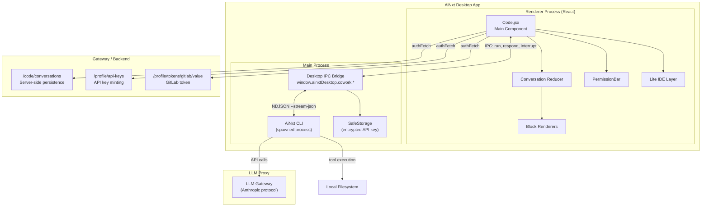
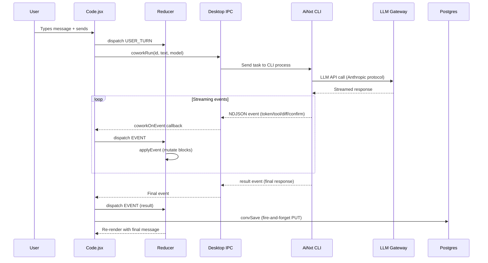
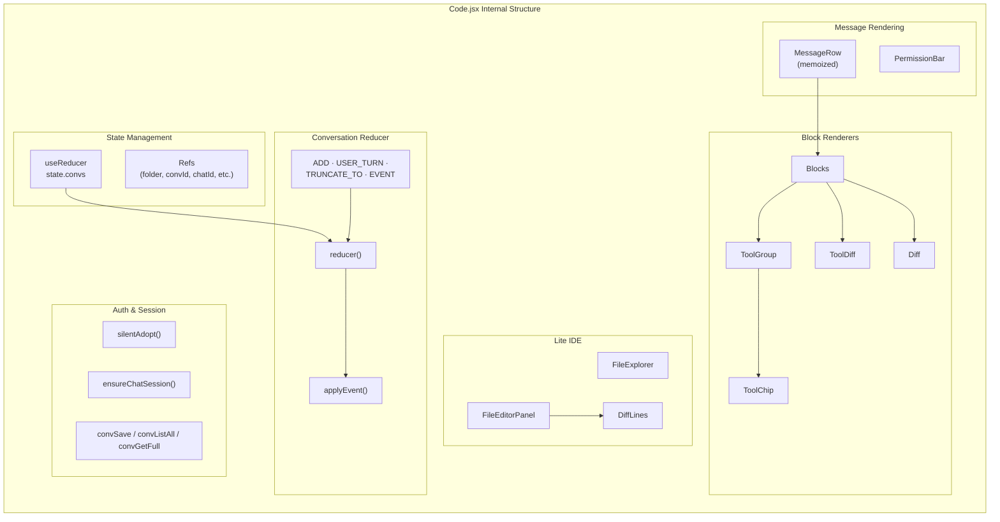
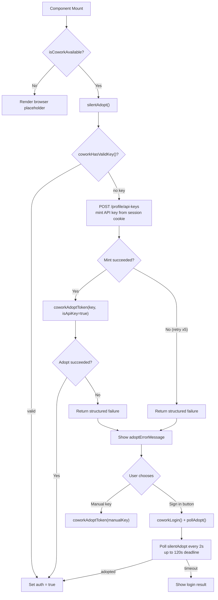
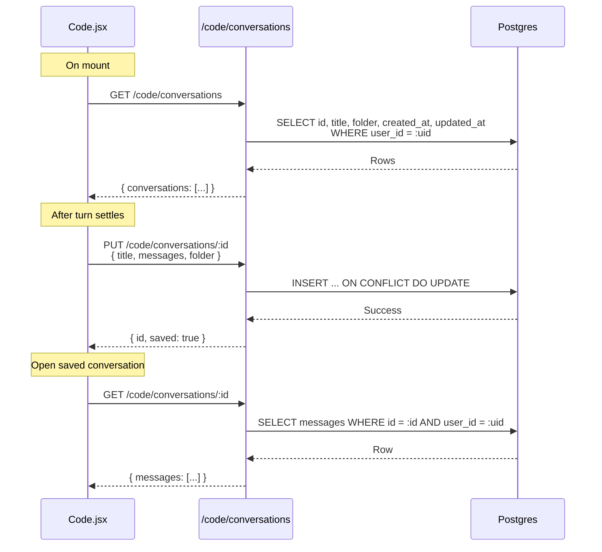
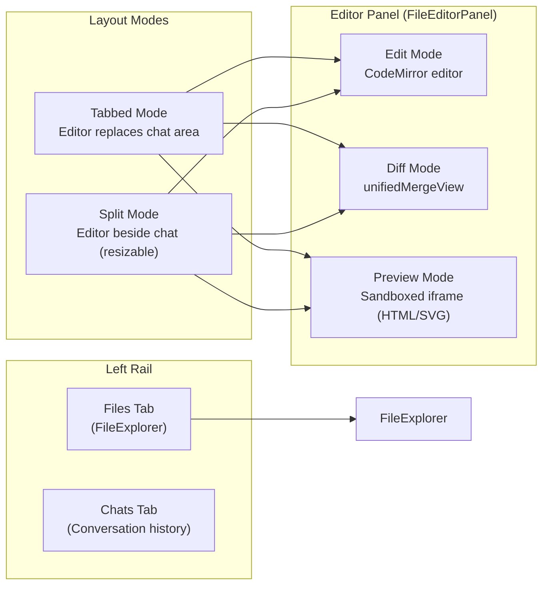
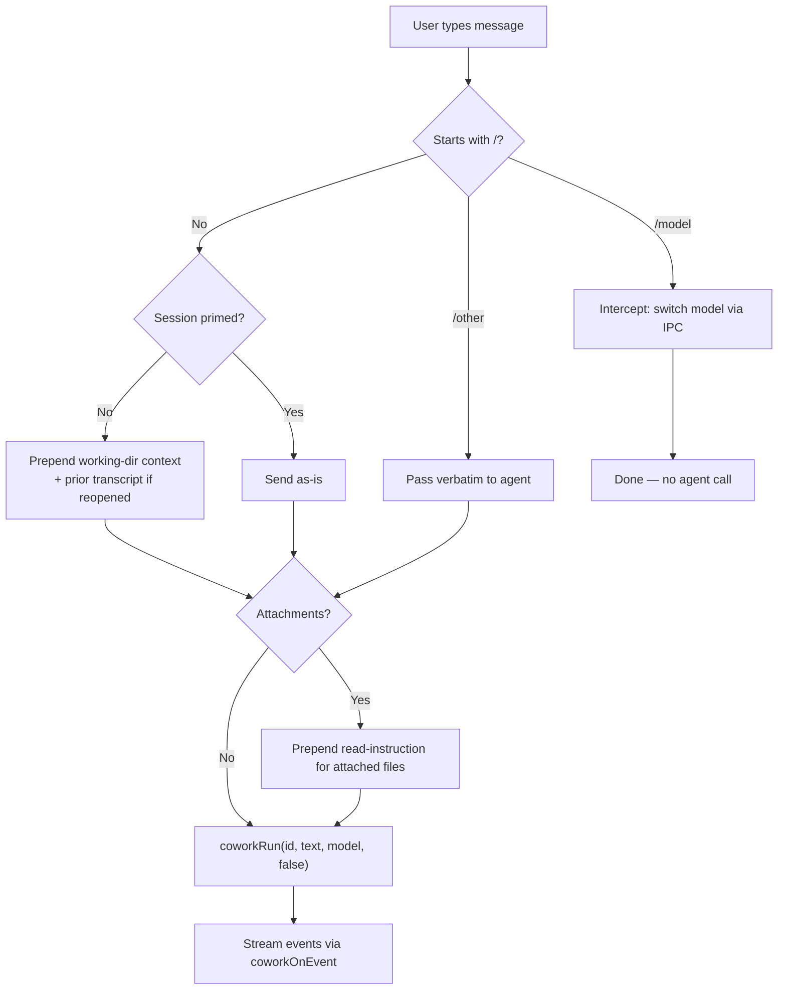
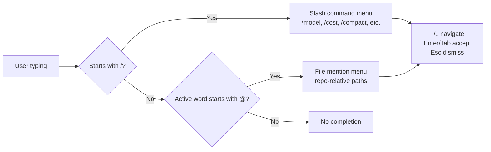
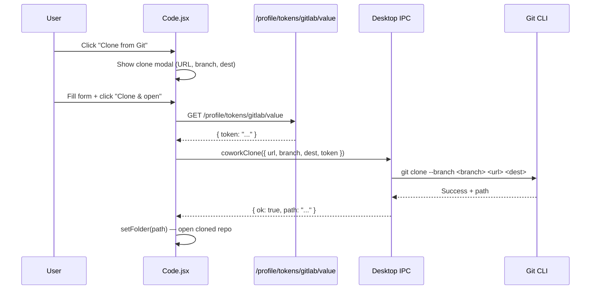
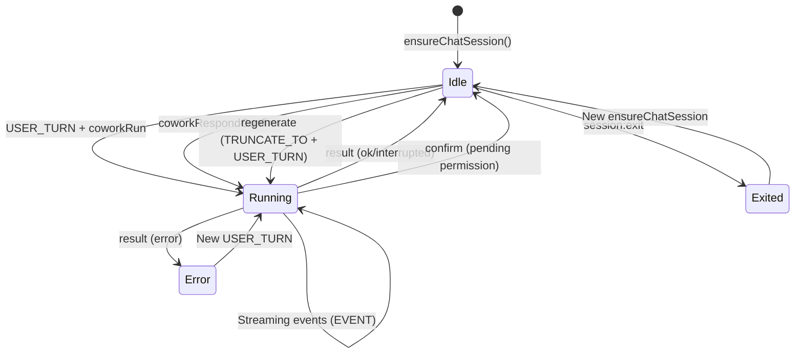

# Code Module — Local-Agent (Engineer) Mode

## Introduction

The **Code** module (`ai-ui/src/components/Code.jsx`) is AiNxt's equivalent of "Claude Code" — a desktop-only local coding agent that runs the full AiNxt agent **on the user's own machine** via a spawned CLI process. It opens a chosen local repository, reads and edits files, runs shell commands, and holds multi-turn conversations with the user, all while streaming tool calls, diffs, and permission prompts in real time.

Unlike the browser-based chat experience (see [chat](chat.md)), Code requires the AiNxt Desktop application because it needs direct access to the local filesystem and terminal. All CLI I/O flows through the desktop IPC bridge (`window.ainxtDesktop.cowork.*`) — the renderer never touches `process` or `fs` directly.

### Key Capabilities

| Capability | Description |
|---|---|
| **Local repo agent** | Opens a folder, explores files, edits code, runs commands — all on the user's machine |
| **Lite IDE** | Built-in file explorer + CodeMirror editor with edit/diff/preview modes |
| **Conversation persistence** | Server-side (Postgres) conversation history scoped to user + project folder |
| **Permission system** | Inline permission bar for tool execution (Ask / Auto-accept / Plan modes) |
| **Git clone** | Clone repositories using the user's stored GitLab token |
| **Slash commands & @-mentions** | `/` for agent commands, `@` for file path completion |
| **Voice input** | Web Speech API dictation (mirrors [chat](chat.md)) |
| **Dark IDE theme** | Scoped high-contrast dark mode for the Code panel |

---

## Architecture Overview



### High-Level Data Flow



---

## Component Architecture



---

## Core Components

### `Code` (Main Component)

The default export — a large React functional component that orchestrates the entire local-agent experience. It manages:

- **Authentication state** — silent API key adoption from the web session, with fallback to manual key entry or device-code login
- **Conversation state** — via `useReducer` with a custom reducer that processes CLI streaming events
- **Folder/workspace management** — choosing, watching, and cloning local repositories
- **Lite IDE surface** — file explorer, editor tabs, split/tabbed layouts
- **Chat interaction** — message sending, regeneration, permission answering, voice input

**Key design decisions:**
- Uses `useReducer` (not `useState`) for conversation state because CLI events arrive as a stream and must be applied immutably to trigger re-renders
- All time-sensitive values (folder, chatId, convId) are mirrored into refs to avoid stale closures in event handlers registered once on mount
- Conversation persistence is **fire-and-forget** — never blocks a turn

### `reducer` & `applyEvent`

The conversation reducer is the heart of the streaming pipeline. It maintains a map of conversation objects keyed by CLI session ID:

```javascript
const initialState = { convs: {} };
// Each conv: { id, kind, cwd, title, status, statusLine, messages, pendingConfirm, ... }
```

**Reducer actions:**

| Action | Purpose |
|---|---|
| `ADD` | Register a new conversation (chat or background task) |
| `USER_TURN` | Append user message + a streaming assistant placeholder |
| `TRUNCATE_TO` | Drop messages from a point onward (used by regenerate) |
| `EVENT` | Apply a CLI streaming event to the conversation |

**`applyEvent` handles these event types from the CLI:**

| Event Type | Effect |
|---|---|
| `token` / `newline` | Append text to the last assistant message's text block |
| `tool:start` | Push a new tool block (with optional diff for Edit/Write/MultiEdit) |
| `tool:done` / `tool:fail` | Settle the matching running tool block |
| `diff:header` / `diff:line` | Build a diff block line-by-line |
| `command` | Show a shell command block |
| `notice` / `error` | Show warning/error notices |
| `phase` / `agent:iter` / `agent:ttfb` | Update the status line |
| `confirm` | Set `pendingConfirm` for the permission bar |
| `session:init` | Capture model, permission mode, slash commands |
| `context` | Update context-window usage metrics |
| `result` | Finalize the turn: reconcile text, settle blocks, set cost/tokens |
| `session:exit` | Mark conversation as exited |

### `Blocks`

Renders the heterogeneous content of an assistant message by iterating over block objects and coalescing consecutive read-only tool calls into collapsible `ToolGroup` components. Mutating tools with diffs render as individual `ToolDiff` cards.

**Block kinds:** `text` (Markdown), `tool`, `diff`, `command`, `notice`

### `ToolGroup`

A collapsible panel for a run of consecutive read-only tool calls (e.g., multiple `Read` or `Glob` calls). Auto-expands while the agent is working; shows a one-line summary when collapsed. Individual tool failures don't make the whole group look failed — only the running/done state of the group header reflects progress.

### `ToolDiff`

A collapsible diff card for mutating tools (`Edit`, `Write`, `MultiEdit`). Shows the file path, added/removed counts, and a `DiffLines` viewer. Defaults open while running so the user sees the proposed change next to the permission prompt.

### `Diff`

Renders a standalone diff block (not tied to a specific tool) with a header showing path, new-file indicator, and add/remove counts.

### `ToolChip`

A single-line tool call indicator with a status icon (spinning Loader2 for running, XCircle for fail, CheckCircle2 for done) and optional detail text.

### `PermissionBar`

An inline permission strip (Claude Code style — never a modal) shown above the input box when `conv.pendingConfirm` is set. Offers three responses:

| Button | Answer | Meaning |
|---|---|---|
| Deny | `"no"` | Reject this tool call |
| Always allow | `"always"` | Allow this tool type for the rest of the session |
| Allow | `"yes"` | Allow this one time |

### `MessageRow` (memoized)

Renders a single user or assistant message. For assistant messages, it renders `Blocks`, then (once settled) an action bar with copy, read-aloud (TTS), and regenerate buttons, plus a `MessageMeta` component showing model, tokens, cost, and latency.

### `PERM_LABEL` & `PERM_MODES`

Constants defining the three permission modes the agent accepts:

| Key | Label | Icon |
|---|---|---|
| `default` | Ask each time | ShieldCheck |
| `acceptEdits` | Auto-accept edits | Pencil |
| `plan` | Plan mode | MapIcon |

---

## Authentication Flow

The Code module reuses the existing web-app session rather than requiring a separate CLI sign-in. The flow is designed to be **silent** — the user should never see a login prompt if they're already authenticated in the portal.



### `silentAdopt`

Returns a **structured result** `{ ok, reason, status?, detail? }` rather than a bare boolean, so the caller can surface a user-meaningful message:

| Reason | Meaning |
|---|---|
| `already` | Desktop already held a valid key |
| `minted` | Freshly minted + adopted |
| `mint_failed` | POST /profile/api-keys returned non-2xx |
| `no_key` | Gateway returned 2xx but no key in body |
| `adopt_failed` | Key obtained but main-process validation failed |
| `exception` | Network/other error |

### `adoptErrorMessage`

Maps structured failure reasons to plain-language messages for non-technical users (e.g., 429 → "You've reached the maximum number of API keys...").

---

## Conversation Persistence

Conversations are persisted **server-side** in Postgres (table `code_conversations`), NOT in localStorage. This ensures history survives app restarts and is scoped to the JWT user + project folder, in a table separate from Buddy chats.



### Persistence helpers

| Function | Endpoint | Purpose |
|---|---|---|
| `convListAll()` | `GET /code/conversations` | List all conversations (metadata only) |
| `convGetFull(id)` | `GET /code/conversations/:id` | Fetch full conversation with messages |
| `convSave(folder, conv)` | `PUT /code/conversations/:id` | Upsert conversation (fire-and-forget) |
| `convDelete(id)` | `DELETE /code/conversations/:id` | Delete a conversation |

### `_sanitize`

Strips transient streaming flags (`streaming: false`) and settles any tool/diff block left in `"running"` status before saving, so a conversation saved mid-stream doesn't reopen stuck on "Thinking…".

> **Server-side implementation:** See [code_conversations_router](code_conversations_router.md) for the backend API that handles persistence, including the 413 size guard (`_MAX_MESSAGES_BYTES`) and `ON CONFLICT` upsert logic.

---

## Lite IDE Layer

The Code module includes a lightweight IDE surface with a file explorer and CodeMirror-based editor, supporting two layout modes:



### File Explorer (`FileExplorer`)

A tree-view file browser with:
- **Search/filter** — fuzzy file name matching
- **Create/rename/delete** — inline editing with create-file, create-folder, and rename modes
- **Changed-file indicators** — green dots on files modified by the agent
- **Refresh from disk** — manual re-scan of the local folder

### File Editor Panel (`FileEditorPanel`)

A CodeMirror 6-based editor with three modes:

| Mode | Trigger | Description |
|---|---|---|
| **Edit** | Default | Full CodeMirror editor with syntax highlighting, line numbers, fold gutter |
| **Diff** | Agent edit or manual toggle | `unifiedMergeView` showing pre-edit snapshot vs. proposed result |
| **Preview** | HTML/SVG files | Sandboxed iframe with `allow-scripts` for live rendering |

**Key behaviors:**
- **Auto-follow** — when the agent edits a file, it automatically opens in the editor with diff mode
- **Pre-edit snapshot** — the original file content is captured once (via `readFile`) before the edit is applied, enabling the full-file inline diff
- **Watcher integration** — disk changes (from agent or external) trigger buffer reload, but never clobber unsaved edits
- **Pending edit approval** — when a permission prompt targets the active file, Accept/Reject buttons appear in the editor's action bar
- **Ctrl/Cmd+S** — saves the active buffer to disk

### Diff Lines (`DiffLines`)

A lightweight diff renderer for streamed hunks (used in `ToolDiff` and as a fallback in `FileEditorPanel` when the full-file diff can't be reconstructed). Color-codes `+` (green), `-` (red), `@@` (indigo) lines.

### Workspace Watching

The module subscribes to OS-level file watchers via `watchFolder`/`unwatchFolder` IPC. When files change on disk (from agent edits or external tools), the watcher:
1. Triggers a debounced file-tree refresh (400ms)
2. Bumps a `reloadSignal` that causes `FileEditorPanel` to reload the affected buffer (if not dirty)

---

## Agent Interaction Flow

### Sending a Message



### Regeneration

The `regenerate` function allows re-asking any assistant reply (not just the last one):
1. Find the target assistant message by index (or default to the last)
2. Walk back to the user message that prompted it
3. `TRUNCATE_TO` before that user message
4. `USER_TURN` to re-append the user message + fresh streaming slot
5. `coworkRun` to re-execute

### Permission Answering

When the CLI emits a `confirm` event, `PermissionBar` renders with three options. The answer is sent via `coworkRespondConfirm(sessionId, confirmId, answer)`, and the dialog is optimistically cleared via a synthetic `__clear_confirm` event. Subsequent CLI events resume streaming.

---

## Model & Permission Controls

### Models

The module ships with a fixed set of Anthropic-protocol model IDs:

| Key | Label |
|---|---|
| `claude-sonnet-4-6` | Sonnet 4.6 (default) |
| `claude-opus-4-7` | Opus 4.7 |
| `claude-haiku-4-5-20251001` | Haiku 4.5 |

Model changes are pushed to the live session via `coworkSetModel` and re-applied to any new session in `ensureChatSession`.

### Permission Modes

Three modes control how the agent handles tool execution:

| Mode | Behavior |
|---|---|
| `default` (Ask each time) | Every mutating tool requires explicit approval |
| `acceptEdits` (Auto-accept edits) | File edits are applied without prompting |
| `plan` (Plan mode) | Agent plans but doesn't execute |

---

## Completion Menu

The input area supports two completion modes triggered by the first character of the active token:



Slash commands are sourced from the CLI's `session:init` event (which carries the agent's registered commands). File mentions are sourced from the local file list (refreshed via `listFolder`).

---

## Git Clone Flow

The module supports cloning repositories directly into a local folder using the user's stored GitLab token:



---

## Dependencies

### Internal Dependencies

| Dependency | Purpose |
|---|---|
| [`useDesktop`](ai_ui_frontend_hooks.md) | All desktop IPC functions (cowork*, pickFolder, readFile, watchFolder, etc.) |
| [`MessageMeta`](message_meta.md) | Renders model/token/cost/latency pills under assistant messages |
| [`BrandMark`](brand_mark.md) | AiNxt logo rendering |
| [`AiNxtSpinner`](spinner.md) | Loading spinner with status label |
| [`DiffLines`](code_editor.md) | Lightweight diff line renderer |
| [`FileExplorer`](code_editor.md) | File tree browser |
| [`FileEditorPanel`](code_editor.md) | CodeMirror editor with edit/diff/preview modes |
| [`config`](config.md) | `authFetch` and `API_BASE` for server API calls |
| [`Message`](message.md) | `mdComponents` for ReactMarkdown rendering |

### External Dependencies

| Library | Purpose |
|---|---|
| `react` | `useReducer`, `useRef`, `useState`, `useEffect`, `useCallback`, `useMemo`, `memo` |
| `react-markdown` + `remark-gfm` + `remark-math` | Markdown rendering with GFM and math support |
| `rehype-highlight` + `rehype-katex` | Syntax highlighting and KaTeX math rendering |
| `lucide-react` | Icon set |
| `@uiw/react-codemirror` + `@codemirror/*` | Code editor (in `FileEditorPanel`) |

### Server-Side Dependencies

| Endpoint | Purpose |
|---|---|
| `GET/PUT/DELETE /code/conversations[/:id]` | Conversation persistence (see [code_conversations_router](code_conversations_router.md)) |
| `POST /profile/api-keys` | Mint API key from web session for CLI authentication |
| `GET /profile/tokens/gitlab/value` | Retrieve stored GitLab token for Git clone |

---

## Desktop IPC Interface

All CLI interaction goes through the `window.ainxtDesktop.cowork` namespace (intentionally NOT renamed to avoid churn across `main.js`/`preload.js`/`cliManager`). Key functions:

| IPC Function | Purpose |
|---|---|
| `coworkCreateSession(cwd)` | Spawn a new CLI session for a working directory |
| `coworkRun(id, task, model, agent)` | Send a task to the agent |
| `coworkRespondConfirm(id, confirmId, answer)` | Answer a permission prompt |
| `coworkInterrupt(id)` | Stop the current turn |
| `coworkOnEvent(cb)` | Subscribe to streaming events (returns unsubscribe) |
| `coworkSetModel(id, model)` | Switch the live agent's model |
| `coworkSetPermissionMode(id, mode)` | Set permission mode |
| `coworkAdoptToken(token, isApiKey)` | Write API key to safeStorage |
| `coworkHasValidKey()` | Check if a valid key is stored |
| `coworkAuthState()` | Read auth state from config.json |
| `coworkOnAuthUpdated(cb)` | Listen for async auth success |
| `coworkLogin()` | Initiate device-code login flow |
| `coworkClone({ url, branch, dest, token })` | Clone a Git repository |
| `pickFolder()` / `pickFile()` | OS file/folder pickers |
| `listFolder(folder, opts)` | List files in a folder |
| `readFile(path)` / `writeFile(path, content)` | File I/O |
| `createPath(path, isDir)` / `deletePath(path)` / `renamePath(old, new)` | File operations |
| `watchFolder(folder)` / `unwatchFolder(folder)` | OS file watchers |
| `onWorkspaceChange(cb)` / `offWorkspaceChange(cb)` | Workspace change events |
| `openExternal(url)` | Open URL in system browser |

> **Desktop implementation:** See [cowork_desktop](cowork_desktop.md) for the main-process side of this IPC bridge, including the CLI session manager and NDJSON stream parsing.

---

## State Management Details

### Refs vs State

The component uses an extensive set of refs to avoid stale closures in event handlers that are registered once on mount:

| Ref | Mirrors | Why |
|---|---|---|
| `folderRef` | `folder` | Used in mount-once event handlers |
| `convIdRef` | `convId` | Used in `persistCurrent` (called from settle effect) |
| `chatIdRef` | `chatId` | Used in event handler + interrupt calls |
| `convsRef` | `state.convs` | Read latest conv state in callbacks |
| `openingRef` | (flag) | Suppress folder-change reset when opening a saved conv |
| `primedRef` | `Set<sessionId>` | Track which sessions got the working-dir preamble |
| `layoutModeRef` | `layoutMode` | Used in `openFile` callback |
| `openFileRef` | `openFile` | Used in mount-once event handler |
| `refreshFilesRef` | `refreshFiles` | Used in mount-once watcher handler |
| `changedFilesRef` | `changedFiles` | Used in mount-once event handler |
| `absOfRef` | `absOf` | Used in mount-once event handler |

### Conversation Lifecycle



---

## Browser vs Desktop

The module is **desktop-only**. When `isCoworkAvailable` is false (i.e., running in a browser), it renders an explanatory placeholder directing the user to open the AiNxt Desktop app. This is because local-agent mode requires:

- Direct filesystem access (read/write/edit local files)
- Terminal/command execution (Bash, etc.)
- OS-level file watchers
- Encrypted credential storage (safeStorage)
- Spawned CLI process management

All of these are only available through the Electron main process IPC bridge.
