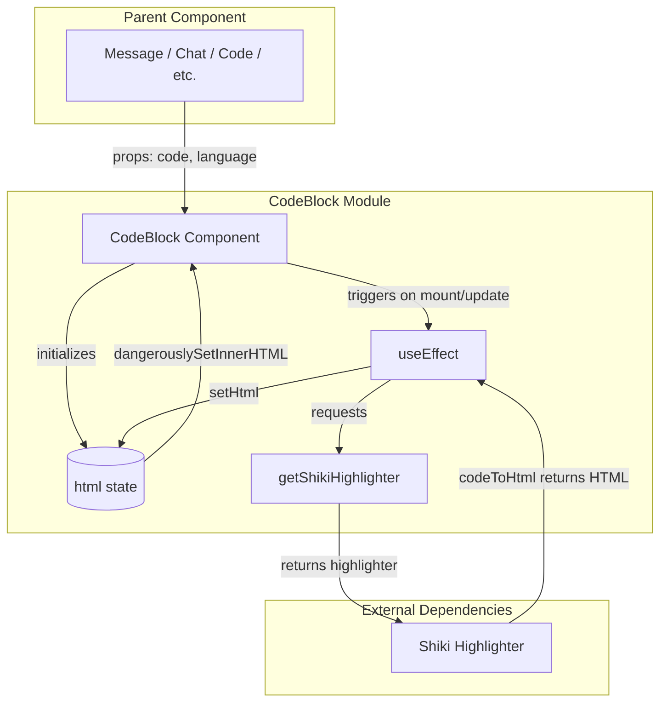
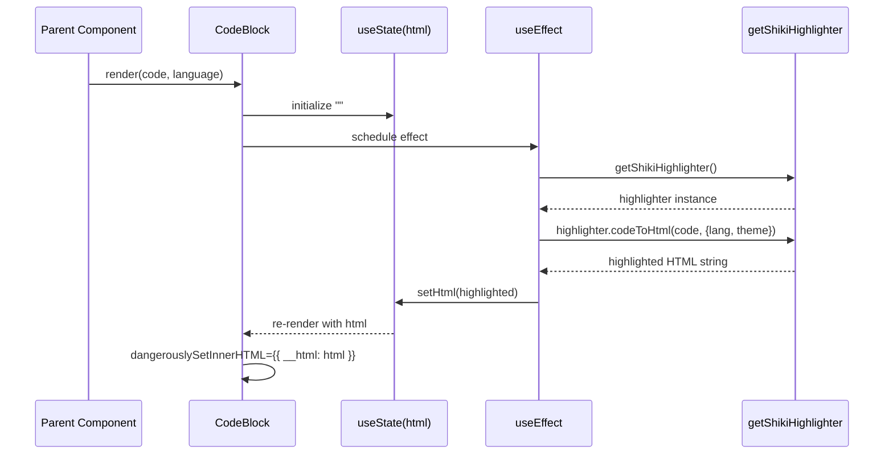
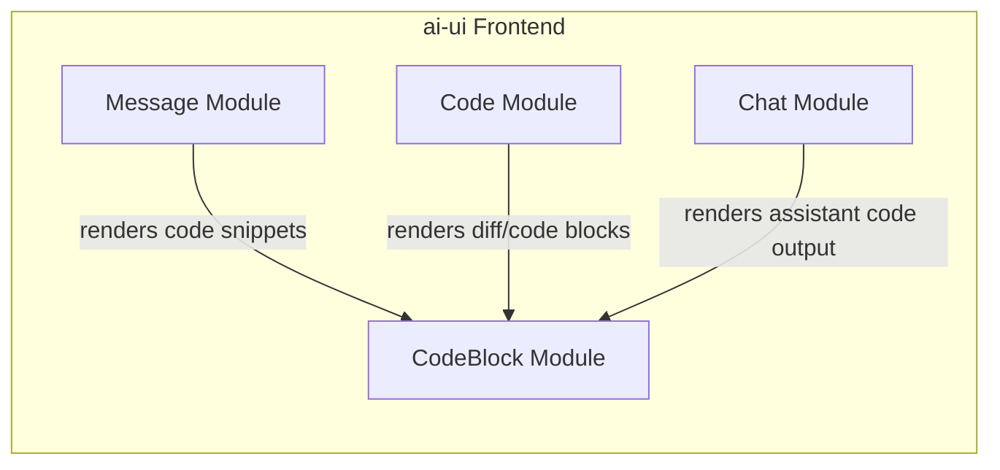
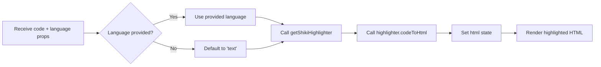

# CodeBlock Module

## Overview

The `CodeBlock` module is a lightweight React presentational component in the `ai-ui` frontend that renders syntax-highlighted source code using the [Shiki](https://shiki.style/) highlighter. It accepts raw code text and an optional language identifier, asynchronously converts the text into themed HTML, and injects the highlighted markup into the DOM.

This module is intentionally focused on a single responsibility: turning a `{ code, language }` payload into a styled, accessible code block. It does not manage copy-to-clipboard behavior, line numbers, or file headers; those concerns are handled by parent or sibling components.

## Purpose and Core Functionality

- **Syntax highlighting**: Uses Shiki to tokenize and colorize code blocks at runtime.
- **Language fallback**: Defaults to `"text"` when no language is supplied.
- **Theming**: Applies the `"one-light"` theme consistently across the application.
- **Zero-layout-shift rendering**: Highlights asynchronously inside `useEffect` and only updates the DOM once the HTML is ready.
- **Style encapsulation**: Uses Tailwind CSS arbitrary variants to target the injected `<pre>` element without adding global styles.

## Architecture



### Component Breakdown

| Element | Responsibility |
|---------|----------------|
| `CodeBlock` | Public React component that receives `code` and `language` props. |
| `html` state | Holds the generated highlighted HTML between async highlight calls. |
| `useEffect` | Re-runs highlighting whenever `code` or `language` changes. |
| `getShikiHighlighter` | Factory that returns a cached/ready Shiki highlighter instance. |
| Tailwind arbitrary variants | Override Shiki's default `<pre>` background, margin, padding, and typography. |

## Data Flow



1. The parent passes `code` and `language` props.
2. The component initializes `html` to an empty string.
3. On mount (and whenever props change), the effect requests the Shiki highlighter.
4. Shiki tokenizes the code and returns an HTML string.
5. The component stores the HTML in local state.
6. React re-renders the wrapper `<div>` with `dangerouslySetInnerHTML` set to the highlighted output.

## Component Interface

```javascript
export default function CodeBlock({ code, language }) { ... }
```

### Props

| Prop | Type | Required | Default | Description |
|------|------|----------|---------|-------------|
| `code` | `string` | Yes | — | Raw source code or text to highlight. |
| `language` | `string` | No | `"text"` | Language identifier passed to Shiki (e.g., `javascript`, `python`, `json`). |

### Rendered Output

The component returns a single `<div>` with:

- A rounded border and light background (`bg-white`, `border-gray-200`).
- Overflow hidden at the wrapper level.
- Arbitrary Tailwind selectors that style the inner `<pre>`:
  - White background
  - Zero margin
  - `1rem` padding
  - `13px` font size with `1.5rem` line height
  - Horizontal scrolling for long lines

## Dependencies

### Runtime Dependencies

- **React** — Component model and lifecycle hooks (`useState`, `useEffect`).
- **Shiki** — Syntax highlighter accessed through `getShikiHighlighter`.
- **Tailwind CSS** — Utility classes for layout and `<pre>` overrides.

### Internal Dependencies

- `getShikiHighlighter` is imported from an internal utility (not defined in this file). It is responsible for creating or returning a cached Shiki highlighter so that repeated renders do not re-initialize the highlighter each time.

## Relationship to the System

The `CodeBlock` module sits in the `ai-ui` presentation layer. It is consumed by message-rendering and code-oriented features that need to display formatted code snippets returned by agents or generated by tools.



For details on how code blocks are embedded inside chat messages, see the [message](message.md) module. For the broader code-editing and diff-rendering experience, see the [code](code.md) module. For the main chat orchestration that produces the content being highlighted, see the [chat](chat.md) module.

> **Note:** The `abstudio_frontend` codebase contains its own `CodeBlock` implementations in `AgentEditor.jsx` and `ChatPanel.jsx`. Those components are separate from this module and are documented under their respective parent modules.

## Process Flow: Highlighting a Code Snippet



## Design Notes

- **Async highlighting**: Shiki highlighting is asynchronous, so the component uses `useEffect` rather than rendering synchronously. This avoids blocking the main thread during large snippets.
- **Security**: The component uses `dangerouslySetInnerHTML`. The input is assumed to be trusted because it originates from the application's own highlighter output. The raw `code` prop is never directly interpolated into the template; it is processed by Shiki first.
- **No copy button**: Copy-to-clipboard functionality is intentionally omitted here. Parent components such as `CopyableCodeBlock` in the [message](message.md) module wrap or replace this component when that behavior is required.
- **Theme consistency**: The `"one-light"` theme is hard-coded to keep the `ai-ui` visual language consistent. Switching themes would require a prop change or a shared theme context.

## Related Modules

- [message](message.md) — Renders assistant messages and may use `CodeBlock` for fenced code blocks.
- [code](code.md) — Provides code editing, diff views, and tool-call rendering.
- [chat](chat.md) — Main chat interface that streams and displays assistant responses containing code.
- [kb_chat](kb_chat.md) — Knowledge-base chat that can also display highlighted code snippets.
