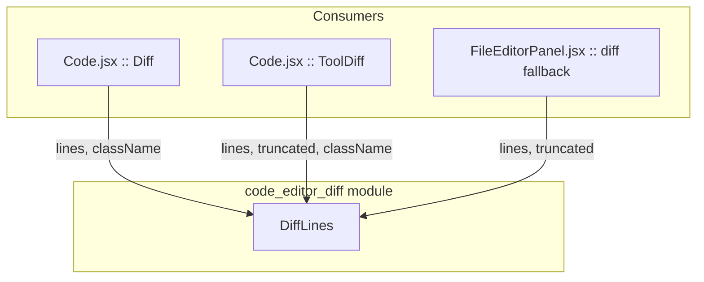
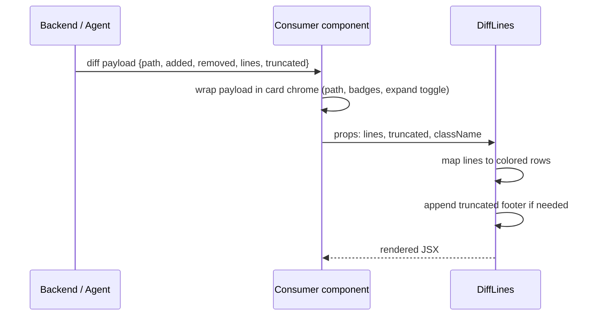
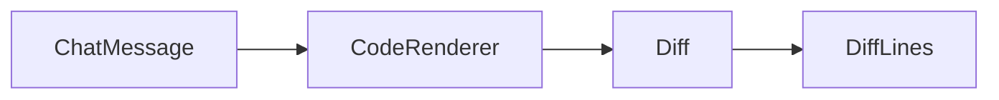
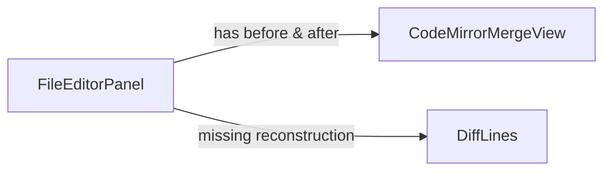

# code_editor_diff

The `code_editor_diff` module provides a single, shared React component — `DiffLines` — that renders a unified-style diff body with red/green/gray highlighting. It is the canonical visual representation of an agent's code change anywhere in the AI UI, ensuring that diff cards in chat, tool output cards, and the lite-IDE editor panel all look identical.

---

## 1. Purpose & Core Functionality

`DiffLines` is intentionally small and presentational. It receives a pre-computed list of diff lines and renders them inside a scrollable `<pre>` block. Each line is colored according to its kind:

| Kind | Visual treatment | Meaning |
|------|------------------|---------|
| `+`  | emerald (green) background & text | added line |
| `-`  | red background & text | removed line |
| `@@` | indigo background & text | hunk header / context marker (rendered as `⋯`) |
| ` `  | gray text | unchanged context line |

The component also supports a `truncated` count, which appends a footer such as `… 12 more lines` when the backend truncates large diffs.

### 1.1 Why this module exists

Multiple features need to show code diffs:

- **Chat diff cards** — when the agent proposes a file edit, the chat stream renders a compact diff card.
- **Tool diff cards** — when a tool such as `Write` or `MultiEdit` finishes, its output is shown as a collapsible diff.
- **Lite-IDE diff fallback** — when the editor cannot reconstruct a full before/after file, it falls back to the streamed hunk view.

Centralizing the rendering in `DiffLines` guarantees consistent colors, fonts, truncation behavior, and accessibility across all of these surfaces.

---

## 2. Architecture

### 2.1 Component overview



`DiffLines` is a leaf presentational component. It owns no state, makes no API calls, and has no side effects. All data is passed via props.

### 2.2 Module boundaries

- **In scope**: rendering a list of diff lines with syntax-aware styling.
- **Out of scope**:
  - Computing diffs (done by backend or by parent components).
  - File-level chrome such as path headers, expand/collapse buttons, or approval actions (see [code](code.md), [code_editor](code_editor.md), and [diff_approval](diff_approval.md)).
  - Full-file merge views (the lite-IDE uses CodeMirror's `unifiedMergeView` for that; `DiffLines` is only the fallback).

---

## 3. API / Props

```javascript
DiffLines({
  lines = [],      // { kind: "+" | "-" | "@@" | " ", line: string }[]
  truncated = 0,   // number of lines omitted after the rendered list
  className = ""   // extra Tailwind classes, e.g. max-height / overflow
})
```

### 3.1 `lines`

Each entry represents one row of a unified diff:

```javascript
[
  { kind: "@@", line: " -1,5 +1,6 @@" },
  { kind: " ", line: "import React from 'react';" },
  { kind: "-", line: "const x = 1;" },
  { kind: "+", line: "const x = 2;" },
]
```

The `kind` value is prepended to `line` when rendered, except for `@@`, which is replaced with `⋯` to keep the display compact.

### 3.2 `truncated`

When the backend caps the number of lines returned, `truncated` tells the user how many additional lines exist. The footer uses correct pluralization (`line` vs `lines`).

### 3.3 `className`

Consumers use this to impose layout constraints without duplicating the base styling. Common examples:

- `max-h-72 overflow-y-auto` in chat diff cards.
- `max-h-80 overflow-y-auto` in tool diff cards.
- no extra class in the lite-IDE fallback, relying on the parent scroll container.

---

## 4. Dependencies

### 4.1 Runtime dependencies

- **React** — functional component with JSX.
- **Tailwind CSS** — all styling is expressed via utility classes (`text-xs`, `font-mono`, `bg-emerald-50`, etc.).

### 4.2 Module dependencies

`DiffLines` has no internal imports. It is imported by:

| Consumer module | Consumer component | Usage |
|-----------------|--------------------|-------|
| [code](code.md) | `Diff` | renders a proposed file change in the chat stream |
| [code](code.md) | `ToolDiff` | renders the result of a `Write`/`MultiEdit` tool call |
| [code_editor](code_editor.md) | `FileEditorPanel` | fallback when a full before/after reconstruction is unavailable |

See the linked module docs for how those parents build the `lines` array and handle user interactions.

---

## 5. Data Flow



1. The backend or agent produces a diff payload.
2. A parent component decides how to frame the diff (chat card, tool card, editor panel).
3. The parent passes the raw `lines` and `truncated` values into `DiffLines`.
4. `DiffLines` maps each line to a styled `<div>` and returns the final JSX.

---

## 6. Component Interaction

### 6.1 Within the chat surface

In [code](code.md), the `Diff` component receives a block `b` containing `path`, `added`, `removed`, `isNew`, and `lines`. It renders a header with the file path and change counts, then delegates the body to `DiffLines`:



The `ToolDiff` component behaves similarly but adds a status icon (`running` / `done` / `fail`) and an expand/collapse toggle.

### 6.2 Within the lite-IDE

[code_editor](code_editor.md)'s `FileEditorPanel` prefers a full-file inline diff using CodeMirror's `unifiedMergeView`. When the original file snapshot (`before`) or the reconstructed result (`after`) is unavailable, it falls back to `DiffLines`:



This keeps the editor robust even when the agent only streamed a partial hunk.

---

## 7. Process Flows

### 7.1 Rendering a single line

```mermaid
flowchart LR
    A[Receive line object] --> B{kind?}
    B -->|+| C[emerald background & text]
    B -->|-| D[red background & text]
    B -->|@@| E[indigo background, render ⋯]
    B -->|space| F[gray text]
    C --> G[Wrap in whitespace-pre span]
    D --> G
    E --> G
    F --> G
    G --> H[Append to pre block]
```

### 7.2 Rendering the full diff body

```mermaid
flowchart TD
    A[Props: lines, truncated, className] --> B[Render <pre> with base styles]
    B --> C[Map lines array]
    C --> D[Determine color class from kind]
    D --> E[Render line text with kind prefix]
    C --> F{truncated > 0?}
    F -->|yes| G[Append "… N more line(s)" footer]
    F -->|no| H[Return JSX]
    G --> H
```

---

## 8. Styling Conventions

The component follows the project's Tailwind conventions:

- `text-xs font-mono` for code-like readability.
- `overflow-x-auto` so long lines scroll horizontally instead of wrapping.
- `bg-white m-0 leading-5` to neutralize default `<pre>` margins and set comfortable line height.
- Color tokens are semantic: emerald for additions, red for deletions, indigo for hunk markers, gray for context.

Consumers should not override the per-line color classes; they should only use `className` for container-level layout (height, overflow, borders, etc.).

---

## 9. Error & Edge Cases

| Scenario | Behavior |
|----------|----------|
| `lines` is empty | Renders an empty `<pre>` block. |
| `lines` is undefined | Default prop `lines = []` prevents crashes. |
| Unknown `kind` | Falls through to the gray context style. |
| `truncated` is negative or zero | No footer is rendered. |
| Very long lines | Horizontal scroll via `overflow-x-auto`. |
| Very many lines | Consumer is responsible for vertical scrolling via `className`. |

---

## 10. How It Fits Into the System

`code_editor_diff` sits at the bottom of the code-editing UI stack. It is one of three related diff surfaces:

1. **Chat / tool diff cards** ([code](code.md)) — lightweight, inline, often transient.
2. **Lite-IDE diff fallback** ([code_editor](code_editor.md)) — integrated into a file editor with tabs and save actions.
3. **Approval gate diff** ([diff_approval](diff_approval.md)) — richer review UI with per-file comments and compile/test badges; uses its own `FileDiff` component rather than `DiffLines`.

By keeping `DiffLines` as a shared primitive, the system avoids visual drift between these surfaces while allowing each parent to add its own chrome and behavior.

---

## 11. Related Documentation

- [code](code.md) — chat-level code rendering, including `Diff` and `ToolDiff`.
- [code_editor](code_editor.md) — lite-IDE file explorer, editor panel, and diff view.
- [diff_approval](diff_approval.md) — SDLC approval gate with verified diffs and review comments.
