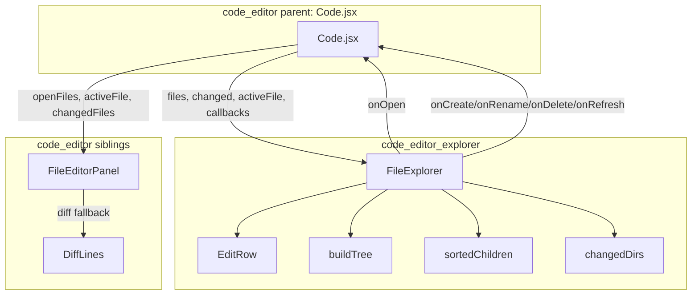
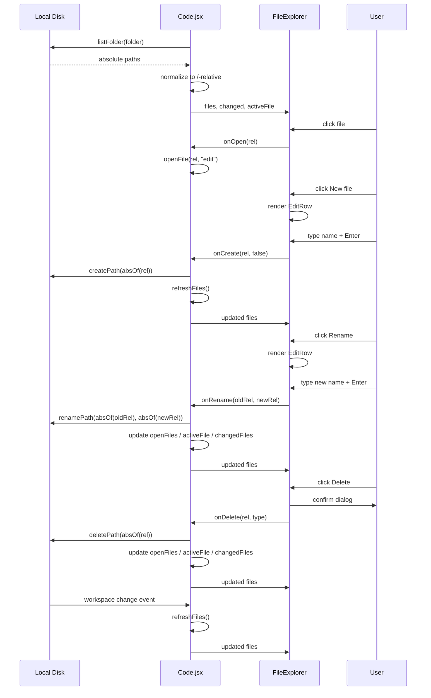
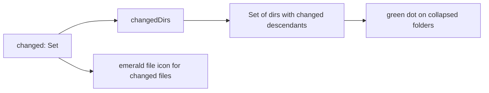

# code_editor_explorer

## Introduction

`code_editor_explorer` is the **project-tree (file explorer) panel** inside the AI-Nxt "Code" local coding agent UI. It lives at `ai-ui/src/components/code/FileExplorer.jsx` and renders a lightweight, collapsible IDE-style file tree from a flat list of `/`-relative paths. The component is intentionally **pure UI**: it does not touch the filesystem directly. All create, rename, delete, open, and refresh operations are delegated to callback props so that the parent ([`code`](code.md)) can coordinate desktop IPC, disk access, and editor state.

This module is part of the larger [`code_editor`](code_editor.md) feature group in [`ai_ui_frontend`](ai_ui_frontend.md), alongside [`code_editor_panel`](code_editor_panel.md) and [`code_editor_diff`](code_editor_diff.md).

---

## Module Purpose

The explorer's responsibilities are:

1. **Visualize the workspace** as a nested, sorted directory tree from a flat array of relative file paths.
2. **Surface file status** by highlighting the active file, changed/unsaved files, and directories that contain changed descendants.
3. **Enable lightweight file operations** — create file/folder, rename, delete, refresh — via inline inputs and hover actions.
4. **Search and filter** the tree without re-fetching from disk.
5. **Stay decoupled from I/O** so the same component can be tested and reused without a real filesystem backend.

It is the left-rail "Files" view that pairs with the chat and editor panels in [`Code.jsx`](code.md).

---

## Core Components

### `FileExplorer`

The default export. A React functional component that renders the full explorer panel (toolbar + tree).

**Key props:**

| Prop | Type | Purpose |
|------|------|---------|
| `files` | `string[]` | Flat list of `/`-relative file paths. |
| `changed` | `Set<string>` | Relative paths that have uncommitted/agent-pending changes. |
| `activeFile` | `string \| null` | Currently open/focused file. |
| `onOpen(rel)` | callback | User clicked a file to open it. |
| `onCreate(rel, isDir)` | callback | Create a new file or folder. |
| `onRename(oldRel, newRel)` | callback | Rename a file or folder. |
| `onDelete(rel, type)` | callback | Delete a file or folder. |
| `onRefresh()` | callback | Refresh the file list from disk. |
| `refreshing` | `boolean` | Show a spinner while a refresh is in flight. |

### `EditRow`

A small inline component defined inside `FileExplorer` for create/rename text input. It handles Enter/Escape/Blur commit semantics and is rendered at the correct tree depth.

### Helper functions

- **`buildTree(files)`** — Converts the flat path list into a nested tree of `{ name, rel, type, children }` nodes.
- **`sortedChildren(node)`** — Returns children sorted directories-first, then alphabetically.
- **`changedDirs(changed)`** — Computes the set of directory paths that contain at least one changed descendant file, used to show the green status dot on collapsed folders.

---

## Architecture



`FileExplorer` sits at the left rail of the Code view. It receives state from [`Code.jsx`](code.md) and emits user actions back to it. [`FileEditorPanel`](code_editor_panel.md) and [`DiffLines`](code_editor_diff.md) are its siblings in the editor area.

---

## Component Relationships

### With `Code.jsx` (parent)

[`Code.jsx`](code.md) owns:

- The selected `folder` (workspace root).
- The flat `files` list, fetched via `listFolder` and normalized to `/`-relative paths.
- The `changedFiles` map, updated when agent edits arrive over the cowork event stream.
- The `activeFile` and `openFiles` editor tab state.
- The actual filesystem IPC calls (`createPath`, `renamePath`, `deletePath`, `readFile`, `listFolder`).

`FileExplorer` only knows about `/`-relative paths. [`Code.jsx`](code.md) converts to OS-absolute paths via `absOf(rel)` before calling desktop APIs.

### With `FileEditorPanel` (sibling)

When a user clicks a file in the explorer, [`Code.jsx`](code.md) calls `openFile(rel, "edit")`, which updates `activeFile` and `openFiles`. [`FileEditorPanel`](code_editor_panel.md) then loads and edits the file. The explorer and editor share the same `changed` set so both surfaces show emerald change indicators.

### With `DiffLines` (sibling)

[`DiffLines`](code_editor_diff.md) renders streamed diff hunks. The explorer does not use it directly, but both are driven by the same `changedFiles` state in [`Code.jsx`](code.md).

---

## Data Flow



All filesystem side effects live in [`Code.jsx`](code.md). `FileExplorer` is a controlled view component.

---

## Process Flows

### Tree Rendering

```mermaid
flowchart LR
    A[files: string[]] --> B[buildTree]
    B --> C[nested tree Map]
    C --> D[sortedChildren]
    D --> E[renderNode recursive]
    E --> F[directory rows]
    E --> G[file rows]
```

1. Receive flat `files` array.
2. `buildTree` walks each path segment and builds a nested `Map` of nodes.
3. `sortedChildren` orders directories before files, alphabetically within each group.
4. `renderNode` recursively emits rows, respecting depth for indentation.

### Search / Filter


When `query` is non-empty, the tree is rebuilt from `shownFiles` and every matching node is expanded automatically (`isExpanded` returns `true` during search).

### Create / Rename Inline Editing

```mermaid
flowchart TD
    A[User clicks New/Rename] --> B[startCreate / setEditing]
    B --> C[Render EditRow at parent/child position]
    C --> D{Key?}
    D -->|Enter| E[commitEdit]
    D -->|Escape| F[cancel editing]
    E --> G{kind?}
    G -->|create| H[onCreate(rel, isDir)]
    G -->|rename| I[onRename(oldRel, newRel)]
```

`EditRow` is rendered in two places:

- At the top of a directory's children for create operations.
- In place of the target node for rename operations.

### Change Tracking



- Changed files get an emerald `FileText` icon and a green dot.
- Collapsed directories that contain changed files get a green dot so users can spot pending edits without expanding every folder.

---

## State Management

`FileExplorer` keeps only local UI state:

| State | Purpose |
|-------|---------|
| `query` | Search input value. |
| `expanded` | `Set` of directory rels currently expanded. |
| `editing` | Current inline create/rename operation. |

All domain state (`files`, `changed`, `activeFile`) is passed in as props. This makes the component easy to reason about and test.

---

## Dependencies

### External

- **React** — `useMemo`, `useState`.
- **lucide-react** — Icons for folders, files, chevrons, and actions.

### Internal

- [`code`](code.md) — Parent component that supplies props and handles callbacks.
- [`code_editor_panel`](code_editor_panel.md) — Sibling editor component that opens files selected in the explorer.
- [`code_editor_diff`](code_editor_diff.md) — Sibling diff renderer used by the editor panel.

---

## Design Decisions

1. **Pure UI / no direct I/O** — The explorer never calls desktop APIs. This keeps it testable and ensures all filesystem mutations flow through [`Code.jsx`](code.md), where error handling, auth, and state synchronization live.
2. **Flat input, nested render** — The backend/desktop layer returns a flat file list. The explorer builds the tree on the fly so the API stays simple.
3. **`/`-relative paths everywhere** — Internally the component only understands `/`-relative paths. OS-specific path handling is the parent's responsibility.
4. **Search auto-expands** — During search, all directories are treated as expanded so matches are visible without manual expansion.
5. **Change propagation to directories** — `changedDirs` computes ancestor directories of changed files so collapsed folders can show status dots.

---

## Related Documentation

- [`code`](code.md) — Parent component; owns folder selection, file list fetching, agent event handling, and editor layout.
- [`code_editor`](code_editor.md) — Feature group overview for the local coding agent editor.
- [`code_editor_panel`](code_editor_panel.md) — File editor panel that opens files from the explorer.
- [`code_editor_diff`](code_editor_diff.md) — Diff hunk renderer used as a fallback in the editor panel.
- [`ai_ui_frontend`](ai_ui_frontend.md) — Top-level frontend documentation.
