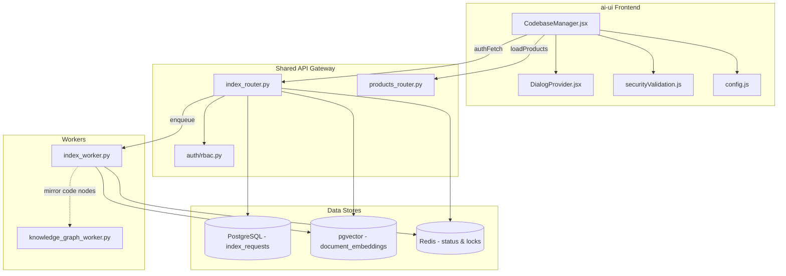
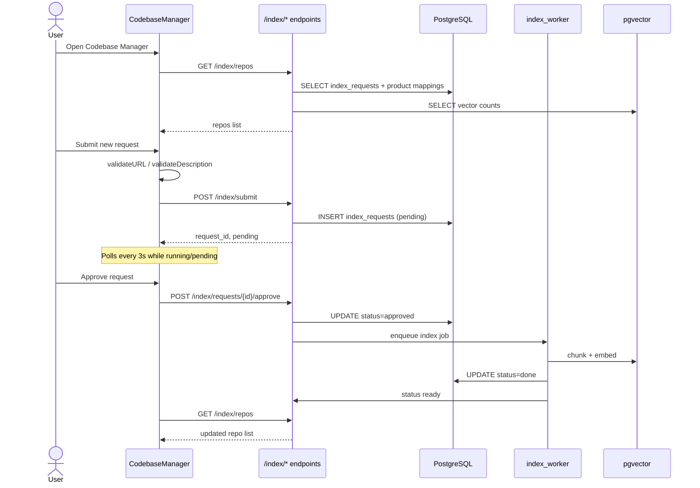
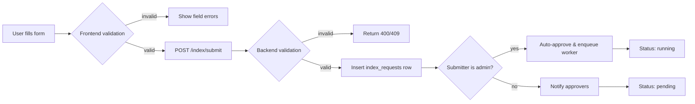
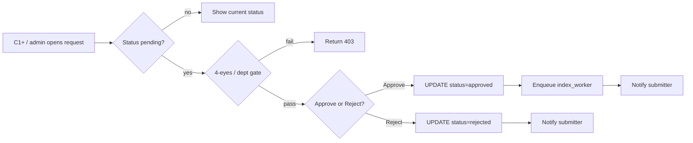
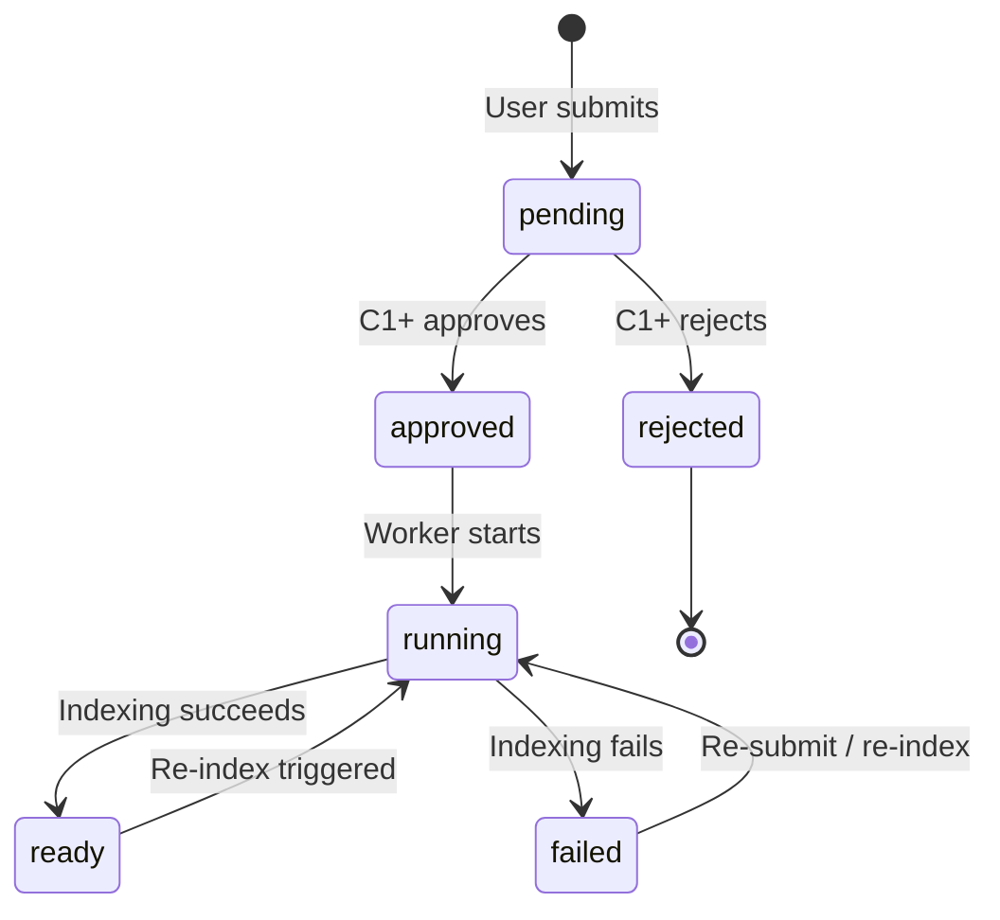
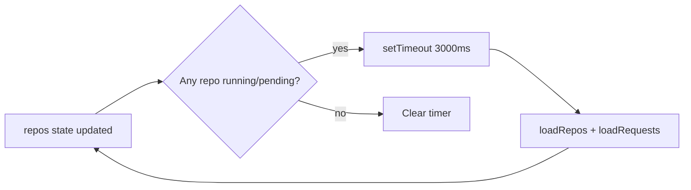

# Codebase Manager Module

## Brief Introduction

The **Codebase Manager** is a React-based UI module in the `ai-ui` frontend that lets users submit, review, and manage GitLab repository indexing requests. It provides a governance-controlled workflow for adding codebases to the platform's retrieval-augmented generation (RAG) knowledge base: a user submits a repository URL and branch, a C1+ approver (or admin) reviews the request, and upon approval an asynchronous worker clones, chunks, embeds, and stores the code in `pgvector`. The module also supports re-indexing, bulk re-indexing, health monitoring, and deletion of indexed repositories.

---

## Purpose and Core Functionality

### What it does

- **Submit index requests**: Users provide a GitLab HTTPS URL, target branch, optional note, and link the request to an active product. Submissions are validated for URL safety, branch naming, and product selection.
- **Approval workflow**: Non-admin submissions enter a `pending` state and require a C1+ / admin approver. Admins auto-approve their own submissions and start indexing immediately.
- **Repository monitoring**: Users can view indexed repositories, their vector counts, branch, status, and last indexed time. The UI auto-refreshes while indexing is `running` or `pending`.
- **Re-indexing**: Authorized users can re-index a single repository or trigger bulk re-indexing (all repos or only stale repos older than 7 days).
- **Health dashboard (admin)**: Admins can inspect per-repo health, stale counts, and vector chunk counts.
- **Deletion**: C1+ / admin users can delete a repository's vectors for a specific product and branch.

### Core UI components

| Component | Responsibility |
|-----------|----------------|
| `CodebaseManager` | Main container. Manages tabs (`repos`, `requests`, `health`), form state, polling, and API coordination. |
| `StatusDot` | Renders a colored dot for repository statuses: `ready`, `running`, `pending`, `failed`, `rejected`. |
| `RequestStatusBadge` | Renders a labeled badge for request statuses: `pending`, `approved`, `rejected`, `running`, `done`, `failed`. |
| `submitRequest` | Validates the submission form and POSTs to `/index/submit`. |
| `approveRequest` | POSTs an approval with an optional note to `/index/requests/{id}/approve`. |
| `rejectRequest` | POSTs a rejection with a required note to `/index/requests/{id}/reject`. |

### RBAC and visibility

- `isAdmin`: full access to all tabs and actions.
- `isC1Plus` (`ad_level ≤ 3` or admin): can approve/reject requests, re-index, delete repos, and view the Health tab.
- Regular users: can submit requests and view their own submissions plus repos mapped to their department via product mappings.

---

## Architecture and Component Relationships

### High-level placement

The Codebase Manager is a frontend feature module inside `ai-ui`. It depends on the shared API layer (`index_router`) for persistence and business logic, and on platform workers (`index_worker`) for the actual clone/chunk/embed pipeline.



### Component interaction



---

## Data Flows

### 1. Submitting an index request



### 2. Approving or rejecting a request



### 3. Repository status lifecycle



### 4. Re-indexing and bulk re-indexing

```mermaid
flowchart TB
    A[User clicks Re-index] --> B[POST /index/repos/{slug}/reindex]
    C[Admin clicks Re-index All / Stale] --> D[POST /index/bulk]
    B --> E[Lookup latest branch & request_id]
    D --> F[Iterate repos from Redis index set]
    E --> G[Enqueue index_worker with drop_index=True]
    F -->|stale_only filter| G
    G --> H[Delete existing vectors for repo+branch]
    H --> I[Clone, chunk, embed]
    I --> J[Update status ready/done]
```

---

## API Endpoints Used

| Endpoint | Method | Purpose |
|----------|--------|---------|
| `/index/repos` | GET | List indexed repositories with vector counts and status. |
| `/index/requests` | GET | List pending/approved/rejected/failed index requests. |
| `/index/submit` | POST | Submit a new index request. |
| `/index/requests/{id}/approve` | POST | Approve a pending request and start indexing. |
| `/index/requests/{id}/reject` | POST | Reject a pending request. |
| `/index/repos/{slug}` | DELETE | Delete vectors for a specific repo + product + branch. |
| `/index/repos/{slug}/reindex` | POST | Re-index a single repo (admin only). |
| `/index/health` | GET | Health summary for all repos (admin only). |
| `/index/bulk` | POST | Bulk re-index all or stale repos (admin only). |
| `/products` | GET | Load active products for the product selector. |

For full backend endpoint behavior, RBAC rules, and database schema details, see [index_router.md](../knowledge/index_router.md) and [products_router.md](../products/products_router.md).

---

## Validation and Security

The module reuses the shared validation utilities in `securityValidation.js`:

- `validateURL`: ensures the GitLab URL uses `https://` and is well-formed.
- `validateDescription`: sanitizes the optional note against XSS / injection patterns.
- Branch name regex: `^[a-zA-Z0-9/_\-.]+$`.
- Product selection is mandatory so vectors can be scoped correctly.

Backend validation is duplicated in `index_router.py` for defense in depth. See security_validation.md for the shared validation engine.

---

## Polling and Real-Time Updates

The component sets a 3-second polling timer whenever any repo has status `running` or `pending`. On each tick it reloads both the repos list and the requests list, keeping the UI in sync with the asynchronous worker progress without requiring WebSockets.



---

## How It Fits Into the Overall System

The Codebase Manager is the primary human interface for populating the platform's code knowledge base. Once a repository is indexed, its chunks become available to:

- **Projects / IDE chat**: scoped Q&A over one or more repos.
- **SDLC pipeline**: code review, governance, and multi-repo workspace features.
- **Knowledge graph**: code symbols and dependency edges are mirrored into the unified knowledge graph (see [knowledge_graph.md](../knowledge/knowledge_graph.md)).
- **Retrieval systems**: hybrid search and RAG pipelines query `document_embeddings` filtered by `repo`, `product_id`, and `branch`.

The module enforces a governance boundary: code from a GitLab repository cannot be embedded into the vector store without an approval step (except for admin auto-approval), ensuring traceability and department-level access control through product mappings.

---

## Related Modules

- [index_router.md](../knowledge/index_router.md) — Backend API routes for index requests and repo management.
- index_worker.md — Background worker that clones, chunks, embeds, and indexes repositories.
- [products_router.md](../products/products_router.md) — Product catalog and department mapping APIs.
- security_validation.md — Shared input validation utilities.
- DialogProvider.md — Toast and confirmation dialog primitives.
- [knowledge_graph.md](../knowledge/knowledge_graph.md) — Knowledge graph ingestion and code node mirroring.
