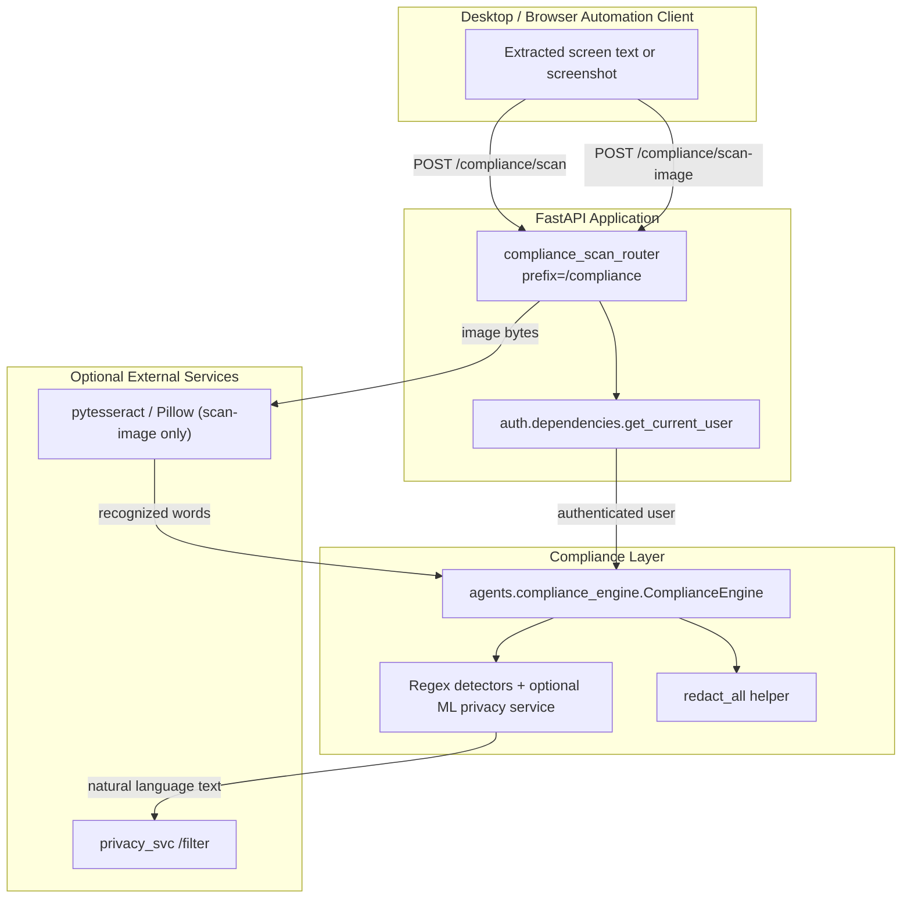
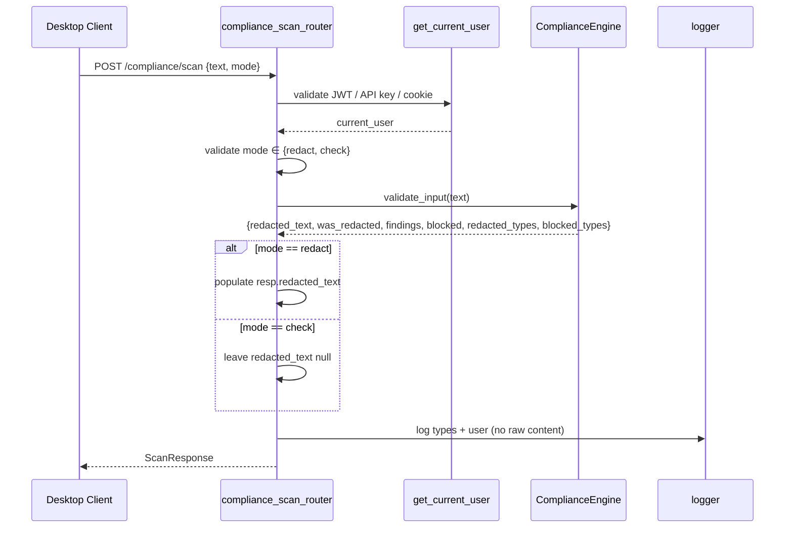
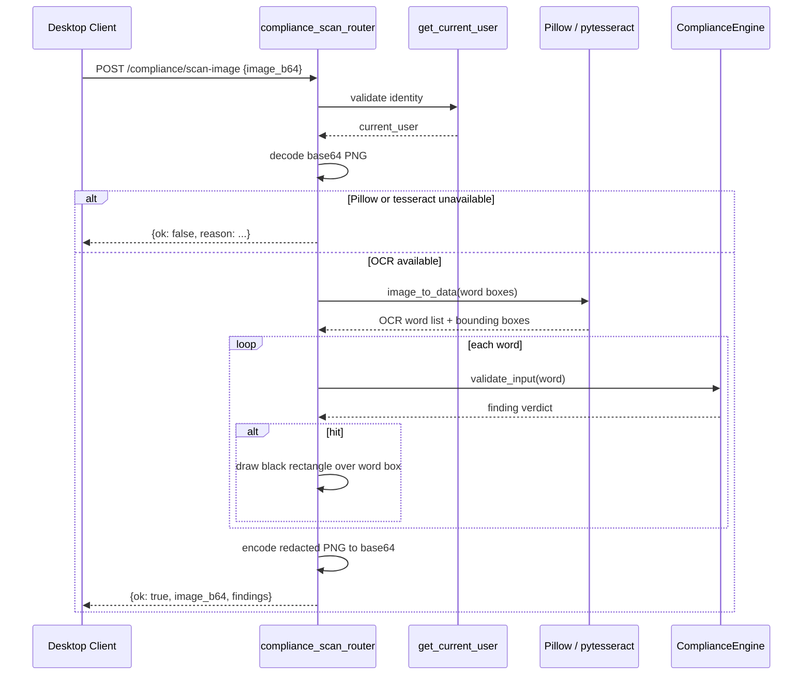
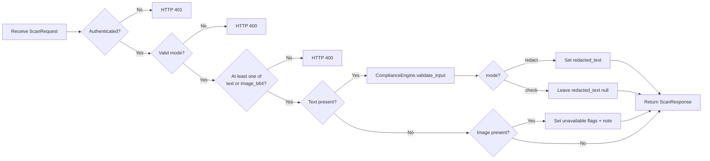

# Compliance Scan Router

The `compliance_scan_router` module provides a dedicated FastAPI router for **pre-context compliance scanning** of content extracted from desktop/browser automation and computer-use sessions. It is designed to intercept text and screenshots *before* they are fed into an LLM context window, redacting PCI/PII and other sensitive data according to the system's compliance configuration.

> **Note on router coexistence:** This router intentionally lives in its own file (`routers/compliance_scan_router.py`) and shares the `/compliance` prefix with the existing [`compliance_router`](compliance_router.md). FastAPI allows multiple routers to share a prefix, and the application orchestrator must include both. This separation preserves the existing compliance endpoints (batch checks, run reports, audit exports) while adding the read-path redaction endpoints required by desktop automation.

---

## Purpose and Core Functionality

Desktop and browser automation tools (see [`desktop_router`](desktop_router.md)) extract screen text and screenshots from the user's environment. This content can contain sensitive information such as:

- PANs, Aadhaar numbers, account numbers
- CVVs, PINs, expiry dates
- API keys, secrets, private keys
- Email addresses, mobile numbers, UPI IDs

The `compliance_scan_router` acts as a **read-path guardrail**: it scans incoming content, redacts sensitive values, and allows the (now sanitized) content to proceed into the agent context. It follows the **REDACT and PROCEED** principle for read paths and never hard-blocks the user at this layer. Outbound writes and connector actions are gated separately by [`connectors_router`](connectors_router.md) and related worker pipelines.

### Endpoints

| Method | Path | Description |
|--------|------|-------------|
| `POST` | `/compliance/scan` | Redact or check text and/or image payloads for sensitive data. |
| `POST` | `/compliance/scan-image` | OCR a screenshot and draw opaque boxes over detected sensitive words. |

### Modes

The `/compliance/scan` endpoint supports two modes:

- **`redact`** (default): Returns a sanitized version of the input text and reports detected sensitive types.
- **`check`**: Runs detection only and returns a verdict without producing a redacted body.

---

## Architecture

### Component Relationships

- **`scan`** — Main orchestration endpoint. Validates the request mode, dispatches text to the [`ComplianceEngine`](agents/compliance_engine.md), and handles image payloads with explicit best-effort flags.
- **`scan_image`** — Standalone image endpoint. Decodes base64 PNGs, runs OCR word-by-word, and black-boxes any word flagged by the compliance engine.
- **`ScanRequest`** / **`ScanImageRequest`** — Pydantic request schemas defining the accepted payload shapes.
- **`ScanResponse`** — Standardized response schema reporting redacted text, detected types, redaction status, and image-scan availability.
- **`compliance_engine`** — Shared singleton from [`agents/compliance_engine`](agents/compliance_engine.md) that performs regex + ML analysis, redaction, and blocking logic.
- **`get_current_user`** — Authentication dependency from [`auth.dependencies`](auth_dependencies.md) that ensures only authenticated users can invoke scanning.

---

## Data Flow

### Text Scan Flow (`POST /compliance/scan`)

### Image Scan Flow (`POST /compliance/scan-image`)

### Image Path in `/compliance/scan`

The unified `/compliance/scan` endpoint does **not** currently perform image OCR/vision PII scanning. Instead, it returns explicit flags so callers can make a PCI-safe decision:

- `image_scanned: false`
- `image_scan_available: false`
- `note`: warning that the screenshot was not scanned

This fail-closed behavior prevents unscanned screenshots from silently entering agent context.

---

## Process Flow

---

## Integration in the System

The `compliance_scan_router` sits at the boundary between **untrusted user environment data** and the **agent/LLM context window**. It is consumed by:

- **Desktop automation / computer-use flows** — screen text and screenshots captured by the desktop client before being sent to the agent.
- **Browser automation extensions** — extracted DOM text and captured tab screenshots.
- **Cowork / CLI runtime** — read-path content that enters agent context (tool results may use `keep_types` to preserve necessary identifiers; see [`agents/compliance_engine`](agents/compliance_engine.md)).

It complements the existing [`compliance_router`](compliance_router.md), which focuses on:

- Batch compliance checks
- Per-run audit reports
- Audit-chain verification
- Audit export

Whereas `compliance_scan_router` is optimized for **low-latency, per-request redaction** of read-path content.

---

## Security and Operational Notes

- **Read-path philosophy**: The router redacts and proceeds. `blocked` is always `false` for text on the redact path. Blocking is reserved for outbound/action paths.
- **No raw content logging**: Only detected types, counts, and user identity are logged. Raw PCI/PII values are never written to application logs.
- **Best-effort image scanning**: `scan-image` requires Pillow and pytesseract/tesseract. If either is missing, it returns `ok: false` so the caller can fail closed.
- **ML privacy filter**: Text analysis may call the optional `privacy_svc` for ML-based entity detection. Regex-blocked types short-circuit the ML call to save latency.
- **Configuration-driven behavior**: Sensitive-type actions (`redact`, `block`, `off`) are controlled by the shared [`ComplianceEngine`](agents/compliance_engine.md) configuration, reloadable at runtime via [`admin_router`](admin_router.md).

---

## Related Modules

- [`compliance_router`](compliance_router.md) — Existing compliance endpoints for batch checks, run reports, and audit exports.
- [`agents/compliance_engine`](agents/compliance_engine.md) — Core engine performing regex + ML detection, redaction, and configuration management.
- [`auth/dependencies`](auth_dependencies.md) — Authentication dependency used by this router.
- [`desktop_router`](desktop_router.md) — Desktop workspace/indexing endpoints that may feed content into this scanner.
- [`connectors_router`](connectors_router.md) — Outbound connector actions that enforce separate write-path guardrails.
- [`core/logger`](core_logger.md) — Structured logging used for audit-safe scan logging.
