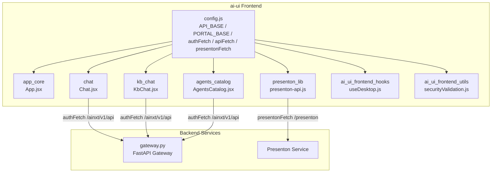
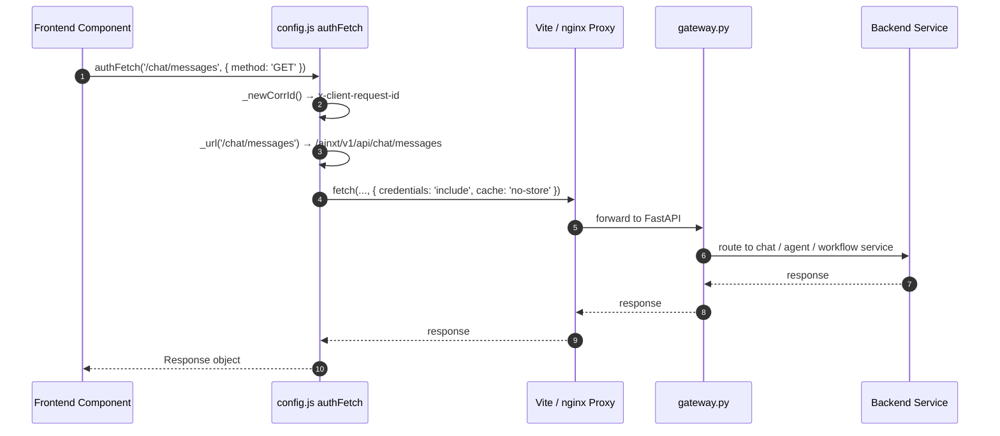
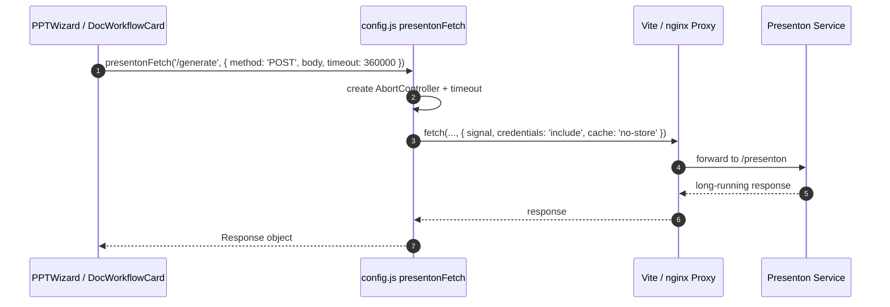
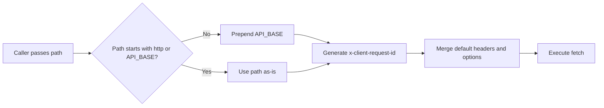
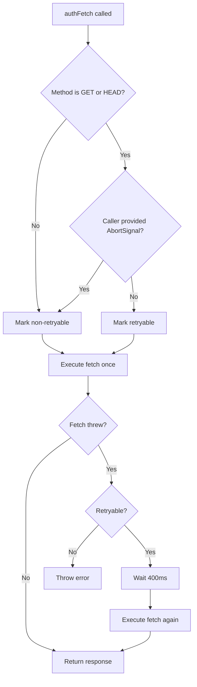

# config Module

## Brief Introduction

The `config` module is the central configuration and HTTP utility layer for the `ai-ui` frontend. It defines the canonical API and portal base paths, Presenton (presentation generation) service settings, and two fetch wrappers—`authFetch` and `apiFetch`—that every other frontend feature uses to communicate with the backend. By keeping routing constants, correlation-id generation, retry policy, and authentication-aware request defaults in one place, the module guarantees consistent request behavior across the entire single-page application (SPA).

---

## Comprehensive Documentation

### 1. Module Purpose and Responsibilities

| Responsibility | Description |
| -------------- | ----------- |
| **Base URL Constants** | Exposes `API_BASE` (`/ainxt/v1/api`) and `PORTAL_BASE` (`/portal`) so that API calls, the React Router basename, and production URL guards all derive from the same source. |
| **Presenton Configuration** | Centralizes Presenton base path, feature flag, timeout, polling interval, and retry limits. |
| **Authenticated Requests** | `authFetch` adds correlation ids, disables caching, sends cookies, and retries idempotent GET/HEAD requests once on transient network failures. |
| **Unauthenticated Requests** | `apiFetch` provides the same correlation-id and cache-busting behavior without retry logic, suitable for public or pre-auth endpoints. |
| **Presenton Requests** | `presentonFetch` handles long-running PPT generation calls with an `AbortController` timeout and explicit `no-store` caching. |

### 2. Core Components

#### 2.1 `API_BASE` and `PORTAL_BASE`

```javascript
export const API_BASE = '/ainxt/v1/api';
export const PORTAL_BASE = '/portal';
```

- `API_BASE` is the single upstream prefix for all backend calls. In local development, the Vite dev server proxies `/ainxt/v1/api/*` to the FastAPI backend on port `8000`. In production, nginx routes the same prefix to the backend pool.
- `PORTAL_BASE` is the SPA mount prefix. It is consumed by the production build base, `BrowserRouter` basename, and the URL tamper guard in `App.jsx`.

#### 2.2 Presenton Configuration

```javascript
export const PRESENTON_BASE = import.meta.env.VITE_PRESENTON_BASE || '/presenton';
export const ENABLE_PRESENTON = (import.meta.env.VITE_ENABLE_PRESENTON || 'true') === 'true';
export const PRESENTON_TIMEOUT = Number(import.meta.env.VITE_PRESENTON_TIMEOUT || 360000);
export const PRESENTON_POLL_INTERVAL = Number(import.meta.env.VITE_PRESENTON_POLL_INTERVAL || 3000);
export const PRESENTON_MAX_RETRIES = Number(import.meta.env.VITE_PRESENTON_MAX_RETRIES || 5);
```

These values can be overridden at build or runtime via Vite environment variables. The default timeout of six minutes reflects the long-running nature of PPT generation.

#### 2.3 `presentonFetch(path, options)`

A dedicated fetch helper for the Presenton service:

- Resolves absolute URLs as-is and prefixes relative URLs with `PRESENTON_BASE`.
- Creates an `AbortController` with a configurable timeout (default `PRESENTON_TIMEOUT`).
- Composes an external `AbortSignal` so that caller-initiated cancellation also clears the internal timeout.
- Uses `cache: 'no-store'` and `credentials: 'include'`.

#### 2.4 `_newCorrId()`

Generates a per-request correlation id:

- Uses `crypto.randomUUID()` when available (modern browsers over HTTPS/localhost).
- Falls back to a timestamp + random token so the `x-client-request-id` header is never empty.

This id is propagated to the backend and enables end-to-end request tracing across gateway, LLM proxy, and worker services.

#### 2.5 `_url(path)`

Normalizes request paths to avoid double-prefixing. It returns the path unchanged if it already starts with `http` or `API_BASE`; otherwise it prepends `API_BASE`.

#### 2.6 `authFetch(url, options)`

The primary request helper for authenticated endpoints:

- Merges default options: `cache: 'no-store'`, `credentials: 'include'`.
- Injects `x-client-request-id`.
- Detects idempotent methods (`GET`, `HEAD`) and retries **once** if the initial `fetch` throws (i.e., no response was received) and no caller-supplied `AbortSignal` is present.
- Non-idempotent methods (`POST`, `PUT`, `PATCH`, `DELETE`) are never retried to prevent duplicate mutations.

#### 2.7 `apiFetch(url, options)`

A lighter wrapper for unauthenticated or pre-auth calls. It injects the correlation id and disables caching but does not implement retry logic.

### 3. Architecture and Component Relationships

The `config` module sits at the bottom of the `ai-ui` frontend dependency graph. It is imported by feature modules, shared components, hooks, and utility files. The backend-facing modules it talks to are the `gateway` (via `/ainxt/v1/api`) and the Presenton service (via `/presenton`).



### 4. Data Flow

A typical authenticated request flows from a UI component through `authFetch`, across the nginx/Vite proxy, into the FastAPI gateway, and onward to the appropriate backend service.



For Presenton PPT generation, the flow uses `presentonFetch` with an explicit timeout:



### 5. Process Flows

#### 5.1 Correlation ID and Request Normalization



#### 5.2 Retry Decision Logic in `authFetch`



### 6. Configuration Reference

| Constant / Function | Default | Environment Override | Description |
| ------------------- | ------- | -------------------- | ----------- |
| `API_BASE` | `/ainxt/v1/api` | — | Backend API prefix. |
| `PORTAL_BASE` | `/portal` | — | SPA mount prefix. |
| `PRESENTON_BASE` | `/presenton` | `VITE_PRESENTON_BASE` | Presenton service prefix. |
| `ENABLE_PRESENTON` | `true` | `VITE_ENABLE_PRESENTON` | Feature flag for Presenton. |
| `PRESENTON_TIMEOUT` | `360000` ms | `VITE_PRESENTON_TIMEOUT` | Default timeout for Presenton calls. |
| `PRESENTON_POLL_INTERVAL` | `3000` ms | `VITE_PRESENTON_POLL_INTERVAL` | Poll interval for status checks. |
| `PRESENTON_MAX_RETRIES` | `5` | `VITE_PRESENTON_MAX_RETRIES` | Max status-poll retries. |
| `authFetch` | — | — | Authenticated fetch with one retry for idempotent methods. |
| `apiFetch` | — | — | Unauthenticated fetch without retry. |
| `presentonFetch` | — | — | Long-timeout fetch for Presenton. |

### 7. How the Module Fits into the Overall System

The `config` module is the narrow waist of the `ai-ui` frontend HTTP layer. It decouples feature code from the exact backend URL layout and from cross-cutting concerns such as authentication cookies, request tracing, and retry semantics. Because every network call flows through this module, changes to the API prefix, portal mount point, or resilience policy can be made in a single file.

Upstream consumers include:

- **app_core** — `App.jsx` uses `PORTAL_BASE` for routing and URL guards.
- **chat** and **kb_chat** — `Chat.jsx` and `KbChat.jsx` use `authFetch` for all message, attachment, and feedback calls.
- **agents_catalog** — `AgentsCatalog.jsx` uses `authFetch` to list and favorite agents.
- **presenton_lib** — `presenton-api.js` uses `presentonFetch` for outline streaming, generation, and status polling.
- **ai_ui_frontend_hooks** — `useDesktop.js` uses `authFetch` for cowork desktop session APIs.
- **ai_ui_frontend_utils** — `securityValidation.js` and other utilities use `apiFetch` for pre-auth or public checks.

Downstream, requests reach the **gateway** module (`gateway.py`) under `/ainxt/v1/api` and the **Presenton** service under `/presenton`.

### 8. References

- [app_core.md](app_core.md) — SPA routing and `PORTAL_BASE` consumption.
- [chat.md](chat.md) — `authFetch` usage in the main chat feature.
- [kb_chat.md](kb_chat.md) — `authFetch` usage in knowledge-base chat.
- [agents_catalog.md](agents_catalog.md) — agent catalog network calls.
- [presenton_lib.md](presenton_lib.md) — Presenton API client and `presentonFetch` usage.
- [gateway.md](gateway.md) — FastAPI gateway that handles `/ainxt/v1/api` traffic.
