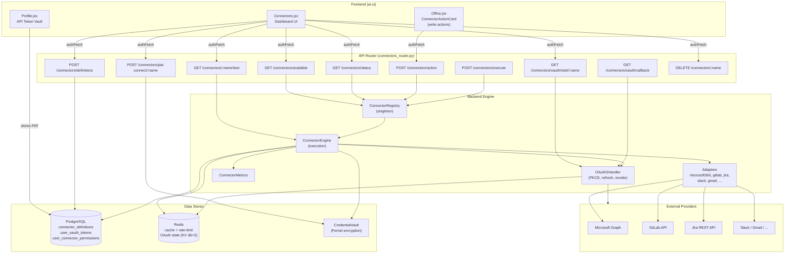
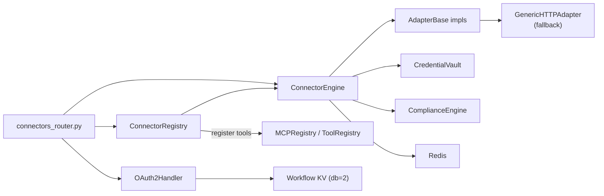
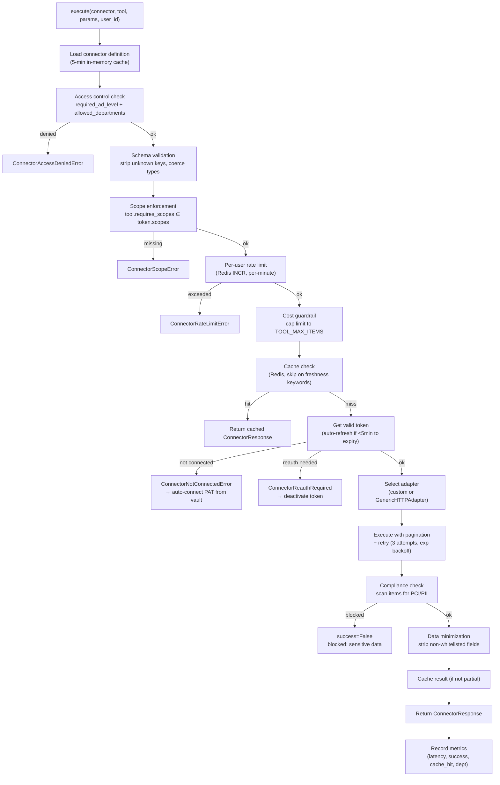
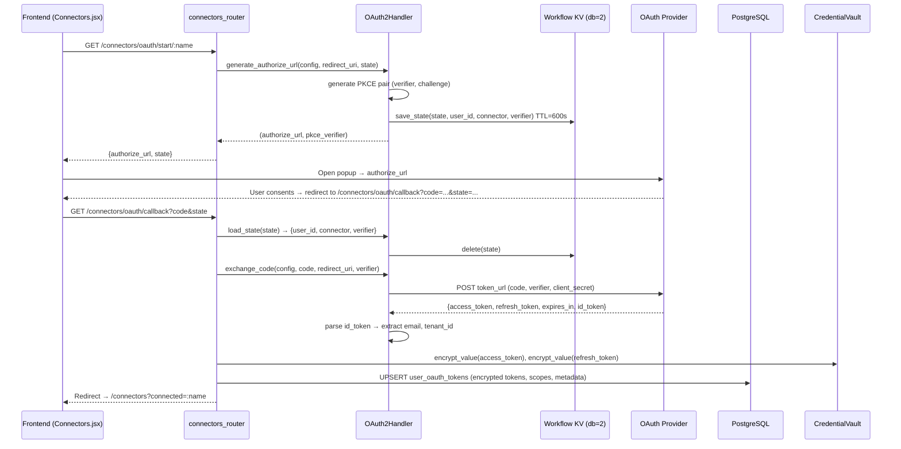
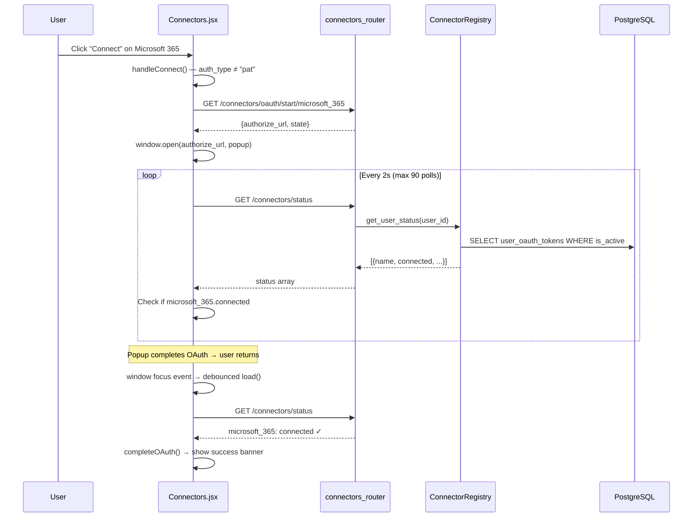
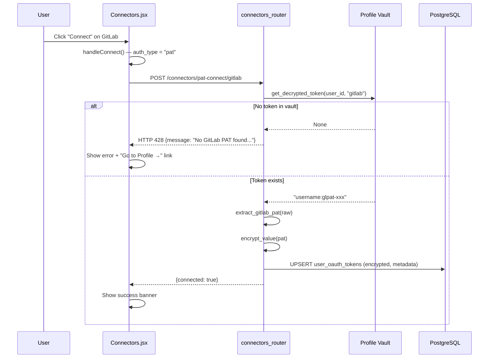
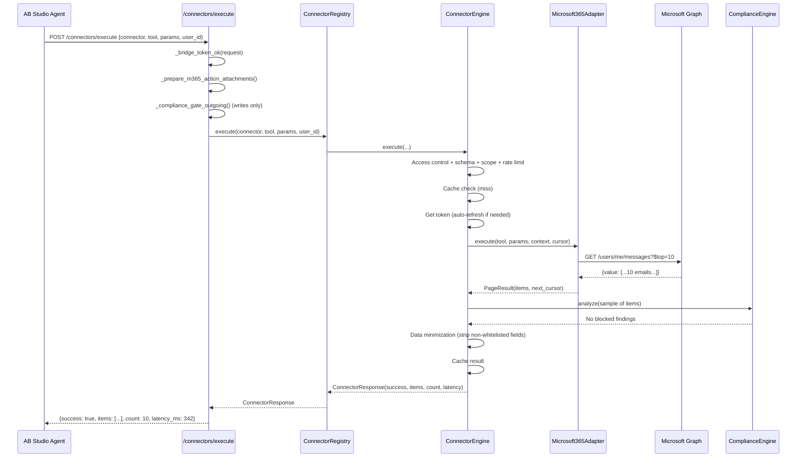
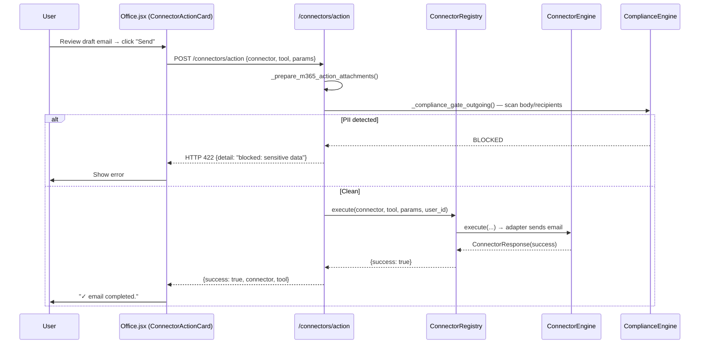
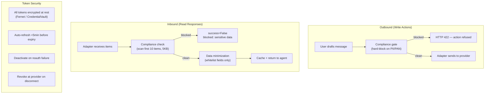

# Connectors Module

## Introduction

The **Connectors** module is the integration layer that bridges the AiNxt platform to external enterprise systems — Microsoft 365, GitLab, Jira, Slack, Gmail, Google Drive, DocuSign, Zoom, Confluence, and custom HTTP-based services. It provides a unified, secure, and governed surface through which AI agents and end-users can *read* data from (and *write* actions to) third-party systems without each agent needing to know provider-specific APIs.

The module spans three tiers:

| Tier | Location | Responsibility |
|------|----------|----------------|
| **Frontend** | `ai-ui/src/components/Connectors.jsx` | User-facing dashboard for browsing, connecting, testing, and disconnecting connectors |
| **API Router** | `routers/connectors_router.py` | REST endpoints for OAuth/PAT flows, status, testing, definitions, and execution |
| **Backend Engine** | `connectors/engine.py`, `connectors/registry.py`, `connectors/oauth2.py`, `connectors/adapters/*` | Token management, access control, execution, caching, compliance, and per-provider adapters |

> **See also:** [shared_integrations](#related-modules) for the adapter implementations and connector infrastructure; [office](#related-modules) for the write-action UI (`ConnectorActionCard`); [profile](#related-modules) for the API Token Vault used by PAT-based connectors.

---

## Architecture Overview

### Component Relationships

---

## Frontend: Connectors.jsx

**File:** `ai-ui/src/components/Connectors.jsx`

The `Connectors` component is the primary user-facing dashboard for managing connector integrations. It renders a categorized grid of connector cards, each showing connection status, available tools, and action buttons (Connect / Test / Disconnect).

### Key Design Decisions

1. **Enabled-connector gating** — Only connectors in the `ENABLED_CONNECTORS` set (`microsoft_365`, `gitlab`, `jira_connector`) are shown to users. New connectors are added to this set when ready for production use.

2. **Dual auth flows** — The component transparently branches between:
   - **OAuth2 popup flow** (Microsoft 365): opens a popup window, polls status until the OAuth callback completes.
   - **PAT flow** (GitLab, Jira): no popup — reads the user's Personal Access Token from the Profile vault via `POST /connectors/pat-connect/:name`. Returns HTTP 428 if the token is missing, prompting the user to add it in Profile first.

3. **Focus-based status refresh** — Because the OAuth popup completes in its own window, the dashboard re-fetches status on window `focus` / `visibilitychange` events (debounced to 1.5s) so the card flips to "Connected" automatically when the user returns.

4. **Flicker guard** — The `load()` function only overwrites the `available` list when the response is non-empty, preventing transient blank-outs when a gateway worker's in-memory registry is momentarily empty.

### Core Components

#### `Connectors({ user })`

The main component. Manages state for:
- `available` — connector definitions from `GET /connectors/available`
- `status` — per-connector connection status from `GET /connectors/status`
- `actionLoading` — per-connector loading state (`connecting` / `disconnecting` / `testing`)
- `oauthMessages` — transient success/error banners after connect attempts
- `testResults` — transient test-connection results
- `showAddForm` / `newConnector` — admin-only custom connector creation form

**Lifecycle:**
- On mount → `load()` fetches available connectors + status in parallel.
- `useEffect` for OAuth callback URL params (`?connected=` / `?connector=`) — handles popup-less completion.
- `useEffect` for `window.message` events of type `ainxt:connector-oauth` — handles popup-based completion.
- `useEffect` for focus/visibility → debounced `load()` re-fetch.
- Cleanup on unmount → clears all OAuth poll timers and popup refs.

#### `handleConnect(connector)`

Branches on `connector.auth_type`:
- `"pat"` → delegates to `handlePatConnect`
- Otherwise (OAuth2) → calls `GET /connectors/oauth/start/:name`, opens the `authorize_url` in a popup, then polls `GET /connectors/status` every 2s (max 90 polls = 3 min) until connected, popup closes, or timeout.

#### `handlePatConnect(connector)`

Calls `POST /connectors/pat-connect/:name`. On HTTP 428, shows a message with a "Go to Profile →" link so the user can add their token first.

#### `handleAddCustom()`

Admin-only. Posts to `POST /connectors/definitions` with name, display_name, base_url, auth_type, and category. Custom connectors default to the generic HTTP adapter.

#### `onFocus` (internal)

A debounced focus/visibility handler that triggers `load()` 1.5s after the window regains focus — ensures the OAuth-completed card updates without a manual refresh.

### API Endpoints Consumed

| Endpoint | Method | Purpose |
|----------|--------|---------|
| `/connectors/available` | GET | List all active connector definitions |
| `/connectors/status` | GET | Per-user connection status for all connectors |
| `/connectors/oauth/start/:name` | GET | Begin OAuth2 flow → returns `authorize_url` |
| `/connectors/pat-connect/:name` | POST | Connect using stored PAT (GitLab/Jira) |
| `/connectors/:name/test` | GET | Lightweight probe call to verify connectivity |
| `/connectors/:name` | DELETE | Disconnect (revoke + deactivate token) |
| `/connectors/definitions` | POST | Admin: create custom connector definition |

> All requests use `authFetch` from [`config.js`](#related-modules), which adds credentials, a correlation ID header, and a single retry on transient GET failures.

---

## API Router: connectors_router.py

**File:** `routers/connectors_router.py`

The router exposes two distinct execution paths and a set of management endpoints. See [shared_api_routers](#related-modules) for the full router registration.

### Endpoint Catalog

#### Management & Status

| Endpoint | Auth | Description |
|----------|------|-------------|
| `GET /connectors/available` | JWT | Lists all active connector definitions with tool counts |
| `GET /connectors/status` | JWT | Per-user connection status (connected, connected_as, workspace) |
| `GET /connectors/:name/test` | JWT | Probes the connector with a parameterless read tool |
| `DELETE /connectors/:name` | JWT | Disconnects: revokes token at provider, deactivates DB row |
| `POST /connectors/definitions` | Admin | Creates a custom connector definition |
| `PUT /connectors/definitions/:name` | Admin | Updates a connector definition |
| `DELETE /connectors/definitions/:name` | Admin | Soft-deletes (deactivates) a non-builtin connector |
| `GET /connectors/metrics` | Admin | Aggregated connector call metrics |

#### OAuth2 Flow

| Endpoint | Auth | Description |
|----------|------|-------------|
| `GET /connectors/oauth/start/:name` | JWT | Generates authorize URL with PKCE, saves state to KV |
| `GET /connectors/oauth/callback` | None | Handles provider redirect, exchanges code for tokens |
| `POST /connectors/pat-connect/:name` | JWT | Connects PAT-based connector from Profile vault |

#### Execution

| Endpoint | Auth | Description |
|----------|------|-------------|
| `POST /connectors/action` | JWT (user) | **Write path** — human-confirmed actions (send email, Teams message). Compliance hard-blocks on PII. Returns ack only (no items). |
| `POST /connectors/execute` | Bridge token | **Read path** — internal bridge for AB Studio agent tools. Returns full `ConnectorResponse` with items. Accepts explicit `user_id`. |
| `POST /connectors/status-for-user` | Bridge token | Internal: is user X connected to connector Y? Used by AB Studio to gate tool visibility. |

### Key Router Behaviors

- **`oauth_start`** — Pins the Azure tenant, validates the `client_id` env var is set, generates a PKCE pair, and stores `{user_id, connector_name, pkce_verifier}` in the workflow KV (Redis db=2) with a 10-minute TTL keyed by a random `state` token.

- **`pat_connect`** — Reads the user's PAT from the Profile `user_tokens` table (via `get_decrypted_token`). Returns **HTTP 428** (Precondition Required) when no token exists, so the frontend can show a "Go to Profile" prompt. For GitLab, extracts the PAT from `username:glpat-xxx` format; for Jira, stores `email:api_token` for Basic auth.

- **`connector_action`** (write path) — The orchestrator never auto-plans writes; this endpoint is only reached after a user clicks "Send" on a draft in the Office UI. Outgoing free-text params are compliance-scanned and **hard-blocked** (HTTP 422) on PII/PAN violations.

- **`connector_execute`** (read path) — Authenticated via a bridge token (reuses `AZURE_AD_CLIENT_SECRET`). Accepts an explicit `user_id` and executes against *that* user's OAuth connection. Maps errors to structured `{success, error, code}` envelopes (`REAUTH_REQUIRED`, `ACCESS_DENIED`, `SCOPE_DENIED`) at HTTP 200 so the sandbox tool can relay guidance to the LLM.

- **`test_connection`** — Selects a probe tool by *capability* (first parameterless non-write tool), not by array position, to avoid false failures when tool ordering changes.

---

## Execution Engine: ConnectorEngine

**File:** `connectors/engine.py` → `ConnectorEngine`

The `ConnectorEngine` is the central, thread-safe execution engine. Its `execute()` method never raises — all errors are captured into the `ConnectorResponse.error` field with a typed prefix (`ACCESS_DENIED`, `REAUTH_REQUIRED`, `SCOPE_ERROR`, `RATE_LIMIT`, `TRANSIENT_ERROR`).

### Execution Pipeline

### Pipeline Steps in Detail

| Step | Method | Purpose |
|------|--------|---------|
| 0. Access control | `_check_access_policy` | Enforces `required_ad_level` (lower = more senior) and `allowed_departments` from the connector definition |
| 1. Schema validation | `_validate_params` | Strips unknown keys, coerces types, preserves internal `_`-prefixed bridge keys (e.g. `_attachments`) |
| 2. Scope enforcement | `_enforce_scopes` | Verifies `tool.requires_scopes ⊆ token.scopes`; missing scopes → `ConnectorScopeError` |
| 3. Rate limiting | `_check_rate_limit` | Redis `INCR` with 60s expiry per `(connector, user)`; configurable per-connector |
| 4. Cost guardrail | `_apply_cost_guardrail` | Caps `limit` param to `TOOL_MAX_ITEMS[tool]`; sets `__truncated__` flag |
| 5. Cache | `_cache_get` / `_cache_set` | SHA-256 key of `(connector, tool, user_id, params)`; bypassed on freshness keywords ("latest", "recent", "today") |
| 6. Token management | `_get_token_row` | Fetches encrypted token from DB; auto-refreshes OAuth tokens expiring <5min; verifies DPI consent artifacts; distinguishes transient DB errors from genuine disconnects |
| 7. Adapter execution | `_execute_with_pagination` | Paginates via `next_cursor` up to `MAX_PAGES` / `max_items`; enforces wall-clock deadline (`MAX_CONNECTOR_EXECUTION_MS`) |
| 8. Compliance | `_compliance_check` | Scans first 10 items (5KB sample) via `ComplianceEngine.analyze()`; blocks on PCI/PII findings |
| 9. Data minimization | `_minimize_response` | Strips fields not in `tool.response_fields` whitelist |
| 10. Metrics | `connector_metrics.record_call` | Records latency, success/failure, cache hit, user dept |

### Error Handling Strategy

The engine distinguishes several error classes, each with a distinct prefix in `ConnectorResponse.error`:

| Error Class | Prefix | Action Taken | User Guidance |
|-------------|--------|--------------|---------------|
| `ConnectorAccessDeniedError` | `ACCESS_DENIED` | None | "Your role level does not meet the minimum required" |
| `ConnectorNotConnectedError` | (raw) | Auto-connect PAT from vault, retry once | "Go to Settings → Connectors" |
| `ConnectorReauthRequired` | `REAUTH_REQUIRED` | Deactivate token | "Reconnect under Settings → Connectors" |
| `ConnectorScopeError` | `SCOPE_ERROR` | None | "Re-connect to grant additional permissions" |
| `ConnectorRateLimitError` | `RATE_LIMIT` | None | "Try again later" |
| `ConnectorTransientError` | `TRANSIENT_ERROR` | None (do NOT deactivate) | "Try again — you do NOT need to reconnect" |

**Critical distinction:** A transient DB error (pool exhaustion, dropped connection) is retried 3× with backoff before surfacing as `TRANSIENT_ERROR` — never as "not connected". This prevents the misleading "please connect again" prompts that would otherwise appear during brief DB blips.

### PAT Auto-Connect

When a `ConnectorNotConnectedError` is raised for a PAT connector (`gitlab`, `jira_connector`), the engine calls `_try_auto_connect_pat()` which reads the user's token from the Profile vault (`user_tokens` table) and writes it to `user_oauth_tokens`. This handles the common case where a user stored their PAT in Profile but never explicitly clicked "Connect" in the dashboard.

---

## Registry: ConnectorRegistry

**File:** `connectors/registry.py` → `ConnectorRegistry`

A thread-safe singleton (`connector_registry`) that loads all active connector definitions from the `ainxt.connector_definitions` table and optionally registers their tools into the MCP `ToolRegistry` for LLM `tool_use` calling.

### Key Methods

| Method | Description |
|--------|-------------|
| `bootstrap(mcp_tools_registry)` | Loads definitions from DB; registers tools into MCP registry as `{connector}__{tool}` (e.g. `microsoft_365__outlook_search_emails`) |
| `get_available()` | Returns all active definitions with tool counts; self-heals empty cache by reloading from DB |
| `get_user_status(user_id)` | Returns per-connector connection status for a user (connected, connected_as, workspace) |
| `get_user_tools(user_id)` | Returns LLM-facing tool definitions for connectors the user has *connected* |
| `list_connected_tools(user_id)` | Returns tools the user can use right now (used by the Cowork office planner) |
| `execute(connector, tool, params, user_id, ...)` | Delegates to `ConnectorEngine.execute()`; enforces `MAX_CONNECTOR_CALLS_PER_REQUEST` guard |

### MCP Integration

Each connector tool is registered into the MCP `ToolRegistry` with:
- **Name:** `{connector_name}__{tool_name}`
- **Description:** `[{display_name} connector] {tool description}`
- **Tags:** `["connector", category, connector_name]`
- **Function:** A closure that calls `connector_engine.execute()` and returns `ConnectorResponse.to_dict()`

This allows LLM agents to discover and call connector tools through the standard MCP tool-use protocol. See [mcp_system](#related-modules) for the MCP registry infrastructure.

### Self-Healing

The registry guards against stale/empty caches in two scenarios:
1. **Gunicorn worker bootstrapped before seeding** — `get_available()` reloads from DB if `_definitions` is empty.
2. **RQ worker without bootstrap** — `execute()`, `get_user_tools()`, `get_user_status()`, and `list_connected_tools()` all lazy-bootstrap on first call.

---

## OAuth2 Handler

**File:** `connectors/oauth2.py` → `OAuth2Handler`

Manages the full OAuth2 lifecycle for any provider with PKCE support.

### Flow State Management

OAuth2 flow state (`user_id`, `connector_name`, `pkce_verifier`) is stored in the **workflow KV** (Redis db=2) with a 10-minute TTL, keyed by a cryptographically random `state` token. This decouples the flow from the gateway process — any worker can complete the callback.

### Token Lifecycle

### Token Refresh

The engine auto-refreshes OAuth access tokens when they expire within 5 minutes. Refresh failures are classified:
- `invalid_grant` / `token_revoked` → `ConnectorReauthRequired` (deactivate token, user must reconnect)
- Network/relay failure → `ConnectorNotConnectedError` with a "server can't reach the sign-in endpoint" message (token is NOT deactivated — it's a server-side issue)

### Vault Key Mismatch Detection

If token decryption fails (the row exists and is active but the process can't decrypt it), the engine surfaces a precise `FERNET_KEY mismatch` error rather than a generic "not connected" — this is a server configuration issue where the worker's `FERNET_KEY` differs from the gateway's.

---

## Adapters

**Directory:** `connectors/adapters/`

Each connector with `has_custom_adapter=True` has a dedicated adapter module that implements `AdapterBase`. Connectors without a custom adapter fall back to `GenericHTTPAdapter`, which uses the tool definition's `method`, `path`, `query_params`, and `response_items_path` to make generic HTTP calls.

### Adapter Selection

The engine's `_get_adapter()` method:
1. Checks `defn.has_custom_adapter`
2. If true, lazy-loads the adapter module via an internal map (e.g. `microsoft_365` → `connectors.adapters.microsoft365`)
3. Looks for a module-level `AdapterBase` singleton (convention: `{connector_name}_adapter`)
4. Falls back to `GenericHTTPAdapter` if no custom adapter is found

### Available Adapters

| Connector | Adapter Module | Auth Type | Notes |
|-----------|----------------|-----------|-------|
| `microsoft_365` | `connectors.adapters.microsoft365` | OAuth2 | Graph API; supports attachments |
| `gitlab` | `connectors.adapters.gitlab` | PAT | Delegates to `tools/gitlab_tools.py` (shared with SDLC) |
| `jira_connector` | `connectors.adapters.jira` | PAT | REST API v3; Basic auth |
| `slack` | `connectors.adapters.slack` | OAuth2 | |
| `gmail` | `connectors.adapters.gmail` | OAuth2 | |
| `google_drive` | `connectors.adapters.google_drive` | OAuth2 | |
| `docusign` | `connectors.adapters.docusign` | OAuth2 | |
| `zoom` | `connectors.adapters.zoom` | OAuth2 | |
| `confluence` | `connectors.adapters.confluence` | PAT/OAuth2 | |
| `dpi_account_aggregator` | `connectors.adapters.dpi_account_aggregator` | DPI Consent | Consent-artifact based; sandbox-aware |
| `dpi_digilocker` | `connectors.adapters.dpi_digilocker` | DPI Consent | Consent-artifact based; sandbox-aware |
| *(custom)* | `GenericHTTPAdapter` | Configurable | Fallback for admin-created connectors |

> See [shared_integrations_connector_adapters](#related-modules) for adapter implementation details.

---

## Process Flows

### OAuth2 Connect Flow (Microsoft 365)

### PAT Connect Flow (GitLab / Jira)

### Connector Execution (Read Path — AB Studio Bridge)

### Write Action Flow (Office UI)

---

## Security & Compliance

### Multi-Layer Data Protection

### Access Control

- **AD-level gating** — Connectors can specify `required_ad_level` (lower = more senior). Users above the threshold are denied.
- **Department restriction** — Connectors can restrict to `allowed_departments`.
- **Per-user permissions** — The `user_connector_permissions` table stores per-tool `always_allow` / `denied` decisions (with wildcard `*` support).
- **Scope enforcement** — Each tool declares `requires_scopes`; the engine verifies these against the token's granted scopes.

### Rate Limiting & Cost Guardrails

- **Per-user rate limit** — Redis `INCR` with 60s window, configurable per connector (`rate_limit_per_min`, default 100).
- **Item cap** — `TOOL_MAX_ITEMS` per tool; requests exceeding the cap are truncated with a `__truncated__` flag.
- **Max calls per request** — `MAX_CONNECTOR_CALLS_PER_REQUEST` prevents agent misuse loops.

---

## Data Model

### PostgreSQL Tables

| Table | Purpose |
|-------|---------|
| `ainxt.connector_definitions` | Connector metadata: name, display_name, category, auth_type, auth_config, tools (JSONB), base_url, has_custom_adapter, rate_limit_per_min, is_active, is_builtin, required_ad_level, allowed_departments |
| `ainxt.user_oauth_tokens` | Per-user connection: user_id, connector_name, access_token (encrypted), refresh_token (encrypted), expires_at, scopes, metadata (JSONB), is_active |
| `ainxt.user_connector_permissions` | Per-user tool permissions: user_id, connector_name, tool_name (or `*`), always_allow |

### Redis Usage

| Key Pattern | DB | Purpose | TTL |
|-------------|----|---------|----|
| `connector:cache:{sha256}` | 0 | Response cache | `tool.cache_ttl_s` (default 300s) |
| `connector:ratelimit:{connector}:{user}` | 0 | Rate limit counter | 60s |
| `connector:oauth:state:{state}` | 2 (workflow KV) | OAuth2 flow state | 600s (10 min) |

---

## Office Integration (Write Actions)

The `Office.jsx` component (see [office](#related-modules)) uses `ConnectorActionCard` to render human-confirmed write actions. The orchestrator proposes a draft (e.g., an email or Teams message), and the user reviews and edits the parameters before clicking "Send". The card calls `POST /connectors/action`, which compliance-scans the outgoing content and hard-blocks on PII.

On the desktop, the full local agent (sub-agents + Skills + connector MCP bridge) runs via `CoworkDesktop`; in the browser, it uses the server-side office-mode SSE flow (`OfficeServer`).

---

## Related Modules

| Module | Relationship |
|--------|-------------|
| **[shared_integrations.md](shared_integrations.md)** | Contains the connector infrastructure (`ConnectorEngine`, `ConnectorRegistry`, `OAuth2Handler`, `ConnectorMetrics`) and all adapter implementations (`microsoft365`, `gitlab`, `jira`, `slack`, `gmail`, etc.) |
| **[connectors_router.md](connectors_router.md)** | The API router (`routers/connectors_router.py`) exposing all connector REST endpoints |
| **[office.md](office.md)** | The Office component with `ConnectorActionCard` for write actions and `OfficeServer` for the SSE flow |
| **[profile.md](profile.md)** | The Profile component with the API Token Vault — source of PATs for GitLab/Jira connectors |
| **[config.md](config.md)** | `authFetch` / `apiFetch` HTTP utilities used by all frontend connector calls |
| **[mcp_system.md](mcp_system.md)** | The MCP registry where connector tools are registered as `{connector}__{tool}` for LLM tool-use |
| **[shared_core.md](shared_core.md)** | `ComplianceEngine` used for PCI/PII scanning of connector responses; `CredentialVault` for token encryption |
| **[database.md](database.md)** | PostgreSQL schema for `connector_definitions`, `user_oauth_tokens`, `user_connector_permissions` |
