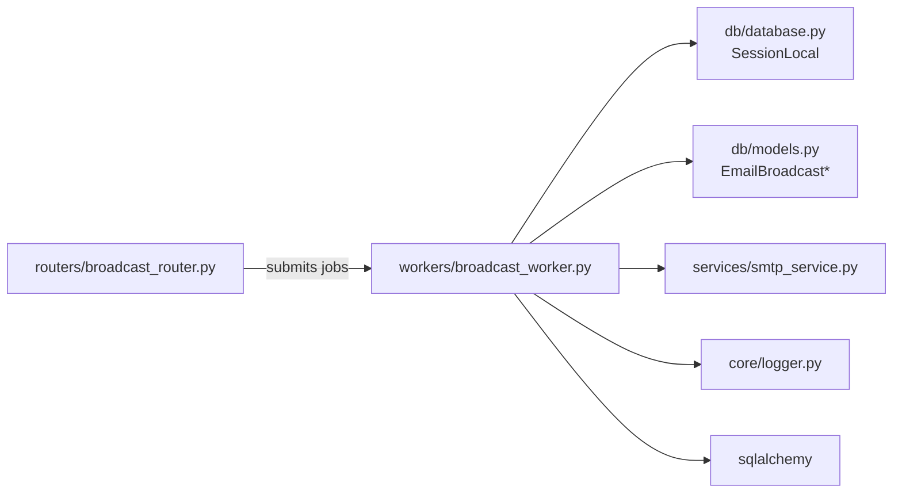
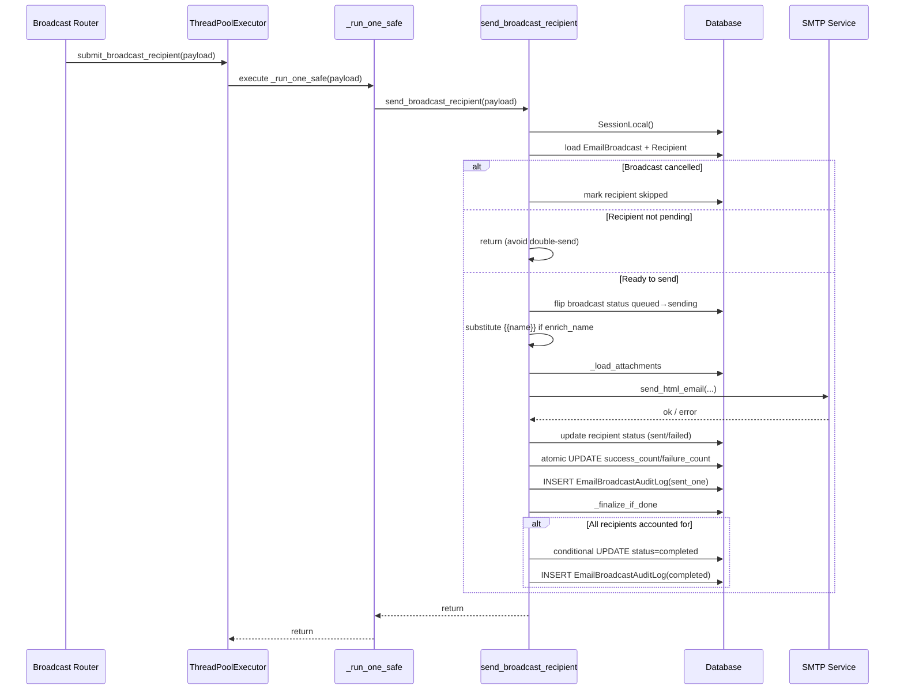
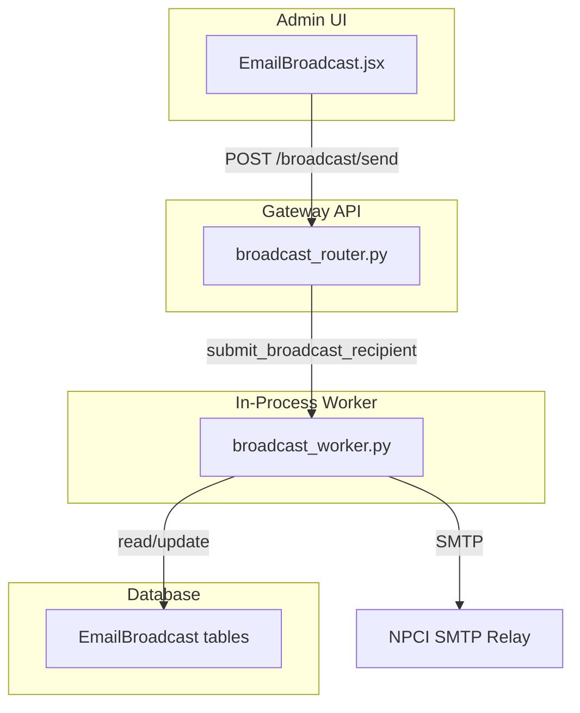

# Broadcast Worker Module

## Brief Introduction

The `broadcast_coach_workers_broadcast` module (`workers/broadcast_worker.py`) is responsible for the reliable, asynchronous delivery of individual email broadcast recipients. It is part of the broader `broadcast_coach_workers` worker group, which supports broadcast messaging and coaching event processing. This module specifically handles the per-recipient dispatch of admin-initiated email broadcasts through the internal NPCI SMTP relay, running as a bounded thread pool inside the gateway process rather than as a separate RQ worker pool.

## Module Purpose and Core Functionality

The broadcast worker's primary responsibility is to send one email to one recipient of an `EmailBroadcast`. It is designed around the following principles:

- **Lightweight concurrency**: Broadcasts are infrequent (once or twice a month), so a dedicated RQ worker pool was deemed overkill. Instead, an 8-thread `ThreadPoolExecutor` runs inside the gateway process.
- **Thread safety**: Each invocation opens its own SQLAlchemy `SessionLocal()`, uses atomic SQL `UPDATE ... SET col = col + 1` for counters, and uses conditional updates for finalization.
- **Fault isolation**: A failure for one recipient does not crash the pool worker or affect other recipients.
- **Auditability**: Every send attempt produces an `EmailBroadcastAuditLog` row, and broadcast completion is recorded once all recipients are accounted for.

### Core Components

| Component | Type | Description |
|-----------|------|-------------|
| `_run_one_safe` | Function | Thread-pool target that wraps `send_broadcast_recipient` and logs exceptions without crashing the worker thread. |
| `submit_broadcast_recipient` | Function | Fire-and-forget API used by the broadcast router to enqueue a single recipient send. |
| `send_broadcast_recipient` | Function | Main per-recipient send logic: loads broadcast/recipient, assembles body, sends via SMTP, updates counters, audits, and finalizes. |
| `_first_name` | Function | Extracts and HTML-escapes the recipient's first name for `{{name}}` substitution. |
| `_substitute_name` | Function | Replaces `{{name}}` tokens in HTML/text bodies. |
| `_load_attachments` | Function | Reads attachment bytes from `storage_path` for inclusion in the email. |
| `_finalize_if_done` | Function | Conditionally marks a broadcast as `completed` when all recipients are processed. |
| `_BROADCAST_EXECUTOR` | `ThreadPoolExecutor` | Module-level bounded thread pool (default 8 workers) for concurrent recipient sends. |

## Architecture and Component Relationships

```mermaid
flowchart TB
    subgraph GatewayProcess["Gateway Process"]
        BR["Broadcast Router<br/>routers/broadcast_router.py"]
        BE["Broadcast ThreadPoolExecutor<br/>_BROADCAST_EXECUTOR"]
        ROS["_run_one_safe"]
        SBR["send_broadcast_recipient"]
    end

    subgraph DataLayer["Data Layer"]
        EB["EmailBroadcast"]
        EBR["EmailBroadcastRecipient"]
        EBA["EmailBroadcastAttachment"]
        EAL["EmailBroadcastAuditLog"]
    end

    subgraph Services["Services"]
        SMTP["services/smtp_service.py<br/>send_html_email"]
    end

    BR -->|submit_broadcast_recipient(payload)| BE
    BE -->|execute| ROS
    ROS -->|try/except| SBR
    SBR -->|query/update| EB
    SBR -->|query/update| EBR
    SBR -->|read| EBA
    SBR -->|insert| EAL
    SBR -->|send| SMTP
```

### Dependency Diagram



## Data Flow

The following sequence diagram illustrates the lifecycle of a single recipient send:



## Process Flow per Recipient

1. **Receive payload**: `broadcast_id` and `recipient_id` are extracted.
2. **Open session**: A fresh `SessionLocal()` is created and closed in `finally`.
3. **Load entities**: `EmailBroadcast` and `EmailBroadcastRecipient` are loaded.
4. **Cancellation check**: If the broadcast is cancelled, pending recipients are marked `skipped`.
5. **Idempotency check**: If the recipient is no longer `pending`, the job returns early.
6. **Status transition**: The broadcast status moves from `queued` to `sending` on the first active recipient.
7. **Body assembly**: Optional `{{name}}` enrichment substitutes the recipient's first name.
8. **Attachment loading**: Files are read from `storage_path`; unreadable attachments are skipped with a warning.
9. **SMTP dispatch**: `send_html_email` is called with HTML/text bodies and attachments.
10. **Outcome persistence**: Recipient status is set to `sent` or `failed`, and the corresponding broadcast counter is incremented atomically.
11. **Audit logging**: A `sent_one` audit row records the result.
12. **Finalization**: If `success_count + failure_count == total_count`, the broadcast is marked `completed` and a `completed` audit row is written.

## Thread Safety and Concurrency

The module is intentionally designed to run inside the gateway process using a shared `ThreadPoolExecutor`. Key thread-safety measures include:

- **Per-thread sessions**: Each `send_broadcast_recipient` call creates and closes its own `SessionLocal()`; sessions are never shared.
- **Atomic counters**: Counter updates use SQL `UPDATE ... SET success_count = success_count + 1` rather than Python read-modify-write.
- **Race-safe finalization**: `_finalize_if_done` uses a conditional `UPDATE` with `status IN ('queued', 'sending')`. Only the worker whose update affects a row writes the `completed` audit log; others see `rowcount == 0` and exit.
- **Fresh SMTP connections**: `send_html_email` opens a new `smtplib.SMTP` connection per call, avoiding shared sockets.
- **Fault isolation**: `_run_one_safe` catches all exceptions so a single bad recipient cannot terminate the pool worker or poison subsequent jobs.

## Error Handling

| Scenario | Behavior |
|----------|----------|
| Missing `broadcast_id` or `recipient_id` | Logged as error; function returns without DB interaction. |
| Broadcast or recipient not found | Logged as error; function returns. |
| Broadcast cancelled | Pending recipient marked `skipped` with explanatory error text. |
| Recipient already non-pending | Early return to prevent double-send. |
| Attachment read failure | Warning logged; attachment skipped; send continues. |
| SMTP returns `False` | Recipient marked `failed`; failure counter incremented. |
| `SMTPSendError` or unexpected exception | Recipient marked `failed`; error text truncated to 2000 chars. |
| Unhandled exception in `send_broadcast_recipient` | Logged with traceback; DB rollback attempted; session closed. |

## How the Module Fits into the System

The broadcast worker is the execution backend for the broadcast feature exposed by the gateway:

- **Frontend**: The `ai_ui_frontend` `email_broadcast` feature (`ai-ui/src/components/EmailBroadcast.jsx`) provides the admin UI for creating, previewing, and sending broadcasts.
- **API Layer**: The `broadcast_router` in `shared_api_routers` (`routers/broadcast_router.py`) handles HTTP endpoints such as `send_broadcast`, `cancel_broadcast`, `list_broadcasts`, and `upload_attachment`. When a broadcast is sent, the router resolves recipients and calls `submit_broadcast_recipient` for each one.
- **Worker Layer**: This module (`workers/broadcast_worker.py`) performs the actual per-recipient SMTP dispatch.
- **Data Model**: Broadcast state is persisted in `EmailBroadcast`, `EmailBroadcastRecipient`, `EmailBroadcastAttachment`, and `EmailBroadcastAuditLog` (defined in `db/models.py`).
- **Mail Transport**: Actual email delivery is delegated to `services/smtp_service.py`.



## Configuration

| Environment Variable | Default | Description |
|----------------------|---------|-------------|
| `BROADCAST_THREADS` | `8` | Number of threads in the broadcast `ThreadPoolExecutor`. The default leaves headroom below the ~10-connection saturation point of the internal SMTP relay. |

## References

- [broadcast_router.md](broadcast_router.md) — HTTP API for broadcast creation, targeting, sending, and cancellation.
- ai_ui_frontend_email_broadcast.md — Admin UI for email broadcasts.
- services_smtp_service.md — SMTP transport service used by this worker.
- db_models.md — Database models including `EmailBroadcast`, `EmailBroadcastRecipient`, `EmailBroadcastAttachment`, and `EmailBroadcastAuditLog`.
- core_logger.md — Structured logging utilities.
