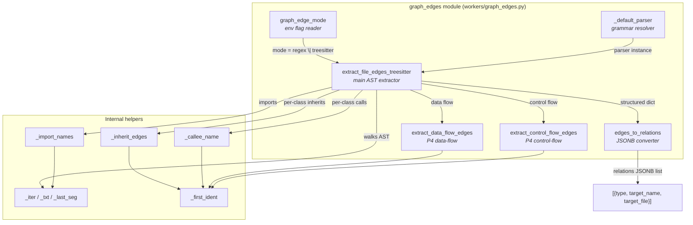
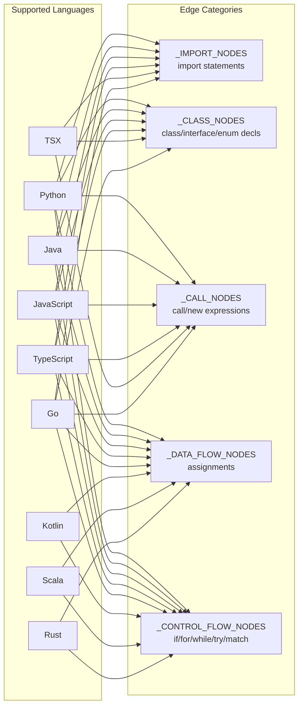
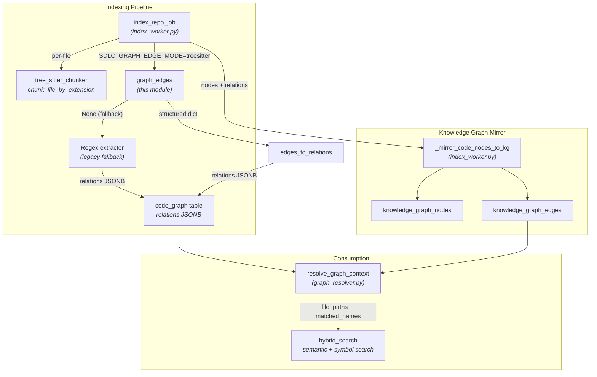
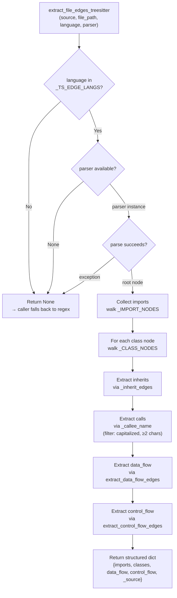
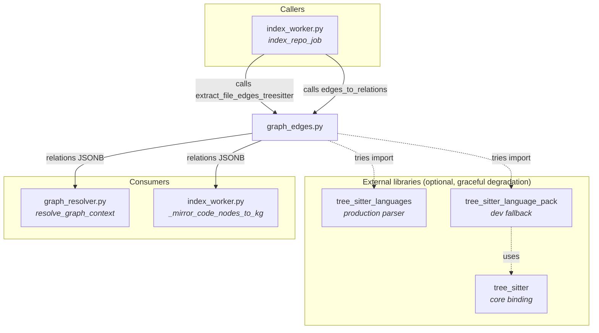

# broadcast_coach_workers_graph_edges

> **Module:** `workers/graph_edges.py` — AST-based code-graph edge extraction (WS-6)
> **Parent group:** `broadcast_coach_workers` (alongside `broadcast_worker.py` and `coach_consumer.py`)
> **Core component:** `edges_to_relations`

## 1. Introduction

The `graph_edges` module provides a **tree-sitter (AST) code-graph edge extractor** that replaces the legacy per-language REGEX approach used in `index_worker.py`. It parses source files into an abstract syntax tree and walks stable node types to resolve **import**, **inheritance** (`extends` / `implements`), **call**, **data-flow**, and **control-flow** edges with far higher accuracy than regex — especially for multi-line and aliased imports, and for call-edge attribution.

The module is **flag-gated** (`SDLC_GRAPH_EDGE_MODE`), **additive** (it can only increase coverage — never strand a language), and **contract-preserving**: the output JSONB shape `[{type, target_name, target_file}]` is identical to what the regex path produces, so no database migration or downstream consumer change is required.

### Design philosophy

| Principle | Detail |
|---|---|
| **AST node-type traversal, not `.scm` queries** | Walks `node.type` / `node.children` / `node.start_byte` — stable across every tree-sitter binding version. Avoids the `Query` API which changed shape between versions. |
| **Graceful fallback** | Returns `None` for unsupported languages, missing grammars, or parse failures. The caller (`index_worker`) owns the fallback to regex. |
| **Injectable parser** | `extract_file_edges_treesitter` accepts an optional `parser` argument, making it fully unit-testable on any platform (including Windows) with any tree-sitter binding. |
| **Additive only** | The AST path can only *add* coverage. Any per-file failure falls back to regex for that file alone. |

---

## 2. Architecture & Component Map



### Core components

| Component | Role |
|---|---|
| **`edges_to_relations`** | Converts the structured extractor output (`extract_file_edges_treesitter` return dict) into the `code_graph` relations JSONB list for a single class. Combines file-wide imports, the class's inherit/call edges, and P4 data-flow/control-flow edges. |
| **`extract_file_edges_treesitter`** | Main AST extraction entry point. Parses source, walks the tree for import/class/call nodes, delegates to helpers, and returns a structured dict (or `None` to signal regex fallback). |
| **`graph_edge_mode`** | Reads `SDLC_GRAPH_EDGE_MODE` env var at call time. Returns `"regex"` (default) or `"treesitter"`. |
| **`_default_parser`** | Resolves a tree-sitter parser via `tree_sitter_languages` (production) with a `tree_sitter_language_pack` fallback (dev boxes). Returns `None` if no grammar is available. |
| **`extract_data_flow_edges`** | P4 addition. Extracts top-level assigned variable/field names from a subtree. Capped at 30 names to avoid noise. |
| **`extract_control_flow_edges`** | P4 addition. Extracts control-flow branch targets (condition variable names) from a subtree. Capped at 20 names. |

### Per-language AST node-type registries

The module defines static dictionaries mapping each supported language to the tree-sitter node types that represent imports, class declarations, call expressions, data-flow assignments, and control-flow statements:



> **Note:** Kotlin, Scala, and Rust currently have data-flow and control-flow node-type mappings but are not yet in the `_TS_EDGE_LANGS` set for import/class/call extraction (those require grammar validation). The P4 dictionaries are forward-looking.

---

## 3. System Context & Data Flow

The `graph_edges` module sits in the **code indexing pipeline** — it is invoked during repository indexing to populate the `code_graph` table's `relations` JSONB column, which is later consumed by the graph resolver for multi-hop code navigation.



### How it fits into the broader system

1. **Repository indexing** (`index_repo_job` in `index_worker.py`) clones/reads a repo, chunks each file via `tree_sitter_chunker`, and extracts code-graph edges.
2. When `SDLC_GRAPH_EDGE_MODE=treesitter`, the indexer calls `extract_file_edges_treesitter` for each file. If it returns `None`, the indexer falls back to the regex extractor for that file only.
3. The structured output is converted via `edges_to_relations` into the `[{type, target_name, target_file}]` JSONB shape and stored in the `code_graph` table's `relations` column.
4. `_mirror_code_nodes_to_kg` mirrors these nodes and edges into the unified `knowledge_graph_nodes` / `knowledge_graph_edges` tables, resolving bare target names to `{file}::{name}` node IDs for multi-hop traversal.
5. At query time, `resolve_graph_context` (in `graph_resolver.py`) traverses the graph to find structurally connected files and symbols, which are used as a file-scope pre-filter for pgvector hybrid search.

> 📖 For details on the indexing job lifecycle, distributed locking, and status tracking, see the [broadcast_coach_workers](broadcast_coach_workers.md) parent documentation.
>
> 📖 For the graph resolver's multi-hop traversal and fuzzy matching logic, see the [model_routing](../llm/model_routing.md) module documentation (`graph_resolver.py`).

---

## 4. Edge Types & Extraction Logic

### 4.1 Edge type taxonomy

| Edge type | Source | Description | Scope |
|---|---|---|---|
| `imports` | `_import_names` | Imported simple names (last segment of dotted/scoped paths) | File-wide |
| `extends` | `_inherit_edges` | Superclass / super-interface names | Per-class |
| `implements` | `_inherit_edges` | Implemented interface names (Java only) | Per-class |
| `calls` | `_callee_name` | Capitalized callee names (constructor/instantiation convention) | Per-class |
| `data_flow` | `extract_data_flow_edges` | Top-level assigned variable/field names | File-wide |
| `control_flow` | `extract_control_flow_edges` | Condition variable names in branch/loop statements | File-wide |

### 4.2 Extraction process flow



### 4.3 Call-edge filtering

Call edges are deliberately filtered to **capitalized identifiers** (`tgt[0].isupper()`) to match the existing `calls` edge semantics — this captures constructor/instantiation patterns (`new ModelRouter(...)`, `ModelRouter(...)`) while excluding function calls to lowercase helpers. Additional filters:

- Target must be ≥ 2 characters
- Target must not equal the class name itself (self-reference)
- Target must not already appear in the file's imports (avoid duplicate edges)
- Deduplicated within the class

### 4.4 Import name resolution

The `_import_names` helper handles multi-line and aliased imports that the regex path mangles:

- Dotted/scoped names (`a.b.c`) are treated as **leaves** — only the last segment is captured
- Aliases (`import X as Y`) are stripped to the original name (`X`)
- Wildcards (`*`), underscores (`_`), and keywords (`import`, `from`, `as`) are excluded

---

## 5. `edges_to_relations` — JSONB Conversion

The core exported function converts the structured extractor output into the flat relations list consumed by the `code_graph` table:

```python
def edges_to_relations(file_edges: dict, class_name: str) -> list[dict]:
```

**Input:** The dict returned by `extract_file_edges_treesitter`:
```json
{
  "imports": ["os", "sys", "ModelRouter"],
  "classes": {
    "MyClass": {
      "inherits": [["extends", "BaseClass"], ["implements", "IHandler"]],
      "calls": ["ModelRouter", "ConfigLoader"]
    }
  },
  "data_flow": ["config", "handler"],
  "control_flow": ["retry_count", "max_retries"],
  "_source": "treesitter"
}
```

**Output:** Flat list of relation dicts (same shape as regex path):
```json
[
  {"type": "imports",      "target_name": "os",           "target_file": ""},
  {"type": "imports",      "target_name": "sys",          "target_file": ""},
  {"type": "imports",      "target_name": "ModelRouter",  "target_file": ""},
  {"type": "extends",      "target_name": "BaseClass",    "target_file": ""},
  {"type": "implements",   "target_name": "IHandler",     "target_file": ""},
  {"type": "calls",        "target_name": "ModelRouter",  "target_file": ""},
  {"type": "calls",        "target_name": "ConfigLoader", "target_file": ""},
  {"type": "data_flow",    "target_name": "config",       "target_file": ""},
  {"type": "data_flow",    "target_name": "handler",      "target_file": ""},
  {"type": "control_flow", "target_name": "retry_count",  "target_file": ""},
  {"type": "control_flow", "target_name": "max_retries",  "target_file": ""}
]
```

> `target_file` is always empty at extraction time — it is resolved downstream by `_mirror_code_nodes_to_kg` (which looks up the target name in the same graph to find its file) or left as a bare name for external/undiscovered references.

---

## 6. Configuration

| Environment Variable | Default | Values | Description |
|---|---|---|---|
| `SDLC_GRAPH_EDGE_MODE` | `regex` | `regex` \| `treesitter` | Controls whether the AST extractor is used. `treesitter` is opt-in and requires a re-index to populate. Read at call time by `graph_edge_mode()`. |

### Parser resolution chain

`_default_parser(language)` attempts two strategies in order:

1. **Production:** `tree_sitter_languages.get_parser(language)` — the server's installed binding.
2. **Dev fallback:** `tree_sitter.Parser(tree_sitter_language_pack.get_language(language))` — modern dev stack.

If both fail, returns `None` → caller falls back to regex.

---

## 7. Dependencies



### Module dependencies

| Dependency | Type | Required? | Purpose |
|---|---|---|---|
| `tree_sitter_languages` | Python package | No (graceful fallback) | Production parser resolution |
| `tree_sitter` + `tree_sitter_language_pack` | Python packages | No (graceful fallback) | Dev-box parser resolution |
| `os` / `typing` | stdlib | Yes | Env var reading, type hints |

### Related modules

| Module | Relationship |
|---|---|
| **`broadcast_coach_workers`** (parent) | This module is a child of the `broadcast_coach_workers` group. See [broadcast_coach_workers](broadcast_coach_workers.md). |
| **`broadcast_coach_workers_broadcast`** | Sibling — broadcast email worker (`broadcast_worker.py`). |
| **`broadcast_coach_workers_coach`** | Sibling — coach event consumer (`coach_consumer.py`). |
| **`document_knowledge_workers`** | Contains `index_worker.py` (the caller) and `knowledge_graph_worker.py` (graph builder). See [document_knowledge_workers](../workers/document_knowledge_workers.md). |
| **`model_routing`** | Contains `graph_resolver.py` which consumes the relations JSONB for multi-hop traversal. See [model_routing](../llm/model_routing.md). |
| **`database`** | Contains the `code_graph`, `knowledge_graph_nodes`, and `knowledge_graph_edges` tables. See [database](../storage/database.md). |

---

## 8. Contract & Safety Guarantees

| Guarantee | How it's enforced |
|---|---|
| **No migration required** | Output JSONB shape `[{type, target_name, target_file}]` is identical to the regex path. |
| **Never strands a language** | Any missing grammar, parse failure, or empty capture returns `None` → caller falls back to regex for that file. |
| **Non-fatal** | All exceptions in extraction are caught and result in `None` (fallback) — never propagates to crash the indexing job. |
| **Additive only** | The AST path can only add edges the regex path would have missed; it cannot remove coverage. |
| **Stable across bindings** | Uses `node.type` / `node.children` / `node.start_byte` — not the version-volatile `Query` API. |
| **Testable on any platform** | `extract_file_edges_treesitter` accepts an injected `parser`, so tests pass a real tree-sitter parser without needing the production grammar registry. |

---

## 9. Internal Helper Reference

| Helper | Purpose |
|---|---|
| `_iter(node)` | DFS generator over all nodes in a subtree. |
| `_txt(node, sb)` | Extracts the text span of a node from the source bytes. |
| `_last_seg(s)` | Extracts the last segment of a dotted/scoped/aliased name. |
| `_field(node, name)` | Safe wrapper around `node.child_by_field_name(name)`. |
| `_first_ident(node, sb)` | Resolves a definition node's name: prefers the `name` field, else first identifier child. |
| `_import_names(imp_node, sb)` | Collects imported simple names from an import node (handles multi-line, aliased, dotted imports). |
| `_inherit_edges(class_node, language, sb)` | Extracts `(rel_type, target)` tuples for a class's super types. |
| `_callee_name(call_node, language, sb)` | Extracts the callee name from a call/new expression node (per-language logic). |
