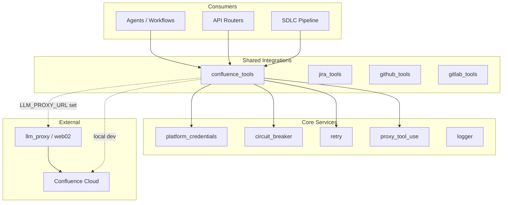
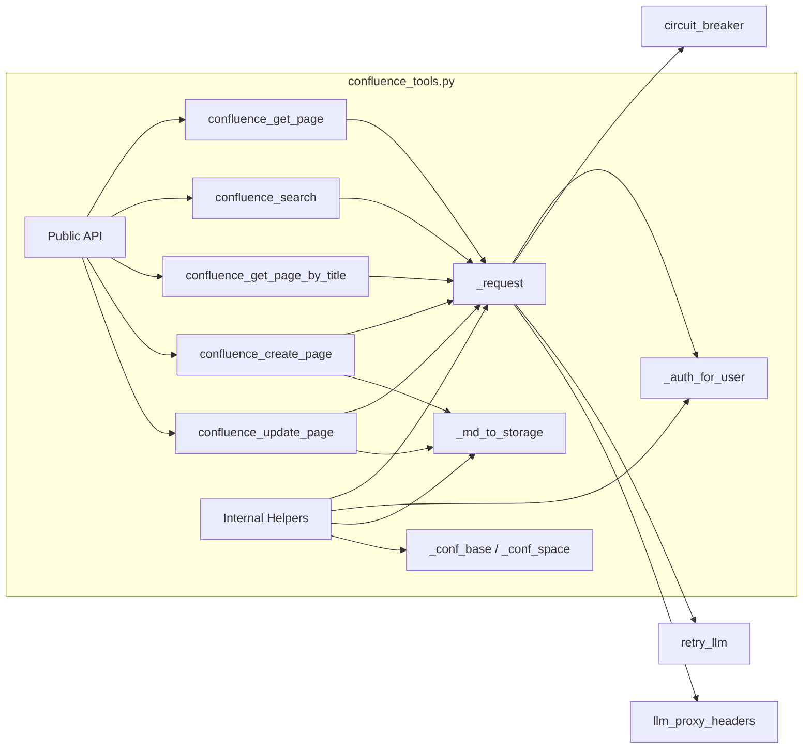
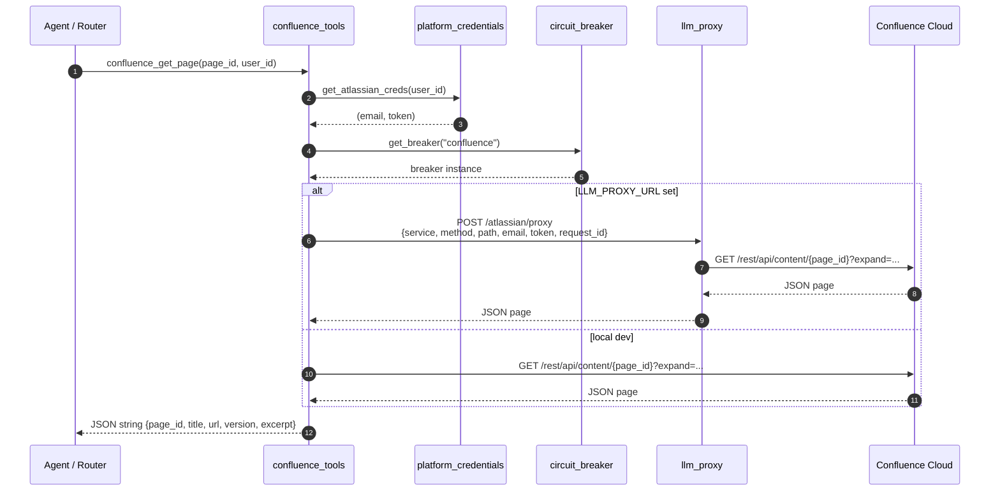
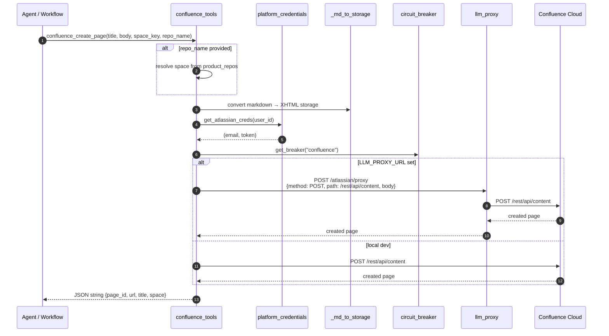
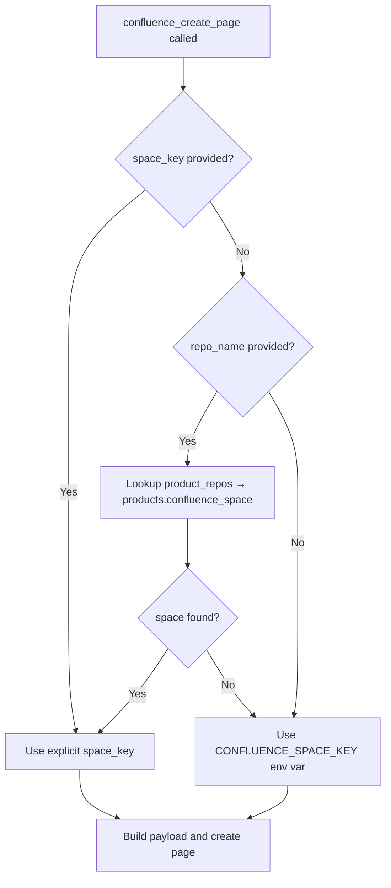

# Confluence Tools Module

## Brief Introduction

The `confluence_tools` module provides a thin, authenticated Python wrapper around the **Atlassian Confluence Cloud REST API v2**. It exposes a small set of callable tool functions that agents, workflows, and backend services can use to read, search, create, and update Confluence pages on behalf of an end user.

All operations are performed with the **requesting user's personal Atlassian token** (email + API token). Service-account credentials are never used. In production, outbound calls are relayed through the `llm_proxy` service (`web02`) because Confluence Cloud is only reachable from specific network zones; in local development the module can call Confluence directly.

The module is part of the broader [shared_integrations](../reference/shared_integrations.md) family and is consumed by the [agent_system](../reference/shared_core.md#agent-system), [workflow_system](../reference/shared_core.md#workflow-system), and various [routers](../api/shared_api_routers.md) that surface Confluence capabilities to the UI.

---

## Core Functionality

### Public Tool Functions

| Function | Purpose |
|----------|---------|
| `confluence_get_page(page_id, ...)` | Retrieve a page by ID, returning title, URL, version, and a body excerpt. |
| `confluence_search(query, space_key, ...)` | Run a CQL search within a space and return matching pages. |
| `confluence_get_page_by_title(title, space_key, ...)` | Find a page by exact title within a space. |
| `confluence_create_page(title, body, ...)` | Create a new page from a markdown body. |
| `confluence_update_page(page_id, title, body, ...)` | Update an existing page, auto-incrementing the version. |

All public functions return **JSON strings** so they can be consumed directly by LLM tool-call parsers and downstream agents.

### Key Design Decisions

1. **User-scoped credentials** — Every call resolves the user's stored Atlassian token via [platform_credentials](../reference/shared_core.md#core-infrastructure). Missing credentials raise `PermissionError` with a clear remediation message.
2. **Production proxy path** — When `LLM_PROXY_URL` is set, requests are sent to `POST /atlassian/proxy` on the LLM proxy with the user's email/token, method, path, and optional body. This avoids direct outbound access from application servers.
3. **Local dev fallback** — When `LLM_PROXY_URL` is unset, the module calls Confluence directly using `urllib`.
4. **Resilience** — Every request passes through a named `confluence` [circuit breaker](../reference/shared_core.md#core-infrastructure) and an exponential-backoff retry wrapper.
5. **Markdown-to-storage conversion** — `confluence_create_page` / `confluence_update_page` convert a simplified markdown dialect to Confluence XHTML storage format (headers, bold/italic, code blocks, lists, paragraphs).
6. **Correlation ID propagation** — `request_id` and `chat_id` are forwarded to the LLM proxy so Confluence API calls appear in the same trace as the originating gateway request.

---

## Architecture

### High-Level Placement



### Component Diagram



---

## Dependencies

### Direct Imports

| Dependency | Module | Role |
|------------|--------|------|
| `logger` | [core.logger](../reference/shared_core.md#core-infrastructure) | Structured logging for errors and successful operations. |
| `get_atlassian_creds` | [core.platform_credentials](../reference/shared_core.md#core-infrastructure) | Resolve user-specific Atlassian email + API token. |
| `get_product_for_repo` | [core.platform_credentials](../reference/shared_core.md#core-infrastructure) | Map a repo name to a product's Confluence space. |
| `get_breaker` | [core.circuit_breaker](../reference/shared_core.md#core-infrastructure) | Obtain the named `confluence` circuit breaker. |
| `retry_llm` | [core.retry](../reference/shared_core.md#core-infrastructure) | Exponential-backoff retry for transient failures. |
| `llm_proxy_headers` | [core.proxy_tool_use](../reference/shared_core.md#core-infrastructure) | Build authenticated headers for the LLM proxy. |
| `sanitize` | [core.prompt_sanitizer](../reference/shared_core.md#core-infrastructure) | Strip dangerous/control characters from titles and bodies. |

### Environment Variables

| Variable | Purpose |
|----------|---------|
| `CONFLUENCE_URL` | Base URL of the Confluence Cloud instance, e.g. `https://your-org.atlassian.net/wiki`. |
| `CONFLUENCE_SPACE_KEY` | Default space key used when no explicit space or repo mapping is provided. |
| `LLM_PROXY_URL` | Base URL of the LLM proxy. When set, all Confluence traffic is routed through it. |
| `LLM_PROXY_TOKEN` | Pre-shared secret used by `llm_proxy_headers` to authenticate proxy requests. |

---

## Data Flow

### Read Page by ID



### Create Page



---

## Component Interaction

### `_request` — Central Dispatch

`_request(method, path, body, auth_email, auth_token)` is the single chokepoint for every Confluence REST call. It:

1. Validates that credentials are present.
2. Builds a request descriptor (`service=confluence`, `method`, `path`, optional `body`, `email`, `token`).
3. Injects `request_id` / `chat_id` from the current logger context when available.
4. Routes to the LLM proxy if `LLM_PROXY_URL` is configured; otherwise calls Confluence directly.
5. Wraps the call in `get_breaker("confluence")` and `retry_llm(..., max_attempts=3, base_delay=1.0)`.
6. Translates HTTP errors and runtime failures into `{"error": "..."}` JSON responses.

### `_auth_for_user` — Credential Resolution

Calls [get_atlassian_creds](../reference/shared_core.md#core-infrastructure) to retrieve the user's personal Atlassian credentials. Raises `PermissionError` if none are stored, prompting the user to add a token under **Profile → Atlassian Token**.

### `_md_to_storage` — Markdown Conversion

A lightweight, regex-based converter that turns markdown into Confluence XHTML storage format. Supported elements:

- Headers (`#`, `##`, `###`)
- Bold (`**text**`) and italic (`*text*`)
- Inline code (`` `code` ``)
- Fenced code blocks (`` ```lang ... ``` ``) → `ac:structured-macro` code macro
- Unordered lists (`- ` / `* `)
- Paragraphs
- Escaping of stray `<`, `>`, and `&` characters in text content

> Note: This is intentionally a simplified converter for agent-generated content. Complex Confluence layouts should use dedicated document-generation tools such as [doc_generator](../reference/shared_integrations.md#doc-generator).

---

## Process Flows

### Space Resolution for Page Creation



### Error Handling Strategy

```mermaid
flowchart TD
    A[HTTP or network error] --> B{Is it 4xx client error?}
    B -->|Yes| C[Return {"error": "HTTP N: reason"}]
    B -->|No| D{Retryable?}
    D -->|Yes| E[retry_llm up to 3 attempts]
    E --> F{Still failing?}
    F -->|Yes| G[Return {"error": ...}]
    D -->|No| G
```

---

## How It Fits into the Overall System

`confluence_tools` is one of many integration tool modules in the [shared_integrations](../reference/shared_integrations.md) layer. It is registered alongside [jira_tools](../reference/shared_integrations.md#jira-tools), [github_tools](../reference/shared_integrations.md#github-tools), [gitlab_tools](../reference/shared_integrations.md#gitlab-tools), and others so that agents and workflows can access enterprise knowledge stores.

Typical consumers include:

- **Agent runtime** — ReAct-style agents invoke `confluence_search` and `confluence_get_page` to ground answers in internal wiki content.
- **SDLC pipeline** — Creates or updates Confluence pages for design docs, run reports, and governance artifacts.
- **API routers** — Higher-level endpoints (e.g., document generation, governance) delegate to these tools after validating user permissions.
- **MCP servers** — The [ConfluenceMCPServer](../mcp/mcp_servers.md) may wrap these functions for external MCP clients.

The module relies on the platform's cross-cutting concerns — authentication, credential storage, circuit breaking, retry, logging, and proxy routing — which are documented in [shared_core](../reference/shared_core.md).

---

## References

- [shared_integrations](../reference/shared_integrations.md) — Overview of all integration tool modules.
- [shared_core](../reference/shared_core.md) — Core infrastructure: logging, credentials, circuit breakers, retry, proxy headers.
- [mcp_servers](../mcp/mcp_servers.md) — MCP server implementations, including ConfluenceMCPServer.
- [shared_api_routers](../api/shared_api_routers.md) — HTTP routers that may call Confluence tools.
