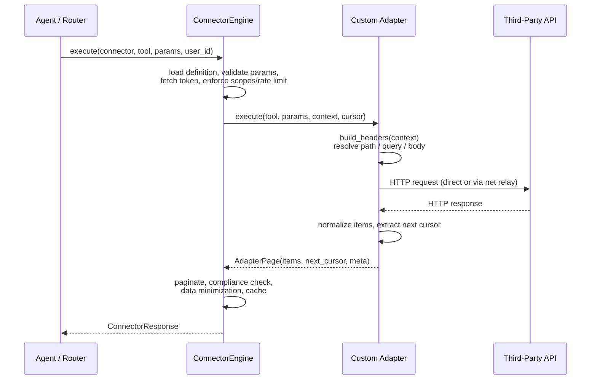

# Connector Adapters

The `connector_adapters` module contains provider-specific HTTP/API adapters that bridge the platform's generic connector framework to third-party SaaS APIs. Each adapter implements the `AdapterBase.execute(...)` contract and is responsible for:

- Translating a generic `ConnectorTool` call into the target provider's REST request shape.
- Injecting the correct authentication headers (OAuth2 bearer, PAT, Basic, or DPI consent artifact).
- Handling provider-specific pagination cursors and response envelopes.
- Normalizing provider responses into a flat `AdapterPage` of items so the rest of the platform can treat all connectors uniformly.
- Surfacing auth failures (`401`), permission failures (`403`), and transient errors (`429`/5xx) using the shared connector exception types.

This module lives inside the broader **Connectors & Integrations** layer. It does not manage connection state, token refresh, rate limits, or compliance — those concerns are owned by the [connector_infrastructure](connector_infrastructure.md) modules (`ConnectorEngine`, `ConnectorRegistry`, `OAuth2Handler`, etc.).

---

## Architecture Overview

```mermaid
flowchart LR
    subgraph Runtime
        A[LLM / Agent / Worker]
        B[MCP Tool Registry]
        C[ConnectorRegistry]
        D[ConnectorEngine]
    end

    subgraph Adapters["Connector Adapters (this module)"]
        E[Microsoft365Adapter]
        F[GmailAdapter]
        G[GoogleDriveAdapter]
        H[SlackAdapter]
        I[ZoomAdapter]
        J[ConfluenceAdapter]
        K[JiraAdapter]
        L[GitLabAdapter]
        M[DocuSignAdapter]
        N[DPI Adapters]
    end

    subgraph Providers["Third-Party APIs"]
        P1[Microsoft Graph]
        P2[Google APIs]
        P3[Slack API]
        P4[Zoom API]
        P5[Atlassian Cloud]
        P6[GitLab API]
        P7[DocuSign API]
        P8[DPI Sandboxes]
    end

    A -->|tool_use| B
    B -->|{connector}__{tool}| C
    C -->|execute| D
    D -->|AdapterBase.execute| E & F & G & H & I & J & K & L & M & N
    E --> P1
    F --> P2
    G --> P2
    H --> P3
    I --> P4
    J --> P5
    K --> P5
    L --> P6
    M --> P7
    N --> P8
```

### Execution Flow



### Key Design Principles

1. **Uniform contract** — every adapter subclasses `AdapterBase` and returns `AdapterPage`. The engine handles retries, pagination, caching, and response wrapping.
2. **No duplicated HTTP** — where possible, adapters reuse canonical clients (`tools/gitlab_tools.py`, `tools/jira_tools.py`) so Cowork, SDLC, and connector calls share the same circuit breaker, retry, and relay logic.
3. **Fail-safe auth** — adapters translate `401` into `ConnectorReauthRequired` and `403` into `ConnectorScopeError` so the engine can deactivate tokens or prompt for re-consent.
4. **Secrets hygiene** — tokens are injected via `ConnectorContext.access_token`; adapters never log headers, bodies, or credentials.
5. **Provider-native pagination** — each adapter understands its provider's cursor mechanism (e.g., `@odata.nextLink`, `next_page_token`, `response_metadata.next_cursor`, `_links.next`, `x-next-page`).

---

## Sub-Modules

The adapters are grouped by the domain of the systems they integrate with.

| Sub-Module | Adapters | Purpose | Details |
|------------|----------|---------|---------|
| Enterprise Collaboration | `ConfluenceAdapter`, `JiraAdapter`, `Microsoft365Adapter`, `SlackAdapter`, `ZoomAdapter` | Integrate with Atlassian, Microsoft 365, Slack, and Zoom for pages, issues, email, chat, meetings, and org directory. | [connector_adapters_enterprise_collab.md](connector_adapters_enterprise_collab.md) |
| Google Workspace | `GmailAdapter`, `GoogleDriveAdapter` | Integrate with Gmail and Google Drive for email search/send and file search/text extraction. | connector_adapters_google_workspace.md |
| DevOps & eSignature | `GitLabAdapter`, `DocuSignAdapter` | Integrate with GitLab (source control) and DocuSign (electronic signatures). | connector_adapters_devops_signature.md |
| India Stack (DPI) | `DpiAccountAggregatorAdapter`, `DpiDigilockerAdapter` | Consent-based adapters for Account Aggregator and DigiLocker; sandbox-only today. | connector_adapters_dpi.md |

---

## Shared Adapter Contract

All adapters inherit from `AdapterBase` (defined in [connector_infrastructure](connector_infrastructure.md)):

```python
class AdapterBase(ABC):
    TIMEOUT = 20
    RETRY_CODES = {429, 500, 502, 503, 504}
    NO_RETRY_CODES = {400, 401, 403, 404}

    @abstractmethod
    def execute(self, tool, params, context, cursor=None) -> AdapterPage: ...

    def build_headers(self, context: ConnectorContext) -> dict: ...
    def _resolve_path(self, path: str, params: dict) -> tuple[str, dict]: ...
```

The engine discovers a custom adapter by importing the module named in `ConnectorEngine._load_custom_adapter` and looking for a module-level `AdapterBase` singleton following the `{connector_name}_adapter` convention (e.g., `microsoft365_adapter`, `slack_adapter`).

---

## Cross-Cutting Concerns

### Authentication

- **OAuth2 Bearer** — default path used by Microsoft 365, Google, Slack, Zoom, Confluence, DocuSign. `build_headers()` emits `Authorization: Bearer <access_token>`.
- **PAT (Personal Access Token)** — GitLab uses `PRIVATE-TOKEN`, Jira uses `Authorization: Basic base64(email:token)`. PAT connectors support auto-connect from the profile vault.
- **DPI Consent** — Account Aggregator and DigiLocker carry a signed consent artifact in `context.access_token`. Production calls are gated behind `DPI_SANDBOX` and fail closed until partner credentials are wired.

### Pagination

The engine drives pagination by passing the previous `AdapterPage.next_cursor` back into `adapter.execute(...)`. Adapters implement provider-specific cursor extraction:

| Provider | Cursor Mechanism |
|----------|------------------|
| Microsoft 365 | `@odata.nextLink` full URL |
| Google Drive | `nextPageToken` |
| Gmail | `nextPageToken` |
| Slack | `response_metadata.next_cursor` |
| Zoom | `next_page_token` |
| Confluence | `_links.next` relative path |
| DocuSign | `nextUri` / `endPosition` → start position |
| Jira | `next_cursor` returned by `jira_search_issues` |
| GitLab | page number (engine stops when page < max_items) |

### Idempotency

Write tools (`is_write=True`) receive an `Idempotency-Key` in `context.metadata`. Adapters forward it using provider-specific headers when available (e.g., `Idempotency-Key` for Confluence/Zoom, `X-DocuSign-Idempotency-Key`).

### Error Handling

Adapters re-raise `httpx.HTTPStatusError` after translating known status codes:

- `401` → `ConnectorReauthRequired` (engine deactivates token)
- `403` → `ConnectorScopeError` for Microsoft 365 scope/consent failures
- `400` → often translated to a user-friendly `ValueError`
- `429` / 5xx → re-raised so the engine's retry/backoff logic runs

### Network Relay

Microsoft 365 and some shared clients route outbound traffic through `connectors.net_relay.relay_request` so workers without direct internet egress can reach Graph via the LLM proxy. See [connector_infrastructure](connector_infrastructure.md) for relay details.

---

## Integration with the Rest of the System

- **MCP System** — `ConnectorRegistry` registers every connector tool as `{connector}__{tool}` in the MCP `ToolRegistry`, making adapters callable by the LLM via tool_use. See [mcp_system](../mcp/mcp_system.md).
- **Connector Engine** — owns schema validation, token refresh, rate limiting, caching, pagination, compliance scanning, and response wrapping. See [connector_infrastructure](connector_infrastructure.md).
- **Shared Tools** — `GitLabAdapter` and `JiraAdapter` delegate to `tools/gitlab_tools.py` and `tools/jira_tools.py` so the SDLC pipeline and connectors share one HTTP client. See [shared_integrations_connector_infrastructure](../skills/shared_integrations_connector_infrastructure.md) and the tool modules.
- **Compliance & Guardrails** — connector responses are scanned by the compliance engine before being returned to the LLM. See [guardrails](../security/guardrails.md) and [agent_system](../agents/agent_system.md).

---

## When to Modify This Module

- Adding a new third-party connector that has non-trivial request/response semantics.
- Fixing provider-specific pagination, query syntax, or body shaping.
- Adding a new tool to an existing connector that requires custom request/response handling.
- Updating auth header conventions for a provider.

For changes that affect all connectors (validation, caching, rate limits, token refresh), modify [connector_infrastructure](connector_infrastructure.md) instead.
