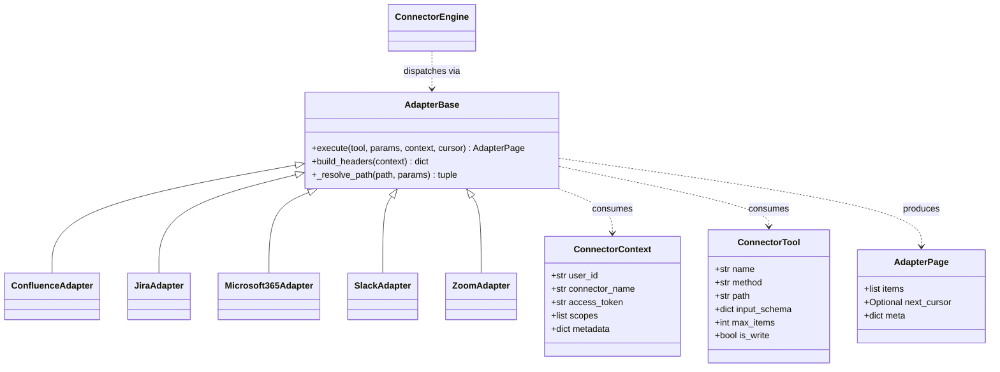
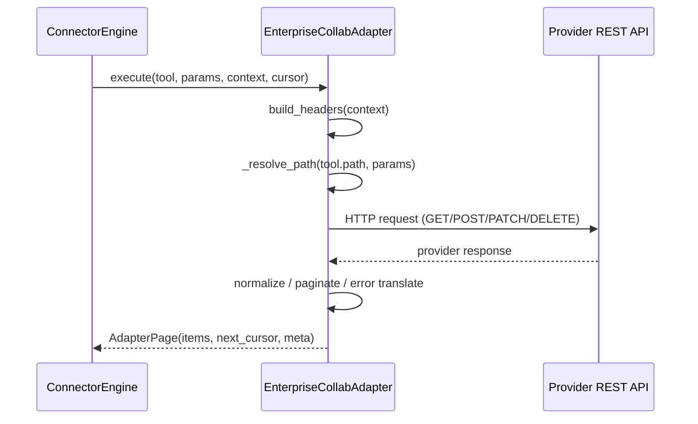
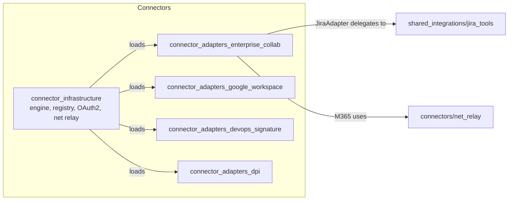

# connector_adapters_enterprise_collab

## Purpose

The `connector_adapters_enterprise_collab` module provides the **provider-specific adapter implementations** for enterprise collaboration platforms. Each adapter translates the generic connector execution contract used by the platform into the native REST API shape of a third-party service, then normalizes the response back into a common page-oriented format.

Supported platforms:

- **Atlassian Confluence Cloud** – page search, retrieval, and creation via the Wiki REST API.
- **Atlassian Jira Cloud** – issue/project search, creation, updates, transitions, and comments.
- **Microsoft 365 / Microsoft Graph** – Outlook mail/calendar, Teams chats/messages/meetings, OneDrive uploads, people search, and org hierarchy.
- **Slack** – channel listing, message search, and message posting.
- **Zoom** – meeting listing and creation.

These adapters do not expose HTTP endpoints directly. They are loaded by the [`connector_infrastructure`](connector_infrastructure.md) runtime (`ConnectorEngine`) and invoked through the shared `AdapterBase.execute(...)` contract.

---

## Architecture Overview

### Runtime Flow

### Module Placement

---

## Sub-modules

### Confluence Adapter

- **File:** `connectors/adapters/confluence.py`
- **Core component:** `ConfluenceAdapter`

Handles Confluence Cloud REST API specifics: CQL search, `_links.next` relative-URL pagination, `body.storage` HTML payloads, and the create-page request shape. Translates 401 responses into `ConnectorReauthRequired` and lets the engine retry 429/5xx errors.

See detailed documentation: [connector_adapters_enterprise_collab_confluence.md](../connector_adapters_enterprise_collab_confluence.md)

### Jira Adapter

- **File:** `connectors/adapters/jira.py`
- **Core component:** `JiraAdapter`

Thin dispatch layer that injects per-user Atlassian credentials into the shared [`tools/jira_tools.py`](jira_tools.md) client used by the SDLC pipeline. This guarantees that Buddy/Cowork connector calls and SDLC automation share the same relay, circuit breaker, retry, and tracing path.

See detailed documentation: [connector_adapters_enterprise_collab_jira.md](../connector_adapters_enterprise_collab_jira.md)

### Microsoft 365 Adapter

- **File:** `connectors/adapters/microsoft365.py`
- **Core component:** `Microsoft365Adapter`

The largest adapter in this module. It covers Microsoft Graph endpoints for Outlook, Teams, Calendar, OneDrive, People Search, and Org Hierarchy. It implements OData query construction, `@odata.nextLink` auto-pagination with bounded budgets, Teams HTML rendering, recipient parsing, OneDrive upload + sharing-link creation, and rich error translation (401 → reauth, 403 → scope error).

See detailed documentation: [connector_adapters_enterprise_collab_microsoft365.md](../connector_adapters_enterprise_collab_microsoft365.md)

### Slack Adapter

- **File:** `connectors/adapters/slack.py`
- **Core component:** `SlackAdapter`

Implements Slack Web API conventions: cursor-based pagination via `response_metadata.next_cursor`, `conversations.history` vs `search.messages` extraction, and message/channel normalization. Detects `token_revoked` and raises `ConnectorReauthRequired`.

See detailed documentation: [connector_adapters_enterprise_collab_slack.md](../connector_adapters_enterprise_collab_slack.md)

### Zoom Adapter

- **File:** `connectors/adapters/zoom.py`
- **Core component:** `ZoomAdapter`

Wraps Zoom API v2 meeting endpoints. Handles `next_page_token` pagination, `page_size` limits, and shapes simple create-meeting parameters into Zoom's verbose request body.

See detailed documentation: [connector_adapters_enterprise_collab_zoom.md](../connector_adapters_enterprise_collab_zoom.md)

---

## Shared Patterns

All adapters in this module follow the same contract and patterns:

| Pattern | Responsibility |
|--------|----------------|
| **Contract** | Subclass `AdapterBase` and implement `execute(tool, params, context, cursor) -> AdapterPage`. |
| **Auth** | Call `self.build_headers(context)` to obtain OAuth2 Bearer or PAT headers; never log tokens. |
| **Path resolution** | Use `_resolve_path(tool.path, params)` to fill `{param}` placeholders and separate query/body params. |
| **Pagination** | Return a cursor in `AdapterPage.next_cursor`; provider-specific cursor formats are opaque to the engine. |
| **Idempotency** | Write tools forward `context.metadata["Idempotency-Key"]` where the provider supports it. |
| **Error translation** | 401/403 (where applicable) become `ConnectorReauthRequired` or `ConnectorScopeError`; 429/5xx are re-raised for engine retry; 400/404 are treated as fatal by the engine. |
| **Normalization** | Provider responses are flattened into plain `dict` items so downstream LLM/tool consumers receive a consistent schema. |

---

## Dependencies

- [`connector_infrastructure`](connector_infrastructure.md) – `AdapterBase`, `ConnectorEngine`, `ConnectorContext`, `ConnectorTool`, `ConnectorReauthRequired`, `ConnectorScopeError`, OAuth2 handling, and the `net_relay` helper.
- [`shared_integrations/jira_tools`](jira_tools.md) – canonical Jira HTTP client used by `JiraAdapter`.
- [`shared_core/core/logger`](../reference/shared_core.md) – structured logging (tokens and secrets are never logged).

---

## When to Modify This Module

- Adding a new enterprise-collaboration connector (e.g., a new Atlassian/MS/Slack/Zoom tool).
- Fixing provider-specific pagination, request shaping, or response normalization.
- Updating error handling when a provider changes auth or permission semantics.
- Extending the Microsoft 365 adapter for new Graph endpoints.

For changes that affect all adapters (auth header building, path resolution, engine dispatch), update [`connector_infrastructure`](connector_infrastructure.md) instead.
