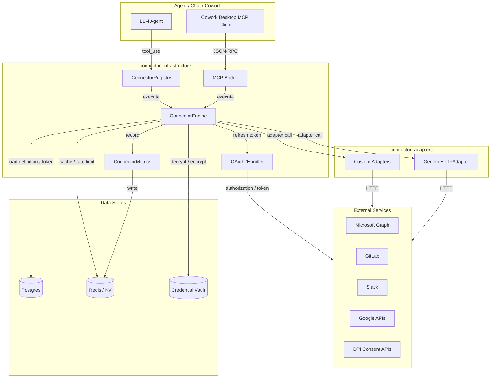
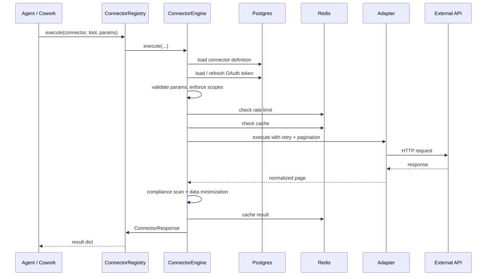

# Connector Infrastructure

The **connector_infrastructure** module is the runtime backbone for all external integrations in the platform. It provides a single, secure, observable execution path for every connector tool call — from schema validation and OAuth token management to pagination, caching, compliance scanning, and registration with the LLM-facing tool registry.

This module is deliberately separate from the per-connector adapters (e.g., Microsoft 365, GitLab, Slack). Adapters implement provider-specific HTTP logic; this module orchestrates those adapters, enforces guardrails, and exposes the resulting tools to agents via the MCP bridge.

## Purpose

- Provide a **universal connector runtime** that works for OAuth2, PAT, API-key, and consent-based connectors.
- Enforce **security and compliance** (access policy, scope checks, rate limits, PCI/PII scanning, data minimization).
- Manage **OAuth2 lifecycle** (authorization URLs, code exchange, token refresh, revocation, idempotency).
- Register connector tools dynamically so LLM agents can call them through the **MCP tool registry**.
- Surface **metrics and audit logs** for operations, cost, and failure analysis.
- Power the **Cowork desktop MCP bridge** with user-scoped connector tools, document skills, sandboxed code, and knowledge search.

## Architecture Overview

### Component Responsibilities

| Component | File | Responsibility |
|-----------|------|----------------|
| `ConnectorEngine` | `connectors/engine.py` | End-to-end execution pipeline for a single tool call. |
| `ConnectorRegistry` | `connectors/registry.py` | Loads connector definitions, registers tools with MCP, and dispatches calls. |
| `OAuth2Handler` | `connectors/oauth2.py` | PKCE authorization, code exchange, token refresh, revocation, and flow state. |
| `ConnectorMetrics` | `connectors/metrics.py` | KV-backed metrics, audit logs, top queries, and failure distributions. |
| MCP Bridge | `connectors/mcp_bridge.py` | Cowork-facing JSON-RPC MCP server with compliance, document skills, and sandbox tools. |

## Execution Pipeline

Every connector tool call flows through the same ten-step pipeline inside `ConnectorEngine`:

## Sub-modules

The module is split into the following sub-modules. Each is documented in its own file.

- **[connector_infrastructure_engine](../connector_infrastructure_engine.md)** — `ConnectorEngine`: schema validation, access policy, scope enforcement, caching, idempotency, token refresh, adapter dispatch, pagination, compliance, and response normalization.
- **[connector_infrastructure_registry](../connector_infrastructure_registry.md)** — `ConnectorRegistry`: DB-backed loading of connector definitions, MCP tool registration, per-user tool filtering, and execution dispatch with per-request call limits.
- **[connector_infrastructure_oauth2](../connector_infrastructure_oauth2.md)** — `OAuth2Handler`: provider-agnostic PKCE OAuth2 flows, token refresh, revocation, and KV-backed flow state.
- **[connector_infrastructure_metrics](../connector_infrastructure_metrics.md)** — `ConnectorMetrics`: Redis/KV-backed call counters, latency sums, cache hits, audit logs, top queries, and department/failure breakdowns.
- **[connector_infrastructure_mcp_bridge](../connector_infrastructure_mcp_bridge.md)** — Cowork MCP bridge: user-scoped tool listing, compliance-gated dispatch, document generation, sandboxed code execution, deep research, and durable memory.

## Integration with the Rest of the System

- **MCP System**: `ConnectorRegistry` registers every connector tool as an MCP tool named `{connector}__{tool}`. See [mcp_system](../mcp/mcp_system.md).
- **Connector Adapters**: The engine delegates HTTP calls to provider-specific adapters documented in [connector_adapters](connector_adapters.md) or the generic `GenericHTTPAdapter`.
- **Authentication**: User tokens are encrypted with the credential vault; OAuth refresh uses the shared `OAuth2Handler`. See [authentication](../security/authentication.md) and [core_infrastructure](../infrastructure/core_infrastructure.md).
- **Compliance**: Connector outputs are scanned by the shared compliance engine before being injected into LLM context. See [guardrails_tools](../security/guardrails_tools.md) and [agent_system](../agents/agent_system.md).
- **Cowork Desktop**: The MCP bridge exposes the same connector engine to the desktop agent over SSE JSON-RPC. See [desktop_app](../clients/desktop_app.md).
- **Knowledge Base**: The MCP bridge can query the platform knowledge base via the retrieval tool. See [shared_core_knowledge_base](../knowledge/shared_core_knowledge_base.md).
- **Document Workers**: Document generation and skill-driven builds are enqueued to the same workers used by the web UI. See [document_knowledge_workers](../workers/document_knowledge_workers.md).

## Configuration & Environment

Key environment variables used across the module:

| Variable | Purpose |
|----------|---------|
| `CONNECTOR_MAX_PAGES` | Maximum pagination pages to follow (default `50`). |
| `CONNECTOR_MAX_ITEMS_DEFAULT` | Default ceiling on returned items (default `1000`). |
| `CONNECTOR_MAX_ITEMS_MAIL` / `CALENDAR` / `TEAMS` | Per-tool-type ceilings. |
| `CONNECTOR_MAX_ITEMS_*` | Specific per-tool ceilings (see `engine.py`). |
| `MAX_CONNECTOR_EXECUTION_MS` | Hard wall-clock timeout per call (`10_000` ms). |
| `DPI_SANDBOX` | Enables synthetic DPI consent sandbox mode. |
| `COWORK_TOOL_POOL` | Thread-pool size for the MCP bridge (default `64`). |
| `COWORK_CONNECTOR_RATE_MAX` / `WINDOW` | Per-user connector rate limiting. |
| `M365_ATTACHMENT_FILE_MAX_BYTES` | Max attachment size for Cowork sends. |
| `REDIS_HOST` / `REDIS_PORT` / `REDIS_PASSWORD` | Redis used for cache, rate limits, metrics, and OAuth state. |

## Operational Notes

- The engine is **synchronous** by design so it can run inside RQ workers and FastAPI sync endpoints.
- Token rows are stored in `ainxt.user_oauth_tokens`; connector definitions live in `ainxt.connector_definitions`.
- A **vault key mismatch** (`FERNET_KEY`) is surfaced as a configuration error rather than a reconnect prompt.
- PAT connectors (GitLab, Jira) support **auto-connect** from the profile API-token vault.
- DPI connectors use a signed **consent artifact** instead of a bearer token.
