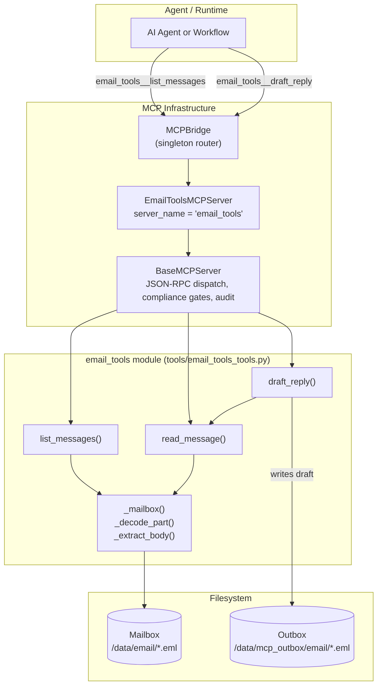
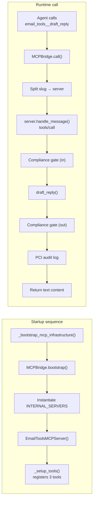
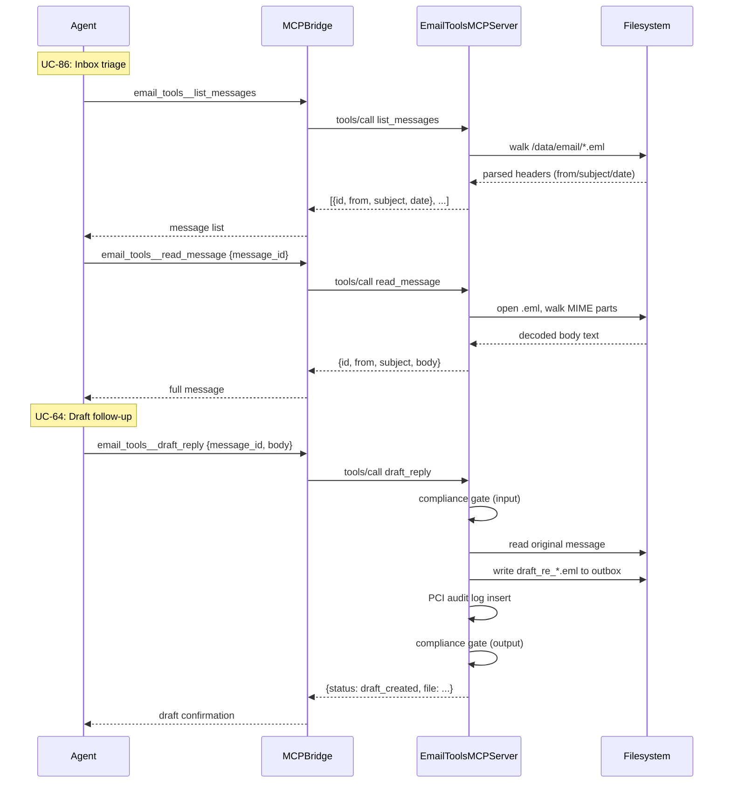
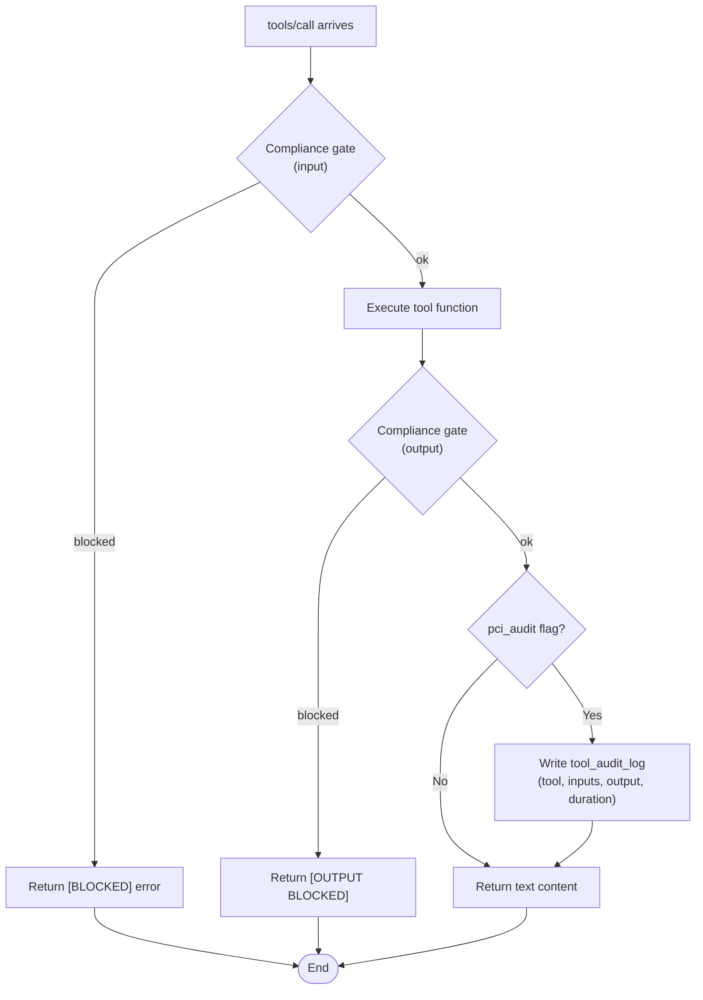
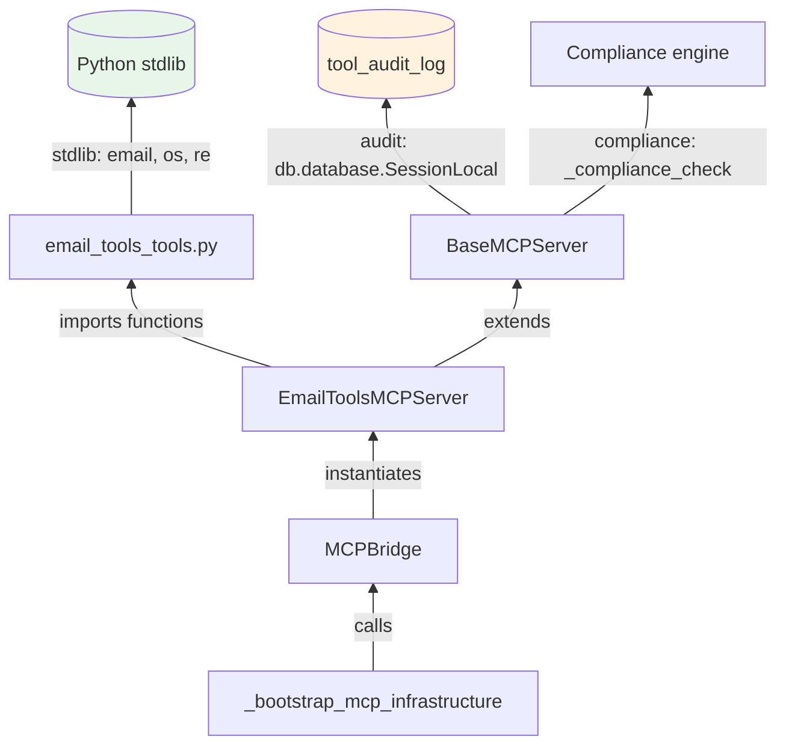

# Email Tools Module

## Introduction

The **email_tools** module provides a read-only mailbox triage and draft-reply capability for the NPCI Agentic Platform's MCP (Model Context Protocol) tool ecosystem. It enables AI agents to inspect locally-stored `.eml` message files and compose **draft** replies to an outbox — without ever sending mail directly.

> **Design principle — drafts only, never sends.** Outbound dispatch is intentionally absent from this module. A separate, gated tool (marked `critical=true`) with full audit handles the actual send. This separation enforces a human-in-the-loop boundary for all email actions and keeps this module safe to expose to autonomous agents.

The module powers two platform use-cases:
- **UC-86** — Executive inbox triage (scan, summarize, prioritize incoming mail)
- **UC-64** — Candidate follow-up drafting (compose templated reply drafts for review)

### Module scope

| Aspect | Detail |
|---|---|
| Source file | `tools/email_tools_tools.py` |
| Companion MCP server | `mcp/servers/email_tools_server.py` (`EmailToolsMCPServer`) |
| Registration | `mcp/servers/__init__.py` → `INTERNAL_SERVERS` → bootstrapped by `MCPBridge` |
| Transport | stdio, SSE, and Streamable HTTP (inherited from `BaseMCPServer`) |
| Data input | `.eml` files under `EMAIL_TOOLS_DATA_DIR` (default `/data/email`) |
| Data output | Draft `.eml` files under `EMAIL_TOOLS_OUTBOX_DIR` (default `/data/mcp_outbox/email`) |

---

## Architecture

The email_tools module follows the platform's standard **tool-function + MCP-server-wrapper** pattern. Pure Python functions in `email_tools_tools.py` contain all business logic; `EmailToolsMCPServer` is a thin adapter that registers those functions as spec-compliant MCP tools and routes JSON-RPC 2.0 calls to them.



### Where it fits in the system

The module is one of many internal MCP tool servers. At platform startup, `MCPBridge.bootstrap()` instantiates every class listed in `INTERNAL_SERVERS` (including `EmailToolsMCPServer`). Agents then invoke tools using the namespaced convention `email_tools__<tool_name>`, which the bridge routes to the correct server instance. See the [mcp_system](#) module documentation for the full bridge/registry lifecycle.



---

## Core Components

### `list_messages()`

Lists all `.eml` files found by recursively walking `EMAIL_TOOLS_DATA_DIR`. Returns a list of lightweight metadata dicts — `id`, `from`, `subject`, `date` — suitable for an agent to scan and triage an inbox without loading full bodies.

- **Input:** none
- **Output:** `List[dict]` where each dict has keys `id`, `from`, `subject`, `date`
- **MCP schema:** `{"type": "object", "properties": {}}` (no arguments)

### `read_message(message_id)`

Reads the full body of a single message identified by its filename (`id`). Internally uses `_extract_body()` to correctly decode multipart MIME, honour transfer-encodings (base64, quoted-printable), and strip HTML tags when no plain-text part exists.

- **Input:** `message_id: str` (the filename from `list_messages`)
- **Output:** `dict` with `id`, `from`, `subject`, `body`
- **Raises:** `FileNotFoundError` if the id is not present in the mailbox
- **MCP schema:** `message_id` required

### `draft_reply(message_id, body)`

Writes a **DRAFT** reply `.eml` file to the outbox directory. The draft is addressed `To:` the original sender with a `Re:` subject and an `X-Status: DRAFT` header. It is never sent — a human or a separately-approved send tool dispatches it later.

- **Input:** `message_id: str`, `body: str`
- **Output:** `{"status": "draft_created", "file": <path>}`
- **MCP flags:** `pci_audit=True` — every invocation is recorded in the `tool_audit_log` table
- **MCP schema:** `message_id` and `body` both required

### Helper functions (internal)

| Function | Responsibility |
|---|---|
| `_mailbox()` | Walks `EMAIL_TOOLS_DATA_DIR`, parses each `.eml` via `email.message_from_file`, returns list of metadata dicts (including `path`). |
| `_decode_part(part)` | Decodes a single MIME part's payload honouring `Content-Transfer-Encoding` and charset; falls back gracefully to UTF-8. |
| `_extract_body(msg)` | Walks all parts of a (possibly nested multipart) message, preferring `text/plain`, falling back to tag-stripped `text/html`. Skips attachments. |

> **Robustness note:** `_extract_body` was hardened to fix earlier bugs where multipart/base64/quoted-printable emails returned empty or garbled text. It now walks *all* parts (not just top-level) and decodes payloads properly.

---

## MCP Server Wrapper — `EmailToolsMCPServer`

`EmailToolsMCPServer` extends [`BaseMCPServer`](#) (see [mcp_system](#) docs) and registers three tools in `_setup_tools()`:

| Tool name | Function | PCI audit | Description |
|---|---|---|---|
| `list_messages` | `list_messages` | No | List message metadata from the mailbox |
| `read_message` | `read_message` | No | Read full body of a message by id |
| `draft_reply` | `draft_reply` | **Yes** | Write a DRAFT reply to the outbox (never sends) |

The server inherits all transport and dispatch behaviour from `BaseMCPServer`:
- **JSON-RPC 2.0** method handling (`initialize`, `tools/list`, `tools/call`, `ping`)
- **Compliance gates** on both input and output of every `tools/call`
- **PCI audit logging** for tools flagged `pci_audit=True` (writes to `tool_audit_log` table)
- **Transports:** stdio, SSE, and Streamable HTTP

---

## Configuration

The module is configured entirely through environment variables, read once at import time:

| Variable | Default | Purpose |
|---|---|---|
| `EMAIL_TOOLS_DATA_DIR` | `/data/email` | Root directory recursively scanned for `.eml` mailbox files |
| `EMAIL_TOOLS_OUTBOX_DIR` | `/data/mcp_outbox/email` | Directory where draft reply `.eml` files are written (created on demand) |

No database connection is required for the tool functions themselves. The PCI audit log (written by `BaseMCPServer._audit`) uses the platform's shared `SessionLocal` / `tool_audit_log` table.

---

## Data Flow



### Draft file format

A draft reply is a minimal RFC-822-style `.eml` file:

```
To: <original sender>
Subject: Re: <original subject>
X-Status: DRAFT

<reply body>
```

The filename is derived from the original subject: `draft_re_` + sanitized subject (non-alphanumerics → `_`, truncated to 50 chars) + `.eml`.

---

## Security & Governance

The module enforces multiple layers of safety, consistent with the platform's governance model:



1. **No send capability** — the module physically cannot transmit email; it only reads and writes local files.
2. **Compliance gates** — `BaseMCPServer` runs `_compliance_check()` on both the incoming arguments and the outgoing result of every tool call. Blocked content is returned as an error without executing or exposing data.
3. **PCI audit trail** — `draft_reply` is flagged `pci_audit=True`, so every draft creation is persisted to the `tool_audit_log` table with tool name, inputs, truncated output, and duration.
4. **Human-in-the-loop** — drafts carry an `X-Status: DRAFT` header and sit in the outbox until a separately-approved, `critical=true` send tool (outside this module) dispatches them.

---

## Dependencies



**Internal dependencies:**
- `mcp/servers/base.py::BaseMCPServer` — protocol dispatch, compliance, audit, transports
- `mcp/bridge.py::MCPBridge` — singleton router that instantiates and calls the server
- `mcp/registry.py::_bootstrap_mcp_infrastructure` — startup hook that triggers bridge bootstrap
- `db/database.py` (via `BaseMCPServer._audit`) — audit log persistence

**External dependencies:** Python standard library only (`email`, `os`, `re`, `typing`). No third-party packages required for the tool functions themselves.

---

## Related Modules

| Module | Relationship |
|---|---|
| **mcp_system** | Owns `MCPBridge`, `BaseMCPServer`, `MCPRegistry`, and the `INTERNAL_SERVERS` bootstrap. The email_tools server is one of many internal MCP servers managed here. |
| **mcp_servers** | Sibling MCP server modules (`EmailToolsMCPServer`, `JiraMCPServer`, `GitLabMCPServer`, etc.) all follow the same `BaseMCPServer` pattern. |
| **connectors_integrations** | The `GmailAdapter` and `Microsoft365Adapter` handle live OAuth-based email connectivity. This module is deliberately file-based and send-free, complementing those adapters for triage/draft workflows. |
| **shared_core → core_infrastructure** | Provides the compliance engine (`_compliance_check`) and database session used by the audit path. |
