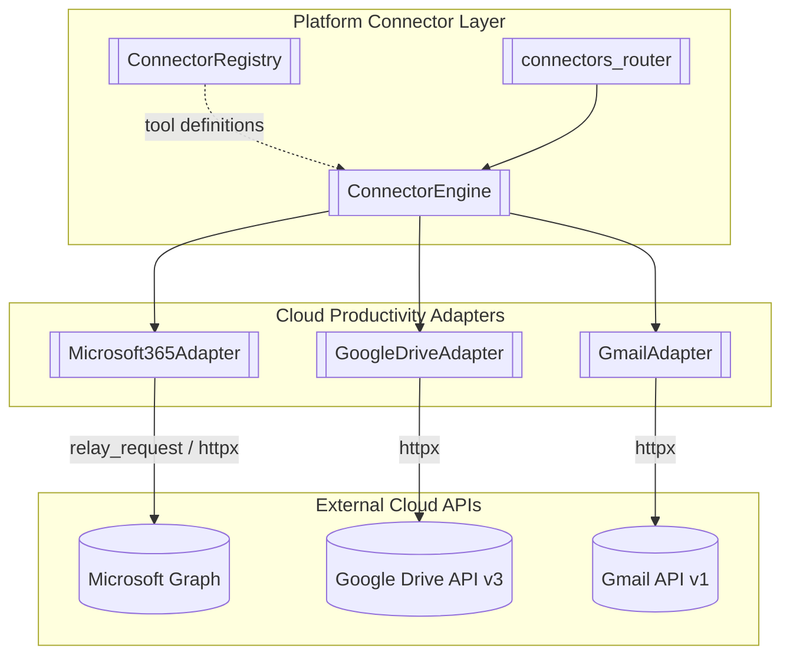
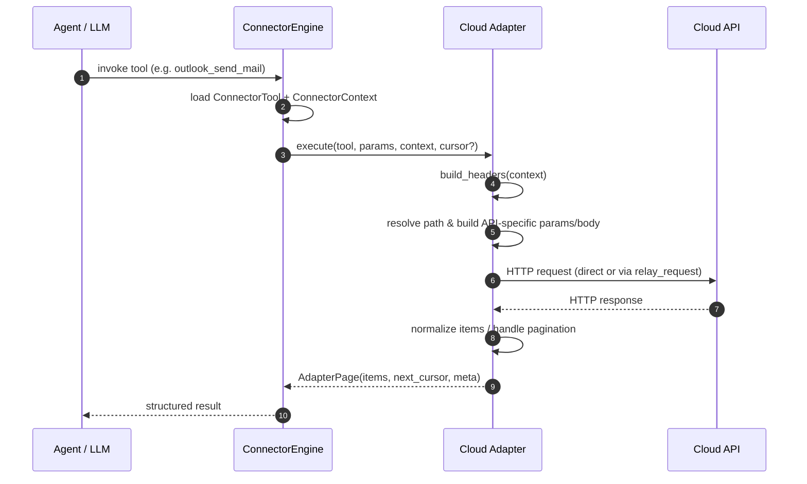

# shared_integrations_connector_adapters_cloud_productivity

## Overview

The **Cloud Productivity Adapters** module is a sub-module of [`shared_integrations_connector_adapters`](shared_integrations_connector_adapters.md). It provides service-specific HTTP adapters that translate generic connector tool calls into the native APIs of popular cloud productivity suites:

- **Microsoft 365** — Microsoft Graph API (Outlook, Teams, OneDrive, Calendar, People, Org hierarchy)
- **Google Drive** — Google Drive API v3 (file search, metadata, text extraction)
- **Gmail** — Google Gmail API v1 (email search, read, send)

Each adapter implements the common [`AdapterBase`](shared_integrations_connector_adapters.md) interface and returns paginated results via [`AdapterPage`](shared_integrations_connector_adapters.md). They are consumed by the connector engine and registry in [`shared_integrations_connector_infrastructure`](shared_integrations_connector_infrastructure.md), exposed through [`shared_api_routers_connectors_router`](../shared_api_routers_connectors_router.md), and may be surfaced as MCP tools by servers such as [`mcp_servers_calendar_tools_server`](../mcp_servers_calendar_tools_server.md), [`mcp_servers_email_tools_server`](../mcp_servers_email_tools_server.md), and [`mcp_servers_document_tools_server`](../mcp_servers_document_tools_server.md).

## Purpose

Cloud productivity APIs differ significantly in authentication, query syntax, pagination, error semantics, and payload shaping. This module isolates those quirks so that the rest of the platform can treat "send an email", "search files", or "list calendar events" as uniform tool operations. The adapters handle:

- OAuth2 bearer token injection and PAT fallback (via `AdapterBase.build_headers`)
- API-specific query parameter construction (OData, Drive `q`, Gmail `q`)
- Cursor-based pagination (`@odata.nextLink`, `pageToken`, `nextPageToken`)
- Request/response normalization into a consistent JSON shape
- Write-operation payload shaping (emails, Teams messages, calendar events, file uploads)
- Error translation into connector-level exceptions (`ConnectorReauthRequired`, `ConnectorScopeError`)

## Architecture



### Data Flow



## Sub-modules

| Sub-module | File | Responsibility | Documentation |
|------------|------|----------------|---------------|
| Microsoft 365 Adapter | `connectors/adapters/microsoft365.py` | Graph API adapter for Outlook, Teams, OneDrive, Calendar, People, and org hierarchy | [`shared_integrations_connector_adapters_cloud_productivity_microsoft365`](../shared_integrations_connector_adapters_cloud_productivity_microsoft365.md) |
| Google Drive Adapter | `connectors/adapters/google_drive.py` | Drive API v3 adapter for search, metadata, and text extraction | [`shared_integrations_connector_adapters_cloud_productivity_google_drive`](../shared_integrations_connector_adapters_cloud_productivity_google_drive.md) |
| Gmail Adapter | `connectors/adapters/gmail.py` | Gmail API v1 adapter for search, read, and send | [`shared_integrations_connector_adapters_cloud_productivity_gmail`](../shared_integrations_connector_adapters_cloud_productivity_gmail.md) |

## Shared Concepts

All three adapters inherit from [`AdapterBase`](shared_integrations_connector_adapters.md) and follow the same execution contract:

```python
class AdapterBase(ABC):
    @abstractmethod
    def execute(
        self,
        tool: ConnectorTool,
        params: dict,
        context: ConnectorContext,
        cursor: Optional[str] = None,
    ) -> AdapterPage:
        ...
```

- **`ConnectorTool`** — defines the tool name, HTTP method, path template, input schema, scopes, pagination, and write semantics.
- **`ConnectorContext`** — carries the user's access token, tenant id, scopes, and auth metadata.
- **`AdapterPage`** — a single page of results with `items`, `next_cursor`, and `meta`.

### Error Handling

| HTTP Status | Mapped Exception | Meaning |
|-------------|------------------|---------|
| 401 | `ConnectorReauthRequired` | Token expired or revoked; user must reconnect. |
| 403 | `ConnectorScopeError` | Token valid but lacks required OAuth scope. |
| 400 / 404 / 429 / 5xx | Re-raised as `httpx.HTTPStatusError` | Engine-level retry/backoff or user-facing error. |

### Pagination Strategies

| Adapter | Cursor Field | Mechanism |
|---------|--------------|-----------|
| Microsoft 365 | `@odata.nextLink` | Auto-followed for selected read tools, bounded by `M365_PAGINATE_BUDGET_S` and `M365_MAX_AUTO_PAGES`. |
| Google Drive | `nextPageToken` | Returned to caller; generic fallback also follows `pageToken`. |
| Gmail | `nextPageToken` | Returned to caller; metadata fetched per message. |

## Dependencies

- [`shared_integrations_connector_adapters`](shared_integrations_connector_adapters.md) — base adapter classes and page model
- [`shared_integrations_connector_infrastructure`](shared_integrations_connector_infrastructure.md) — engine, registry, OAuth2 handler, metrics
- [`shared_api_routers_connectors_router`](../shared_api_routers_connectors_router.md) — REST API surface for connector actions
- [`mcp_servers`](../mcp/mcp_servers.md) — MCP servers that may expose these adapters as tools
- `connectors/net_relay.py` — outbound HTTP relay for hosts without direct internet egress
- `core/logger.py` — structured logging

## Related Modules

- [`shared_integrations_connector_adapters_atlassian`](shared_integrations_connector_adapters_atlassian.md) — Confluence and Jira adapters
- [`shared_integrations_connector_adapters_devops_communication`](../shared_integrations_connector_adapters_devops_communication.md) — GitLab, Slack, and Zoom adapters
- [`shared_integrations_connector_adapters_dpi_signing`](../shared_integrations_connector_adapters_dpi_signing.md) — DocuSign and DPI consent adapters
