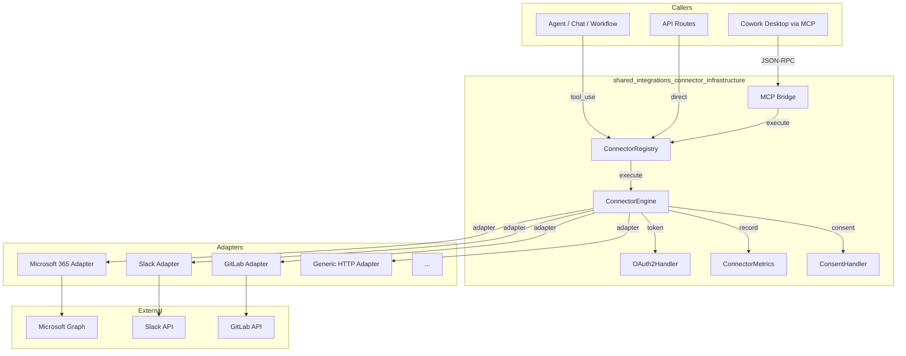
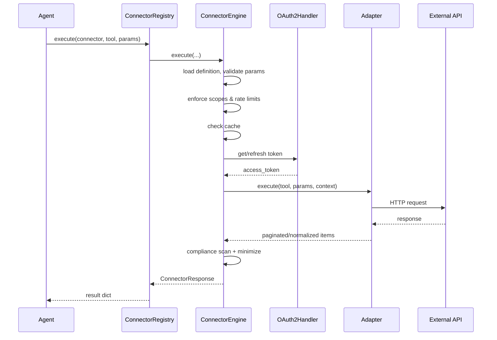

# shared_integrations_connector_infrastructure

## Overview

The `shared_integrations_connector_infrastructure` module is the runtime backbone for all external integrations in the AiNxt platform. It provides a unified, secure, and observable execution layer that turns connector definitions stored in the database into LLM-callable tools. The module sits between the connector adapters (e.g., Microsoft 365, Slack, GitLab) and the rest of the system, handling authentication, caching, rate limiting, compliance, pagination, retries, and metrics collection.

This module is part of the larger [`shared_integrations`](../reference/shared_integrations.md) family. While [`shared_integrations_connector_adapters`](shared_integrations_connector_adapters.md) implements the protocol-specific logic for each external service, this module provides the shared infrastructure that makes those adapters callable, discoverable, and governable.

## Purpose

- Provide a single execution engine for all connector tool calls.
- Manage OAuth2, PAT, and DPI consent-based authentication lifecycles.
- Register connector tools into the MCP tool registry so agents can discover and invoke them.
- Enforce guardrails: access control, scopes, rate limits, cost ceilings, compliance scanning, and data minimization.
- Record per-connector, per-tool, per-user, and per-department metrics for observability and auditing.
- Expose connectors to the desktop Cowork agent via an MCP bridge with input/output compliance controls.

## Architecture

## High-Level Data Flow

## Sub-modules

| Sub-module | File(s) | Responsibility | Documentation |
|---|---|---|---|
| Engine | [`connectors/engine.py`](shared_integrations_connector_infrastructure_engine.md) | Core execution pipeline: validation, auth, caching, pagination, retries, compliance, response normalization. | [shared_integrations_connector_infrastructure_engine.md](shared_integrations_connector_infrastructure_engine.md) |
| Registry | [`connectors/registry.py`](shared_integrations_connector_infrastructure_registry.md) | DB-backed registry that bootstraps connector tools into MCP, dispatches execution, and lists connected/available tools per user. | [shared_integrations_connector_infrastructure_registry.md](shared_integrations_connector_infrastructure_registry.md) |
| Metrics | [`connectors/metrics.py`](shared_integrations_connector_infrastructure_metrics.md) | KV-backed metrics: call counts, errors, latency, cache hits, token refreshes, audit logs, top queries, usage by department, failure distribution. | [shared_integrations_connector_infrastructure_metrics.md](shared_integrations_connector_infrastructure_metrics.md) |
| OAuth2 | [`connectors/oauth2.py`](shared_integrations_connector_infrastructure_oauth2.md) | Universal OAuth2 handler: PKCE, authorization URL generation, code exchange, token refresh, revocation, and KV-backed flow state. | [shared_integrations_connector_infrastructure_oauth2.md](shared_integrations_connector_infrastructure_oauth2.md) |
| MCP Bridge | [`connectors/mcp_bridge.py`](shared_integrations_connector_infrastructure_mcp_bridge.md) | Cowork MCP bridge: exposes connector tools, KB search, document generation, sandboxed code execution, deep research, and durable memory to the desktop agent with compliance controls. | [shared_integrations_connector_infrastructure_mcp_bridge.md](shared_integrations_connector_infrastructure_mcp_bridge.md) |
| DPI Consent | [`connectors/dpi/consent.py`](shared_integrations_connector_infrastructure_dpi_consent.md) | DEPA-style consent artifact creation and verification for India Stack connectors (Account Aggregator / Digilocker), with sandbox and production plug points. | [shared_integrations_connector_infrastructure_dpi_consent.md](shared_integrations_connector_infrastructure_dpi_consent.md) |

## Key Design Decisions

1. **Synchronous by default**: `ConnectorEngine.execute` is synchronous so it can run inside RQ workers and FastAPI sync endpoints without requiring an event loop. The MCP bridge wraps blocking calls in a thread pool when serving the desktop agent over SSE.
2. **Never raise on execution errors**: The engine returns a `ConnectorResponse` with `success=False` and an `error` string. This lets callers (agents, routers) decide how to surface failures.
3. **Token lifecycle is self-contained**: OAuth refresh, PAT auto-connect, and DPI consent verification all live inside the engine. Callers pass only `user_id`.
4. **Compliance is layered**: Input is hard-blocked for outbound writes; connector read output is redacted (not blocked) so the user can still see their own data. See [`guardrails`](../security/guardrails.md) for the underlying compliance engine.
5. **Caching is query-aware**: Freshness keywords (`latest`, `today`, `now`, etc.) bypass the Redis cache automatically.
6. **Metrics are best-effort**: Metric recording never fails a tool call; failures are logged at debug level.

## Integration with Other Modules

- **Connector adapters**: The engine lazy-loads custom adapters from [`shared_integrations_connector_adapters`](shared_integrations_connector_adapters.md) or falls back to a generic HTTP adapter. Adapter-specific behavior (pagination cursors, error mapping) is implemented there.
- **MCP system**: The registry bootstraps connector tools into the shared [`mcp_system`](../shared_core_mcp_system.md) `ToolRegistry` so agents can call them via `tool_use`.
- **Guardrails**: The engine calls the shared [`guardrails`](../security/guardrails.md) / compliance engine for input/output scanning.
- **Authentication**: User tokens are read from `ainxt.user_oauth_tokens`; PAT auto-connect reads from the profile vault managed by [`shared_api_routers_profile_router`](../shared_api_routers_profile_router.md).
- **Knowledge base**: The MCP bridge can query the platform KB via [`shared_core_knowledge_base`](../knowledge/shared_core_knowledge_base.md) retrieval tools.
- **Document workers**: Document generation and skill-driven builds are enqueued to RQ workers documented under [`workers_document_knowledge_workers`](../workers_document_knowledge_workers.md).
- **Memory**: Cowork durable memory is persisted through the memory system documented under [`shared_core_memory_system`](../shared_core_memory_system.md).

## Operational Notes

- **Environment variables**: `CONNECTOR_MAX_PAGES`, `CONNECTOR_MAX_ITEMS_*`, `CONNECTOR_MAX_ITEMS_DEFAULT`, `CONNECTOR_MAX_ITEMS_MAIL`, `CONNECTOR_MAX_ITEMS_CALENDAR`, `CONNECTOR_MAX_ITEMS_TEAMS`, `COWORK_TOOL_POOL`, `COWORK_CONNECTOR_RATE_MAX`, `COWORK_CONNECTOR_RATE_WINDOW`, `DPI_SANDBOX`, `DPI_SANDBOX_SIGNING_KEY`, `LLM_PROXY_URL`, `FERNET_KEY`.
- **Database tables**: `ainxt.connector_definitions`, `ainxt.user_oauth_tokens`, `ainxt.user_connector_permissions`.
- **Redis databases**: DB 0 (connector cache + rate limits), DB 1 (metrics/trace store via `RDB_TRACE`), DB 2 (OAuth flow state via `RDB_WORKFLOW`), DB 5 (Cowork exec results + rate limits).
- **Common failure modes**:
  - `ConnectorNotConnectedError` — no active token row; for PAT connectors the engine attempts auto-connect from the profile vault.
  - `ConnectorReauthRequired` — refresh token revoked or consent expired; the token is deactivated so the UI prompts reconnect.
  - `ConnectorTransientError` — temporary DB or network issue; the user is told to retry rather than reconnect.
  - `ConnectorRateLimitError` — per-user per-connector rate limit exceeded.
  - Vault key mismatch — if `FERNET_KEY` differs between gateway and worker, token decryption fails with a precise error message.
