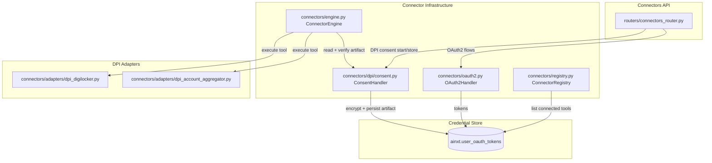
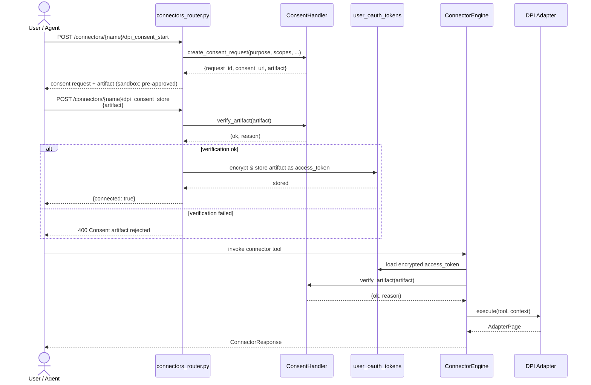
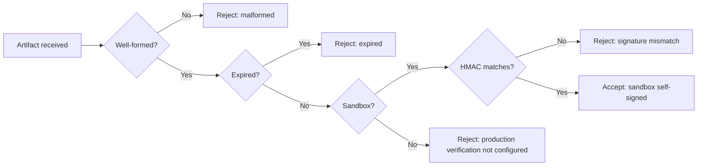

# DPI Consent Handler

## Brief Introduction

The `shared_integrations_connector_infrastructure_dpi_consent` module implements the **Data Empowerment and Protection Architecture (DEPA) / Digital Public Infrastructure (DPI) consent model** for agent-driven data access. Unlike traditional OAuth2 bearer tokens, DPI consent is based on a **signed consent artifact** that is scoped to a specific **purpose**, **data range**, and **expiry**. The artifact acts as a user-granted mandate: the agent may only access data strictly within the bounds defined in the consent.

This module is the consent counterpart to the OAuth2 handler in [`shared_integrations_connector_infrastructure_oauth2.md`](shared_integrations_connector_infrastructure_oauth2.md). It is consumed by the connector execution engine ([`shared_integrations_connector_infrastructure_engine.md`](shared_integrations_connector_infrastructure_engine.md)), exposed through the connectors API ([`shared_api_routers_connectors_router.md`](../shared_api_routers_connectors_router.md)), and used by the DPI adapter implementations in [`shared_integrations_connector_adapters.md`](shared_integrations_connector_adapters.md).

---

## Module Purpose and Core Functionality

The module's single public component, `ConsentHandler`, is responsible for the full lifecycle of a DPI consent artifact:

1. **Create consent requests** — build a signed artifact that describes what data the connector may access, for what purpose, and for how long.
2. **Verify artifacts** — validate shape, expiry, and signature before any data access is allowed.
3. **Sandbox self-signing** — provide a fully offline, open-source-safe mode where artifacts are HMAC-signed with a dev key.
4. **Production plug point** — reserve a fail-closed verification path for real DPI issuer signatures (RBI AA, DigiLocker partner, etc.) in Phase 2.

The artifact is stored as the encrypted `access_token` in `ainxt.user_oauth_tokens`, with `auth_type` and consent metadata recorded alongside it. This design lets the existing connector pipeline (connection detection, MCP tool exposure, and execution) treat DPI consent connectors almost identically to OAuth2/PAT connectors.

---

## Core Components

### `ConsentHandler` (`connectors/dpi/consent.py`)

| Method | Responsibility |
|--------|----------------|
| `create_consent_request(...)` | Builds a consent artifact with `consent_id`, `purpose`, `scope`, `data_range_days`, `issued_at`, `expires_at`, and a signature. In sandbox mode the artifact is returned already approved. In production it would redirect the user to an issuer consent screen. |
| `verify_artifact(artifact)` | Validates that the artifact is well-formed, not expired, and (in sandbox) that the HMAC signature matches. In production it fails closed until issuer-signature verification is wired. |
| `_sign(artifact)` | Sandbox-only HMAC-SHA256 signer over a canonical JSON payload. |

A module-level singleton `consent_handler` is provided for direct import.

### Environment Controls

| Variable | Purpose |
|----------|---------|
| `DPI_SANDBOX` | When set to `1`, `true`, `yes`, or `on`, enables the offline sandbox mode with self-signed artifacts. |
| `DPI_SANDBOX_SIGNING_KEY` | Dev-only HMAC key used to sign sandbox artifacts. Not a security boundary; production uses real issuer signatures. |

---

## Architecture and Component Relationships

### Where DPI Consent Fits

The DPI consent handler sits in the connector infrastructure layer, parallel to OAuth2 and PAT handling:

### Consent Artifact Lifecycle

### Verification Modes

---

## Data Model: Consent Artifact

A consent artifact is a JSON object with the following fields:

| Field | Type | Description |
|-------|------|-------------|
| `consent_id` | string | Unique identifier for this consent grant. |
| `connector` | string | Connector name, e.g. `dpi_account_aggregator`. |
| `user_id` | string | User who granted the consent. |
| `purpose` | string | Human-readable purpose, e.g. "Personal finance review". |
| `scope` | list[string] | Data scopes being requested. |
| `data_range_days` | int | How far back in time the data access may reach. |
| `issued_at` | int (epoch) | When the artifact was issued. |
| `expires_at` | int (epoch) | When the artifact expires. |
| `sandbox` | bool | Whether this is a sandbox self-signed artifact. |
| `signature` | string | HMAC-SHA256 (sandbox) or issuer signature (production). |

Purpose-limitation and scope enforcement are the responsibility of the caller (the connector engine and adapters), not the verifier itself.

---

## Integration with the Connector Engine

The connector engine treats DPI consent connectors as a distinct `auth_type`. The relevant flow in `ConnectorEngine._get_token_row` is:

1. Load the encrypted `access_token` from `ainxt.user_oauth_tokens`.
2. Decrypt it with the vault key.
3. If `auth_type == "dpi_consent"`, parse the token as a JSON artifact.
4. Call `consent_handler.verify_artifact(artifact)`.
5. If verification fails, deactivate the token and raise `ConnectorReauthRequired`.
6. If verification succeeds, build a `ConnectorContext` with `auth_type="dpi_consent"`, `is_sandbox` derived from the environment, and the artifact attached to metadata.

The adapter then receives this context and uses `is_sandbox` to decide whether to return synthetic fixtures or call a real upstream DPI endpoint.

For full details on execution, caching, rate limiting, and error handling, see [`shared_integrations_connector_infrastructure_engine.md`](shared_integrations_connector_infrastructure_engine.md).

---

## API Surface

The connectors router exposes two DPI-specific endpoints. These are documented in [`shared_api_routers_connectors_router.md`](../shared_api_routers_connectors_router.md):

- `POST /connectors/{connector_name}/dpi_consent_start` — creates a consent request. In sandbox mode the response includes an already-approved artifact.
- `POST /connectors/{connector_name}/dpi_consent_store` — verifies and persists the artifact, marking the connector as connected.

---

## DPI Adapters

Two custom adapters consume the consent context:

- **`DpiAccountAggregatorAdapter`** — sandbox tools: `aa_list_accounts`, `aa_fetch_statement`. Production requires RBI AA licensing and a configured FIP/AA endpoint.
- **`DpiDigilockerAdapter`** — sandbox tools: `digilocker_list_documents`, `digilocker_fetch_document`. Production requires DigiLocker partner credentials.

Both adapters fail closed when sandbox mode is disabled and production endpoints are not configured. See [`shared_integrations_connector_adapters.md`](shared_integrations_connector_adapters.md) for adapter details.

---

## Security and Compliance Considerations

- **Fail-closed by default**: Production verification is intentionally unimplemented and returns a rejection until real issuer-signature checking is wired.
- **Purpose limitation**: The artifact carries `purpose` and `scope`, but enforcement is delegated to the adapter and the calling agent. Adapters should respect these fields.
- **Encryption at rest**: The artifact is encrypted with the platform credential vault before being stored in `user_oauth_tokens`.
- **Expiry**: Artifacts carry both `issued_at` and `expires_at`; the verifier rejects expired artifacts.
- **Sandbox key**: `DPI_SANDBOX_SIGNING_KEY` is a development convenience only and must not be used for real user data.

---

## Deployment and Operational Notes

- Set `DPI_SANDBOX=true` for local development, CI, and demos. No external DPI issuer is contacted.
- For production, implement the issuer-signature verification in `verify_artifact` and configure the appropriate public keys/certificates.
- Ensure the `FERNET_KEY` / `VAULT_ENCRYPTION_KEY` is identical across gateway and worker processes; otherwise decryption of stored artifacts will fail with a vault-key mismatch error.
- The consent artifact is stored in the same `user_oauth_tokens` table as OAuth2 tokens, so existing connection-status queries and MCP registration continue to work unchanged.

---

## Related Documentation

- [`shared_integrations_connector_infrastructure_oauth2.md`](shared_integrations_connector_infrastructure_oauth2.md) — OAuth2 token lifecycle and PKCE flow.
- [`shared_integrations_connector_infrastructure_engine.md`](shared_integrations_connector_infrastructure_engine.md) — connector execution, caching, rate limiting, and error handling.
- [`shared_integrations_connector_infrastructure_registry.md`](shared_integrations_connector_infrastructure_registry.md) — connector registration and MCP tool exposure.
- [`shared_integrations_connector_adapters.md`](shared_integrations_connector_adapters.md) — DPI adapter implementations and sandbox fixtures.
- [`shared_api_routers_connectors_router.md`](../shared_api_routers_connectors_router.md) — REST endpoints for connector management and DPI consent.
