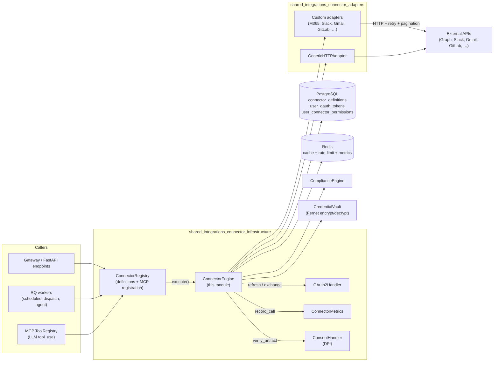
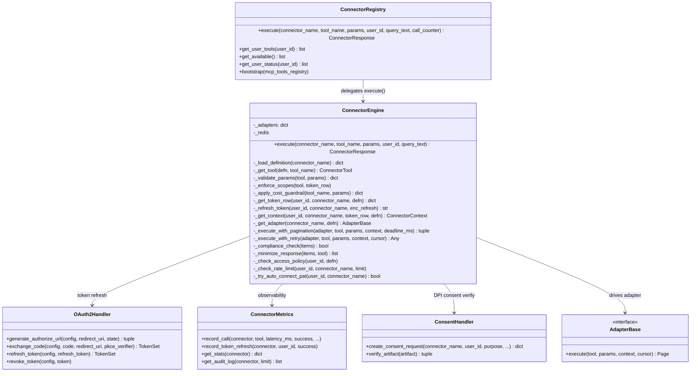
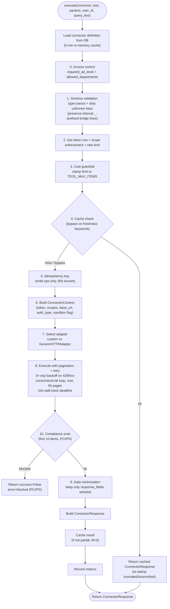
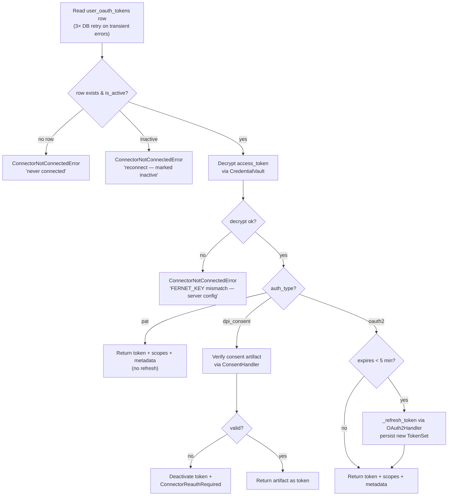
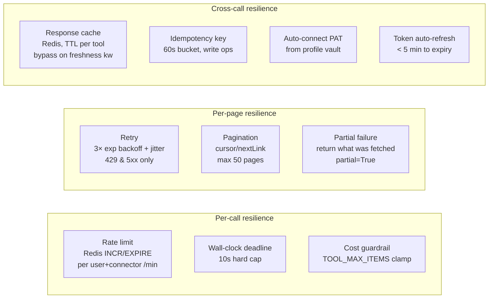
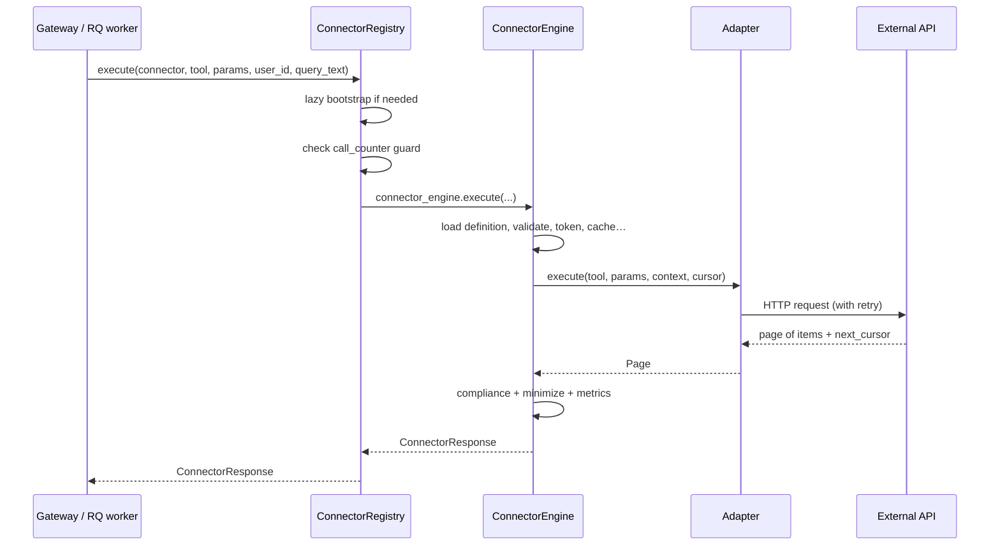

# Connector Engine (`shared_integrations_connector_infrastructure_engine`)

> **Core component:** `connectors/engine.py::ConnectorEngine`
> **Parent module:** [shared_integrations_connector_infrastructure](shared_integrations_connector_infrastructure.md) → [shared_integrations](../reference/shared_integrations.md)

## 1. Introduction

The `ConnectorEngine` is the **production-hardened universal connector runtime** — the single, synchronous entry point through which every external-integration tool call is executed. It sits at the heart of the platform's connector infrastructure and is responsible for turning a high-level request like *"run `microsoft_365__outlook_search_emails` for user X with these params"* into a safe, validated, cached, retried, paginated, compliance-scanned, and normalized `ConnectorResponse`.

The engine is deliberately **synchronous and thread-safe**, so it can be invoked identically from:

- **FastAPI sync endpoints** (e.g. the `connectors_router` action/execute routes), and
- **RQ workers** (scheduled tasks, cowork dispatch, agent tool calls).

It never raises to its caller — every failure path is captured into the `ConnectorResponse.error` field with a typed prefix (`ACCESS_DENIED`, `REAUTH_REQUIRED`, `TRANSIENT_ERROR`, `SCOPE_ERROR`, `RATE_LIMIT`, …) so upstream code can branch on the *cause* rather than guessing from a generic message.

### What it is *not*

- It is **not** the registry of connector definitions — that is [`ConnectorRegistry`](shared_integrations_connector_infrastructure_registry.md), which loads definitions from the DB and registers tools into the MCP `ToolRegistry`. The registry *delegates execution* to `connector_engine.execute(...)`.
- It is **not** the OAuth2 flow manager — that is [`OAuth2Handler`](shared_integrations_connector_infrastructure_oauth2.md). The engine *consumes* tokens that the handler produces and *triggers refreshes* through it.
- It is **not** the adapter implementations — those live in the [`shared_integrations_connector_adapters`](shared_integrations_connector_adapters.md) module. The engine *selects and drives* adapters.

## 2. Architecture & System Position



The engine is the **convergence point** between three concerns:

1. **Identity & authorization** — token retrieval, auto-refresh, scope enforcement, DPI consent verification, PAT auto-connect.
2. **Execution resilience** — schema validation, cost guardrails, caching, idempotency, retry with backoff, pagination, wall-clock deadlines.
3. **Safety & observability** — access policy (AD level + department), data minimization, compliance scanning, metrics, audit logging.

## 3. Component Relationships



### Dependency summary

| Direction | Component | Purpose |
|-----------|-----------|---------|
| Engine → | [`ConnectorRegistry`](shared_integrations_connector_infrastructure_registry.md) | Registry calls `connector_engine.execute()`; engine is the worker beneath the registry. |
| Engine → | [`OAuth2Handler`](shared_integrations_connector_infrastructure_oauth2.md) | Refresh expired access tokens; build `OAuth2Config` from connector definition. |
| Engine → | [`ConnectorMetrics`](shared_integrations_connector_infrastructure_metrics.md) | Record every call (latency, success, cache hit, dept, error type) + token refresh outcomes. |
| Engine → | [`ConsentHandler`](shared_integrations_connector_infrastructure_dpi_consent.md) | Verify DPI consent artifacts (expiry + signature) for `dpi_*` connectors. |
| Engine → | [Adapters](shared_integrations_connector_adapters.md) | Custom adapters (M365, Slack, Gmail, GitLab, Jira, Confluence, Google Drive, DocuSign, Zoom, DPI) or `GenericHTTPAdapter`. |
| Engine → | `ComplianceEngine` (`agents.compliance_engine`) | Pre-LLM PCI/PII scan of response items. |
| Engine → | `CredentialVault` (`store.credential_vault`) | Fernet encrypt/decrypt of stored tokens. |
| Engine → | PostgreSQL (`db.database`) | Connector definitions, user tokens, user permissions, user level/dept. |
| Engine → | Redis | Response cache, per-user rate-limit counters. |

## 4. Execution Pipeline (Data Flow)

The `execute()` method runs a deterministic 10-stage pipeline. The diagram below traces a single tool call end-to-end.



### Stage detail

| # | Stage | Key behaviour |
|---|-------|---------------|
| 0 | **Access control** | `_check_access_policy` enforces `required_ad_level` (lower number = more senior) and `allowed_departments` from the connector definition. Violations raise `ConnectorAccessDeniedError`. |
| 1 | **Schema validation** | `_validate_params` coerces types (`integer`/`number`/`boolean`/`string`), strips unknown keys, and **preserves internal `_`-prefixed keys** (e.g. `_attachments`, `_attachment_retry`) injected by the MCP bridge so they survive into the adapter's write-body builder. |
| 2 | **Token + scope + rate limit** | `_get_token_row` reads the encrypted token from `user_oauth_tokens`, decrypts via `CredentialVault`, and auto-refreshes if expiring < 5 min. `_enforce_scopes` checks `requires_scopes` ⊆ granted scopes. `_check_rate_limit` uses a Redis `INCR`+`EXPIRE` counter per user/connector. |
| 3 | **Cost guardrail** | `_apply_cost_guardrail` clamps `limit` to `TOOL_MAX_ITEMS[tool]` (e.g. 2000 for mail, 1000 for calendar). Sets `__truncated__` flag when clamped. |
| 4 | **Cache** | SHA-256 cache key over `connector:tool:user_id:sorted(params)`. Bypassed when `query_text` contains freshness keywords (`latest`, `today`, `now`, …). Only non-partial results are cached. |
| 5 | **Idempotency** | For write ops, a 60-second-bucketed `Idempotency-Key` is injected into `ConnectorContext.metadata` so retries within a minute are deduplicated upstream. |
| 6 | **Context** | `_get_context` builds a `ConnectorContext` carrying the decrypted token, scopes, `base_url`, `auth_type`, and a `is_sandbox` flag (DPI sandbox when `DPI_SANDBOX` env is set). |
| 7 | **Adapter selection** | `_get_adapter` lazy-loads and caches the adapter. Custom adapters are resolved via a name→module map and a module-level `AdapterBase` singleton is extracted (with a fallback scan). Falls back to `GenericHTTPAdapter`. |
| 8 | **Execute + retry + pagination** | `_execute_with_pagination` loops up to `MAX_PAGES` (50), calling `_execute_with_retry` per page. Retry: 3 attempts, exponential backoff + jitter on HTTP 429/5xx (capped at 32s); 4xx (400/401/403/404) are non-retryable. A 10-second wall-clock `deadline_ms` stops runaway pagination. |
| 9 | **Data minimization** | `_minimize_response` keeps only fields in `tool.response_fields` per item — a GDPR/data-minimization safeguard. |
| 10 | **Compliance** | `_compliance_check` samples the first 10 items (capped at 5000 chars) through `ComplianceEngine.analyze`. If any finding is `blocked`, the response is returned with `success=False` and a PCI/PII error — **before** the data reaches the LLM context. |

## 5. Token Management & Auth-Type Routing

The engine supports four authentication strategies, each with distinct token-handling logic inside `_get_token_row`:



### PAT auto-connect

For PAT connectors (`gitlab`, `jira_connector`), when a `ConnectorNotConnectedError` is raised, the engine attempts a **one-time auto-connect** from the user's profile vault (`user_tokens` table). If a stored PAT is found, it is encrypted and upserted into `user_oauth_tokens`, and the original `execute()` call is retried. This handles the common UX gap where a user stored a token in *Profile → API Token Vault* but never clicked *Connect* in *Settings → Connectors*.

### Transient vs. disconnect disambiguation

A recurring production pain-point the engine explicitly addresses: a **transient DB error** (pool exhaustion, dropped connection) must *not* be reported as "not connected". `_get_token_row` retries the DB read 3× with backoff and, on exhaustion, raises `ConnectorTransientError` — which surfaces to the user as *"try again in a moment, you do NOT need to reconnect"*. The token is **never deactivated** on a transient error.

## 6. Error Handling Strategy

The engine's contract is **never raise; always return a `ConnectorResponse`**. Each exception type maps to a typed error prefix:

```mermaid
flowchart TD
    TRY["try: execute pipeline"]
    TRY --> C1{"ConnectorAccessDeniedError"}
    C1 -->|"yes"| E1["error = 'ACCESS_DENIED: …'"]
    C1 -->|"no"| C2{"ConnectorNotConnectedError"}
    C2 -->|"PAT?"}| C2PAT["Try auto-connect from vault<br/>retry once if ok"]
    C2PAT -->|"ok"| TRY
    C2PAT -->|"fail"| E2["error = str(e)"]
    C2 -->|"no"| C3{"ConnectorTransientError"}
    C3 -->|"yes"| E3["error = 'TRANSIENT_ERROR: …'<br/>(do NOT deactivate token)"]
    C3 -->|"no"| C4{"ConnectorReauthRequired"}
    C4 -->|"yes"| E4["Deactivate token<br/>error = 'REAUTH_REQUIRED: …'"]
    C4 -->|"no"| C5{"ConnectorScopeError"}
    C5 -->|"yes"| E5["error = 'SCOPE_ERROR: …'"]
    C5 -->|"no"| C6{"ConnectorRateLimitError"}
    C6 -->|"yes"| E6["error = 'RATE_LIMIT: …'"]
    C6 -->|"no"| C7{"any Exception"}
    C7 -->|"yes"| E7["log error + record metrics<br/>error = str(e)"]
```

| Error prefix | Meaning | Token side-effect | User action |
|--------------|---------|-------------------|-------------|
| `ACCESS_DENIED` | AD level / department policy violation | None | Request access from admin |
| `TRANSIENT_ERROR` | Temporary DB/network blip | **None** (token stays active) | Retry |
| `REAUTH_REQUIRED` | Refresh token revoked / DPI consent invalid | **Deactivated** | Reconnect |
| `SCOPE_ERROR` | Token lacks required OAuth scopes | None | Reconnect to grant scopes |
| `RATE_LIMIT` | Per-user requests/min exceeded | None | Wait and retry |
| (raw) `… is not connected` | No token row / inactive / vault-key mismatch | None | Reconnect (or admin fixes `FERNET_KEY`) |

## 7. Resilience Mechanisms



### Key constants (env-overridable)

| Constant | Default | Env override | Purpose |
|----------|---------|--------------|---------|
| `MAX_PAGES` | 50 | `CONNECTOR_MAX_PAGES` | Max pagination pages |
| `MAX_CONNECTOR_EXECUTION_MS` | 10 000 | — | Hard wall-clock timeout |
| `_MAX_ITEMS_DEFAULT` | 1000 | `CONNECTOR_MAX_ITEMS_DEFAULT` | Fallback item ceiling |
| Mail ceiling | 2000 | `CONNECTOR_MAX_ITEMS_MAIL` | `outlook_*` / `gmail_*` |
| Calendar ceiling | 1000 | `CONNECTOR_MAX_ITEMS_CALENDAR` | `calendar_list_events` |
| Teams ceiling | 2000 | `CONNECTOR_MAX_ITEMS_TEAMS` | `teams_get_*_messages` |
| `ASYNC_THRESHOLD_ITEMS` | 200 | — | Requests above this → async queue |

### Permission-gated connectors

A frozen set of connectors whose **read** tool calls require explicit user permission before execution (checked by the orchestrator via `_check_user_permission`, which queries `user_connector_permissions` for `always_allow` / `denied` / `needs_prompt`):

```
gitlab, jira_connector, google_drive, slack, zoom
```

M365 *write* tools are excluded — they already flow through the `[SENDPROPOSAL]`/`[ACTIONPROPOSAL]` approval path.

## 8. Observability

Every call flows through [`ConnectorMetrics`](shared_integrations_connector_infrastructure_metrics.md), which writes to the Redis trace KV store:

- **Counters:** `calls_total`, `errors_total`, `cache_hits`, `token_refreshes`, `token_refresh_failures`.
- **Aggregates:** `latency_sum_ms` (for avg latency), `last_error_at`.
- **Sorted sets:** `top_queries` (connector:tool → call count), `usage_by_dept:{connector}`, `failure_dist:{connector}` (error_type → count).
- **Audit log:** `connector:audit:{connector}` — a capped list (last 1000) of JSON entries with `user_id`, `tool`, `latency_ms`, `success`, `cache_hit`, `dept`, `error_type`, `ts`.

These are exposed via the `connectors_router` `get_metrics` endpoint and the admin dashboard.

## 9. Integration Points

### 9.1 How callers invoke the engine



### 9.2 MCP tool registration

`ConnectorRegistry._register_to_mcp` wraps each connector tool as an MCP `ToolDefinition` named `{connector}__{tool}` (e.g. `microsoft_365__outlook_search_emails`). The wrapper closure calls `connector_engine.execute(...)` and returns `result.to_dict()`. This is how LLM `tool_use` calls reach the engine — see [shared_integrations_connector_infrastructure_registry](shared_integrations_connector_infrastructure_registry.md) and the [mcp_system](../reference/shared_core.md) module for the full registration flow.

### 9.3 Related module documentation

| Topic | Reference |
|-------|-----------|
| Connector definitions, MCP registration, user status | [shared_integrations_connector_infrastructure_registry](shared_integrations_connector_infrastructure_registry.md) |
| OAuth2 authorize/exchange/refresh/revoke, PKCE | [shared_integrations_connector_infrastructure_oauth2](shared_integrations_connector_infrastructure_oauth2.md) |
| Metrics, audit log, top queries, failure distribution | [shared_integrations_connector_infrastructure_metrics](shared_integrations_connector_infrastructure_metrics.md) |
| DPI consent artifact create/verify | [shared_integrations_connector_infrastructure_dpi_consent](shared_integrations_connector_infrastructure_dpi_consent.md) |
| MCP bridge (`_kb_search`, tool wrappers) | [shared_integrations_connector_infrastructure_mcp_bridge](shared_integrations_connector_infrastructure_mcp_bridge.md) |
| Adapter implementations (M365, Slack, Gmail, GitLab, …) | [shared_integrations_connector_adapters](shared_integrations_connector_adapters.md) |
| Connector tool functions (jira, gitlab, confluence, …) | [shared_integrations](../reference/shared_integrations.md) |
| Compliance engine (PCI/PII scanning) | [shared_core](../reference/shared_core.md) |
| Credential vault (Fernet encrypt/decrypt) | [shared_core](../reference/shared_core.md) |
| Connectors REST API (execute, oauth, permissions) | [shared_api_routers](../api/shared_api_routers.md) |

## 10. Design Decisions & Rationale

1. **Synchronous by design.** The engine runs in RQ workers and FastAPI sync endpoints. Concurrency is controlled via Redis rate-limit counters, not `asyncio.Semaphore`, so the same code path works in both contexts.

2. **Never raise; always return.** A `ConnectorResponse` with `success=False` and a typed `error` prefix lets the agent/UI branch on cause without try/except noise at every call site.

3. **Transient ≠ disconnected.** The most subtle production bug class — a DB pool blip surfacing as "please reconnect" — is explicitly prevented by retrying DB reads and raising `ConnectorTransientError` instead of `ConnectorNotConnectedError`.

4. **Vault-key mismatch is a server bug, not a user bug.** When token decryption fails, the engine tells the user *exactly* that `FERNET_KEY` is misaligned across hosts, rather than deceptively prompting a reconnect that will fail identically.

5. **Compliance before LLM.** The PCI/PII scan (stage 10) runs *before* the response is returned to the agent, ensuring sensitive data never enters LLM context.

6. **Data minimization.** `response_fields` whitelisting strips fields the tool doesn't need — a defence-in-depth GDPR measure independent of compliance scanning.

7. **High item ceilings, not curation limits.** `TOOL_MAX_ITEMS` values are deliberately high (e.g. 2000 for mail) so the agent sees a *whole* mailbox, not a truncated sample. They are safety ceilings against runaway APIs, not curation limits.

8. **PAT auto-connect.** Bridges the UX gap between the profile vault and the connectors page, eliminating a common support ticket.

## 11. Module-level singleton

The engine is exposed as a module-level singleton:

```python
connector_engine = ConnectorEngine()
```

`ConnectorRegistry` (and therefore all MCP-registered connector tools, REST endpoints, and RQ workers) import and call this singleton. The singleton holds an in-memory adapter cache (`_adapters`) and a 5-minute definition cache (`_defn_cache_{name}`), so repeated calls for the same connector avoid re-loading from the DB and re-importing adapter modules.
