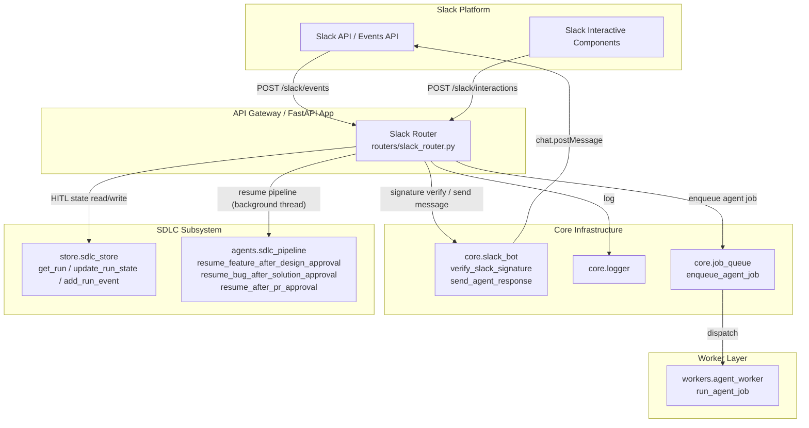
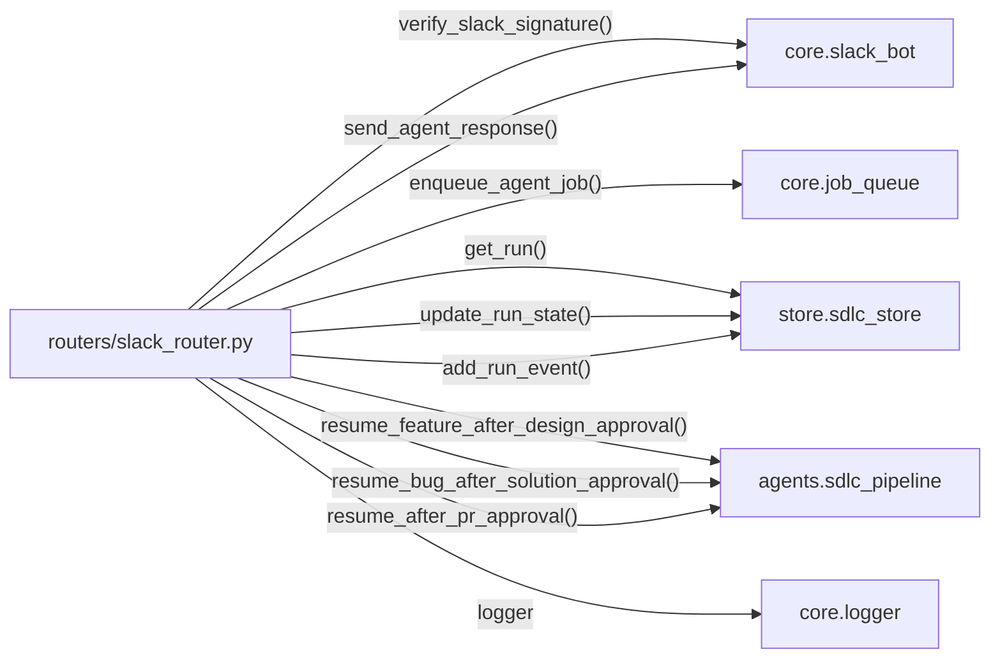
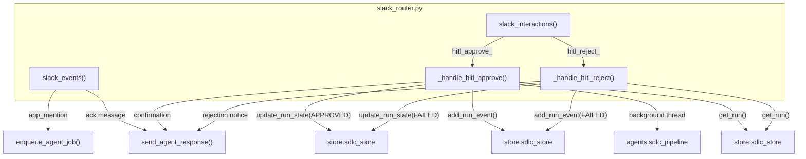
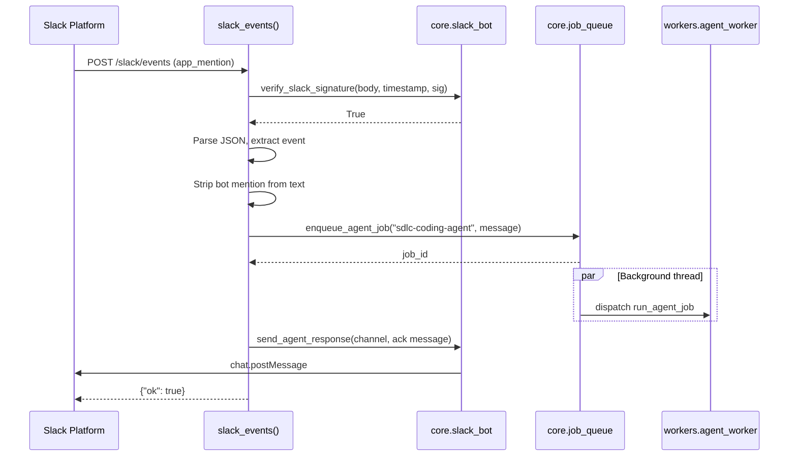
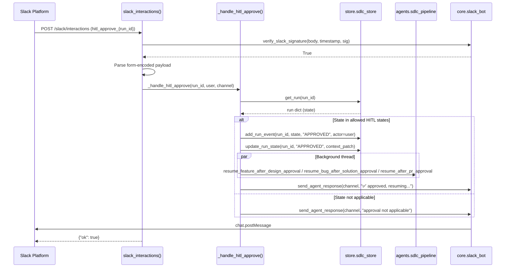
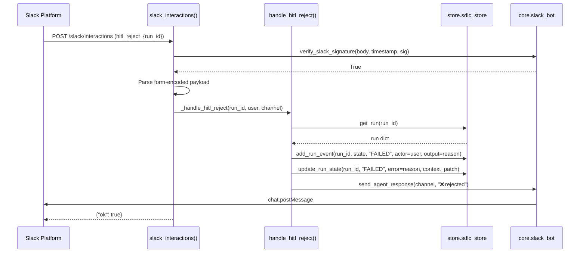
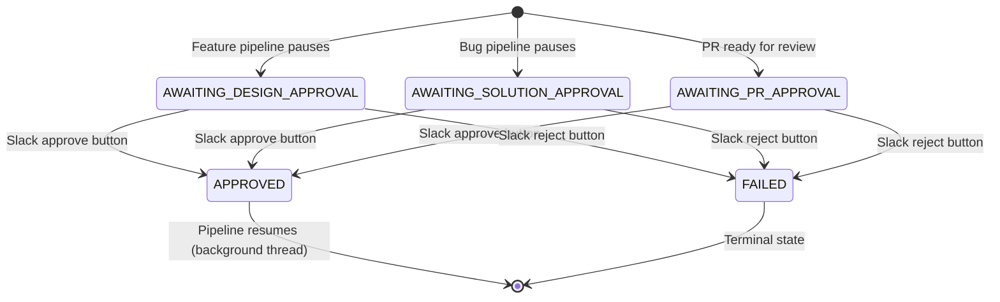

# Slack Router

## Overview

The **Slack Router** (`routers/slack_router.py`) is a FastAPI `APIRouter` that
serves as the inbound webhook bridge between the **Slack platform** and the
ABStudio / AiNxt backend. It exposes two endpoints under the `/slack` prefix:

| Endpoint | Method | Purpose |
|---|---|---|
| `/slack/events` | POST | Receives Slack Events API payloads (URL verification, `app_mention`). |
| `/slack/interactions` | POST | Receives Slack interactive component payloads (button clicks for HITL approval/rejection). |

The router is intentionally thin: it validates Slack signatures, parses
payloads, dispatches work to the appropriate subsystem (agent job queue or SDLC
pipeline resume), and sends acknowledgement messages back to the Slack channel.
It does **not** contain business logic for agent execution or SDLC state
management — those responsibilities are delegated to dedicated modules.

---

## Architecture

### Module Boundaries

The router sits at the **edge** of the system. All inbound Slack traffic flows
through it, but it delegates immediately to:

- **`core.slack_bot`** — HMAC-SHA256 signature verification and outbound Slack
  messaging (see [core_infrastructure.md](../core/core_infrastructure.md)).
- **`core.job_queue`** — asynchronous agent job dispatch (see
  [core_infrastructure.md](../core/core_infrastructure.md)).
- **`store.sdlc_store`** — SDLC run state persistence and audit trail (see
  [store_layer.md](../storage/store_layer.md)).
- **`agents.sdlc_pipeline`** — SDLC pipeline resume functions after Human-in-the-
  Loop (HITL) approvals (see
  [shared_core_sdlc_pipeline.md](../sdlc/shared_core_sdlc_pipeline.md)).

> **Note:** Outbound Slack connector actions (reading channels, posting rich
> messages, etc.) are handled by the `SlackAdapter` in the connectors layer —
> see [connectors_integrations.md](../connectors/connectors_integrations.md). This router only
> handles inbound webhook callbacks.

---

## Dependencies

| Dependency | Import | Role |
|---|---|---|
| `core.slack_bot` | `verify_slack_signature`, `send_agent_response` | Request authentication; posting replies to Slack channels. |
| `core.job_queue` | `enqueue_agent_job` | Enqueues an agent run onto the `Q_AGENT` queue for `workers.agent_worker`. |
| `store.sdlc_store` | `get_run`, `update_run_state`, `add_run_event` | Reads SDLC run state, transitions state, and appends signed audit events. |
| `agents.sdlc_pipeline` | `resume_feature_after_design_approval`, `resume_bug_after_solution_approval`, `resume_after_pr_approval` | Resumes the SDLC coding/PR pipeline after a human approves via Slack. |
| `core.logger` | `logger` | Structured logging. |

---

## Endpoints

### POST `/slack/events`

Receives Slack Events API payloads.

**Headers consumed:**

| Header | Description |
|---|---|
| `X-Slack-Request-Timestamp` | Unix timestamp used in signature base string and staleness check. |
| `X-Slack-Signature` | `v0=`-prefixed HMAC-SHA256 signature to verify. |

**Handled event types:**

| Payload `type` / `event.type` | Behaviour |
|---|---|
| `url_verification` (top-level) | Returns `{"challenge": "..."}` to complete the Slack app setup handshake. |
| `app_mention` | Strips the bot mention (`<@BOT_ID>`), enqueues an agent job for `sdlc-coding-agent`, and posts an acknowledgement to the channel. |
| *any other* | Returns `{"ok": true}` (acknowledged, no action). |

**Security:** Every request is signature-verified before parsing. If
`SLACK_SIGNING_SECRET` is not configured in `core.slack_bot`, verification
returns `True` (open mode — suitable only for local development). Requests with
timestamps older than 5 minutes are rejected.

### POST `/slack/interactions`

Receives Slack interactive component payloads (button clicks). Unlike the events
endpoint, the payload arrives as **form-encoded** data with a `payload` field
containing a JSON string.

**Handled action IDs:**

| Action ID prefix | Action value | Behaviour |
|---|---|---|
| `hitl_approve_` | SDLC `run_id` | Approves the SDLC run and resumes the pipeline. |
| `hitl_reject_` | SDLC `run_id` | Rejects the SDLC run and marks it `FAILED`. |

---

## Component Interaction

---

## Process Flow: `app_mention` Event

---

## Process Flow: HITL Approve

### Allowed HITL States for Approval

| Run State | Resume Function Called |
|---|---|
| `AWAITING_DESIGN_APPROVAL` | `resume_feature_after_design_approval(run_id, "")` |
| `AWAITING_SOLUTION_APPROVAL` | `resume_bug_after_solution_approval(run_id, "")` |
| `AWAITING_PR_APPROVAL` | `resume_after_pr_approval(run_id)` |

If the run is in any other state, approval is rejected with a channel message
and no state transition occurs.

---

## Process Flow: HITL Reject

---

## HITL State Transitions

> The `update_run_state()` function in `store.sdlc_store` performs a
> synchronous Postgres write with `SELECT ... FOR UPDATE` row-level locking to
> serialise concurrent state transitions. See [store_layer.md](../storage/store_layer.md)
> for details on persistence, Kafka audit events, and budget finalisation.

---

## Configuration

| Variable | Source | Default | Description |
|---|---|---|---|
| `SLACK_DEFAULT_CHANNEL` | `os.getenv` in router | `#general` | Fallback channel if the Slack payload does not include one. |
| `SLACK_SIGNING_SECRET` | `core.slack_bot` | — | Slack app signing secret for HMAC-SHA256 verification. If unset, verification is bypassed. |
| `SLACK_BOT_TOKEN` | `core.slack_bot` | — | Bot OAuth token used to post messages via `chat.postMessage`. If unset, outbound messages are silently skipped. |

---

## Security

### Signature Verification

Both endpoints call `verify_slack_signature()` from `core.slack_bot` before any
payload parsing. The verification process:

1. If `SLACK_SIGNING_SECRET` is not set, returns `True` (development mode).
2. Rejects requests where the timestamp is missing or older than 5 minutes.
3. Computes `HMAC-SHA256("v0:{timestamp}:{body}", signing_secret)`.
4. Compares the result with the `X-Slack-Signature` header using
   `hmac.compare_digest` (constant-time comparison).

### Error Responses

| HTTP Status | Condition |
|---|---|
| `401` | Invalid or missing Slack signature. |
| `400` | Malformed JSON (events) or malformed form-encoded payload (interactions). |
| `200` | All successfully processed requests return `{"ok": true}`. |

### Internal Errors

Agent dispatch failures and HITL processing errors are caught, logged, and
reported back to the Slack channel as user-facing error messages. The endpoints
themselves always return `200 {"ok": true}` to Slack to prevent Slack from
retrying the webhook.

---

## Concurrency Model

The router uses **daemon threads** for fire-and-forget background work to avoid
blocking the HTTP response to Slack (Slack expects a response within 3 seconds):

| Path | Background Work | Thread Target |
|---|---|---|
| `app_mention` | Enqueue agent job + send acknowledgement | `_reply()` closure |
| `hitl_approve_` | Resume SDLC pipeline | `_resume()` closure |

Pipeline resume functions may take minutes (coding, testing, MR creation). By
running them in a daemon thread, the router returns `{"ok": true}` immediately
while the pipeline continues asynchronously.

> **Concurrency note:** State transitions via `update_run_state()` use Postgres
> row-level locks, making them safe even if a Slack button click and a
> concurrent API call (e.g. from [sdlc_router.md](../sdlc/sdlc_router.md)) race to
> approve the same run.

---

## Related Documentation

| Module | Relationship |
|---|---|
| [sdlc_router.md](../sdlc/sdlc_router.md) | HTTP API equivalents for HITL approve/reject/resume (`approve_run`, `reject_run`, `resume_run`). |
| [shared_core_sdlc_pipeline.md](../sdlc/shared_core_sdlc_pipeline.md) | SDLC pipeline resume functions and state machine invoked after Slack HITL approvals. |
| [store_layer.md](../storage/store_layer.md) | `sdlc_store` persistence layer for run state, events, and audit trail. |
| [core_infrastructure.md](../core/core_infrastructure.md) | `core.slack_bot`, `core.job_queue`, and `core.logger` utilities. |
| [connectors_integrations.md](../connectors/connectors_integrations.md) | `SlackAdapter` for outbound Slack connector actions (separate from this inbound webhook router). |
| [chat_agent_execution_workers.md](../workers/chat_agent_execution_workers.md) | `workers.agent_worker.run_agent_job` — the worker that consumes agent jobs enqueued from `app_mention`. |
| [teams_router.md](teams_router.md) | Analogous router for Microsoft Teams integration. |
