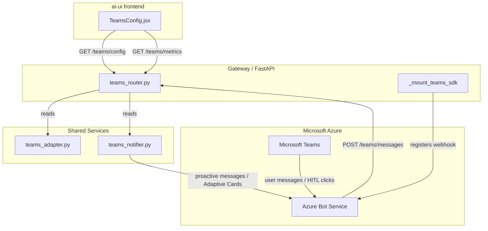
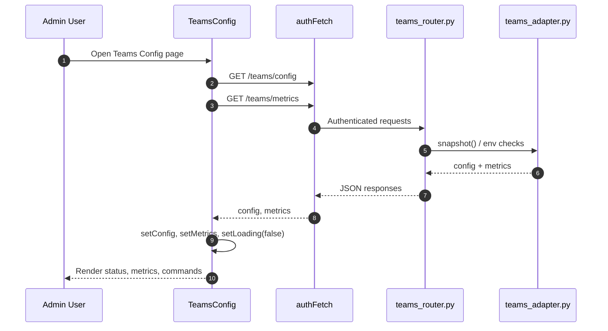
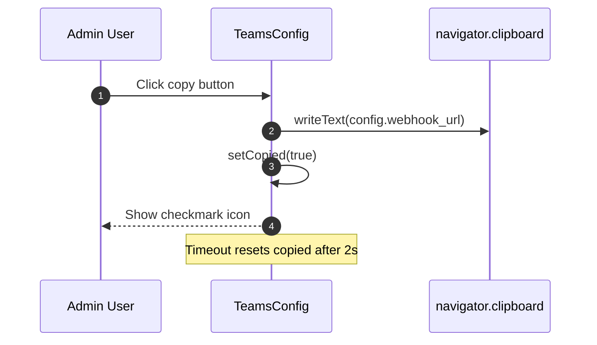

# teams_config — Microsoft Teams Bot Configuration UI

The `teams_config` module provides the **administrative frontend surface** for configuring, monitoring, and troubleshooting the AiNxt Microsoft Teams bot integration. It is implemented as a single React component, `TeamsConfig`, in the `ai-ui` application and is the primary user-facing counterpart to the backend Teams messaging pipeline.

---

## 1. Purpose & Core Functionality

`TeamsConfig` lets platform administrators:

1. **Verify bot registration status** — confirm that `TEAMS_BOT_APP_ID` and `TEAMS_BOT_SECRET` are present and that the Bot Framework webhook is reachable.
2. **Copy the webhook URL** — quickly register the messaging endpoint in Azure Bot Service.
3. **Monitor live metrics** — view message volume, agent runs, success/failure counts, success rate, and average latency.
4. **Track HITL pending approvals** — see how many human-in-the-loop approvals are waiting via Teams Adaptive Cards.
5. **Browse supported commands** — review the command catalog exposed by the backend (`/teams/config`).

The component is read-only by design: configuration changes are made by setting environment variables and restarting the backend services.

---

## 2. Architecture

### 2.1 Component Hierarchy

```text
TeamsConfig (page/container)
├── Row (status row for App ID, Secret, Auth mode)
├── MetricTile (live metric card)
└── copyWebhook (clipboard helper)
```

- **`TeamsConfig`** — owns state (`config`, `metrics`, `loading`, `copied`) and orchestrates data fetching.
- **`Row`** — reusable status line with icon-driven success/warning/error indicators.
- **`MetricTile`** — small metric card used in the Live Metrics grid.
- **`copyWebhook`** — copies `config.webhook_url` to the clipboard and shows a transient copied state.

### 2.2 State Model

| State | Type | Source | Purpose |
|-------|------|--------|---------|
| `config` | object | `GET /teams/config` | Bot registration, auth mode, webhook URL, HITL pending count, command list. |
| `metrics` | object | `GET /teams/metrics` | Counters and latency for the Teams channel. |
| `loading` | boolean | Local | Spinner while both requests are in flight. |
| `copied` | boolean | Local | Visual feedback after copying the webhook URL. |

### 2.3 Data Fetching

On mount, `TeamsConfig` fires two authenticated requests in parallel via `authFetch`:

```javascript
const [cfgRes, mRes] = await Promise.all([
  authFetch(`${API}/teams/config`),
  authFetch(`${API}/teams/metrics`),
]);
```

Both endpoints are part of the backend Teams router (`routers/teams_router.py`). See [teams_router.md](teams_router.md) for endpoint details.

---

## 3. Dependencies

### 3.1 Frontend Dependencies

| Dependency | Usage |
|------------|-------|
| `react` (`useState`, `useEffect`) | Component state and lifecycle. |
| `lucide-react` | Status, action, and metric icons. |
| `../config` (`API_BASE`, `authFetch`) | Authenticated HTTP helper and API base URL. See ai_ui_frontend_config.md. |

### 3.2 Backend Dependencies

| Module | Responsibility | Link |
|--------|----------------|------|
| `routers/teams_router.py` | Exposes `/teams/config`, `/teams/metrics`, `/teams/messages`, `/teams/notify`, `/teams/health`. | [teams_router.md](teams_router.md) |
| `services/teams_adapter.py` | Validates Bot Framework JWTs, parses activities, routes commands, maintains in-memory metrics, and maps Teams conversations to AiNxt threads. | teams_adapter.md |
| `services/teams_notifier.py` | Sends proactive notifications and HITL Adaptive Cards back to Teams. | teams_notifier.md |
| `gateway.py` | Mounts the Teams SDK webhook during startup (`_mount_teams_sdk`). | [gateway.md](../core/gateway.md) |

---

## 4. How It Fits into the System

`teams_config` sits at the **configuration/monitoring layer** of the AiNxt platform:

- It is a child of the `ai_ui_frontend` application tree under the `teams_config` module node.
- It consumes the same backend Teams integration that powers the Bot Framework webhook, proactive notifications, and SDLC HITL approvals.
- It does **not** mutate backend configuration directly; it reflects the current environment-variable state and operational metrics.

### 4.1 Context Within ai-ui

The component is rendered as a top-level route/page inside `ai-ui` (typically reachable from the main navigation/Sidebar). It shares the global authentication context and API conventions used by the rest of the `ai-ui` frontend. For the application shell, see [ai_ui_frontend_app_core.md](../ui/ai_ui_frontend_app_core.md); for shared UI primitives, see [ai_ui_frontend_utils.md](../ui/ai_ui_frontend_utils.md) and related component docs.

### 4.2 Relationship to Backend Teams Integration



---

## 5. Data Flow

### 5.1 Configuration & Metrics Load



### 5.2 Webhook URL Copy



---

## 6. Key UI Sections

| Section | Description |
|---------|-------------|
| **Header** | Title, subtitle, and manual Refresh button. |
| **Status Banner** | Green (configured) or yellow (missing credentials) alert. |
| **Bot Registration** | App ID preview, secret presence, auth mode, webhook URL with copy action, and setup steps. |
| **Live Metrics** | Grid of `MetricTile` cards: messages received, agent runs, successes, failures, success rate, average latency. |
| **HITL Pending** | Count of approvals awaiting action via Teams Adaptive Cards. |
| **Supported Commands** | List of `{cmd, desc}` objects returned by `/teams/config`. |
| **Azure Link** | Shortcut to Azure Bot Service registration portal. |

---

## 7. Configuration Surface

The component expects the backend to expose the following shape from `GET /teams/config`:

```json
{
  "configured": true,
  "app_id_preview": "12345678-...",
  "secret_set": true,
  "skip_auth": false,
  "webhook_url": "https://<host>/teams/messages",
  "hitl_pending": 0,
  "commands": [
    { "cmd": "@AiNxt fix JIRA-123", "desc": "Run the SDLC bug pipeline" }
  ]
}
```

And from `GET /teams/metrics`:

```json
{
  "requests_total": 120,
  "agent_runs_total": 45,
  "success_total": 40,
  "failure_total": 5,
  "success_rate": 0.8889,
  "avg_latency_ms": 1240.5
}
```

> **Note:** Actual backend configuration is controlled via environment variables (`TEAMS_BOT_APP_ID`, `TEAMS_BOT_SECRET`, `TEAMS_SKIP_AUTH`). The UI only reads these values through the backend API.

---

## 8. Security & Operational Notes

- **Authentication:** All data requests use `authFetch`, which attaches the platform JWT.
- **Secret Handling:** The UI never receives the actual app secret; it only receives a boolean `secret_set` flag.
- **Auth Mode Warning:** When `skip_auth` is `true`, the UI shows a yellow warning because JWT validation is disabled (intended for local development).
- **No Direct Mutation:** To change configuration, administrators must update environment variables and restart the relevant services.

---

## 9. Related Documentation

- [teams_router.md](teams_router.md) — Backend Teams REST endpoints.
- teams_adapter.md — Bot Framework activity processing, JWT validation, command routing, and metrics.
- teams_notifier.md — Proactive Teams notifications and HITL Adaptive Cards.
- [gateway.md](../core/gateway.md) — Service startup and Teams SDK mounting.
- [ai_ui_frontend_app_core.md](../ui/ai_ui_frontend_app_core.md) — `ai-ui` application shell and routing.
- ai_ui_frontend_config.md — `authFetch` and API configuration.
