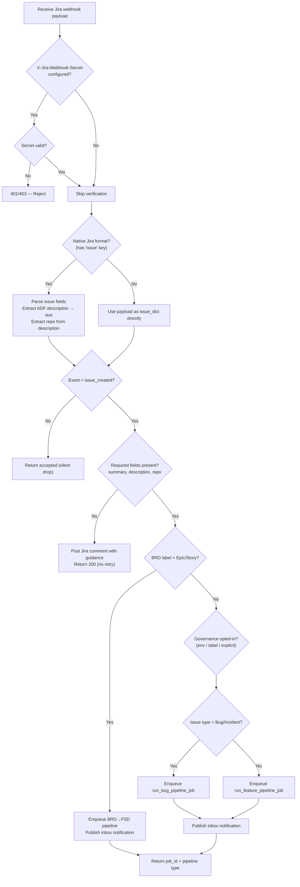
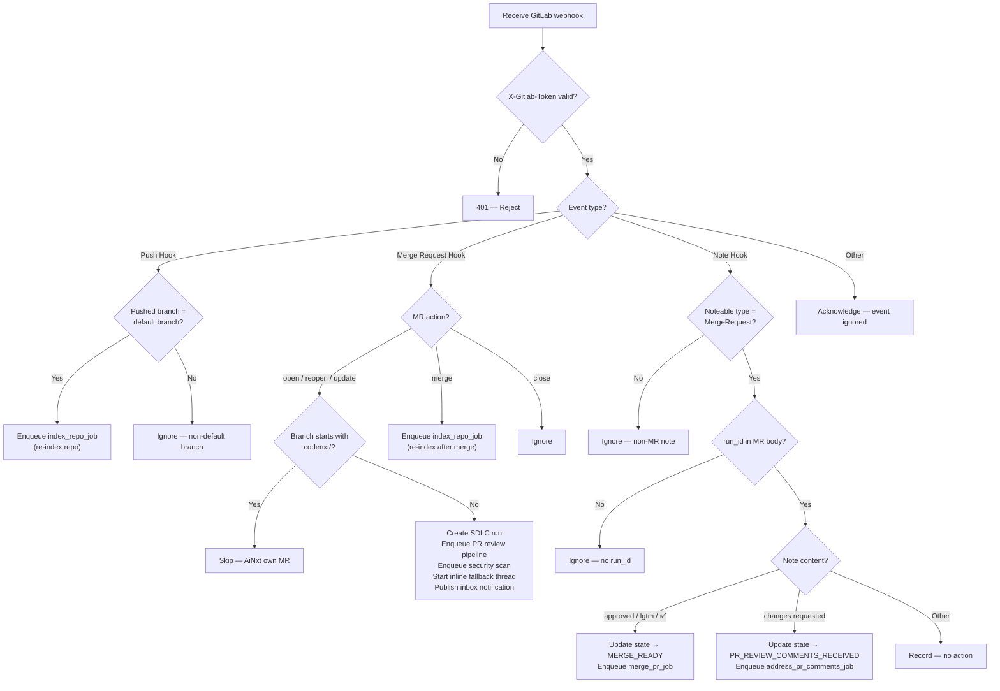
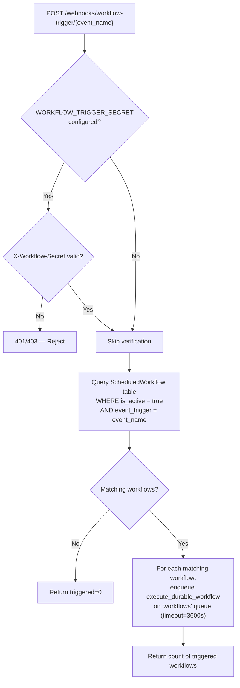
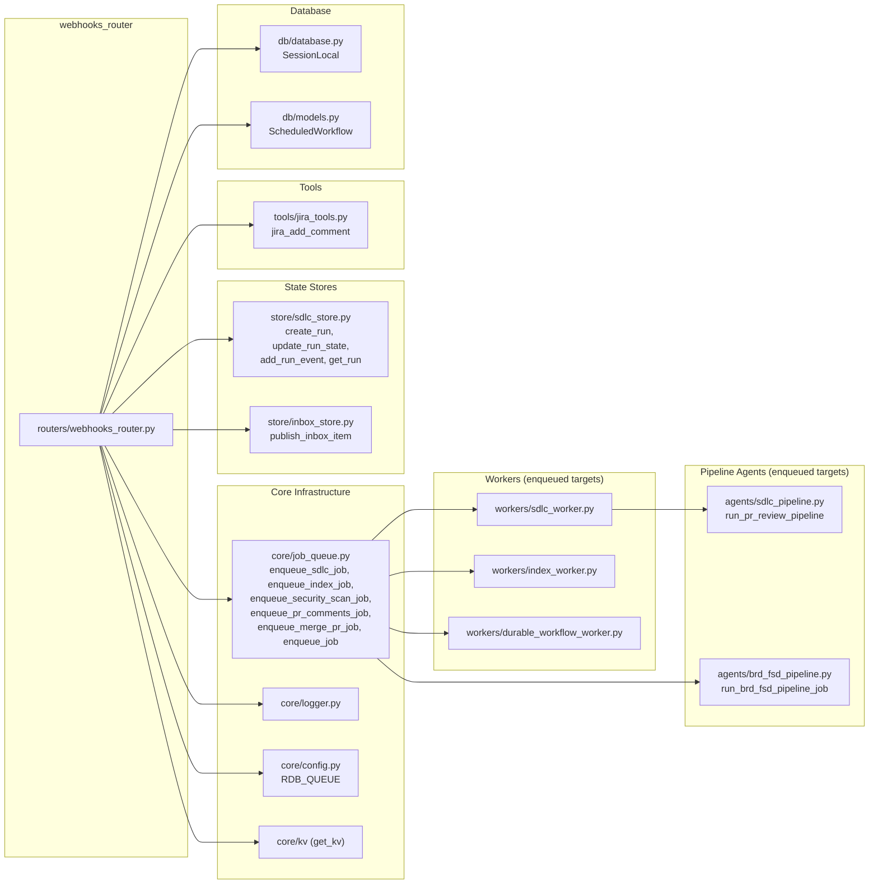
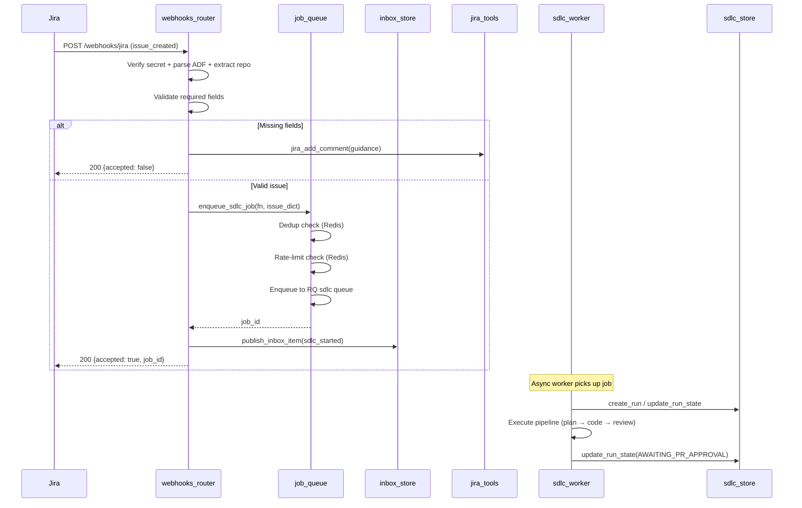
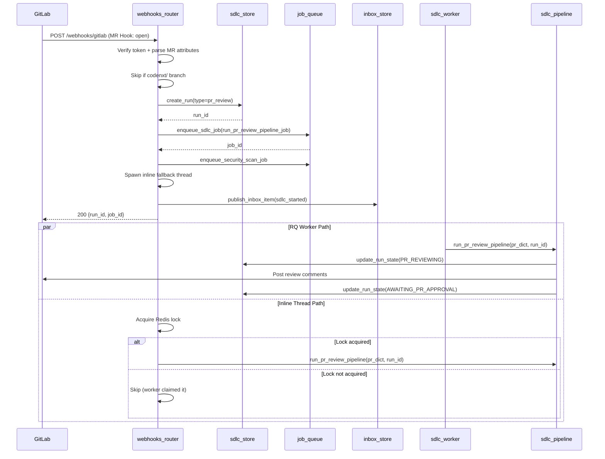
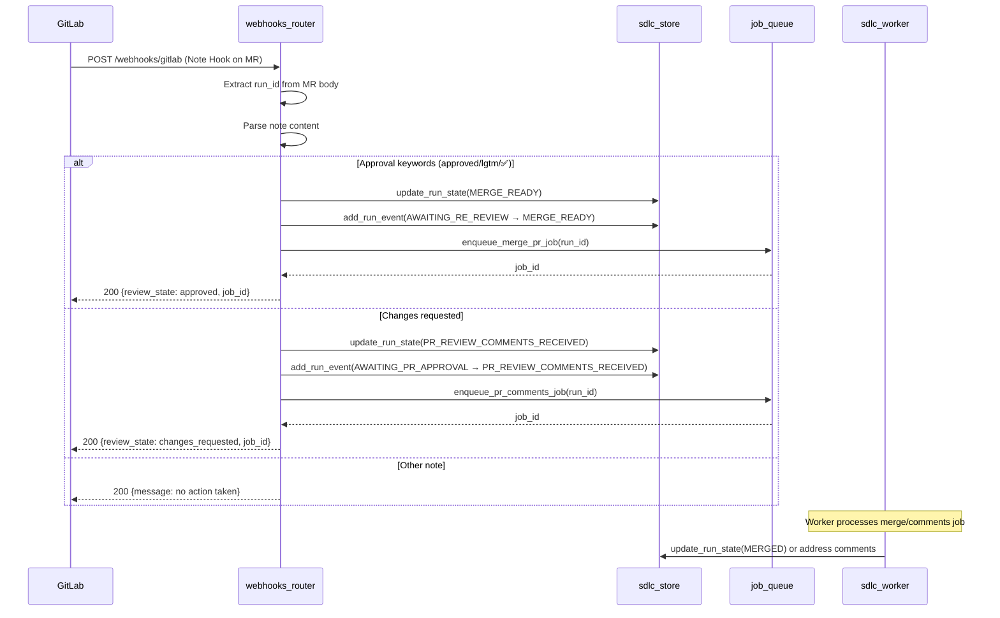

# Webhooks Router

## Overview

The **Webhooks Router** (`routers/webhooks_router.py`) is a FastAPI APIRouter module that serves as the system's inbound integration point for external DevOps platforms — **Jira** and **GitLab** — as well as a generic **event-driven workflow trigger** endpoint. It receives webhook payloads from these platforms, validates them, classifies the event, and dispatches the appropriate SDLC pipeline or indexing job onto the RQ (Redis Queue) job queue for asynchronous execution by background workers.

The router is mounted under the `/webhooks` prefix and tagged with `sdlc`. It acts as the bridge between external issue trackers / source-control systems and the platform's internal SDLC automation engine.

---

## Architecture

```mermaid
graph TB
    subgraph External["External Platforms"]
        JIRA["Jira<br/>(Issue Created/Updated)"]
        GL["GitLab<br/>(Push / MR / Note Hooks)"]
        EXT["External Systems<br/>(CI/CD, Monitoring)"]
    end

    subgraph WebhooksRouter["Webhooks Router (/webhooks)"]
        JW["jira_webhook<br/>POST /webhooks/jira"]
        GW["gitlab_webhook<br/>POST /webhooks/gitlab"]
        WT["trigger_workflow_by_event<br/>POST /webhooks/workflow-trigger/{event}"]
    end

    subgraph Security["Security Layer"]
        SEC1["JIRA_WEBHOOK_SECRET<br/>X-Jira-Webhook-Secret"]
        SEC2["GITLAB_WEBHOOK_SECRET<br/>X-Gitlab-Token"]
        SEC3["WORKFLOW_TRIGGER_SECRET<br/>X-Workflow-Secret"]
    end

    subgraph JobQueue["core/job_queue (RQ)"]
        EQ_SDLC["enqueue_sdlc_job"]
        EQ_IDX["enqueue_index_job"]
        EQ_SEC["enqueue_security_scan_job"]
        EQ_PR["enqueue_pr_comments_job"]
        EQ_MRG["enqueue_merge_pr_job"]
        EQ_WF["enqueue_job (workflows queue)"]
    end

    subgraph Workers["Background Workers"]
        W_BUG["run_bug_pipeline_job"]
        W_FEAT["run_feature_pipeline_job"]
        W_PR["run_pr_review_pipeline_job"]
        W_IDX["index_repo_job"]
        W_SEC["run_security_scan_job"]
        W_ADDR["address_pr_comments_job"]
        W_MRG["merge_pr_job"]
        W_BRD["run_brd_fsd_pipeline_job"]
        W_DWF["execute_durable_workflow"]
    end

    subgraph Store["State & Notification"]
        SDLC_STORE["sdlc_store<br/>create_run / update_run_state / add_run_event"]
        INBOX["inbox_store<br/>publish_inbox_item"]
    end

    JIRA -->|JSON payload| JW
    GL -->|JSON payload + headers| GW
    EXT -->|JSON payload + secret| WT

    JW --> SEC1
    GW --> SEC2
    WT --> SEC3

    JW -->|Bug/Incident| EQ_SDLC --> W_BUG
    JW -->|Story/Task| EQ_SDLC --> W_FEAT
    JW -->|BRD label| EQ_SDLC --> W_BRD
    JW --> INBOX
    JW -->|missing fields| JIRA

    GW -->|Push (default branch)| EQ_IDX --> W_IDX
    GW -->|MR opened/updated| EQ_SDLC --> W_PR
    GW -->|MR opened/updated| EQ_SEC --> W_SEC
    GW -->|MR merged| EQ_IDX --> W_IDX
    GW -->|Note: approved| EQ_MRG --> W_MRG
    GW -->|Note: changes requested| EQ_PR --> W_ADDR
    GW --> SDLC_STORE
    GW --> INBOX

    WT --> EQ_WF --> W_DWF

    W_PR --> SDLC_STORE
    W_MRG --> SDLC_STORE
    W_ADDR --> SDLC_STORE
```

---

## Core Components

### 1. `jira_webhook` — Jira Event Receiver

**Endpoint:** `POST /webhooks/jira`

Receives Jira issue lifecycle events (primarily `jira:issue_created`) and routes them to the appropriate SDLC pipeline based on issue type and labels.

#### Processing Flow



#### Key Behaviors

| Behavior | Detail |
|---|---|
| **Secret verification** | If `JIRA_WEBHOOK_SECRET` env var is set, validates `X-Jira-Webhook-Secret` header using `hmac.compare_digest`. Returns 401 if missing, 403 if invalid. |
| **ADF parsing** | Jira Cloud sends descriptions in Atlassian Document Format (nested JSON). The `_adf_to_text()` helper recursively extracts plain text so `repo:` extraction works regardless of format. |
| **Repo extraction** | The `_extract_repo()` function uses a regex to find `repo: namespace/project` patterns in the description, supporting both bare paths and full URLs. |
| **Event filtering** | Only `jira:issue_created` events trigger pipelines. All other events (updated, deleted, etc.) are silently accepted and dropped. |
| **Field validation** | Requires `summary`, `description`, and `repo`. Missing fields result in a Jira comment posted back to the ticket with guidance — returns HTTP 200 (not 4xx) to prevent Jira retries. |
| **BRD→FSD routing** | Issues with the `BRD` label and type Epic/Story/Task are routed to the BRD→FSD document generation pipeline via `agents.brd_fsd_pipeline.run_brd_fsd_pipeline_job`. |
| **Governance opt-in** | Governance review is triggered if `SDLC_GOVERNANCE_ON_WEBHOOK` env is truthy, the Jira ticket has a `governance` label, or the caller explicitly sets `run_governance_review` in the payload. |
| **Rate limiting** | The `enqueue_sdlc_job` function enforces per-reporter concurrent job limits (default 3). On rate-limit, a Jira comment is posted and HTTP 200 is returned. |
| **Deduplication** | `enqueue_sdlc_job` prevents duplicate pipelines for the same Jira key via a Redis-backed dedup slot with TTL. |

---

### 2. `gitlab_webhook` — GitLab Event Receiver

**Endpoint:** `POST /webhooks/gitlab`

Receives GitLab webhook events and dispatches indexing, PR review, merge, or comment-addressing jobs based on the event type and action.

#### Event Handling Matrix



#### Inline Fallback Thread

For MR review pipelines, the webhook handler employs a **dual-execution strategy** to minimize latency:

1. The job is enqueued to the RQ `sdlc` queue for normal worker processing.
2. A daemon thread is spawned that attempts to acquire a Redis lock (`pr_review:running:{run_id}`). If acquired (meaning no RQ worker has picked it up yet), the thread executes the PR review pipeline inline via `agents.sdlc_pipeline.run_pr_review_pipeline`.
3. If the RQ worker claims the lock first, the inline thread skips execution.

This ensures near-instant review feedback when workers are idle, while falling back to queue-based processing under load.

#### Run ID Extraction

The `_extract_run_id()` function parses HTML comments embedded in MR descriptions (`<!-- codenxt_run_id: {uuid} -->`) to correlate reviewer notes with the originating SDLC run. This allows approval/change-request notes to transition the correct run's state machine.

---

### 3. `JiraIssue` — Pydantic Data Model

```python
class JiraIssue(BaseModel):
    key:         str
    summary:     str
    description: Optional[str] = ""
    issue_type:  Optional[str] = "Story"    # Story | Bug | Task
    priority:    Optional[str] = "Medium"
    repo:        Optional[str] = ""         # linked repo name
    assignee:    Optional[str] = ""
```

A Pydantic model representing a Jira issue for the direct-POST path (when the payload is not in Jira's native webhook format). When Jira sends its native webhook format, the issue fields are extracted from the nested `issue.fields` structure and normalized into this shape before pipeline routing.

---

### 4. `trigger_workflow_by_event` — Event-Driven Workflow Trigger

**Endpoint:** `POST /webhooks/workflow-trigger/{event_name}`

A generic endpoint that external systems (CI/CD pipelines, monitoring tools, etc.) can call to fire all active `ScheduledWorkflow` records whose `event_trigger` field matches the provided `event_name`.

#### Processing Flow



This endpoint bridges external event sources with the platform's durable workflow execution engine, enabling event-driven automation without cron scheduling.

---

## Security Model

All three endpoints implement optional shared-secret verification using environment variables. When a secret is configured, the corresponding header is validated using `hmac.compare_digest` (constant-time comparison) to prevent timing attacks.

| Endpoint | Env Var | Header | Algorithm |
|---|---|---|---|
| `POST /webhooks/jira` | `JIRA_WEBHOOK_SECRET` | `X-Jira-Webhook-Secret` | String comparison |
| `POST /webhooks/gitlab` | `GITLAB_WEBHOOK_SECRET` | `X-Gitlab-Token` | String comparison |
| `POST /webhooks/workflow-trigger/{event}` | `WORKFLOW_TRIGGER_SECRET` | `X-Workflow-Secret` | String comparison |

When a secret env var is **not set** (empty string), verification is skipped — allowing open access in development environments. In production, all three secrets should be configured.

---

## Dependencies



### Key Dependency Modules

| Module | Role | Documentation |
|---|---|---|
| `core/job_queue.py` | RQ-based job enqueue with dedup, rate-limiting, and back-pressure guards | — |
| `store/sdlc_store.py` | SDLC run lifecycle management (create, state transitions, audit events) | — |
| `store/inbox_store.py` | User inbox notifications with SSE push | — |
| `tools/jira_tools.py` | Jira REST API client for posting comments | — |
| `workers/sdlc_worker.py` | SDLC pipeline worker jobs (bug, feature, PR review, merge, comments) | [sdlc_pipeline_workers](../sdlc/sdlc_pipeline_workers.md) |
| `workers/index_worker.py` | Codebase indexing worker | [document_knowledge_workers](../workers/document_knowledge_workers.md) |
| `workers/durable_workflow_worker.py` | Durable workflow execution with checkpoint/resume | [chat_agent_execution_workers](../workers/chat_agent_execution_workers.md) |
| `agents/sdlc_pipeline.py` | Core SDLC pipeline orchestration (PR review, bug, feature) | [shared_core_sdlc_pipeline](../sdlc/shared_core_sdlc_pipeline.md) |
| `agents/brd_fsd_pipeline.py` | BRD→FSD document generation pipeline | [sdlc_pipeline_agents](../sdlc/sdlc_pipeline_agents.md) |
| `db/models.py` | `ScheduledWorkflow` ORM model for event-driven workflows | [database](../storage/database.md) |

---

## Data Flow: Jira Issue → SDLC Pipeline



---

## Data Flow: GitLab MR → PR Review Pipeline



---

## Data Flow: GitLab Note → Merge / Address Comments



---

## Configuration

The router reads the following environment variables at import time:

| Variable | Default | Purpose |
|---|---|---|
| `JIRA_WEBHOOK_SECRET` | `""` (disabled) | Shared secret for Jira webhook verification |
| `GITLAB_WEBHOOK_SECRET` | `""` (disabled) | Shared secret for GitLab webhook verification |
| `WORKFLOW_TRIGGER_SECRET` | `""` (disabled) | Shared secret for event-driven workflow trigger |
| `SDLC_GOVERNANCE_ON_WEBHOOK` | `"false"` | Global toggle for governance review on Jira-triggered pipelines |
| `SDLC_USER_LIMIT` | `3` | Max concurrent SDLC jobs per reporter (enforced in `enqueue_sdlc_job`) |
| `SDLC_ACTIVE_TTL_SECS` | `28800` (8h) | TTL for dedup/rate-limit Redis keys |

### External Platform Configuration

**Jira:** Configure webhook at `https://your-platform/webhooks/jira` for *Issue Created* events. Add a `repo: namespace/project` line in the issue description. Use the `BRD` label for Epic/Story issues to trigger the BRD→FSD pipeline.

**GitLab:** Configure webhook at `https://your-platform/webhooks/gitlab` for *Push events*, *Merge request events*, and *Comments*. Set the secret token to match `GITLAB_WEBHOOK_SECRET`.

---

## Error Handling Strategy

The router follows a **fail-safe, no-retry** philosophy for webhook responses:

1. **Always return HTTP 200** for recognized events (even on validation failures) to prevent the external platform from retrying and creating duplicate pipelines.
2. **Post feedback to Jira** when required fields are missing or rate limits are hit, so the ticket creator knows what to fix.
3. **Non-blocking security scans** — if the security scan enqueue fails, the PR review pipeline still proceeds (the failure is logged as a warning).
4. **Inbox notifications are fire-and-forget** — wrapped in try/except so a notification failure never blocks the pipeline trigger.
5. **Inline thread failures are logged** but do not affect the RQ job — the RQ worker will independently attempt execution.

---

## Relationship to Other Modules

- **[sdlc_pipeline_workers](../sdlc/sdlc_pipeline_workers.md)**: The primary consumer of jobs enqueued by this router. All SDLC pipeline jobs (bug, feature, PR review, merge, address comments) are executed by `workers/sdlc_worker.py`.
- **[shared_core_sdlc_pipeline](../sdlc/shared_core_sdlc_pipeline.md)**: Contains the core pipeline orchestration logic (`agents/sdlc_pipeline.py`) that workers invoke. The inline fallback thread in `gitlab_webhook` calls `run_pr_review_pipeline` directly from this module.
- **[document_knowledge_workers](../workers/document_knowledge_workers.md)**: The `index_repo_job` worker that re-indexes repositories after push/merge events.
- **[chat_agent_execution_workers](../workers/chat_agent_execution_workers.md)**: The `execute_durable_workflow` worker that runs event-triggered workflows.
- **[sdlc_pipeline_agents](../sdlc/sdlc_pipeline_agents.md)**: The BRD→FSD pipeline agent invoked when Jira issues carry the `BRD` label.
- **[database](../storage/database.md)**: Provides the `ScheduledWorkflow` model queried by `trigger_workflow_by_event` and the `SDLCRun` model managed by `sdlc_store`.
- **[graph_webhooks_router](graph_webhooks_router.md)**: A sibling router handling Microsoft Graph (M365) webhook notifications, following the same pattern of receive → validate → dispatch.
- **[slack_router](slack_router.md)** / **[teams_router](teams_router.md)**: Other inbound integration routers that follow similar webhook-receiver patterns for Slack and Microsoft Teams respectively.
