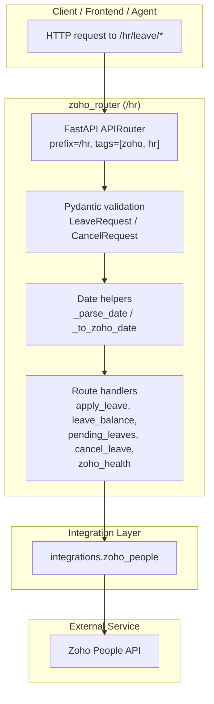
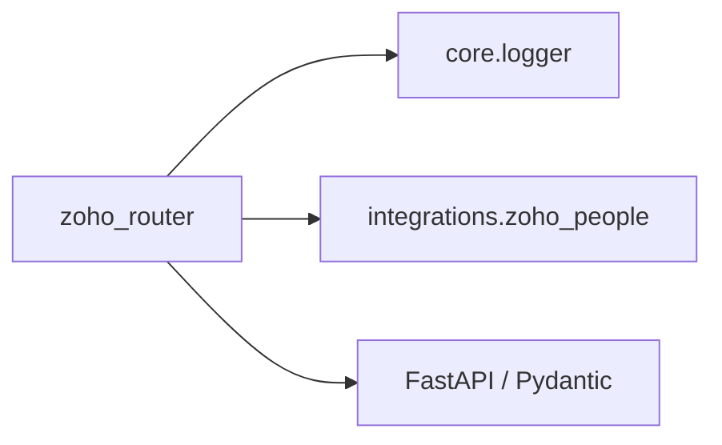
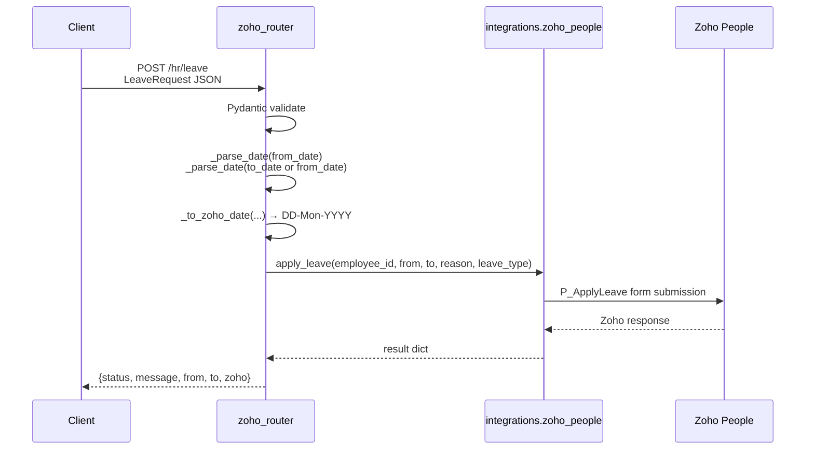
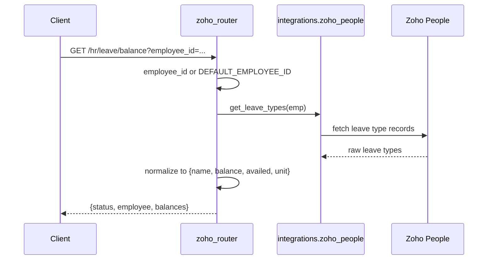
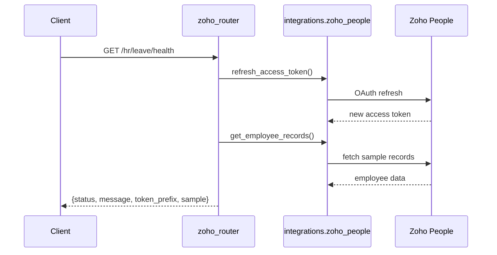
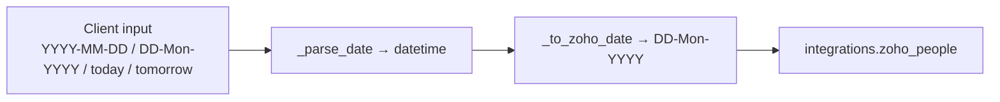

# Zoho Router

The **Zoho Router** exposes a small, focused FastAPI sub-router under `/hr` that proxies employee leave-management operations to the Zoho People API. It is part of the `shared_api_routers` layer and is responsible for translating REST requests into Zoho-specific date formats, field names, and form calls, then returning normalized responses to callers.

## Purpose

- Provide a backend bridge between the platform and Zoho People for common HR workflows.
- Support applying, cancelling, listing, and checking balances of employee leaves.
- Offer a health endpoint that verifies Zoho OAuth token freshness and API reachability.
- Keep Zoho-specific details (date formats, form names, token refresh) isolated from the rest of the application.

## Scope

This router intentionally covers only the leave-management surface of Zoho People. Broader Zoho integrations (recruitment, payroll, directory sync, etc.) are out of scope and should be added through the [connectors](../connectors/connectors.md) or [shared_integrations](../skills/shared_integrations.md) modules if they grow beyond simple leave workflows.

## Architecture



## Component Overview

| Component | Type | Responsibility |
|-----------|------|----------------|
| `router` | `APIRouter` | Defines the `/hr` prefix and groups endpoints under `zoho` / `hr` tags. |
| `LeaveRequest` | Pydantic model | Validates leave-application payloads: `employee_id`, `from_date`, optional `to_date`, `reason`, and `leave_type`. |
| `CancelRequest` | Pydantic model | Validates the optional cancellation reason. |
| `_parse_date` | helper | Parses ISO, `DD-Mon-YYYY`, `today`, and `tomorrow` into `datetime`. |
| `_to_zoho_date` | helper | Converts `datetime` to Zoho's `DD-Mon-YYYY` string format. |
| `apply_leave` | route | POST `/hr/leave` — applies leave via Zoho People. |
| `leave_balance` | route | GET `/hr/leave/balance` — returns leave balances for an employee. |
| `pending_leaves` | route | GET `/hr/leave/pending` — returns pending/recorded leave entries. |
| `cancel_leave` | route | POST `/hr/leave/cancel/{record_id}` — cancels a leave by Zoho record ID. |
| `zoho_health` | route | GET `/hr/leave/health` — refreshes token and fetches a sample employee record. |

## Dependencies



- **core.logger** — structured logging for errors and diagnostics.
- **[integrations.zoho_people](../skills/shared_integrations.md)** — the actual Zoho People API client that handles OAuth, token refresh, form submission, and record fetching. The router delegates all outbound calls to this module.
- **FastAPI / Pydantic** — request routing, validation, and HTTP exception handling.

## Data Flow

### Apply Leave



### Check Leave Balance



### Health Check



## Route Reference

### `POST /hr/leave`

Apply a new leave record in Zoho People.

**Request body (`LeaveRequest`)**

| Field | Type | Default | Description |
|-------|------|---------|-------------|
| `employee_id` | `str` | `"1"` | Zoho employee identifier. |
| `from_date` | `str` | required | Start date. Accepts `YYYY-MM-DD`, `DD-Mon-YYYY`, `today`, or `tomorrow`. |
| `to_date` | `Optional[str]` | `from_date` | End date (same formats). |
| `reason` | `str` | `"Personal"` | Reason text passed to Zoho. |
| `leave_type` | `str` | `"Casual Leave"` | Zoho leave type name. |

**Responses**

- `200 OK` — leave applied successfully.
- `400 Bad Request` — date parsing failed.
- `503 Service Unavailable` — Zoho returned a runtime error.
- `500 Internal Server Error` — unexpected failure.

### `GET /hr/leave/balance`

Return leave balances for the given employee.

**Query parameters**

| Parameter | Type | Default | Description |
|-----------|------|---------|-------------|
| `employee_id` | `str` | `DEFAULT_EMPLOYEE_ID` from integration | Employee to query. |

**Response shape**

```json
{
  "status": "success",
  "employee": "1",
  "balances": [
    {"name": "Casual Leave", "balance": "10", "availed": "2", "unit": "Days"}
  ]
}
```

### `GET /hr/leave/pending`

Return pending/recorded leave records for the given employee.

**Query parameters**

| Parameter | Type | Default | Description |
|-----------|------|---------|-------------|
| `employee_id` | `str` | `DEFAULT_EMPLOYEE_ID` | Employee to query. |

### `POST /hr/leave/cancel/{record_id}`

Cancel an existing leave record by its Zoho record ID.

**Path parameter**

| Parameter | Type | Description |
|-----------|------|-------------|
| `record_id` | `str` | Zoho record ID of the leave entry. |

**Request body (`CancelRequest`)**

| Field | Type | Default | Description |
|-------|------|---------|-------------|
| `reason` | `str` | `"Cancelled via AiNxt"` | Cancellation reason. |

### `GET /hr/leave/health`

Verify Zoho connectivity by forcing an OAuth token refresh and fetching a sample employee record.

**Response**

```json
{
  "status": "ok",
  "message": "Zoho token refreshed and valid",
  "token_prefix": "a1b2c3d4...",
  "sample": "{...first 200 chars of employee data...}"
}
```

## Error Handling

The router maps exceptions to HTTP status codes consistently:

| Exception | Status | Meaning |
|-----------|--------|---------|
| `ValueError` (date parsing) | `400` | Client supplied an invalid date format. |
| `RuntimeError` from Zoho integration | `503` | Zoho API or token issue. |
| Any other unexpected exception | `500` / `503` | Internal or downstream failure; logged via `core.logger`. |

## Date Handling

Zoho People expects dates in `DD-Mon-YYYY` format (e.g., `10-Mar-2026`). The router accepts more convenient inputs from clients and normalizes them before calling the integration layer.



## Integration with the Rest of the System

- The router is mounted as part of the shared API router collection. It does not implement authentication itself; it relies on the application's global auth middleware and dependencies (see [auth_router](../auth/auth_router.md) and auth/dependencies).
- All Zoho-specific business logic, OAuth handling, and retry behavior live in `integrations.zoho_people`, which is documented under [shared_integrations](../skills/shared_integrations.md).
- Errors are logged through core.logger for observability.

## Notes for Maintainers

- Keep this router thin. If new Zoho domains (payroll, recruitment, expenses) are needed, evaluate whether they belong in a dedicated connector under [shared_integrations](../skills/shared_integrations.md) rather than expanding this router.
- The health endpoint always refreshes the access token before checking API reachability; this intentionally catches expired cached tokens but adds latency to the health call.
- `DEFAULT_EMPLOYEE_ID` is defined in the integration layer, not the router, so behavior changes when that default is modified.
