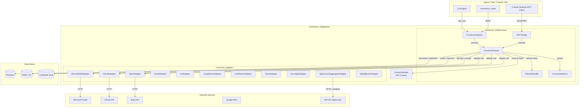
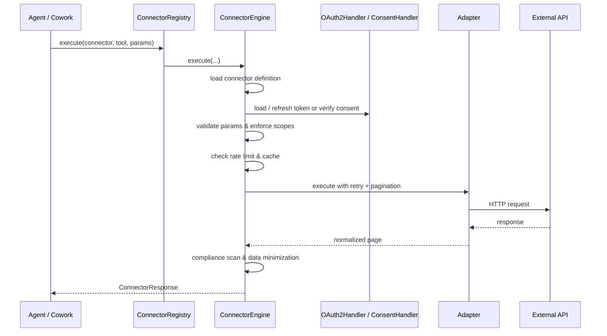

# connectors_integrations Module Overview

## Purpose

The `connectors_integrations` module is the platform's unified integration layer for external services. It provides a secure, observable, and compliant runtime for connecting agents and applications to third-party APIs — including SaaS tools (Microsoft 365, Google Workspace, Slack, Jira, GitLab, Confluence, Zoom, DocuSign), email/calendar services, and India-specific DPI consent-based data sources (Account Aggregator, DigiLocker).

The module separates **provider-specific adapter logic** from **shared connector infrastructure**, ensuring every external tool call follows the same guardrails: schema validation, OAuth/PAT/consent token management, rate limiting, caching, pagination, compliance scanning, and MCP tool registration.

## Architecture

### High-Level Component Diagram

### Execution Pipeline

## Core Components

| Sub-module | Key Components | Documentation |
|---|---|---|
| **connector_infrastructure** | `ConnectorEngine`, `ConnectorRegistry`, `OAuth2Handler`, `ConnectorMetrics`, `MCPBridge` | [connector_infrastructure_engine](connector_infrastructure_engine.md), [connector_infrastructure_registry](connector_infrastructure_registry.md), [connector_infrastructure_oauth2](connector_infrastructure_oauth2.md), [connector_infrastructure_metrics](connector_infrastructure_metrics.md), [connector_infrastructure_mcp_bridge](connector_infrastructure_mcp_bridge.md) |
| **connector_adapters** | `Microsoft365Adapter`, `GitLabAdapter`, `JiraAdapter`, `SlackAdapter`, `GmailAdapter`, `GoogleDriveAdapter`, `ConfluenceAdapter`, `ZoomAdapter`, `DocuSignAdapter`, `DpiAccountAggregatorAdapter`, `DpiDigilockerAdapter` | [connector_adapters](connector_adapters.md) |
| **dpi_consent** | `ConsentHandler` | Documented within [connector_infrastructure.md](connector_infrastructure.md) and the DPI Consent module docs |

## Integration Points

- **MCP System**: Connector tools are registered as `{connector}__{tool}` and exposed to agents via the MCP bridge.
- **Authentication**: Tokens are encrypted in the credential vault; OAuth flows use `OAuth2Handler`.
- **Compliance**: Connector outputs are scanned before being injected into LLM context.
- **Cowork Desktop**: The MCP bridge exposes user-scoped connector tools over SSE JSON-RPC.
- **Knowledge Base**: The bridge can query the platform knowledge base via the retrieval tool.