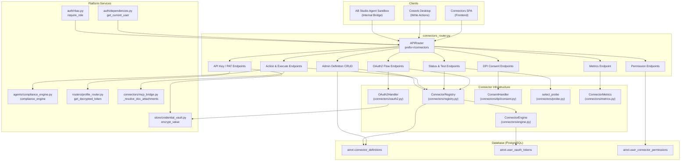
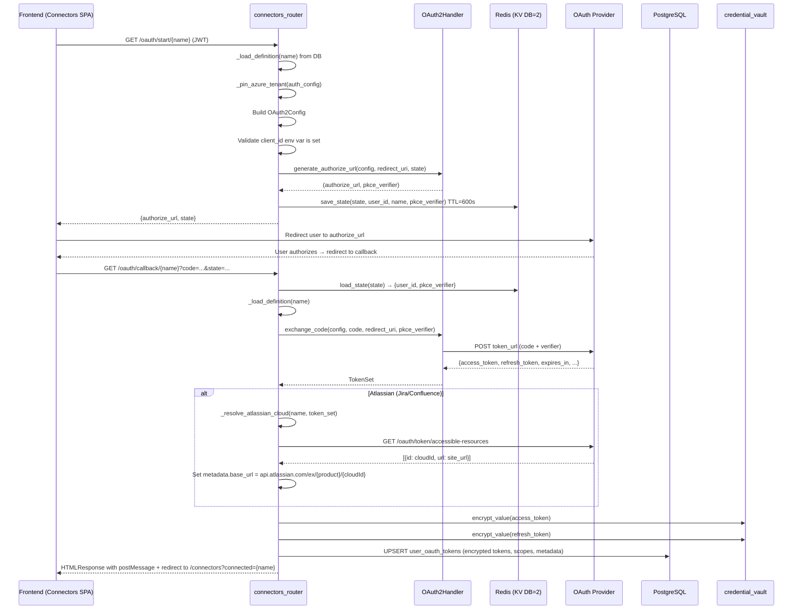
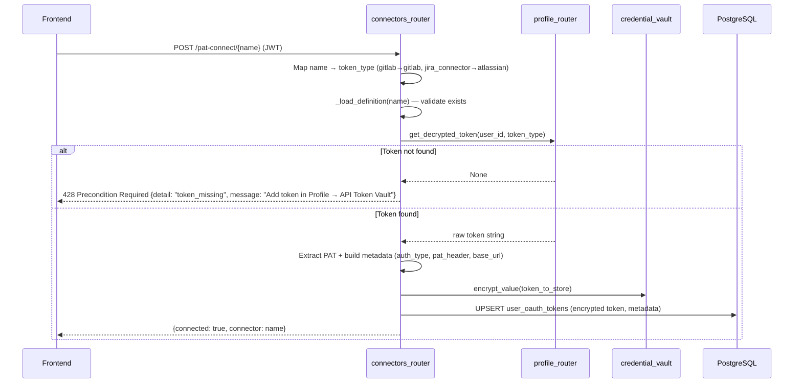
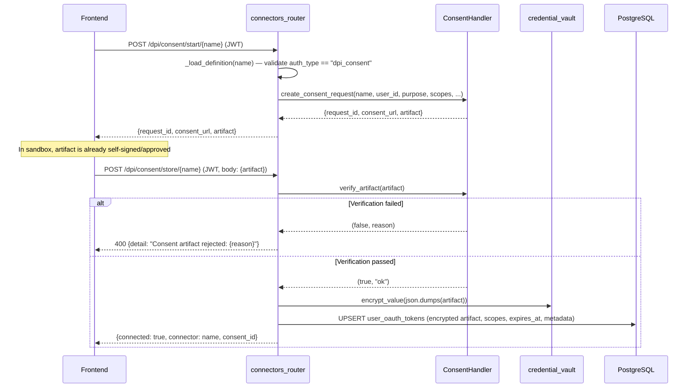
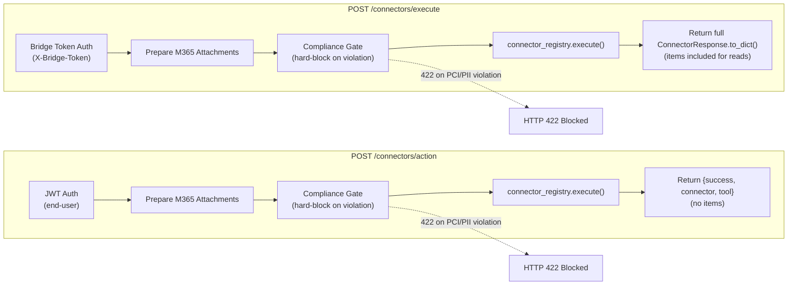
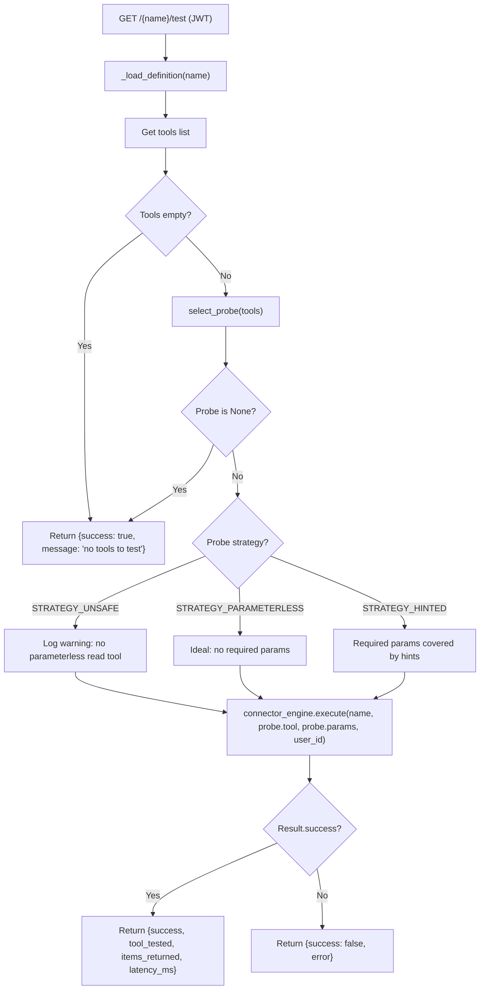
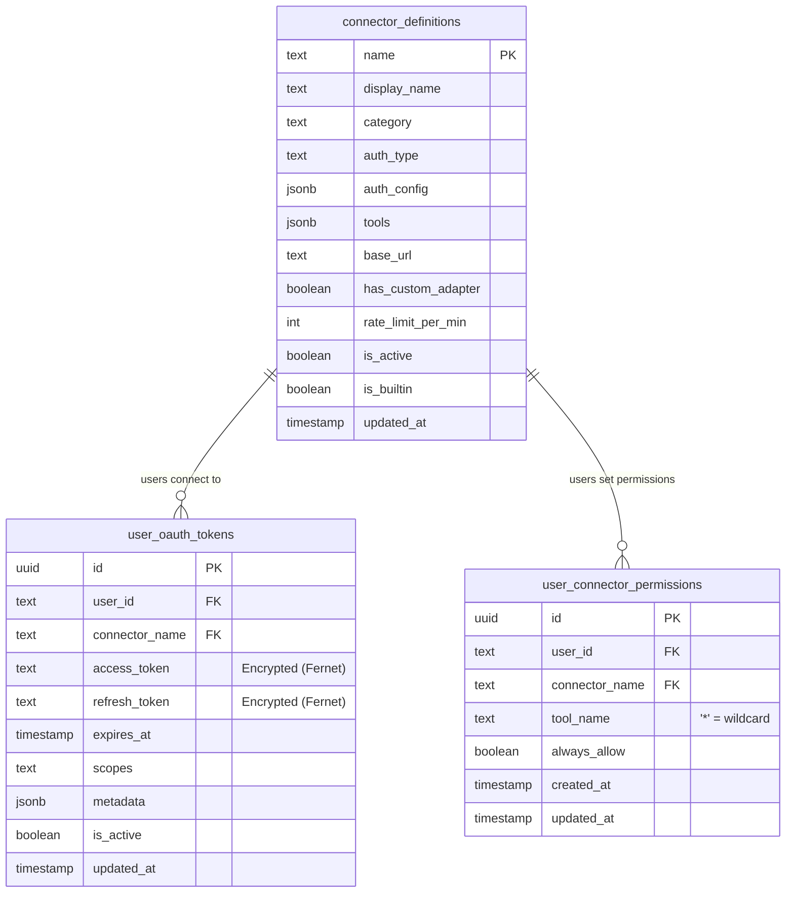
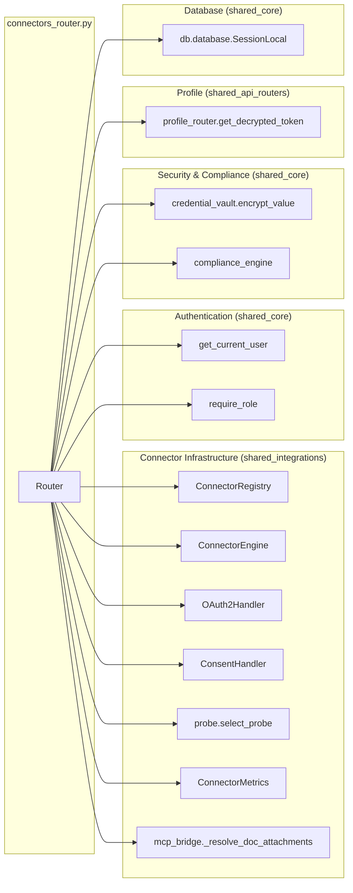
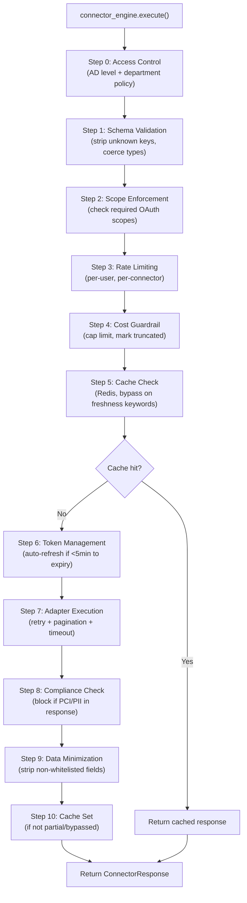

# Connectors Router

## Overview

The **Connectors Router** (`routers/connectors_router.py`) is the REST API layer for managing external third-party integrations (connectors) within the platform. It exposes endpoints for OAuth2 authorization flows, API-key/PAT-based authentication, DPI (Data Protection India) consent grants, connection lifecycle management, connector tool execution, user permission decisions, admin definition CRUD, and observability metrics.

The router acts as the **HTTP boundary** between frontend clients (the Connectors SPA, Cowork desktop, AB Studio agent sandbox) and the deeper connector infrastructure — the `ConnectorRegistry`, `ConnectorEngine`, `OAuth2Handler`, and `ConsentHandler`. It handles authentication, request validation, credential encryption, compliance gating, and structured error mapping, then delegates execution to the engine layer.

---

## Architecture

---

## Authentication & Authorization

The router uses two distinct authentication strategies depending on the caller:

| Strategy | Endpoints | Mechanism |
|---|---|---|
| **End-user JWT** | Most endpoints | `Depends(get_current_user)` — validates Bearer JWT or `auth_token` cookie via [auth_router](auth_router.md) |
| **Service bridge token** | `POST /execute`, `POST /status-for-user` | `X-Bridge-Token` header validated against `AZURE_AD_CLIENT_SECRET` using constant-time `secrets.compare_digest` |
| **Admin role** | Definition CRUD, metrics | `Depends(require_role("admin"))` via [auth_router](auth_router.md) RBAC |

### Bridge Token Design

The internal bridge endpoints (`/execute`, `/status-for-user`) are called by the **AB Studio agent tool sandbox**, which is not an end-user session. These endpoints:

- Authenticate with a shared secret (`AZURE_AD_CLIENT_SECRET`, reused as the bridge token)
- Accept an explicit `user_id` in the request body and execute against *that user's* OAuth connection
- **Must be bound to the internal network only** — they accept arbitrary user IDs and must never be exposed on public ingress
- Fail-closed when `AZURE_AD_CLIENT_SECRET` is unset/empty (endpoint disabled entirely)

> **Rotation caveat:** The bridge secret is the Azure AD client secret, rotated by Microsoft ~every 180 days. Both the platform host and the AB Studio host (`m365_tools.py`) must be redeployed simultaneously on rotation.

---

## Endpoint Reference

### Connection Discovery & Status

| Method | Path | Auth | Description |
|---|---|---|---|
| `GET` | `/connectors/available` | JWT | List all active connector definitions with tool counts |
| `GET` | `/connectors/status` | JWT | Connection status for all connectors for the current user |
| `POST` | `/connectors/status-for-user` | Bridge | Internal: check if a specific user is connected to a connector |

### OAuth2 Flow

| Method | Path | Auth | Description |
|---|---|---|---|
| `GET` | `/connectors/oauth/start/{name}` | JWT | Begin OAuth2 flow — returns `{authorize_url, state}` |
| `GET` | `/connectors/oauth/callback/{name}` | None | OAuth2 callback — exchanges code, stores tokens, redirects to UI |

### API Key & PAT Authentication

| Method | Path | Auth | Description |
|---|---|---|---|
| `POST` | `/connectors/api-key/{name}` | JWT | Store an API key/bearer token for a non-OAuth connector |
| `POST` | `/connectors/pat-connect/{name}` | JWT | Connect a PAT-based connector (GitLab, Jira) from profile vault |

### DPI Consent Flow

| Method | Path | Auth | Description |
|---|---|---|---|
| `POST` | `/connectors/dpi/consent/start/{name}` | JWT | Begin a DPI consent grant (sandbox returns self-signed artifact) |
| `POST` | `/connectors/dpi/consent/store/{name}` | JWT | Verify and persist an approved DPI consent artifact |

### Connection Management

| Method | Path | Auth | Description |
|---|---|---|---|
| `DELETE` | `/connectors/{name}` | JWT | Disconnect the current user from a connector |
| `GET` | `/connectors/{name}/test` | JWT | Make a lightweight test API call to verify connectivity |

### Tool Execution

| Method | Path | Auth | Description |
|---|---|---|---|
| `POST` | `/connectors/action` | JWT | Execute a connector tool — human-confirmed write path (Cowork) |
| `POST` | `/connectors/execute` | Bridge | Internal read-capable bridge for AB Studio agent tools |

### User Permissions

| Method | Path | Auth | Description |
|---|---|---|---|
| `GET` | `/connectors/permissions` | JWT | List the current user's connector permission decisions |
| `POST` | `/connectors/permissions` | JWT | Store a permission decision (`always_allow` / `deny`) |
| `DELETE` | `/connectors/permissions/{name}` | JWT | Revoke a permission decision (revert to `needs_prompt`) |

### Admin: Definition CRUD & Metrics

| Method | Path | Auth | Description |
|---|---|---|---|
| `POST` | `/connectors/definitions` | Admin | Create a new connector definition |
| `PUT` | `/connectors/definitions/{name}` | Admin | Update an existing connector definition |
| `DELETE` | `/connectors/definitions/{name}` | Admin | Deactivate a connector definition (cannot delete builtins) |
| `GET` | `/connectors/{name}/metrics` | Admin | Call stats, observability breakdown, and recent audit log |

---

## Core Workflows

### OAuth2 Authorization Flow

The OAuth2 flow supports PKCE (Proof Key for Code Exchange) and handles provider-specific quirks such as Atlassian cloud ID resolution and Azure AD tenant pinning.

#### Azure AD Tenant Pinning

The `_pin_azure_tenant()` helper rewrites Microsoft Entra authorization and token URLs from the multi-tenant `/common/` endpoint to a specific `/{tenant_id}/` endpoint when `AZURE_AD_TENANT_ID` is set. This is required for single-tenant app registrations (e.g., NPCI enterprise deployments). When the env var is unset, it is a no-op, preserving multi-tenant compatibility.

#### OAuth2 Callback Completion

The `_oauth_complete()` helper returns an `HTMLResponse` that:
1. Posts a structured `{type: "ainxt:connector-oauth", connector, success, error}` message to `window.opener` (for popup-based flows)
2. Falls back to a `window.location.replace()` redirect to `/connectors?connected={name}` (or `?error=...`)
3. Includes a `<meta http-equiv="refresh">` as a final fallback after 3 seconds

### PAT-Based Connection Flow

PAT (Personal Access Token) connectors (GitLab, Jira) use tokens stored in the user's Profile API Token Vault rather than OAuth2.

### DPI Consent Flow

DPI (Data Protection India) connectors use a consent-based model (Account Aggregator / DEPA) rather than OAuth2 or API keys.

### Tool Execution Paths

The router exposes two distinct execution paths with different authentication, compliance, and response semantics:

#### Compliance Gate

The `_compliance_gate_outgoing()` function is shared by both execution paths. It:

1. Concatenates free-text params (`body`, `message`, `subject`, `content`, `text`)
2. Runs `compliance_engine.validate_input()` on the combined text
3. **Hard-blocks** (HTTP 422) on any finding — unlike chat (which redacts), outbound emails/messages must never leak PANs/PII
4. Fails-open only on infrastructure errors (compliance checker itself fails), never on an actual finding

#### M365 Attachment Resolution

The `_prepare_m365_action_attachments()` helper resolves document attachments for Microsoft 365 write tools (`outlook_send_mail`, `outlook_create_draft`, `teams_send_message`, `teams_send_chat_message`). It:

- Accepts multiple attachment reference formats: `attachment_job_id`, `attachment_job_ids`, `attachment_artifact_id`, `attachment_file_path`, `attachment_id`
- Delegates to `connectors/mcp_bridge.py::_resolve_doc_attachments()` for resolution
- Returns HTTP 409 if a document is still being generated (pending)
- Returns HTTP 400 if attachment resolution fails
- Returns HTTP 502 if Teams OneDrive upload fails

#### Error Code Mapping (Internal Bridge)

The `/execute` endpoint maps connector errors to stable codes at HTTP 200 (so the sandbox tool can relay guidance to the LLM without crashing on 4xx/5xx):

| Error Pattern | Code | Description |
|---|---|---|
| `REAUTH_REQUIRED` | `REAUTH_REQUIRED` | Token expired/revoked — user must reconnect |
| `ACCESS_DENIED` / `not connected` | `ACCESS_DENIED` | User lacks access or connector not connected |
| `scope` | `SCOPE_DENIED` | Token lacks required OAuth scopes |
| Other | `ERROR` | Generic connector failure |

### Connection Test Flow

The probe selection (via `connectors/probe.py::select_probe`) uses a capability-based strategy rather than blindly calling `tools[0]`:

1. **STRATEGY_PARAMETERLESS** — First non-write tool with no required params (ideal)
2. **STRATEGY_HINTED** — First tool whose required params are fully covered by `PROBE_PARAM_HINTS`
3. **STRATEGY_UNSAFE** — Falls back to `tools[0]` with whatever hints exist (preserves historical behavior, labeled for diagnosis)

---

## Request/Response Models

### `ApiKeyRequest`
Stores an API key or bearer token for a non-OAuth connector.

| Field | Type | Required | Description |
|---|---|---|---|
| `api_key` | `str` | Yes | The API key or bearer token |
| `workspace_name` | `str?` | No | Workspace display name |
| `email` | `str?` | No | Associated email for display |

### `DpiConsentStartRequest`
Initiates a DPI consent grant.

| Field | Type | Required | Default | Description |
|---|---|---|---|---|
| `purpose` | `str?` | No | `null` | Consent purpose (falls back to definition default) |
| `scopes` | `list[str]?` | No | `null` | Requested data scopes |
| `data_range_days` | `int?` | No | `null` | Historical data range (falls back to 180) |
| `valid_days` | `int` | No | `30` | Consent validity period in days |

### `DpiConsentStoreRequest`
Persists an approved DPI consent artifact.

| Field | Type | Required | Description |
|---|---|---|---|
| `artifact` | `dict` | Yes | The signed consent artifact from the issuer |

### `ConnectorDefinitionCreate`
Creates or updates a connector definition (admin only).

| Field | Type | Required | Default | Description |
|---|---|---|---|---|
| `name` | `str` | Yes | — | Unique connector identifier |
| `display_name` | `str` | Yes | — | Human-readable name |
| `description` | `str?` | No | `""` | Connector description |
| `icon_url` | `str?` | No | `""` | Icon URL |
| `category` | `str` | No | `"custom"` | Category tag |
| `auth_type` | `str` | No | `"oauth2"` | `oauth2`, `api_key`, `pat`, or `dpi_consent` |
| `auth_config` | `dict` | No | `{}` | OAuth2 config (authorize_url, token_url, client_id_env, etc.) |
| `tools` | `list` | No | `[]` | Tool definitions (name, method, path, input_schema, etc.) |
| `base_url` | `str` | No | `""` | API base URL |
| `has_custom_adapter` | `bool` | No | `False` | Whether a custom adapter module exists |
| `rate_limit_per_min` | `int` | No | `100` | Per-user rate limit |

### `ConnectorActionRequest`
Executes a connector tool via the user-confirmed write path.

| Field | Type | Required | Default | Description |
|---|---|---|---|---|
| `connector` | `str` | Yes | — | Connector name |
| `tool` | `str` | Yes | — | Tool name |
| `params` | `dict` | No | `{}` | Tool parameters |

### `ConnectorExecuteRequest`
Executes a connector tool via the internal bridge (AB Studio).

| Field | Type | Required | Description |
|---|---|---|---|
| `connector` | `str` | Yes | Connector name |
| `tool` | `str` | Yes | Tool name |
| `params` | `dict` | No | Tool parameters |
| `user_id` | `str` | Yes | Target user ID (whose OAuth connection to use) |

### `ConnectorStatusForUserRequest`
Checks connection status for a specific user (internal bridge).

| Field | Type | Required | Default | Description |
|---|---|---|---|---|
| `user_id` | `str` | Yes | — | User ID to check |
| `connector` | `str` | No | `"microsoft_365"` | Connector name |

### `ConnectorPermissionRequest`
Stores or updates a user's permission decision for a connector tool.

| Field | Type | Required | Default | Description |
|---|---|---|---|---|
| `connector` | `str` | Yes | — | Connector name |
| `tool` | `str` | No | `"*"` | Tool name (`*` = all tools for this connector) |
| `always_allow` | `bool` | No | `True` | Whether to always allow without prompting |

---

## Database Schema

The router interacts with three PostgreSQL tables in the `ainxt` schema:

### Credential Encryption

All tokens (OAuth access/refresh, API keys, PATs, DPI consent artifacts) are encrypted at rest using **Fernet symmetric encryption** (AES-128-CBC + HMAC-SHA256) via `store/credential_vault.py::encrypt_value()`. The encryption key (`FERNET_KEY`) must be identical across the gateway and all worker hosts — a mismatch causes decryption failures that surface as `ConnectorNotConnectedError` with a specific vault-key-mismatch message.

---

## Dependencies

### Key Dependencies

| Dependency | Module | Purpose |
|---|---|---|
| `ConnectorRegistry` | [shared_integrations](shared_integrations.md) | Singleton registry for connector definitions, user status, and execution delegation |
| `ConnectorEngine` | [shared_integrations](shared_integrations.md) | Execution engine with schema validation, caching, rate limiting, compliance, pagination |
| `OAuth2Handler` | [shared_integrations](shared_integrations.md) | OAuth2 lifecycle: PKCE, authorize URL, code exchange, token refresh, state management |
| `ConsentHandler` | [shared_integrations](shared_integrations.md) | DPI consent artifact creation, signing (sandbox), and verification |
| `select_probe` | [shared_integrations](shared_integrations.md) | Capability-based probe selection for connection testing |
| `ConnectorMetrics` | [shared_integrations](shared_integrations.md) | Redis-backed observability: call stats, top queries, audit log |
| `get_current_user` | [auth_router](auth_router.md) | JWT/API-key/cookie authentication |
| `require_role` | [auth_router](auth_router.md) | RBAC role enforcement |
| `encrypt_value` | [shared_core](shared_core.md) | Fernet encryption for stored credentials |
| `compliance_engine` | [shared_core](shared_core.md) | PCI/PII compliance scanning for outgoing messages |
| `get_decrypted_token` | [profile_router](profile_router.md) | Profile vault token retrieval for PAT connectors |
| `_resolve_doc_attachments` | [shared_integrations](shared_integrations.md) | Document attachment resolution for M365 write tools |

---

## Environment Variables

| Variable | Purpose | Default |
|---|---|---|
| `AZURE_AD_TENANT_ID` | Pin Microsoft Entra to a specific tenant (single-tenant apps) | unset (multi-tenant `/common/`) |
| `AZURE_AD_CLIENT_SECRET` | Azure AD client secret — reused as the internal bridge token | unset (bridge disabled) |
| `CONNECTOR_OAUTH_REDIRECT_BASE` | Base URL for OAuth2 callback redirects | — |
| `GITLAB_URL` | GitLab instance URL for PAT connectors | `https://gitlab.com` |
| `JIRA_URL` | Jira instance URL for PAT connectors | — |
| `DPI_SANDBOX` | Enable DPI sandbox mode (self-signed consent artifacts) | unset |
| `FERNET_KEY` | Encryption key for credential vault (must match across all hosts) | — |

---

## Integration with System Components

### Frontend (Connectors SPA)

The `ai-ui` frontend `Connectors.jsx` component consumes the `/available`, `/status`, `/oauth/start`, `/api-key`, `/pat-connect`, `/{name}/test`, and `DELETE /{name}` endpoints. OAuth callbacks redirect to `/connectors?connected={name}` or `/connectors?error=...&connector={name}`.

### Cowork Desktop (Write Actions)

Cowork's human-confirmed send path (email, Teams messages) uses `POST /connectors/action` with JWT authentication. The orchestrator never auto-plans writes — they only reach this endpoint after the user clicks Send on a draft. Outgoing text is compliance-scanned and hard-blocked on violation.

### AB Studio Agent Sandbox (Internal Bridge)

AB Studio agent tools use `POST /connectors/execute` with bridge token authentication. This path:
- Returns full `ConnectorResponse.to_dict()` (items included) for reads
- Returns `{success: True}` ack for writes
- Maps errors to structured `{success: false, error, code}` at HTTP 200
- Uses `POST /connectors/status-for-user` to gate connector-backed tool visibility in `/tools-catalog`

### Connector Engine Pipeline

When the router delegates to `connector_registry.execute()`, the `ConnectorEngine` runs a multi-step pipeline:

### MCP Tool Registration

The `ConnectorRegistry` registers connector tools into the MCP `ToolRegistry` with naming convention `{connector}__{tool}` (e.g., `microsoft_365__outlook_search_emails`). This makes connector tools available to LLM tool-use calling. See [mcp_system](shared_core.md) for details on the MCP infrastructure.

### Permission System Integration

The `user_connector_permissions` table is consumed by:
- **The orchestrator** — gates connector tool calls before execution (checks `always_allow` / `denied` / `needs_prompt`)
- **The scheduled task worker** — bypasses per-task action allowlist when `always_allow=TRUE`
- **The ConnectorEngine** — `_check_user_permission()` method queries the table to determine the user's decision

---

## Error Handling

The router maps connector infrastructure errors to appropriate HTTP responses:

| Scenario | HTTP Status | Response |
|---|---|---|
| Connector not found | 404 | `{detail: "Connector 'name' not found"}` |
| OAuth client_id not configured | 400 | `{detail: "Connector 'name' is not configured: {ENV_VAR} is not set"}` |
| OAuth flow failure | 500 | `{detail: "Failed to start OAuth flow: {error}"}` |
| PAT token missing | 428 | `{detail: "token_missing", message: "Add token in Profile → API Token Vault"}` |
| Compliance violation (action) | 422 | `{detail: "Blocked by compliance policy: {types}"}` |
| Compliance violation (execute) | 422 | Propagated as HTTP 422 |
| Attachment pending | 409 | `{detail: "Document still being generated. Wait and retry."}` |
| Attachment resolution failed | 400 | `{detail: "Attachment could not be resolved..."}` |
| Teams upload failed | 502 | `{detail: "OneDrive upload failed for: {files}"}` |
| Reauth required (action) | 401 | `{detail: "{connector} needs reconnection"}` |
| Connector action failed (action) | 502 | `{detail: "{error}"}` |
| Bridge token invalid | 401 | `{detail: "Invalid or missing bridge token"}` |
| Cannot delete builtin connector | 400 | `{detail: "Cannot delete built-in connectors"}` |
| Internal error | 500 | `{detail: "{error}"}` |

The `/execute` endpoint is an exception — it returns HTTP 200 with `{success: false, error, code}` for connector-level failures so the AB Studio sandbox can relay guidance to the LLM without crashing on 4xx/5xx responses.
