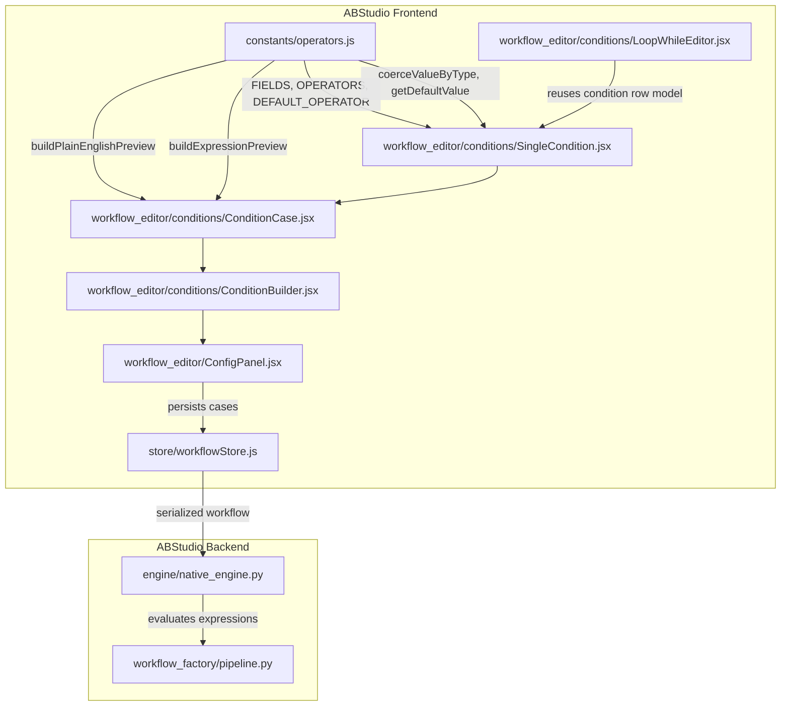
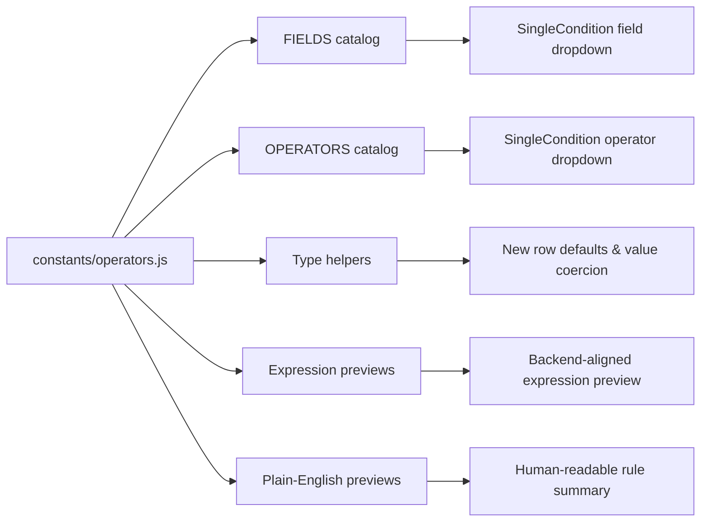
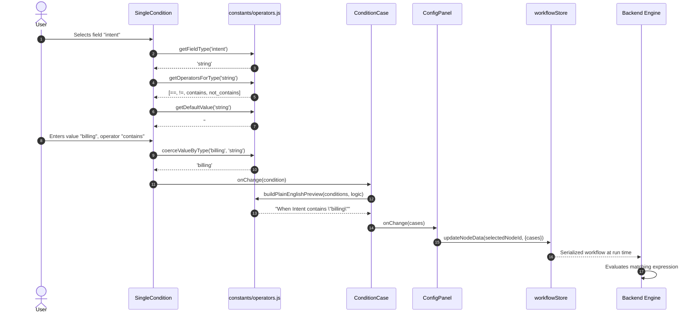
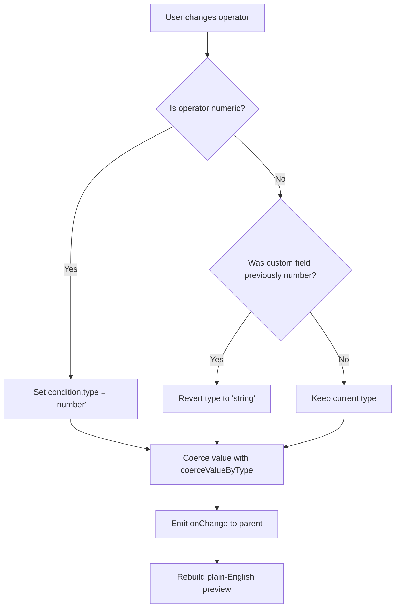

# Constants Module

## Brief Introduction

The `constants` module is a small, shared frontend utility in **ABStudio** that centralizes the definitions and helper logic used by the visual condition builder. It lives at `ABStudio/frontend/src/constants/operators.js` and provides the canonical field catalog, operator catalogs, type coercion rules, and human-readable expression previews that power condition nodes and loop-while editors in the workflow canvas.

By keeping these rules in one place, the module guarantees that:

- The same set of fields and operators is offered everywhere a user builds a rule.
- The preview shown in the UI matches the expression the backend execution engine will evaluate.
- Type coercion at form-fill time is consistent with the defaults assigned to new condition rows.

---

## Module Purpose and Core Functionality

### 1. Field and Operator Catalogs

The module exports two primary data structures that drive the condition builder UI:

- **`FIELDS`** — A preset list of commonly checked fields (`intent`, `category`, `sentiment`, `score`, `amount`, etc.). Each entry carries an explicit `type` (`string`, `number`, or `boolean`).
- **`OPERATORS`** — Operator choices grouped by type. For example, string fields offer `==`, `!=`, `contains`, and `not_contains`, while number fields offer numeric comparisons such as `>`, `>=`, `<`, and `<=`.

These catalogs are consumed by [`SingleCondition`](workflow_editor_conditions_cases.md) to decide which operators to render and by [`ConditionCase`](workflow_editor_conditions_cases.md) to generate the plain-English preview.

### 2. Type-Aware Helpers

| Function | Responsibility |
|----------|----------------|
| `getFieldType(fieldValue)` | Looks up a preset field and returns its declared type, defaulting to `string`. |
| `getOperatorsForType(type)` | Returns the operator list for a given type. |
| `getDefaultValue(type)` | Returns the default value for a new condition row (`0` for number, `true` for boolean, `''` for string). |
| `coerceValueByType(raw, type)` | Converts a raw form value into the canonical JavaScript shape for its declared type. |

`coerceValueByType` is intentionally kept next to `getDefaultValue` so the string→number/boolean rules used when a user fills a form stay in sync with the defaults assigned when a row is created.

### 3. Expression Previews

The module produces two complementary previews for a set of conditions:

- **`buildExpressionPreview(condition)`** — Generates a backend-aligned expression such as `'billing' in input.intent` or `input.score >= 0.8`. The comment in the source explicitly warns that this must stay in sync with the backend expression builder.
- **`buildCombinedExpressionPreview(conditions, logic)`** — Joins multiple single previews with `and` or `or` based on the case logic.
- **`buildPlainEnglishCondition(condition)`** and **`buildPlainEnglishPreview(conditions, logic)`** — Produce a non-engineer-friendly summary such as `When Intent contains "billing" and Priority is "high"`. This is the text surfaced in the configuration panel.

### 4. Default Operator Constant

`DEFAULT_OPERATOR` (`==`) is used by [`SingleCondition`](workflow_editor_conditions_cases.md) when a field change invalidates the previously selected operator.

---

## Architecture and Component Relationships

### Module Position

### Dependency Diagram

### Data Flow: Building a Condition

### Process Flow: Type Inference on Operator Change

---

## How the Module Fits into the Overall System

The `constants` module is a cross-cutting frontend dependency. It does not contain business logic for executing workflows; instead, it supplies the vocabulary and formatting rules that keep the visual rule editor consistent with the backend evaluator.

### Integration Points

| Consumer | What it uses | Why |
|----------|--------------|-----|
| [`SingleCondition`](workflow_editor_conditions_cases.md) | `FIELDS`, `OPERATORS`, `DEFAULT_OPERATOR`, `getFieldType`, `getOperatorsForType`, `getDefaultValue` | Renders the field/operator/value inputs and infers types when the user switches fields or operators. |
| [`ConditionCase`](workflow_editor_conditions_cases.md) | `buildPlainEnglishPreview`, `buildPlainEnglishCondition` | Shows the "In plain English" summary below each case. |
| [`LoopWhileEditor`](workflow_editor_conditions_loop.md) | Condition row model and helpers | Reuses the same condition semantics for loop continuation rules. |
| [`ConfigPanel`](workflow_editor.md) | `ConditionBuilder` output | Persists condition cases into the selected workflow node. |
| [`workflowStore`](store.md) | Node data | Stores the cases array as part of the condition node's data. |
| Backend execution engine | Equivalent expression builder | Evaluates the serialized conditions at run time. |

### Design Principles

1. **Single source of truth for rule vocabulary** — All condition-related UI components read from `FIELDS` and `OPERATORS` rather than duplicating lists.
2. **Frontend/backend parity** — The expression preview format is intentionally aligned with the backend expression builder so users see exactly what will be evaluated.
3. **Progressive disclosure** — Preset fields are type-restricted, while custom free-text fields allow any operator and infer type from the chosen operator.
4. **Human-readable summaries** — `buildPlainEnglishPreview` bridges the gap between raw expressions and non-technical users.

### Limitations and Scope

- The module is purely presentational and formatting-oriented; it does not execute conditions or validate them against real input data.
- Field presets are static. Dynamic fields from upstream nodes are handled as custom free-text fields.
- The backend expression builder is the authoritative evaluator; any change to operator semantics must be mirrored in both places.

---

## References

- [`workflow_editor_conditions_cases`](workflow_editor_conditions_cases.md) — Components that render individual conditions and cases.
- [`workflow_editor_conditions_loop`](workflow_editor_conditions_loop.md) — Loop-while editor that reuses the same condition model.
- [`workflow_editor`](workflow_editor.md) — Canvas configuration panel that hosts the condition builder.
- [`store`](store.md) — Workflow state management that persists condition node data.
- [`engine_native_engine`](engine_native_engine.md) — Backend engine that evaluates the serialized conditions at run time.
