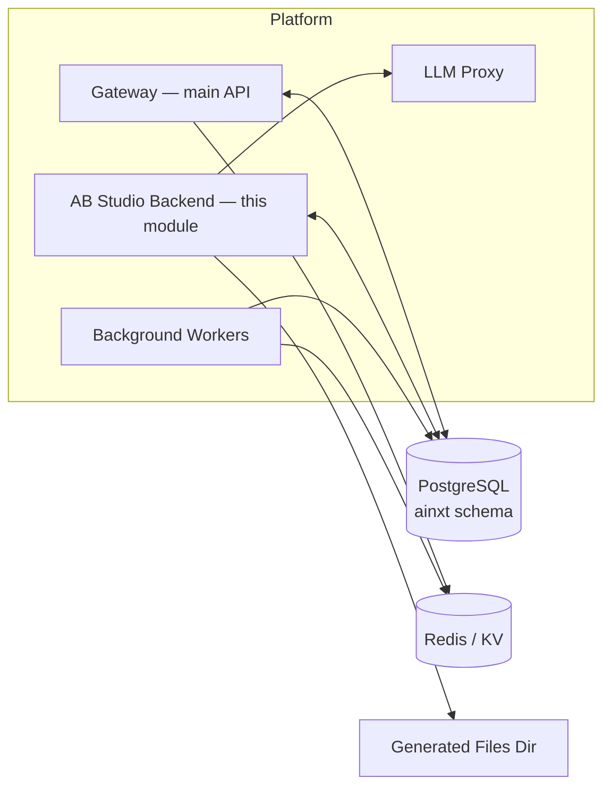
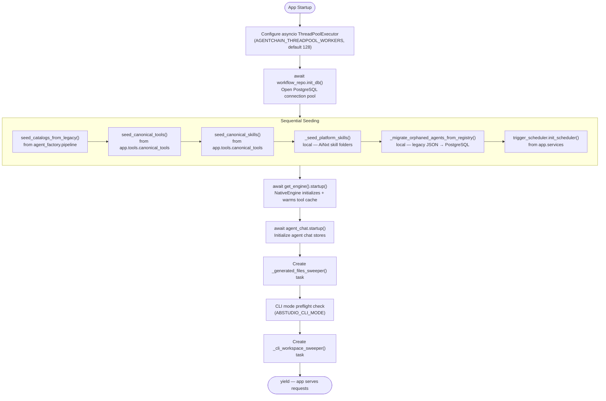
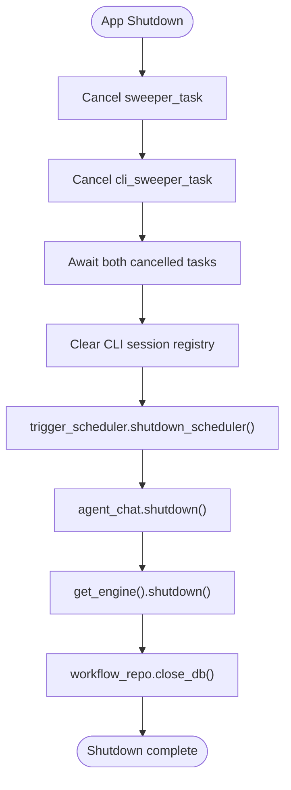
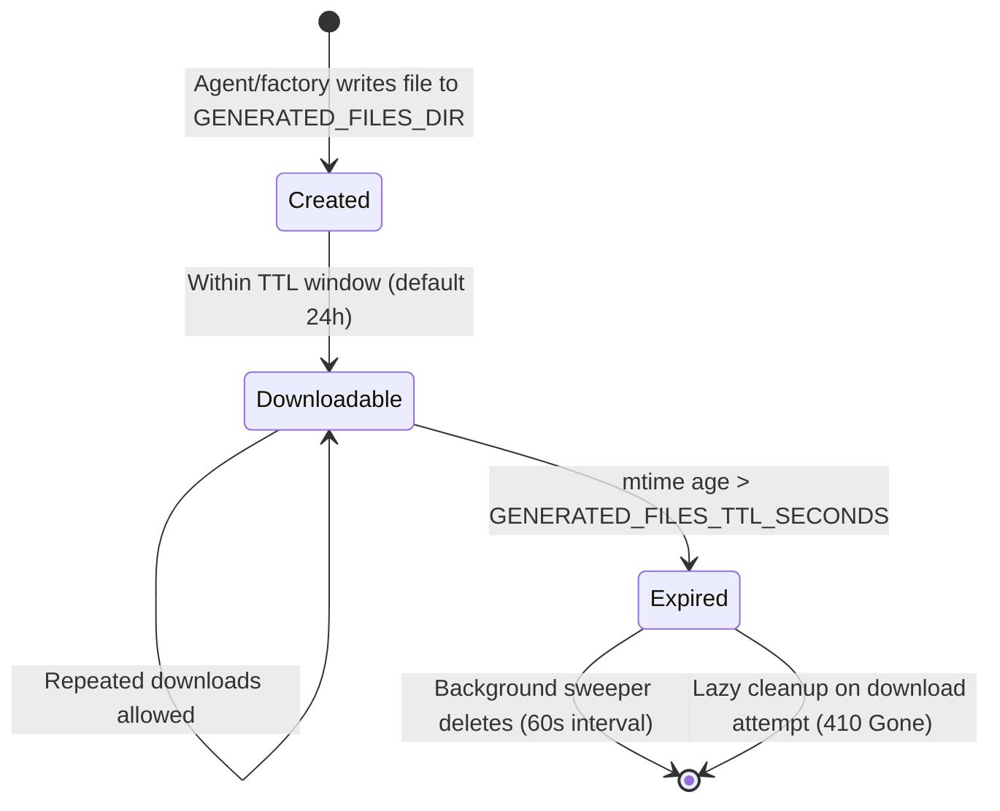
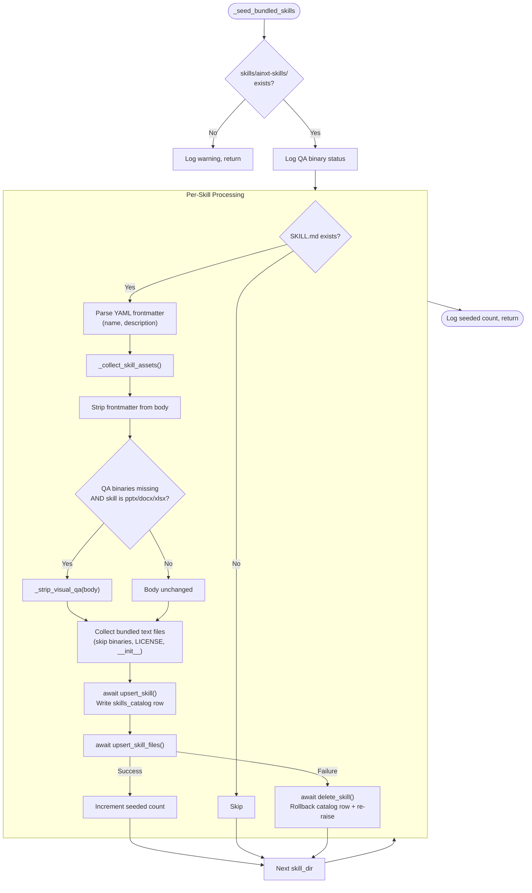
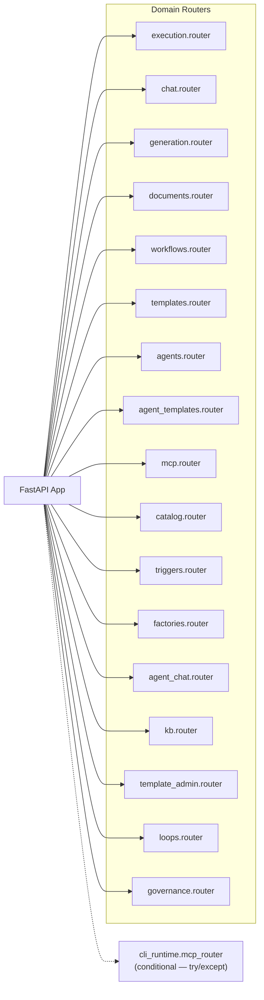
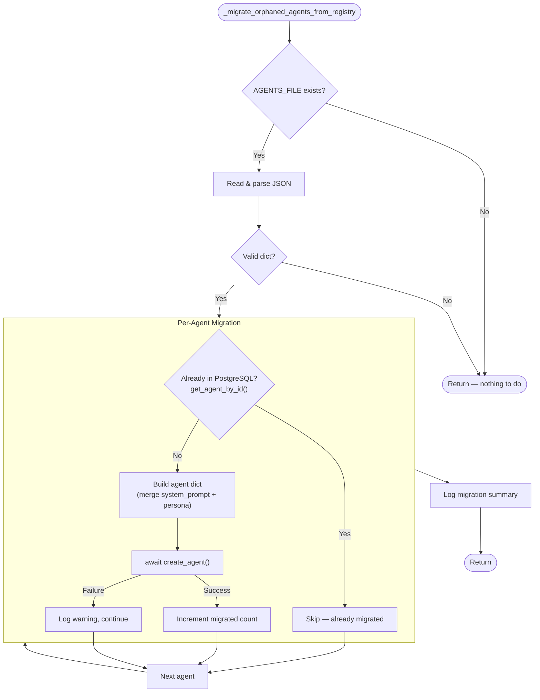
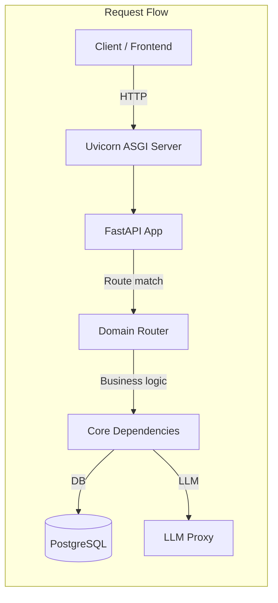

# app_main — AB Studio Backend Application Entry Point

## 1. Introduction

The `app_main` module (`ABStudio/backend/app/main.py`) is the **FastAPI application entry point** for the AB Studio backend — a visual multi-agent workflow builder. This file does not contain domain logic itself; its sole responsibility is to **wire together** all domain routers, manage the application lifecycle (startup/shutdown), seed catalogs and skills into the database, and expose two utility endpoints (`/health` and `/generated-files/{filename}`).

### Key Responsibilities

| Responsibility | Description |
|---|---|
| **Application bootstrap** | Creates the `FastAPI` app instance, configures CORS, and mounts all domain routers. |
| **Lifecycle management** | The `_lifespan` async context manager orchestrates ordered startup (DB init → seeding → engine startup → background sweepers) and graceful shutdown. |
| **Skill seeding** | Seeds AiNxt platform skills, canonical tools/skills, and legacy catalog data into PostgreSQL on every startup (idempotent upserts). |
| **Generated file lifecycle** | Serves generated artifacts (PPTX, DOCX, PDF, etc.) with a TTL-based expiry and background sweeper. |
| **QA binary adaptation** | Detects whether LibreOffice/Poppler are installed and conditionally strips visual-QA instructions from Office skills so the LLM never sees commands it can't execute. |
| **Health monitoring** | Exposes a `/health` endpoint reporting DB connectivity, execution backend mode, and CLI run status. |

---

## 2. Architecture Overview

```mermaid
graph TB
    subgraph "app_main (main.py)"
        APP[FastAPI App Instance]
        LIFESPAN["_lifespan() — Startup/Shutdown"]
        HEALTH["health_check() — GET /health"]
        DOWNLOAD["download_generated_file() — GET /generated-files/{filename}"]
        QA["_qa_binaries_available()"]
        SEED_SKILLS["_seed_platform_skills()"]
        SEED_MIGRATE["_migrate_orphaned_agents_from_registry()"]
        SWEEPER_FILES["_generated_files_sweeper()"]
        SWEEPER_CLI["_cli_workspace_sweeper()"]
    end

    subgraph "Domain Routers (app/api/*)"
        R_EXEC[execution]
        R_CHAT[chat]
        R_GEN[generation]
        R_DOCS[documents]
        R_WF[workflows]
        R_TPL[templates]
        R_AGENTS[agents]
        R_CAT[catalog]
        R_TRIG[triggers]
        R_FACT[factories]
        R_LOOPS[loops]
        R_GOV[governance]
        R_KB[kb]
        R_MCP[mcp]
        R_AGENT_CHAT[agent_chat]
        R_AGENT_TPL[agent_templates]
        R_TPL_ADMIN[template_admin]
    end

    subgraph "Core Dependencies"
        WF_REPO[workflow_repo]
        ENGINE[NativeEngine]
        TRIG_SCHED[trigger_scheduler]
        CANONICAL[canonical_tools]
        AGENT_FACTORY[agent_factory.pipeline]
        CLI_RUNTIME[cli_runtime]
    end

    APP --> LIFESPAN
    APP --> HEALTH
    APP --> DOWNLOAD
    APP --> R_EXEC & R_CHAT & R_GEN & R_DOCS & R_WF & R_TPL & R_AGENTS & R_CAT & R_TRIG & R_FACT & R_LOOPS & R_GOV & R_KB & R_MCP & R_AGENT_CHAT & R_AGENT_TPL & R_TPL_ADMIN

    LIFESPAN --> WF_REPO
    LIFESPAN --> SEED_SKILLS
    LIFESPAN --> SEED_MIGRATE
    LIFESPAN --> ENGINE
    LIFESPAN --> TRIG_SCHED
    LIFESPAN --> CANONICAL
    LIFESPAN --> AGENT_FACTORY
    LIFESPAN --> SWEEPER_FILES
    LIFESPAN --> SWEEPER_CLI
    LIFESPAN --> CLI_RUNTIME

    SEED_SKILLS --> QA
    SEED_SKILLS --> WF_REPO
    HEALTH --> ENGINE
    HEALTH --> WF_REPO
    HEALTH --> CLI_RUNTIME
```

### System Position

The AB Studio backend sits alongside the main platform Gateway as a specialized service for visual workflow building. It shares the same PostgreSQL database (`ainxt` schema), the same structured logger (`core/logger.py`), and the same credential vault infrastructure.

---

## 3. Core Components

### 3.1 `_lifespan(app: FastAPI)`

The FastAPI lifespan async context manager — the heart of the application's startup and shutdown sequence. It is registered via `FastAPI(lifespan=_lifespan)`.

**Startup sequence (strictly ordered):**

> **Critical ordering note:** DB init and all seeding MUST complete before `get_engine().startup()`. The `NativeEngine._warm_singleton_tool_cache()` looks up `code_executor` and `read_skill_file` in `tools_catalog` immediately on startup and caches the result for the process lifetime. If the pool isn't open or canonical rows aren't seeded, the cache is poisoned with an empty list — permanently hiding tools from every agent node.

**Shutdown sequence:**

**Thread pool sizing rationale:** The default asyncio `to_thread` executor is `min(32, cpu+4)`. Every psycopg call is wrapped in `to_thread`, so the pool must be at least as large as the sum of Postgres pool max-sizes: `workflow_repo (30) + checkpoint (25) + agent_chat (25) = 80` worst-case concurrent DB callers, plus headroom for non-DB I/O. Default: 128 workers.

---

### 3.2 `download_generated_file(filename: str, current_user)`

**Endpoint:** `GET /generated-files/{filename}` (authenticated via `require_access`)

Serves generated artifacts (PPTX, DOCX, PDF, Markdown, text) from the `GENERATED_FILES_DIR` directory with TTL-based expiry.

**Lifecycle of a generated file:**

**Security:** Path traversal is prevented by resolving the target path and verifying it falls within `GENERATED_FILES_DIR` via `Path.relative_to()`.

**Media type mapping:**

| Extension | Media Type |
|---|---|
| `.pptx` | `application/vnd...presentationml.presentation` |
| `.docx` | `application/vnd...wordprocessingml.document` |
| `.pdf` | `application/pdf` |
| `.md` | `text/markdown` |
| `.txt` | `text/plain` |
| other | `application/octet-stream` |

---

### 3.3 `health_check()`

**Endpoint:** `GET /health` (unauthenticated)

Returns a JSON object with the following fields:

| Field | Description |
|---|---|
| `db` | `"ok"` or `"error"` — PostgreSQL connectivity via `SELECT 1` |
| `db_mode` | `"postgres"` or `"memory"` (when no pool is configured) |
| `db_error` | *(present only on error)* The exception message |
| `execution_backend` | `"cli"`, `"native"`, or `"unknown"` |
| `cli_ready` | *(CLI mode only)* Whether the CLI binary + API key are available |
| `cli_active_runs` | *(CLI mode only)* Count of in-flight CLI processes |
| `cli_problems` | *(CLI mode only)* List of configuration problems |
| *(engine fields)* | Additional health data from `NativeEngine.health()` |

---

### 3.4 `_qa_binaries_available() -> bool`

Checks whether the host has the binaries required for Office skill visual-QA workflows:

- **LibreOffice** (`soffice` or `libreoffice`) — for `.pptx` → `.pdf` conversion
- **Poppler** (`pdftoppm`) — for `.pdf` → images conversion

Returns `True` only if **both** are present. The result is computed once at module import time (`_QA_BINARIES_OK`) and cached for the process lifetime.

**Impact on skill seeding:** When binaries are missing, the `_seed_platform_skills()` function:
1. Strips the `## QA` and `## Converting to Images` sections from `SKILL.md` bodies of `pptx`, `docx`, and `xlsx` skills (via `_strip_visual_qa()`).
2. Excludes all files under `scripts/office/` from the bundled-files manifest (via `_should_skip_bundled_file()`).
3. Injects a replacement `_NO_VISUAL_QA_NOTICE` instructing the model to use `markitdown` for content-only QA.

This ensures the LLM never receives instructions referencing binaries it cannot execute.

---

## 4. Skill Seeding Pipeline

The `_seed_bundled_skills()` coroutine is a critical startup task that loads the bundled first-party skill folders from `ABStudio/skills/ainxt-skills/` into the `skills_catalog` and `skill_files` PostgreSQL tables.

### `_collect_skill_assets(skill_dir, skill_name)`

Returns a tuple `(skill_md_body, bundled_files)`:

- **`skill_md_body`**: The `SKILL.md` content with YAML frontmatter stripped. For binary-dependent skills on hosts without QA binaries, the visual-QA sections are replaced with a content-only QA notice.
- **`bundled_files`**: A list of dicts for every other text file in the skill folder, each containing `rel_path`, `content`, `size_bytes`, `description`, `kind` (`"script"` or `"reference"`), and `abs_path`.

**NUL byte handling:** Postgres `TEXT` columns reject `\x00` bytes. The collector strips NULs from file content to prevent a single bad byte from rolling back the entire `skill_files` transaction (which would leave a "phantom skill" — listed in the catalog but with no readable files).

### Category Mapping

Skills are categorized based on their folder name:

| Category | Skill Folders |
|---|---|
| `creative` | `algorithmic-art`, `slack-gif-creator` |
| `compliance` | the bundled `dslar-*` skills |
| `productivity` | `doc-coauthoring` |
| `productivity` | `doc-coauthoring`, `docx`, `pdf`, `pptx`, `xlsx` |
| `compliance` | `dslar-clause1-validation`, `dslar-clauses-2-5-validation`, `dslar-clauses-6-9-validation`, `dslar-clauses-10-13-validation`, `dslar-image-enrichment`, `dslar-pdf-extraction` |
| `communication` | `internal-comms` |
| `general` | *(fallback for unmapped folders)* |

---

## 5. Background Sweepers

Two long-running asyncio tasks are created during startup and cancelled during shutdown:

### 5.1 `_generated_files_sweeper()`

| Property | Value |
|---|---|
| **Interval** | 60 seconds (`_GENERATED_FILES_SWEEP_INTERVAL_SECONDS`) |
| **Purpose** | Delete files in `GENERATED_FILES_DIR` older than `GENERATED_FILES_TTL_SECONDS` |
| **Expiry check** | `_is_expired(path, now)` — compares `time.time() - path.stat().st_mtime` against TTL |

This is a safety net; the download endpoint also performs lazy cleanup (deletes expired files on access and returns `410 Gone`).

### 5.2 `_cli_workspace_sweeper()`

| Property | Value |
|---|---|
| **Interval** | 3600 seconds (hourly) |
| **Purpose** | Reclaim expired per-run CLI workspaces and stale MCP run sessions |
| **Condition** | No-op when `cli_mode_enabled()` returns `False` |
| **Actions** | `get_registry().sweep_expired()` + `sweep_workspaces()` (runs in thread via `asyncio.to_thread`) |

> See [cli_runtime](../cowork/cli_runtime.md) for details on CLI workspace and session management.

---

## 6. Router Registration

All domain routers are mounted via `app.include_router()`. The complete list:

| Router | Module Reference | Purpose |
|---|---|---|
| `execution` | [api_execution](../api/api_execution.md) | Workflow run/stream/resume endpoints |
| `chat` | [api_chat](../api/api_chat.md) | Workflow chat thread management |
| `generation` | [api_generation](../api/api_generation.md) | LLM-powered workflow/instruction generation |
| `documents` | [api_documents](../api/api_documents.md) | Document extraction & agent runner attachments |
| `workflows` | [api_workflows](../api/api_workflows.md) | Workflow CRUD |
| `templates` | [api_templates](../api/api_templates.md) | Template listing & usage |
| `agents` | [api_agents](../api/api_agents.md) | Agent CRUD |
| `agent_templates` | [api_agent_templates](../api/api_agent_templates.md) | Agent template listing & usage |
| `mcp` | [api_mcp](../mcp/api_mcp.md) | MCP server testing |
| `catalog` | [api_catalog](../api/api_catalog.md) | Skills/tools catalog management |
| `triggers` | [api_triggers](../api/api_triggers.md) | Trigger CRUD & execution history |
| `factories` | [api_factories](../api/api_factories.md) | Agent/skill/workflow/agent-runner factory chat |
| `agent_chat` | [api_agent_chat](../api/api_agent_chat.md) | Agent chat thread management |
| `kb` | [api_kb](../api/api_kb.md) | Build-Studio KB upload proxy |
| `template_admin` | [api_template_admin](../api/api_template_admin.md) | Feature-flagged template editor |
| `loops` | [api_loops](../api/api_loops.md) | Loop/goal CRUD & governance |
| `governance` | [api_governance](../api/api_governance.md) | Governance/approval bridge |
| `cli_mcp_router` | [cli_runtime](../cowork/cli_runtime.md) | MCP tool plane for spawned CLI processes |

The CLI MCP router is mounted unconditionally inside a `try/except` — it is inert unless a live run session exists, and every request must present that run's bearer token.

---

## 7. Orphan Agent Migration

`_migrate_orphaned_agents_from_registry()` is a one-time idempotent migration that imports agents from the legacy JSON registry (`backend/data/agents.json`) into the PostgreSQL `agents` table.

After this runs once successfully, new deploys go straight to PostgreSQL and the JSON file becomes a read-only artifact.

---

## 8. Configuration

### Environment Variables

| Variable | Default | Description |
|---|---|---|
| `GENERATED_FILES_DIR` | `ABStudio/tmp` | Directory for generated artifacts |
| `GENERATED_FILES_TTL_SECONDS` | `86400` (24h) | Time-to-live for generated files |
| `CORS_ALLOW_ORIGINS` | `localhost:5173,5174,3000,file://,null` | Comma-separated CORS origins |
| `AGENTCHAIN_THREADPOOL_WORKERS` | `128` | asyncio `to_thread` executor size |
| `ABSTUDIO_CLI_MODE` | *(unset)* | Enable CLI execution mode |
| `TEMPLATES_EDITABLE` | *(unset)* | Enable template admin editor |
| `factory_model` | *(from config)* | Default LLM model for factory operations |

### Platform Integration

The module inserts the parent AiNxt platform root onto `sys.path` at import time, enabling the standalone Build Studio backend to import shared credential modules (`core.platform_credentials`, `store.credential_vault`) used by `workflow_repo.get_all_connection_env_vars()` to pull per-user vault tokens into the sandbox environment.

### Logging

Build Studio logs are routed through the shared gateway logger (`core/logger.py`) by importing `from core.logger import logger`. This ensures every AB Studio record lands in the same structured, rotating `agent.log` as the rest of the platform, carrying structlog context (`request_id`, `chat_id`, `user_id`, `span_id`, `client_source`). The module must **not** call `logging.basicConfig()` to avoid double-logging and unstructured stdout output.

---

## 9. Dependency Map

```mermaid
graph TD
    MAIN[app.main]

    MAIN -->|DB pool, CRUD| WF_REPO["app.core.workflow_repo<br/>See: core_workflow_repo"]
    MAIN -->|Engine lifecycle| ENGINE["app.engine.native_engine<br/>See: engine_native_engine"]
    MAIN -->|Trigger scheduling| TRIG["app.services.trigger_scheduler<br/>See: services_trigger_scheduler"]
    MAIN -->|Canonical tool/skill seeding| CANON["app.tools.canonical_tools<br/>See: tools"]
    MAIN -->|Catalog seeding, LLM calls| AF["agent_factory.pipeline<br/>See: agent_factory_pipeline"]
    MAIN -->|Auth dependency| DEPS["app.api.deps<br/>See: api_deps"]
    MAIN -->|Models| MODELS["app.models<br/>See: app_models"]
    MAIN -->|Config| CONFIG["app.core.config<br/>See: core_config"]
    MAIN -->|Structured logging| LOGGER["core.logger<br/>See: shared_core"]
    MAIN -->|CLI mode| CLI["app.cli_runtime<br/>See: cli_runtime"]
    MAIN -->|Agent chat stores| AGENT_CHAT["app.api.agent_chat<br/>See: api_agent_chat"]
    MAIN -->|Bundled skills| SKILLS["ABStudio/skills/ainxt-skills/<br/>See: shared_skills"]

    MAIN -->|Router mounting| ROUTERS["17 domain routers<br/>See: Section 6"]
```

---

## 10. Direct Execution

When run directly (`python main.py`), the app starts via `uvicorn.run(app, host="0.0.0.0", port=8002)`. In production, it is typically served behind Gunicorn with Uvicorn workers.

---

## 11. Key Design Decisions

1. **Sequential seeding with error isolation** — Each startup coroutine is awaited individually with `try/except` so a single seeding failure doesn't prevent the app from starting. However, DB init must succeed before any seeding runs.

2. **Idempotent upserts** — All seeding operations use upsert semantics, making restarts safe. Skills, tools, and catalog entries are refreshed on every startup.

3. **Atomic skill seeding** — The catalog row is written first (FK constraint), then files. If the file write fails, the catalog row is deleted to prevent "phantom skills" that appear attachable but have no readable files.

4. **QA binary adaptation** — Rather than failing at runtime when LibreOffice/Poppler are missing, the system proactively strips visual-QA instructions at seed time, ensuring the LLM only sees actionable instructions.

5. **Unconditional CLI MCP router mounting** — The CLI MCP router is always mounted (inside `try/except`) so a mid-flight `ABSTUDIO_CLI_MODE` flag flip doesn't leave the route missing and cause tools to silently vanish.

6. **Thread pool sizing** — The asyncio `to_thread` executor is explicitly sized to 128 workers (configurable) to prevent DB-bound requests from queuing on Python's default `min(32, cpu+4)` pool.
