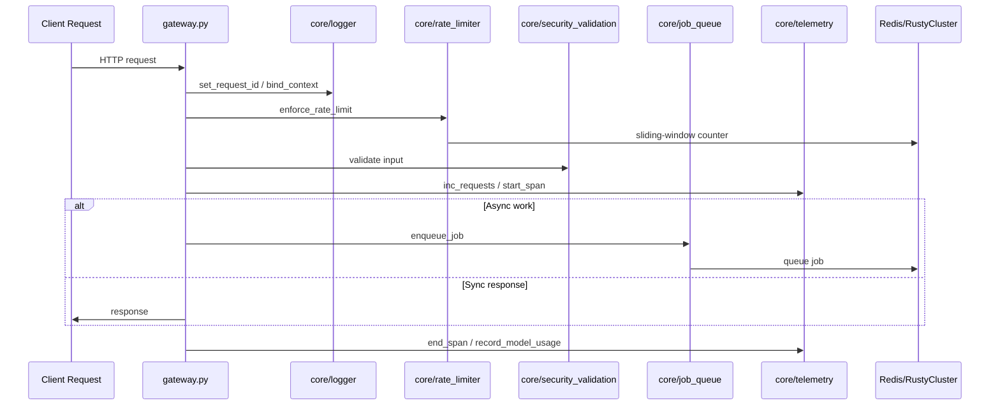
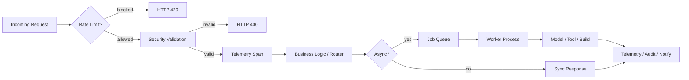

# Core Infrastructure Module

## Overview

The `core_infrastructure` module is the foundational layer of the AiNxt platform. It provides the cross-cutting services, configuration, resilience primitives, observability, security controls, and shared utilities that every other module depends on. It is intentionally dependency-light and contains no business-domain logic; instead, it exposes stable primitives used by API routes, workers, agents, connectors, and frontends.

The module's design goals are:

- **Centralized configuration** — all environment-driven settings live in `core/config.py`.
- **Production-grade observability** — structured logging, Prometheus metrics, OpenTelemetry tracing, and distributed tracing context propagation.
- **Resilience at scale** — circuit breakers, rate limiters, distributed semaphores, and backend-agnostic KV storage.
- **Security by default** — prompt-injection detection, XSS/input sanitization, RAG access control, and PCI/PII-aware content handling.
- **LLM-agnostic infrastructure** — model registry, prompt versioning, tool-use proxying, and cache egress handling.
- **Enterprise operability** — job queues, notifications, multi-tenancy, and multilingual translation support.

---

## Architecture

```mermaid
flowchart TB
    subgraph CoreInfrastructure["Core Infrastructure"]
        direction TB
        Config["Configuration\ncore/config.py"]
        Logger["Structured Logging\ncore/logger.py"]
        Telemetry["Telemetry & Tracing\ncore/telemetry.py"]
        Storage["Object Storage\ncore/storage.py"]
        CB["Circuit Breaker\ncore/circuit_breaker.py"]
        RL["Rate Limiter\ncore/rate_limiter.py"]
        DSem["Distributed Semaphore\ncore/distributed_semaphore.py"]
        SecVal["Security Validation\ncore/security_validation.py"]
        PromptInj["Prompt Injection\ncore/prompt_injection.py"]
        PromptSan["Prompt Sanitizer\ncore/prompt_sanitizer.py"]
        RagACL["RAG ACL\ncore/rag_acl.py"]
        ModelReg["Model Registry\ncore/model_registry.py"]
        ProxyTool["Proxy Tool Use\ncore/proxy_tool_use.py"]
        PromptReg["Prompt Registry\ncore/prompt_registry.py"]
        JobQueue["Job Queue\ncore/job_queue.py"]
        Notify["Notifications\ncore/notifications.py"]
        Translate["Translation\ncore/translation_wrapper.py"]
    end

    Gateway["gateway.py"] --> CoreInfrastructure
    Workers["workers/"] --> CoreInfrastructure
    Routers["routers/"] --> CoreInfrastructure
    Agents["agents/"] --> CoreInfrastructure
    Connectors["connectors/"] --> CoreInfrastructure
    Frontend["ai-ui / ABStudio"] --> Gateway

    CoreInfrastructure --> Redis[(Redis / RustyCluster)]
    CoreInfrastructure --> Postgres[(Postgres / pgVector)]
    CoreInfrastructure --> MinIO[(MinIO / Local FS)]
    CoreInfrastructure --> OTLP[(OTLP Collector)]
```

### Component Interaction Flow

---

## Sub-modules

The core infrastructure is split into the following sub-modules. Each has its own detailed documentation file.

| Sub-module | Files | Purpose |
|------------|-------|---------|
| [Configuration & Logging](core_infrastructure_config_logging.md) | `config.py`, `logger.py` | Environment-driven configuration, DSN builders, and structured JSON logging with context propagation. |
| [Observability](core_infrastructure_observability.md) | `telemetry.py`, `otel.py`, `trace_store.py` | Prometheus metrics, OpenTelemetry tracing, in-memory span fallback, and Redis-backed trace store. |
| [Resilience & Storage](core_infrastructure_resilience_storage.md) | `storage.py`, `circuit_breaker.py`, `rate_limiter.py`, `distributed_semaphore.py` | Object storage (MinIO/local), circuit breakers, sliding-window rate limiting, and distributed semaphores. |
| Security & Compliance | `prompt_injection.py`, `prompt_sanitizer.py`, `security_validation.py`, `rag_acl.py` | Prompt-injection detection, XSS/input validation, content sanitization, and RAG chunk access control. |
| LLM Tooling | `model_registry.py`, `proxy_tool_use.py`, `claude_cache_egress.py`, `prompt_registry.py` | Model registry/tiers, multi-round tool-use proxy, Anthropic cache egress transport, and prompt versioning/A/B testing. |
| Context & Evaluation | `context_compressor.py`, `context_manager.py`, `evals.py`, `confidence_scorer.py` | Token-budget compression, engineer work-context management, LLM-as-judge evaluation, and block-confidence scoring. |
| Jobs & Notifications | `job_queue.py`, `notifications.py`, `generation_registry.py` | RQ-backed job queues, Slack/email/WhatsApp notifications, and active-generation stop registry. |
| Internationalization | `translation_wrapper.py`, `lang_detect.py`, `prose_translate.py` | Indic language detection, prose-vs-code segmentation, and translation microservice integration. |
| Build & Dependencies | `build_result_parser.py`, `npci_dependency_resolver.py` | Docker build output parsing and NPCI-internal Maven dependency resolution. |
| Shared Utilities | `tenant.py`, `coach_events.py`, `discussions_engine_client.py`, `chroma_client.py` | Multi-tenancy, Coach event emission, Discussions engine client, and ChromaDB stub. |

---

## Key Design Principles

### Environment-First Configuration

All connection strings, feature flags, timeouts, and model identifiers are read from environment variables at import time. `core/config.py` is the single source of truth and includes a `validate_prod_config()` routine that fails fast on missing critical values in production.

### Context-Aware Logging

`core/logger.py` uses `contextvars.ContextVar` to attach `request_id`, `user_id`, `chat_id`, `client_source`, `agent_id`, `pipeline_stage`, `task_id`, and `correlation_id` to every log line. This is safe under FastAPI/asyncio and propagates into thread-pool executors.

### Backend-Agnostic KV

The platform can run against either Redis or RustyCluster for its logical databases. `core/config.py` exposes `kv_backend_for(db)` and `KV_BACKEND_MAP`, and modules such as `circuit_breaker.py`, `rate_limiter.py`, and `job_queue.py` consume the backend-agnostic `core.kv` clients.

### Fail-Open / Fail-Safe Defaults

Where a failure would otherwise block a user-facing path, the module prefers safe degradation:

- Translation service unreachable → return original text.
- KV unavailable for rate limiting → allow request (when `block_on_redis_failure=false`).
- Circuit-breaker KV unavailable → fail OPEN to prevent thundering herd.
- Eval judge parse error → return `ACCEPT` with a low score.

### Security Redaction, Not Blocking

Compliance-adjacent modules (e.g., `prompt_sanitizer.py`, `rag_acl.py`) follow the platform rule of redacting or filtering sensitive content rather than dropping user requests, except where explicit policy blocks access.

---

## Integration with Other Modules

- **gateway.py** — initializes logging, telemetry, rate limiting, and serves `/metrics`, `/health`, and `/traces`.
- **routers/** — use `security_validation`, `rate_limiter`, `telemetry`, and `job_queue`.
- **workers/** — consume jobs enqueued by `core/job_queue.py` and inherit logging context via `sdlc_log_context`.
- **agents/** — rely on `model_registry`, `prompt_registry`, `evals`, `confidence_scorer`, and `proxy_tool_use`.
- **connectors/** — use `circuit_breaker`, `rate_limiter`, and `object storage` for adapter resilience.
- **memory/** — uses `core/config` DSNs and KV backend selection.
- **mcp/** — registers tools whose outputs may be scanned by `prompt_injection` and `prompt_sanitizer`.

---

## Operational Notes

### Redis DB Allocation

The module owns and documents the logical Redis database layout in `core/config.py`:

| DB | Purpose |
|----|---------|
| 0 | Answer cache + rewrite cache |
| 1 | Trace store |
| 2 | Workflows + agent run history |
| 3 | Marketplace registry / inbox / index governance |
| 4 | Budget + usage |
| 5 | RQ job queues |
| 6 | Chat token streams (SSE via `XREAD`) |
| 7 | Embed service SHA256 embedding cache |
| 8 | Privacy service PII cache |

### Feature Kill-Switches

Many capabilities can be disabled via environment variables:

- `RATE_LIMIT_ENABLED=false` — bypass all rate limiting.
- `ENABLE_TRACING=0` / unset `OTLP_ENDPOINT` — use in-memory span store.
- `CIRCUIT_BREAKER_DISABLED=1` — bypass circuit breakers.
- `ENABLE_COACH=false` — disable Coach event emission.
- `ENABLE_DISCUSSIONS=false` — disable Discussions engine integration.
- `EVAL_ENABLED=false` — disable LLM-as-judge evaluations (default is `true`).

### Health & Metrics

- Prometheus metrics are exposed via `core/telemetry.py::get_prometheus_metrics()`.
- OpenTelemetry spans are exported when `OTLP_ENDPOINT` is set; otherwise the in-memory `_SpanStore` retains the last 1,000 spans.
- The trace store (`core/trace_store.py`) persists request-scoped debug traces to Redis DB 1 with a 24-hour TTL.

---

## Mermaid: Data Flow Through Core Infrastructure

