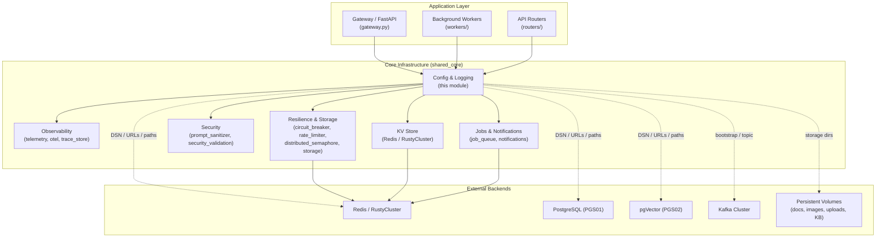
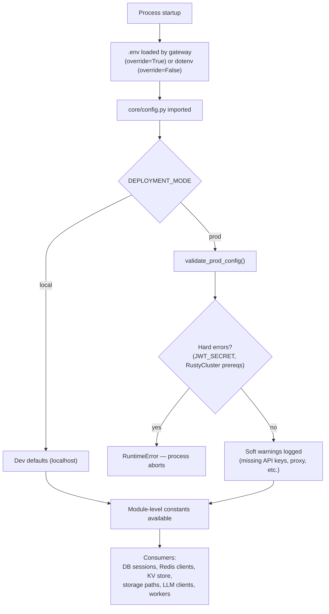
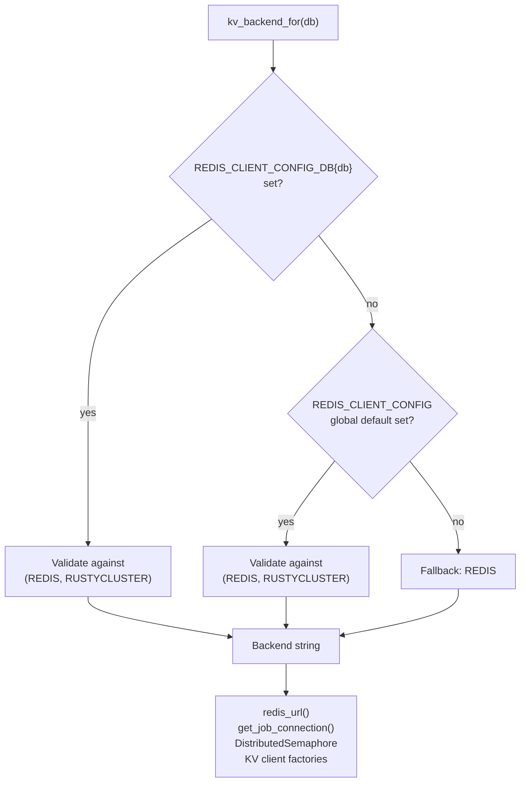
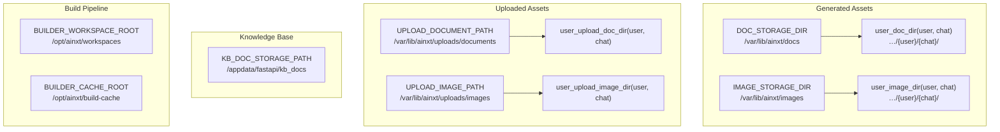
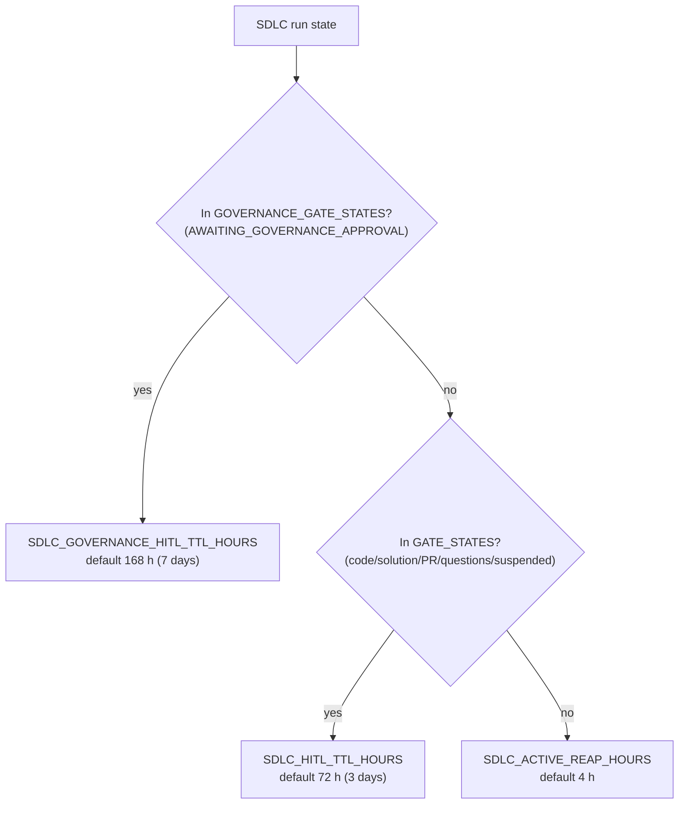
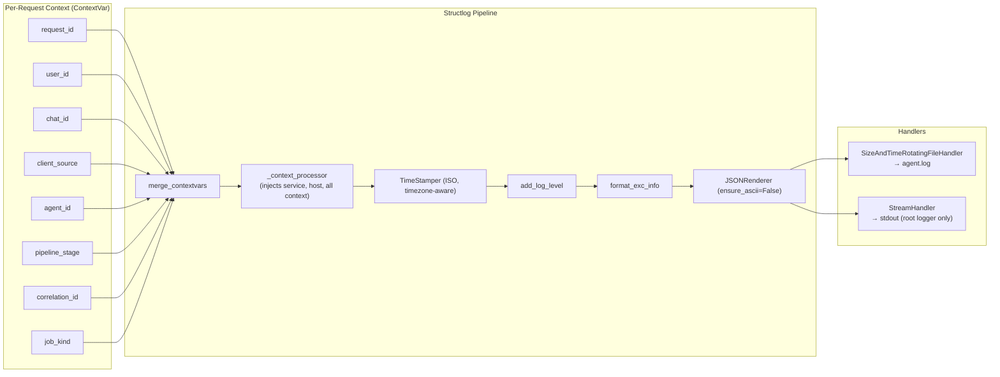
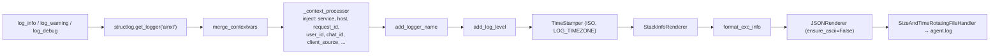
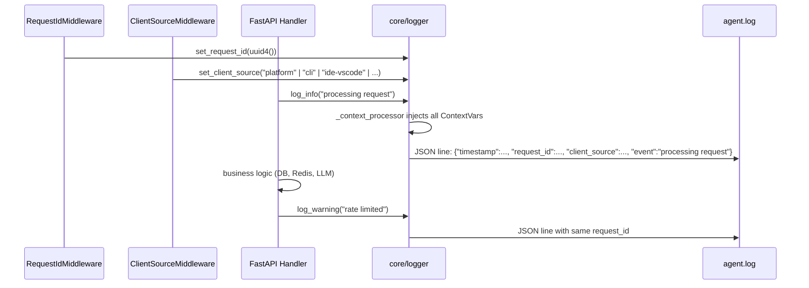
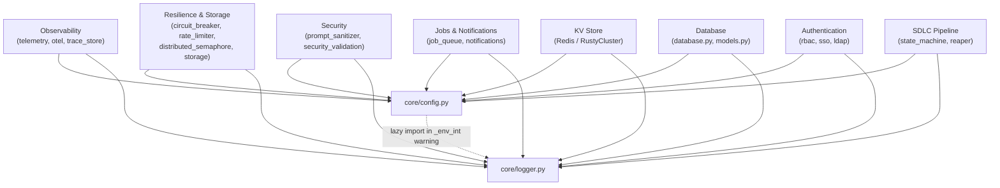

# Core Infrastructure — Configuration & Logging

> **Parent module:** [Core Infrastructure](core_infrastructure.md)
>
> This module (`core/config.py` + `core/logger.py`) is the foundational configuration and logging layer for the entire AiNxt platform. Every gateway process, background worker, and API router imports constants and the logger from here. It is designed to be imported first — before any database, Redis, or LLM client is initialised.

---

## 1. Purpose

The module serves two inseparable responsibilities:

| Responsibility | Files | Summary |
|---|---|---|
| **Central configuration** | `core/config.py` | Resolves every connection string, storage path, feature toggle, compliance flag, and SDLC lifecycle constant from environment variables. Provides DSN builders, path helpers, KV-backend selectors, and production startup validation. |
| **Production-grade logging** | `core/logger.py` | Structured JSON logging via `structlog` with a multi-process-safe rotating file handler, per-coroutine context propagation (`ContextVar`), and ergonomic helpers used across the codebase. |

No host, port, or credential is ever hardcoded. In local dev, every `os.getenv()` falls back to `localhost`; in production, the `.env` file (loaded by the gateway before CKMS decryption) supplies all values.

---

## 2. Architecture Overview



### 2.1 Module Position in the System

`core/config.py` is imported at the very top of the process boot path. The gateway loads `.env` (with `override=True`) and runs CKMS decryption *before* importing `core.config`, so decrypted secrets are already present in `os.environ`. When `core.config` is imported standalone (tests, scripts), it loads `.env` itself with `override=False` to avoid clobbering CKMS-decrypted values.

`core/logger.py` is imported implicitly by `core.config` (lazily, only in the `_env_int` warning path) and explicitly by virtually every other module. It configures itself on first import via `_configure_logging_once()`.

---

## 3. Configuration (`core/config.py`)

### 3.1 Configuration Resolution Flow



### 3.2 Key Functions & Helpers

| Function / Symbol | Purpose |
|---|---|
| `redis_client(db, decode_responses)` | Returns a `redis.Redis` client for the given logical DB number. |
| `redis_url(db=0)` | Returns a `redis://host:port/db` URL. Raises if the DB is configured for `RUSTYCLUSTER` — callers should use `core.kv.get_kv(db)` instead. |
| `postgres_dsn()` | Primary PostgreSQL DSN with `search_path=ainxt,public`. |
| `postgres_read_dsn()` | Read-replica DSN (CQRS). Falls back to primary if `POSTGRES_READ_HOST` is unset. |
| `pgvector_dsn()` | pgVector (PGS02) DSN for vector workloads. |
| `pgvector_read_dsn()` | pgVector read-replica DSN. |
| `user_doc_dir(user_id, chat_id)` | Per-user / per-chat directory for **generated** documents. Path-traversal sanitised. |
| `user_image_dir(user_id, chat_id)` | Per-user / per-chat directory for **generated** images. |
| `user_upload_doc_dir(user_id, chat_id)` | Per-user / per-chat directory for **uploaded** documents. |
| `user_upload_image_dir(user_id, chat_id)` | Per-user / per-chat directory for **uploaded** images. |
| `kv_backend_for(db)` | Resolves whether logical DB `db` uses `REDIS` or `RUSTYCLUSTER`. Per-DB override via `REDIS_CLIENT_CONFIG_DB{db}`. |
| `KV_BACKEND_MAP` | Snapshot of `kv_backend_for(db)` for all DBs at import time (used by `/healthz`, startup logs). |
| `validate_prod_config()` | Hard-fails on missing critical secrets; soft-warns on missing optional API keys. Called only when `DEPLOYMENT_MODE=prod`. |
| `_env_int(name, default)` | Safe integer env-var reader — logs a warning and falls back on invalid values. |
| `sdlc_gate_deadline(gate_kind)` | Returns absolute epoch-second deadline for an SDLC human gate. |
| `sdlc_reaper_window_hours(state)` | Returns inactivity window after which a stale SDLC run may be reaped. |

### 3.3 KV Backend Selection

The platform supports two KV backends — **Redis** and **RustyCluster** — selectable per logical DB. This enables incremental rollout and rollback via environment variables alone.



**Redis DB allocation** (reference constants):

| Constant | DB | Purpose |
|---|---|---|
| `RDB_CACHE` | 0 | Answer cache + rewrite cache |
| `RDB_TRACE` | 1 | Trace store |
| `RDB_WORKFLOW` | 2 | Workflows + agent run history |
| `RDB_REGISTRY` | 3 | Marketplace registry / inbox / index governance |
| `RDB_BUDGET` | 4 | Budget + usage |
| `RDB_QUEUE` | 5 | RQ job queues + Teams conversation mapping |
| `RDB_STREAM` | 6 | Chat token streams (SSE via XREAD) |
| `RDB_EMBED` | 7 | Embed service SHA256 embedding cache |
| `RDB_PRIVACY` | 8 | Privacy service PII cache |

> `KV_DB_COUNT = 9` — bump this when adding a new logical DB.

### 3.4 Storage Path Hierarchy

Generated assets, uploaded assets, and KB documents are deliberately kept in separate directory trees to prevent mixing and to support different lifecycle policies.



All path helpers sanitise each segment with `re.sub(r"[^A-Za-z0-9_.-]", "_", ...)` to prevent path traversal, and fall back to `"unknown"` / `"no-chat"` for empty values.

### 3.5 SDLC Human-Gate TTL Model

The configuration module defines the state-set constants and TTL windows that govern how long a human-in-the-loop SDLC run can survive before the reaper cancels it.



| Constant | Default | Env Var |
|---|---|---|
| `SDLC_HITL_TTL_HOURS` | 72 | `SDLC_HITL_TTL_HOURS` |
| `SDLC_GOVERNANCE_HITL_TTL_HOURS` | 168 | `SDLC_GOVERNANCE_HITL_TTL_HOURS` |
| `SDLC_ACTIVE_REAP_HOURS` | 4 | `SDLC_ACTIVE_REAP_HOURS` |

> See [SDLC Pipeline](../sdlc/shared_core_sdlc_pipeline.md) for how these constants are consumed by the state machine and reaper workers.

### 3.6 Feature Toggles

Several self-contained features can be enabled or disabled via environment variables. When disabled, their routers do not mount and their sidebar navigation is hidden.

| Feature | Env Var | Default | Description |
|---|---|---|---|
| Skill Loop | `ENABLE_SKILL_LOOP` | `false` | Self-improving skill proposal worker |
| Raw OpenAI API | `ENABLE_RAW_OPENAI_API` | `false` | Direct `/v1/chat/completions` endpoint |
| External Sync | `ENABLE_EXTERNAL_SYNC` | `false` | OSS resource sync (Anthropic/OpenAI skills) |
| AiNxt Coach | `ENABLE_COACH` | `false` | Coach evaluator + ingestor + routers |
| Discussions | `ENABLE_DISCUSSIONS` | `false` | Native discussions module (headless engine) |
| HardBlock Engine | `HARDBLOCK_ENABLED` | `false` | Deterministic hard-block gate in compliance |
| LDAP | `LDAP_ENABLED` | `false` | Direct LDAP/AD integration |

### 3.7 Compliance Scan Scope

Compliance scanning is configurable to balance latency vs. coverage. The current-prompt scan always runs; additional scan classes are opt-in.

| Env Var | Default | Scope |
|---|---|---|
| `COMPLIANCE_SCAN_TOOL_RESULTS` | `false` | Scan tool/file-read output |
| `COMPLIANCE_SCAN_HISTORY` | `false` | Re-scan prior conversation turns each iteration |
| `COMPLIANCE_SCAN_LLM_OUTPUT` | `false` | Redact/validate model response |
| `COMPLIANCE_SCAN_KB_UPLOAD` | `false` | PII/PCI scan at KB upload time |
| `HARDBLOCK_THRESHOLD` | `0.75` | Weighted score threshold for HardBlock gate |

> See Security for the compliance engine and prompt sanitiser details.

### 3.8 Production Validation

`validate_prod_config()` runs at gateway startup when `DEPLOYMENT_MODE=prod`:

- **Hard errors** (process aborts):
  - Missing `JWT_SECRET`
  - Missing `RUSTYCLUSTER_PASSWORD` or `rustycluster.yaml` when any DB uses RustyCluster
- **Soft warnings** (logged, process continues):
  - Missing `ANTHROPIC_API_KEY`, `OPENAI_API_KEY`, `GEMINI_API_KEY` / `GOOGLE_API_KEY`
  - Missing `HTTPS_PROXY` / `FORWARD_PROXY_URL`
  - Missing `LOCAL_LLM_BASE_URL`
  - Missing `PGVECTOR_HOST`
  - `KAFKA_BOOTSTRAP` pointing at localhost

---

## 4. Logging (`core/logger.py`)

### 4.1 Logging Architecture



### 4.2 `SizeAndTimeRotatingFileHandler`

A custom handler that extends `TimedRotatingFileHandler` to rotate on **either** size **or** time — whichever fires first.

| Concern | Solution |
|---|---|
| **Multi-process safety** | On every `emit()`, the handler compares the open file descriptor's inode (`os.fstat`) against the on-disk file (`os.stat`). If a peer process rotated the file, the stale fd is closed and the new file is opened — same mechanism as `WatchedFileHandler`. |
| **Thread safety** | A `threading.Lock` guards the `shouldRollover()` + `doRollover()` sequence, preventing concurrent threads from double-rotating and leaving `self.stream = None`. |
| **Size rotation** | Checks `stream.tell() >= maxBytes` (default 50 MB) before falling through to the time-based check. |
| **Time rotation** | Inherits `TimedRotatingFileHandler` logic — `midnight` by default, configurable via `LOG_ROTATION_WHEN`. |
| **Timezone** | `LOG_TIMEZONE` (default `Asia/Kolkata`) is applied via `os.environ["TZ"]` + `time.tzset()` before any datetime import. |

### 4.3 Per-Coroutine Context (`ContextVar`)

The logger uses `contextvars.ContextVar` (not `threading.local`) for per-request context. This is critical because FastAPI/uvicorn runs all async coroutines on a single event-loop thread — `threading.local` would allow concurrent coroutines to overwrite each other's `request_id` or `client_source`.

| ContextVar | Setter / Getter | Default |
|---|---|---|
| `request_id` | `set_request_id()` / `get_request_id()` | `"-"` |
| `user_id` | `set_chat_context()` / `get_user_id()` | `"-"` |
| `chat_id` | `set_chat_context()` / `get_chat_id()` | `"-"` |
| `span_id` | `set_span_id()` / `get_span_id()` | `"-"` |
| `client_source` | `set_client_source()` / `get_client_source()` | `"platform"` |
| `agent_id` | `bind_context()` / `_cv_agent_id.get()` | `""` |
| `pipeline_stage` | `bind_context()` / `_cv_pipeline_stage.get()` | `""` |
| `task_id` | `bind_context()` / `_cv_task_id.get()` | `""` |
| `correlation_id` | `set_correlation_id()` / `get_correlation_id()` | `""` |
| `job_kind` | `set_job_kind()` / `get_job_kind()` | `""` |

**Key helpers:**

- `set_chat_context(user_id, chat_id)` — binds user and chat for the current request.
- `clear_chat_context()` — resets user, chat, span, and client_source to defaults.
- `bind_context(agent_id, pipeline_stage, task_id, correlation_id, job_kind)` — conditionally sets only non-empty values (preserves existing).
- `set_correlation_id(value)` — unconditionally overwrites (use at request entry points to prevent stale inheritance in RQ workers).
- `clear_bound_context()` — resets all bound context fields.

### 4.4 `sdlc_log_context` Context Manager

A context manager that binds SDLC correlation context for the duration of a block:

```python
from core.logger import sdlc_log_context

with sdlc_log_context(run_id="RUN-123", pipeline_stage="sdlc_feature"):
    # All log lines inside this block carry:
    #   correlation_id="RUN-123"
    #   pipeline_stage="sdlc_feature"
    ...
```

Safe for RQ workers, daemon threads, and `ThreadPoolExecutor` — each thread gets its own `ContextVar` context.

### 4.5 Structlog Pipeline Configuration



- `cache_logger_on_first_use=False` — ensures the pipeline is never frozen against a stale handler reference after rotation.
- The named `"ainxt"` logger writes **only** to `agent.log` (no stdout).
- The root logger writes third-party library logs to **stdout only** (no duplicate file writes).

### 4.6 Safe Logging Helpers

| Function | Behaviour |
|---|---|
| `log_info(message)` | `logger.info(message)` |
| `log_warning(message)` | `logger.warning(message)` |
| `log_debug(message)` | `logger.debug(message)` |
| `log_error(message, exc=None)` | `logger.exception(message)` if `exc` provided, else `logger.error(message)` |

The module-level `logger` instance (`structlog.get_logger("ainxt")`) is imported throughout the codebase for structured key-value logging:

```python
from core.logger import logger
logger.info("agent_started", agent_id=agent_id, model=model)
```

---

## 5. Request Lifecycle & Logging Data Flow



For background workers (RQ / threading), callers must capture `contextvars.copy_context()` at spawn time and run the target inside `ctx.run(...)` so the parent request's context is inherited correctly.

---

## 6. Dependencies & Relationships

### 6.1 Internal Module Dependencies



### 6.2 Related Module Documentation

| Module | Relationship |
|---|---|
| [Core Infrastructure](core_infrastructure.md) | Parent module — this is one of its sub-modules. |
| [Observability & Telemetry](core_infrastructure_observability.md) | Consumes config for OTEL enablement, Prometheus metrics, and trace storage; uses the logger for structured event emission. |
| [Resilience & Storage](core_infrastructure_resilience_storage.md) | `CircuitBreaker`, `DistributedSemaphore`, and `RateLimitConfig` all use `redis_client()` / `kv_backend_for()` from config and `logger` for state transitions. |
| Security | Compliance scan flags (`COMPLIANCE_SCAN_*`, `HARDBLOCK_*`) are defined here; security modules log via `core.logger`. |
| LLM Tooling | LLM proxy URLs, model defaults (`DOC_INTENT_MODEL`, `GENERAL_CHAT_MODEL`), and API key env vars are resolved here. |
| Jobs & Notifications | `get_job_connection()` in `core/kv/queue.py` uses `kv_backend_for(RDB_QUEUE)` from config. |
| [KV Store](../storage/kv_store.md) | Per-DB backend selection (`REDIS` vs `RUSTYCLUSTER`) originates from `kv_backend_for()` and `KV_BACKEND_MAP`. |
| [Database](../storage/database.md) | `postgres_dsn()`, `postgres_read_dsn()`, `pgvector_dsn()`, and `pgvector_read_dsn()` supply connection strings to SQLAlchemy session factories. |
| [Authentication](../auth/authentication.md) | LDAP/AD configuration (`LDAP_*`, `SECURITY_AD_GROUP`, `APPROVER_AD_GROUP`) and `JWT_SECRET` validation are defined here. |
| [SDLC Pipeline](../sdlc/shared_core_sdlc_pipeline.md) | SDLC gate TTLs, state-set constants, and `sdlc_log_context` are consumed by the state machine, reaper, and workers. |
| [Gateway](gateway.md) | The gateway is the primary consumer — it loads `.env`, runs CKMS, calls `validate_prod_config()`, and imports the logger at startup. |
| [Worker Orchestration](../workers/worker_orchestration.md) | Workers import config for Redis/Kafka/DB connections and use the logger with `sdlc_log_context` for pipeline stages. |

### 6.3 External Library Dependencies

| Library | Used By | Purpose |
|---|---|---|
| `structlog` | `core/logger.py` | Structured JSON logging pipeline. |
| `redis` | `core/config.py` | `redis_client()` factory and `redis_url()` builder. |
| `python-dotenv` | `core/config.py` | `.env` loading (optional — `ImportError` tolerated). |
| `logging` (stdlib) | `core/logger.py` | Base handler classes, root logger, console output. |
| `contextvars` (stdlib) | `core/logger.py` | Async-safe per-coroutine context storage. |

---

## 7. Environment Variable Reference

### 7.1 Deployment & Core

| Env Var | Default | Description |
|---|---|---|
| `DEPLOYMENT_MODE` | `local` | `local` (dev) or `prod` (production cluster). |
| `LOG_TIMEZONE` | `Asia/Kolkata` | IANA timezone for log timestamps. |
| `LOG_LEVEL` | `INFO` | Logging level (`DEBUG`, `INFO`, `WARNING`, `ERROR`). |
| `LOG_DIR` | `…/log/app` | Directory for `agent.log`. |
| `LOG_MAX_BYTES` | `52428800` (50 MB) | Size threshold for log rotation. |
| `LOG_BACKUP_COUNT` | `30` | Number of rotated files to keep. |
| `LOG_ROTATION_WHEN` | `midnight` | Time-based rotation schedule. |
| `LOG_ROTATION_INTERVAL` | `1` | Units between rotations (for `h`, `d`, `s`). |
| `LOG_ROTATION_UTC` | `false` | Use UTC for rollover timing. |
| `SERVICE_NAME` | `ainxt-gateway` | Service name in log context. |

### 7.2 Redis & KV Backend

| Env Var | Default | Description |
|---|---|---|
| `REDIS_HOST` | `localhost` | Redis host. |
| `REDIS_PORT` | `6379` | Redis port. |
| `REDIS_PASSWORD` | *(none)* | Redis password. |
| `REDIS_CLIENT_CONFIG` | `REDIS` | Global KV backend default. |
| `REDIS_CLIENT_CONFIG_DB{db}` | *(inherits global)* | Per-DB backend override. |
| `RUSTYCLUSTER_PASSWORD` | *(none)* | Required in prod when any DB uses RustyCluster. |
| `RUSTYCLUSTER_CONFIG_PATH` | *(auto-discovered)* | Path to `rustycluster.yaml`. |

### 7.3 PostgreSQL & pgVector

| Env Var | Default | Description |
|---|---|---|
| `POSTGRES_HOST` | `localhost` | Primary PostgreSQL host (PGS01). |
| `POSTGRES_PORT` | `5432` | Primary PostgreSQL port. |
| `POSTGRES_DB` | `npci_memory` | Database name. |
| `POSTGRES_USER` | *(none)* | Database user. |
| `POSTGRES_PASSWORD` | *(none)* | Database password. |
| `POSTGRES_SCHEMA` | `ainxt` | Application schema. |
| `POSTGRES_READ_HOST` | *(=primary)* | Read-replica host (CQRS). |
| `PGVECTOR_HOST` | *(=POSTGRES_HOST)* | pgVector host (PGS02). |
| `PGVECTOR_PORT` | *(=POSTGRES_PORT)* | pgVector port. |
| `PGVECTOR_READ_HOST` | *(=PGVECTOR_HOST)* | pgVector read-replica host. |

### 7.4 LLM & Proxy

| Env Var | Default | Description |
|---|---|---|
| `LOCAL_LLM_BASE_URL` | *(none)* | In-house LLM proxy URL (WEB02). |
| `LOCAL_LLM_API_KEY` | `sk-local` | LLM proxy API key. |
| `HTTPS_PROXY` / `FORWARD_PROXY_URL` | *(none)* | Forward proxy for cloud LLM APIs (Squid on WEB02). |
| `DOC_INTENT_MODEL` | `haiku` | Model for document intent classification. |
| `GENERAL_CHAT_MODEL` | `local:glm-5.2-fp8` | Model for general chat without scope. |
| `ANTHROPIC_API_KEY` | *(none)* | Claude API key (complex tier). |
| `OPENAI_API_KEY` | *(none)* | OpenAI API key (medium tier). |
| `GEMINI_API_KEY` / `GOOGLE_API_KEY` | *(none)* | Gemini API key (vision tier). |

### 7.5 Storage Paths

| Env Var | Local Default | Prod Default |
|---|---|---|
| `AINXT_DOC_STORAGE_DIR` | `/tmp/ainxt_docs` | `/var/lib/ainxt/docs` |
| `AINXT_IMAGE_STORAGE_DIR` | `/tmp/ainxt_images` | `/var/lib/ainxt/images` |
| `AINXT_UPLOAD_DOCUMENT_PATH` | `/tmp/ainxt_uploads/documents` | `/var/lib/ainxt/uploads/documents` |
| `AINXT_UPLOAD_IMAGE_PATH` | `/tmp/ainxt_uploads/images` | `/var/lib/ainxt/uploads/images` |
| `KB_DOC_STORAGE_PATH` | `/appdata/fastapi/kb_docs` | `/appdata/fastapi/kb_docs` |
| `BUILDER_WORKSPACE_ROOT` | `/opt/ainxt/workspaces` | `/opt/ainxt/workspaces` |
| `BUILDER_CACHE_ROOT` | `/opt/ainxt/build-cache` | `/opt/ainxt/build-cache` |

### 7.6 Kafka

| Env Var | Default | Description |
|---|---|---|
| `KAFKA_BOOTSTRAP` | `localhost:9092` | Comma-separated broker list. |
| `KAFKA_ENABLED` | `false` | Enable Kafka-based async streaming. |

### 7.7 Build Pipeline

| Env Var | Default | Description |
|---|---|---|
| `BUILD_TIMEOUT_SECS` | `300` | Warm build timeout per phase. |
| `BUILD_COLD_TIMEOUT_SECS` | `1800` | Cold-cache build timeout. |
| `BUILD_MAX_RETRIES` | `1` | LLM fix-loop attempts. |
| `BUILDER_REGISTRY` | *(none)* | Docker registry prefix for builder images. |
| `NPCI_NEXUS_URL` | *(none)* | Internal Nexus repository URL. |

### 7.8 SDLC HITL

| Env Var | Default | Description |
|---|---|---|
| `SDLC_HITL_TTL_HOURS` | `72` | Feature/bug gate survival window. |
| `SDLC_GOVERNANCE_HITL_TTL_HOURS` | `168` | Governance gate survival window. |
| `SDLC_ACTIVE_REAP_HOURS` | `4` | Stale active-run reaper window. |

---

## 8. Key Design Decisions

1. **Environment variables over code** — No host, port, or credential is hardcoded. The `.env` file is the single source of truth.
2. **`override=False` on dotenv** — Prevents clobbering CKMS-decrypted values already placed in `os.environ` by the gateway boot path.
3. **Per-DB KV backend selection** — Enables incremental Redis → RustyCluster migration without code changes or redeployment.
4. **CQRS read replicas** — `postgres_read_dsn()` and `pgvector_read_dsn()` allow routing SELECT queries to hot-standby replicas with zero behaviour change in single-node deployments.
5. **ContextVar over threading.local** — Correct under FastAPI/anyio where concurrent requests share the same event-loop thread.
6. **Multi-process log rotation** — Inode-change detection ensures no log records are lost when peer gunicorn/RQ workers rotate the shared log file.
7. **Separate storage trees** — Generated assets, uploaded assets, and KB documents are isolated to prevent mixing and support different lifecycle/cleanup policies.
8. **Fail-fast in prod** — `validate_prod_config()` aborts on missing critical secrets rather than degrading silently.
9. **Safe env-var parsing** — `_env_int()` logs a warning and falls back to the default on invalid values, mirroring the SDLC model-override convention.
10. **Feature toggles are removable** — Each major feature (Coach, Discussions, Skill Loop) is self-contained and can be fully removed by flipping a flag and dropping its tables.
