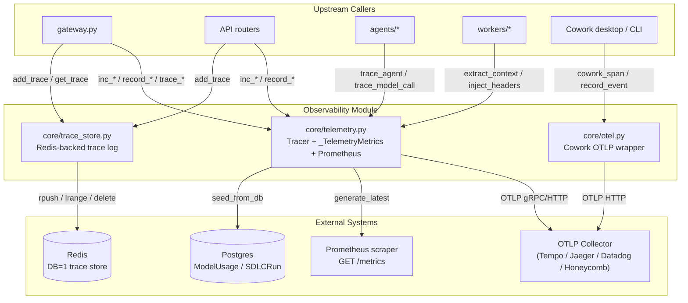
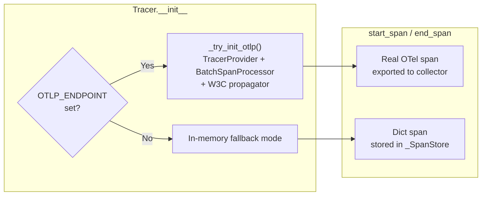
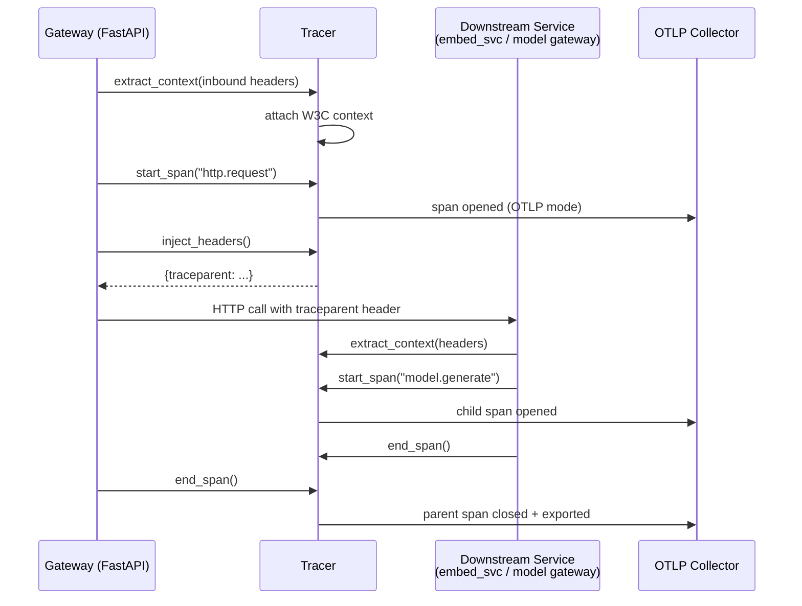
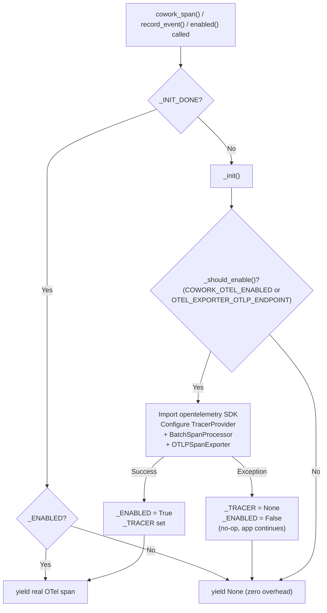
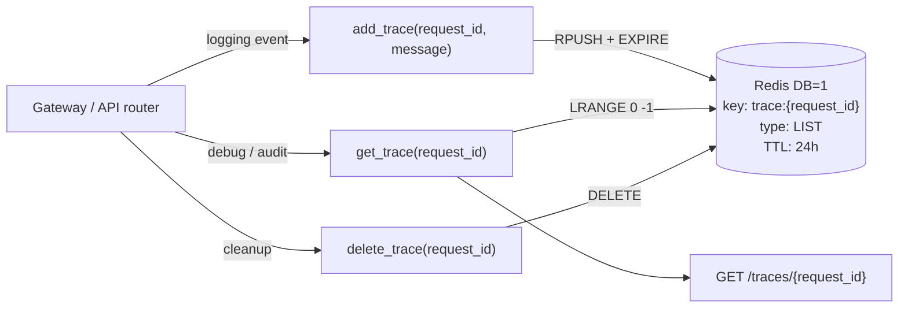
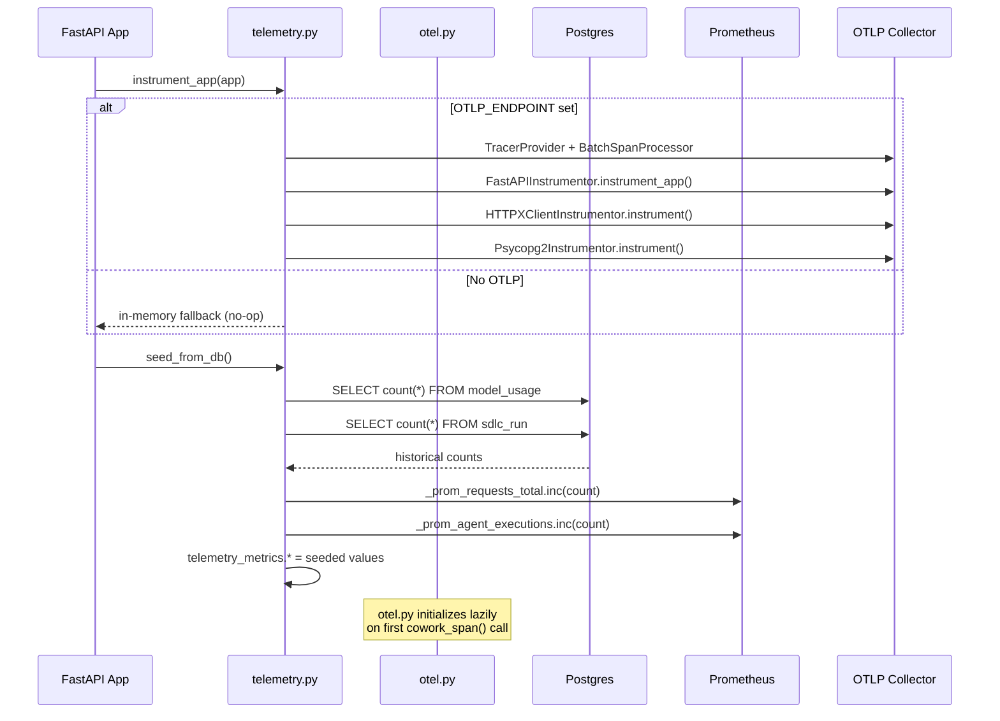
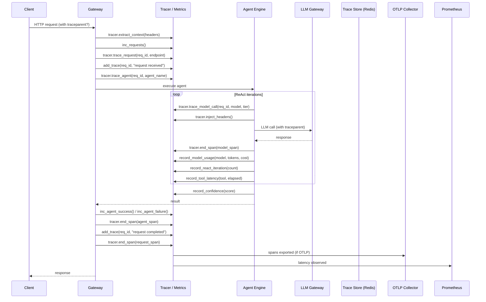
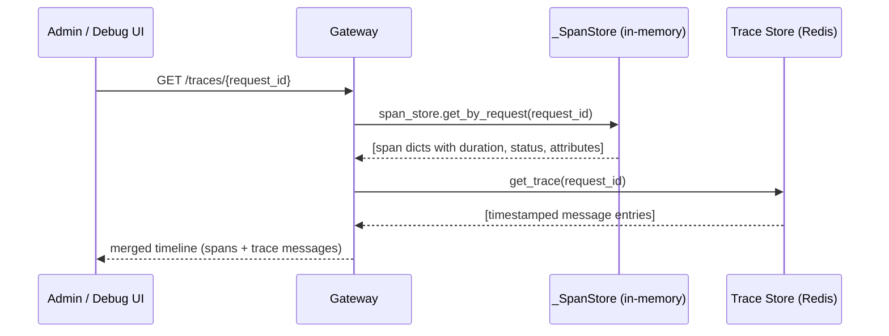
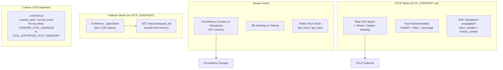

# Core Infrastructure: Observability

## Brief Introduction

The `core_infrastructure_observability` module provides the unified observability layer for the AiNxt / ABStudio platform. It collects metrics, distributed traces, and request-level trace logs from across the gateway, workers, agents, and Cowork desktop flows, then exposes them through Prometheus, OpenTelemetry (OTLP), and a Redis-backed trace store.

The module is designed to operate in two modes:

- **Production mode**: OpenTelemetry spans are exported to an OTLP collector (e.g., Grafana Tempo, Jaeger, Datadog, Honeycomb), Prometheus counters/histograms are scraped by `/metrics`, and W3C `traceparent` propagation links services.
- **Local / fallback mode**: When no OTLP endpoint is configured, traces are kept in a bounded in-memory span store (last 1,000 spans) and Prometheus metrics still work locally.

This module is part of the broader [`core_infrastructure`](core_infrastructure.md) family. It depends on [`core_infrastructure_config_logging`](core_infrastructure_config_logging.md) for configuration and logging, and on [`core_infrastructure_resilience_storage`](core_infrastructure_resilience_storage.md) for the KV-backed trace store.

---

## Core Responsibilities

| Responsibility | Description |
| -------------- | ----------- |
| **Metrics collection** | Prometheus counters/histograms for requests, agent executions, workflow executions, model usage, cache hits, compliance blocks, errors, tool latency, RAG latency, ReAct iterations, confidence scores, and verifier loops. |
| **Distributed tracing** | OpenTelemetry span creation, context propagation, and auto-instrumentation of FastAPI, `httpx`, and `psycopg2`. |
| **In-memory trace fallback** | Bounded span store for environments without an OTLP collector, still serving per-request timelines. |
| **Cowork telemetry** | Optional, zero-overhead OTLP wrapper for Cowork desktop events (tool calls, connector access, document generation, usage). |
| **Production trace store** | Redis-backed, TTL-scoped trace log storage keyed by `request_id`. |
| **DB seeding** | Seeds Prometheus counters from persisted DB counts on startup so metrics survive restarts. |

---

## Architecture

---

## Component Overview

### 1. `core/telemetry.py` - Unified Telemetry Engine

This is the primary observability file. It contains four major subsystems:

#### 1a. Prometheus Metrics

A set of module-level `Counter`, `Histogram`, and `Gauge` objects are defined at import time. These are always active (no OTLP dependency) and are scraped via the `/metrics` endpoint.

| Metric | Type | Labels | Description |
| ------ | ---- | ------ | ----------- |
| `codenxt_requests_total` | Counter | - | Total HTTP requests |
| `codenxt_agent_executions_total` | Counter | - | Agent executions |
| `codenxt_workflow_executions_total` | Counter | - | Workflow executions |
| `codenxt_compliance_blocks_total` | Counter | - | Compliance violations blocked |
| `codenxt_errors_total` | Counter | - | Total errors |
| `codenxt_cache_hits_total` | Counter | - | Cache hits |
| `codenxt_agent_success_total` | Counter | - | Agent successful executions |
| `codenxt_agent_failure_total` | Counter | - | Agent failed executions |
| `codenxt_request_latency_seconds` | Histogram | - | Request latency (s) |
| `codenxt_model_calls_total` | Counter | `model` | API calls per model |
| `codenxt_model_tokens_total` | Counter | `model` | Tokens consumed per model |
| `codenxt_model_cost_usd_total` | Counter | `model` | Cost in USD per model |
| `codenxt_tool_failures_total` | Counter | `tool` | Agent tool failures |
| `codenxt_cache_type_hits_total` | Counter | `cache_type` | Cache hits by type |
| `codenxt_tool_latency_seconds` | Histogram | `tool` | Tool execution latency |
| `codenxt_rag_retrieval_latency_seconds` | Histogram | - | RAG hybrid retrieval latency |
| `codenxt_react_loop_iterations` | Histogram | - | ReAct loop tool-round count |
| `codenxt_confidence_score` | Histogram | - | Hybrid confidence score (0-1) |
| `codenxt_verifier_loop_count` | Histogram | - | Goal-verifier recovery loop count |

#### 1b. `_SpanStore` - In-Memory Trace Fallback

A thread-safe, bounded (last 1,000 spans) in-memory store used when no OTLP endpoint is configured. It supports:

- `add(span)` - append a span dict, trimming to 1,000 entries.
- `get_by_request(request_id)` - filter spans by request ID (used by `/traces/{request_id}`).
- `list_recent(limit)` - return the most recent N spans.

#### 1c. `Tracer` - Dual-Mode Distributed Tracer

The `Tracer` class is the central tracing abstraction. It auto-detects whether OTLP is available and switches between real OpenTelemetry spans and in-memory fallback spans transparently.

**Key methods:**

| Method | Purpose |
| ------ | ------- |
| `start_span(name, request_id, attributes)` | Begin a span. Returns a dict that is passed to `end_span()`. In OTLP mode, the dict holds a reference to the real OTel span. |
| `end_span(span, error)` | Close a span, compute duration, record error if any, close OTel span if present, and always store in `_SpanStore`. |
| `trace_request(request_id, endpoint)` | Convenience: start an `http.request` span. |
| `trace_agent(request_id, agent_name)` | Convenience: start an `agent.execute` span. |
| `trace_workflow(request_id, workflow_name)` | Convenience: start a `workflow.execute` span. |
| `trace_model_call(request_id, model, tier)` | Convenience: start a `model.generate` span. |
| `trace_retrieval(request_id, repo, source)` | Convenience: start a `rag.retrieval` span. |
| `trace_compliance(request_id, direction)` | Convenience: start a `compliance.check` span. |
| `record_tool_latency(tool_name, elapsed_sec)` | Observe tool execution latency histogram. |
| `record_rag_latency(elapsed_sec)` | Observe RAG retrieval latency histogram. |
| `record_react_iteration(iteration_count)` | Observe ReAct loop iteration count. |
| `record_confidence(score)` | Observe hybrid confidence score. |
| `record_verifier_loops(loop_count)` | Observe goal-verifier recovery loop count. |
| `inject_headers()` | Return W3C `traceparent` headers for outbound HTTP calls. |
| `extract_context(headers)` | Attach inbound trace context in workers/jobs. |

**Context propagation flow:**

#### 1d. `instrument_app(app)` — Auto-Instrumentation

Called once at application startup (after `app = FastAPI(...)`). When OTLP is enabled, it wires OpenTelemetry auto-instrumentation for:

- **FastAPI / Starlette** — one span per HTTP request, enriched with `ainxt.request_id`, `ainxt.user_id`, `ainxt.chat_id` via `_fastapi_request_hook`.
- **httpx** — one span per outbound HTTP call (to embed_svc, model gateways, etc.).
- **psycopg2** — one span per Postgres query (with SQL commenter enabled).

Excluded URLs: `health`, `metrics`, `favicon`.

#### 1e. `_TelemetryMetrics` — Unified Metrics Interface

A dual-mode metrics object that maintains in-memory counters **and** increments the corresponding Prometheus counters simultaneously. Used by `gateway.py` and API routers.

| Method | Description |
| ------ | ----------- |
| `inc(name, value)` | Increment a named counter in both in-memory and Prometheus. |
| `record_latency(ms)` | Record a latency sample (in-memory ring buffer of 200 + Prometheus histogram). |
| `record_model_usage(model, tokens, cost_usd)` | Track per-model calls, tokens, and cost. |
| `record_tool_failure(tool)` | Increment tool failure counter. |
| `record_cache_hit(cache_type)` | Increment cache hit counter by type. |
| `to_prometheus()` | Return Prometheus text exposition format. |
| `to_json()` | Return JSON summary with avg/p95 latency, model stats, OTLP status. |

**Module-level convenience functions** (backward-compatible wrappers around `telemetry_metrics`):

`inc_requests()`, `inc_agent_executions()`, `inc_workflow_executions()`, `inc_compliance_blocks()`, `inc_errors()`, `inc_cache_hits()`, `inc_agent_success()`, `inc_agent_failure()`, `record_model_usage()`, `get_prometheus_metrics()`.

#### 1f. `seed_from_db()` — Startup Counter Seeding

On application startup, this function queries Postgres (`ModelUsage`, `SDLCRun` tables) to seed Prometheus counters so they reflect historical counts after a restart. It sets both the Prometheus counter values and the in-memory `_TelemetryMetrics` attributes.

---

### 2. `core/otel.py` - Cowork Enterprise Telemetry

A separate, optional OTLP wrapper designed specifically for the Cowork desktop / CLI subsystem. It is **fully no-op at rest** - it only activates when both the `opentelemetry` SDK is importable and an endpoint is configured (`OTEL_EXPORTER_OTLP_ENDPOINT` or `COWORK_OTEL_ENABLED=true`).

**Design principles:**
- Zero overhead when disabled (no imports, no latency).
- Span attributes are **low-cardinality and non-sensitive** only (tool names, connector slugs, user/department IDs, status, token counts, cost). Never payloads, screen pixels, or tool arguments.
- Model-agnostic - does not assume any specific LLM provider.

| Component | Description |
| --------- | ----------- |
| `enabled()` | Lazily initializes the tracer provider and returns whether telemetry is active. |
| `cowork_span(name, **attributes)` | Context manager wrapping a Cowork operation in an OTLP span. No-op when disabled. On exception, marks span as error and re-raises. |
| `record_event(name, **attributes)` | Fire-and-forget convenience wrapper for discrete events (usage, publish, etc.). Never raises. |

**Initialization flow:**

---

### 3. `core/trace_store.py` - Redis-Backed Production Trace Store

A lightweight, Redis-backed trace log that stores timestamped messages keyed by `request_id`. This is separate from the OpenTelemetry span store - it provides a simple append-only log of human-readable trace messages for debugging and audit.

**Configuration:**
- Uses `RDB_TRACE` from `core/config.py` to select the Redis database number.
- Backend (Redis) is selected via `REDIS_CLIENT_CONFIG_DB1` environment variable, abstracted through the `core.kv.get_kv()` interface (see [`core_infrastructure_resilience_storage`](core_infrastructure_resilience_storage.md)).
- TTL: 24 hours (`TRACE_TTL = 86400`).

| Function | Description |
| -------- | ----------- |
| `add_trace(request_id, message)` | Append a timestamped JSON entry to the Redis list `trace:{request_id}` and set TTL. |
| `get_trace(request_id)` | Return all trace entries for a request as a list of parsed JSON dicts. |
| `delete_trace(request_id)` | Delete the trace list for a request (optional cleanup). |

**Data flow:**

---

## Dependencies

```mermaid
flowchart TB
    subgraph "This Module"
        TEL["core/telemetry.py"]
        OTEL["core/otel.py"]
        TS["core/trace_store.py"]
    end

    subgraph "Internal Dependencies"
        CFG["core/config.py<br/>(RDB_TRACE)"]
        LOG["core/logger.py<br/>(logger, get_request_id,<br/>get_user_id, get_chat_id)"]
        KV["core/kv<br/>(get_kv)"]
        DB["db/database.py<br/>(SessionLocal)"]
        DBMODELS["db/models.py<br/>(ModelUsage, SDLCRun)"]
    end

    subgraph "External Dependencies"
        PROM["prometheus_client"]
        OTELSDK["opentelemetry-sdk<br/>(optional, lazy import)"]
        OTELFASTAPI["opentelemetry-instrumentation-fastapi<br/>(optional)"]
        OTELHTTPX["opentelemetry-instrumentation-httpx<br/>(optional)"]
        OTELPSYCO["opentelemetry-instrumentation-psycopg2<br/>(optional)"]
        OTLPHTTP["opentelemetry-exporter-otlp-proto-http<br/>(optional)"]
        OTLPGRPC["opentelemetry-exporter-otlp-proto-grpc<br/>(optional)"]
        SA["sqlalchemy<br/>(func)"]
    end

    TEL --> LOG
    TEL --> DB
    TEL --> DBMODELS
    TEL --> PROM
    TEL -.->|"lazy, conditional"| OTELSDK
    TEL -.->|"lazy, conditional"| OTELFASTAPI
    TEL -.->|"lazy, conditional"| OTELHTTPX
    TEL -.->|"lazy, conditional"| OTELPSYCO
    TEL -.->|"lazy, conditional"| OTLPHTTP
    TEL -.->|"lazy, conditional"| OTLPGRPC
    TEL --> SA

    OTEL --> LOG
    OTEL -.->|"lazy, conditional"| OTELSDK
    OTEL -.->|"lazy, conditional"| OTLPHTTP

    TS --> CFG
    TS --> LOG
    TS --> KV
```

### Internal Module References

| Dependency | Module | Purpose |
| ---------- | ------ | ------- |
| `core/config.py` | [`core_infrastructure_config_logging`](core_infrastructure_config_logging.md) | Provides `RDB_TRACE` for trace store DB selection. |
| `core/logger.py` | [`core_infrastructure_config_logging`](core_infrastructure_config_logging.md) | Logging, request/user/chat ID extraction for span enrichment. |
| `core/kv` | [`core_infrastructure_resilience_storage`](core_infrastructure_resilience_storage.md) | `get_kv()` abstraction over Redis for trace store. |
| `db/database.py` | [`database`](../storage/database.md) | `SessionLocal` for DB seeding. |
| `db/models.py` | [`database`](../storage/database.md) | `ModelUsage`, `SDLCRun` ORM models for counter seeding. |

### External Dependencies

| Package | Required? | Purpose |
| ------- | --------- | ------- |
| `prometheus_client` | **Yes** | Counters, histograms, text exposition format. |
| `opentelemetry-sdk` | Optional (lazy) | TracerProvider, BatchSpanProcessor, Resource. |
| `opentelemetry-exporter-otlp-proto-http` | Optional (lazy) | OTLP HTTP exporter (telemetry.py + otel.py). |
| `opentelemetry-exporter-otlp-proto-grpc` | Optional (lazy) | OTLP gRPC exporter (telemetry.py). |
| `opentelemetry-instrumentation-fastapi` | Optional (lazy) | FastAPI auto-instrumentation. |
| `opentelemetry-instrumentation-httpx` | Optional (lazy) | httpx auto-instrumentation. |
| `opentelemetry-instrumentation-psycopg2` | Optional (lazy) | psycopg2 auto-instrumentation. |
| `sqlalchemy` | Yes (via db layer) | `func` for aggregate queries in `seed_from_db()`. |

---

## Environment Variables

### `core/telemetry.py`

| Variable | Default | Description |
| -------- | ------- | ----------- |
| `OTLP_ENDPOINT` | `""` (empty) | OTLP collector endpoint. When empty, in-memory fallback is used. |
| `OTLP_PROTOCOL` | `grpc` | Export protocol: `grpc` or `http`. |
| `ENABLE_TRACING` | `1` | Master switch for tracing (`1` = enabled). |
| `SERVICE_NAME` | `ainxt-gateway` | OpenTelemetry service name attribute. |

### `core/otel.py`

| Variable | Default | Description |
| -------- | ------- | ----------- |
| `OTEL_EXPORTER_OTLP_ENDPOINT` | - | Standard OTLP endpoint. Presence enables Cowork telemetry. |
| `COWORK_OTEL_ENABLED` | - | Explicitly enable Cowork telemetry (`1`/`true`/`yes`/`on`). |
| `OTEL_SERVICE_NAME` | `ainxt-cowork` | Cowork service name in OTLP resource. |

### `core/trace_store.py`

| Variable | Default | Description |
| -------- | ------- | ----------- |
| `RDB_TRACE` | (from `core/config.py`) | Redis database number for trace store. |
| `REDIS_CLIENT_CONFIG_DB1` | - | Selects KV backend for DB=1. |

---

## How the Module Fits into the Overall System

### Gateway Integration

The `gateway.py` module (see [`health_and_monitoring`](../observability/health_and_monitoring.md)) is the primary consumer:

1. **Startup**: Calls `instrument_app(app)` to wire auto-instrumentation, then `seed_from_db()` to seed counters.
2. **Per-request**: Calls `inc_requests()`, `tracer.trace_request()`, and `add_trace()` for each incoming request.
3. **Agent execution**: Calls `inc_agent_executions()`, `inc_agent_success()` / `inc_agent_failure()`, and `tracer.trace_agent()`.
4. **Model calls**: Calls `record_model_usage(model, tokens, cost)` and `tracer.trace_model_call()`.
5. **Endpoints**: Exposes `GET /metrics` (Prometheus) and `GET /traces/{request_id}` (in-memory span store + Redis trace log).

### Worker Integration

Background workers (see [`worker_orchestration`](../workers/worker_orchestration.md)) use:

- `tracer.extract_context(headers)` - to continue a trace from the gateway.
- `tracer.inject_headers()` - to propagate trace context to downstream services.
- `add_trace()` - to log worker-specific events to the Redis trace store.

### Cowork Desktop Integration

The Cowork desktop app and CLI runtime (see [`cowork_desktop`](../cowork/cowork_desktop.md)) use `core/otel.py`:

- `cowork_span("tool.execute", tool=..., user_id=..., status=...)` - wraps tool executions.
- `record_event("usage.recorded", tokens=..., cost_usd=...)` - fire-and-forget usage events.

### Agent System Integration

The agent framework (see [`agent_system`](../agents/agent_system.md)) uses operational metric helpers:

- `tracer.record_tool_latency(tool_name, elapsed_sec)` - per-tool latency.
- `tracer.record_rag_latency(elapsed_sec)` - RAG retrieval latency.
- `tracer.record_react_iteration(iteration_count)` - ReAct loop depth.
- `tracer.record_confidence(score)` - hybrid confidence score.
- `tracer.record_verifier_loops(loop_count)` - goal-verifier recovery iterations.

---

## Process Flows

### Application Startup Sequence

### Request Lifecycle (Tracing + Metrics)

### Trace Retrieval Flow

---

## Dual-Mode Operation Summary

---

## Key Design Decisions

1. **Lazy OTel imports**: All `opentelemetry` imports are inside `try/except` blocks or conditional on endpoint configuration. This ensures the module never fails at import time if the OTel SDK is not installed.

2. **Dual-write for metrics**: `_TelemetryMetrics.inc()` updates both an in-memory counter and the Prometheus counter. This allows `to_json()` to return a quick snapshot for admin dashboards while Prometheus handles the authoritative scrape.

3. **Span store always populated**: Even in OTLP mode, `end_span()` always stores a cleaned span dict in `_SpanStore`. This ensures the `/traces/{request_id}` endpoint works regardless of collector availability.

4. **Separate Cowork telemetry**: `core/otel.py` is intentionally separate from `core/telemetry.py` to keep Cowork's tracing concerns isolated, with its own initialization logic, service name, and no-op guarantees. It uses the standard `OTEL_EXPORTER_OTLP_ENDPOINT` env var rather than the gateway-specific `OTLP_ENDPOINT`.

5. **Non-sensitive attributes only**: Both `Tracer` and `cowork_span` enforce that span attributes are low-cardinality metadata (names, IDs, counts, statuses). Tool arguments, results, screen content, and payloads are never recorded in spans - compliance redaction happens elsewhere in the pipeline.

6. **Redis trace store is append-only**: The trace store uses Redis `RPUSH` to append timestamped messages, providing a simple audit trail that complements (but does not replace) the structured OTel span data.