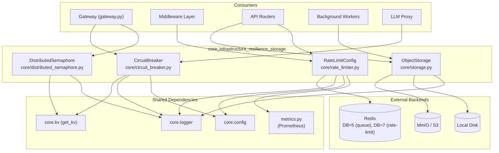
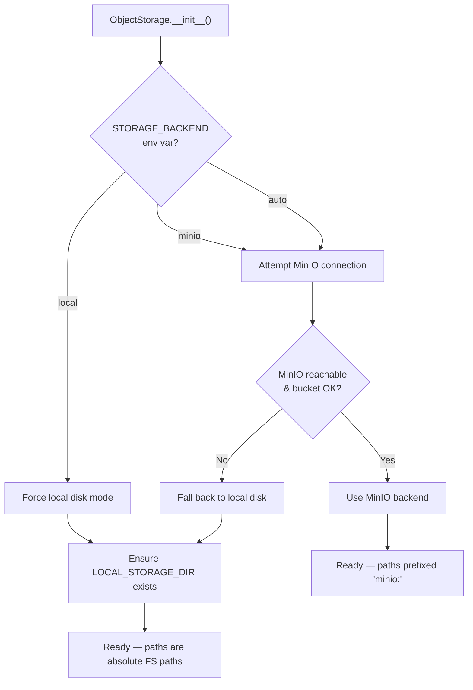
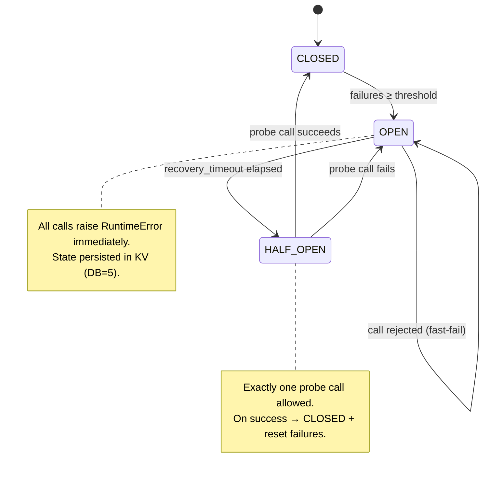
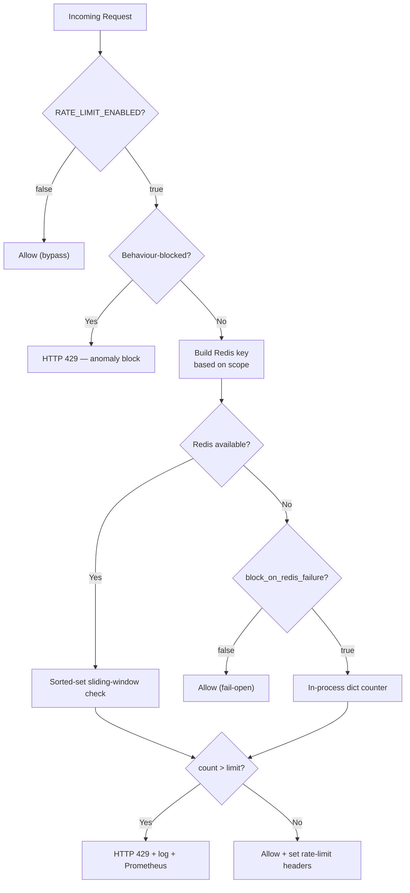
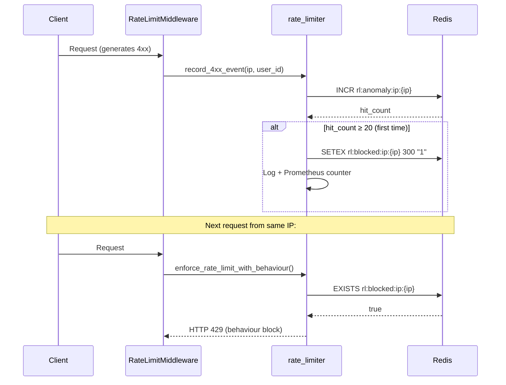
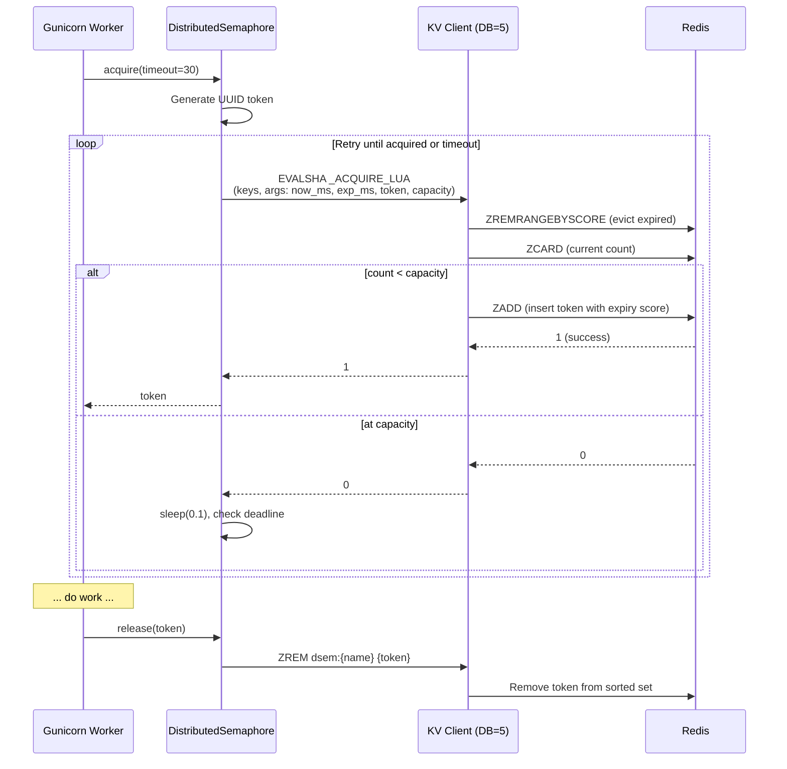
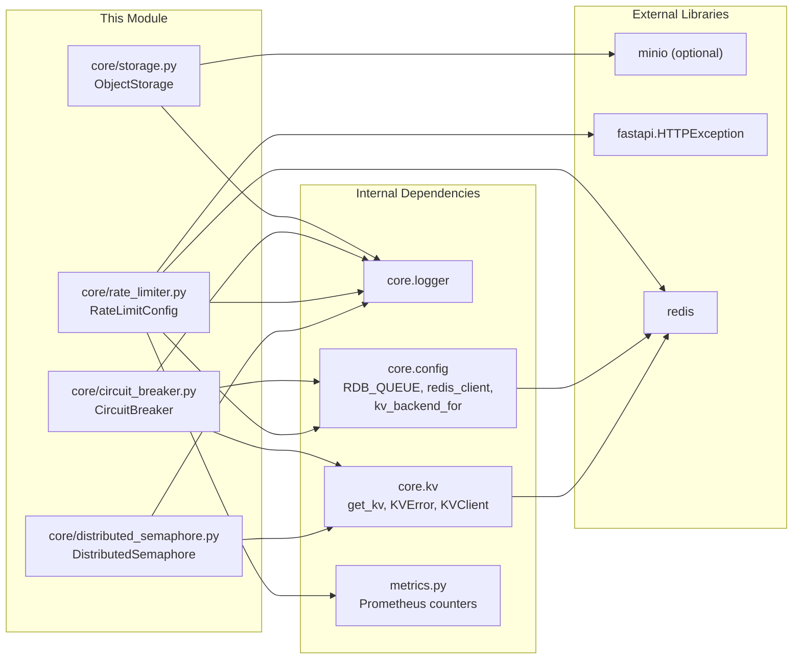
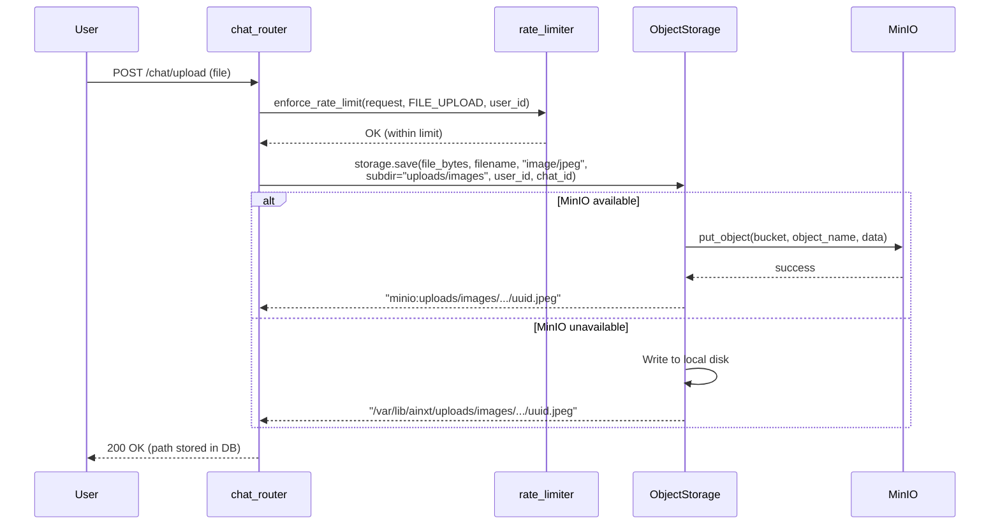

# Core Infrastructure — Resilience & Storage

## 1. Introduction

The **core_infrastructure_resilience_storage** module provides four foundational
cross-cutting capabilities that every gateway worker, background worker, and API
router relies on:

| Capability | Primary Component | Purpose |
|---|---|---|
| **Object Storage** | `ObjectStorage` (`core/storage.py`) | Unified byte-level persistence with MinIO primary / local-disk fallback |
| **Circuit Breaking** | `CircuitBreaker` (`core/circuit_breaker.py`) | Per-provider failure isolation with Redis-backed shared state |
| **Rate Limiting** | `RateLimitConfig` (`core/rate_limiter.py`) | Sliding-window throttling (IP / user / behaviour-based) with anomaly detection |
| **Distributed Concurrency** | `DistributedSemaphore` (`core/distributed_semaphore.py`) | Cross-process counting semaphore for LLM concurrency control |

These components sit at the lowest layer of the platform's resilience stack.
They are designed to **fail safe** (fail-open or fail-closed depending on the
component), **share state across all gunicorn workers** via the KV layer, and
**degrade gracefully** when dependencies (MinIO, Redis) are
temporarily unavailable.

> **Parent module:** This is a sub-module of
> [core_infrastructure](core_infrastructure.md). See also
> [core_infrastructure_config_logging](core_infrastructure_config_logging.md),
> [core_infrastructure_observability](core_infrastructure_observability.md),
> core_infrastructure_security, and
> [kv_store](../storage/kv_store.md).

---

## 2. Architecture Overview



### 2.1 Design Principles

1. **Shared state across workers** — Circuit breaker state, semaphore slots, and
   rate-limit counters all live in the KV layer (Redis), not in
   per-process memory. This prevents split-brain and thundering-herd scenarios
   when one worker sees a failure but others do not.

2. **Graceful degradation** — Every component has a defined fallback when its
   backend is unavailable:
   - `ObjectStorage` → falls back from MinIO to local disk.
   - `CircuitBreaker` → fails **OPEN** (fast-fail) to prevent independent
     per-worker state divergence.
   - `RateLimitConfig` → falls back to an in-process counter (single-node) or
     fails **open** (allows request through) depending on `block_on_redis_failure`.
   - `DistributedSemaphore` → requires KV; no silent in-memory fallback.

3. **Path / key sanitisation** — Storage paths and Redis keys are sanitised to
   prevent path traversal and shard-injection attacks.

4. **Observability hooks** — Rate-limit events emit structured logs and
   Prometheus counters; circuit breakers expose `status()` for admin endpoints.

---

## 3. Component Documentation

### 3.1 ObjectStorage

**File:** `core/storage.py`
**Singleton:** `storage` (module-level instance)

#### Purpose

Provides a unified API for persisting and retrieving binary blobs (chat
attachments, uploaded documents/images, generated files). The backend is
auto-detected: MinIO is used when available and reachable; otherwise local disk
is used. All paths returned by `save()` are opaque strings that callers pass
back to `load()` / `delete()` without needing to know the underlying backend.

#### Backend Selection



#### Path Layout

When `user_id` and/or `chat_id` are supplied, objects are sharded into a
hierarchical layout:

```
<subdir>/<sanitised_user_id>/<sanitised_chat_id>/<uuid>.<ext>
```

When all three of `subdir`, `user_id`, and `chat_id` are empty, a legacy flat
layout is used (for generated docs/images that have no user/chat context).

| Backend | Returned Path Format | Example |
|---|---|---|
| MinIO | `minio:<object_name>` | `minio:uploads/images/user123/chat456/abc.jpeg` |
| Local disk | Absolute filesystem path | `/var/lib/ainxt/uploads/images/user123/chat456/abc.jpeg` |

#### Local Disk Directory Resolution

The local base directory is resolved per-subdir to keep uploaded assets
separate from generated assets:

| Subdir prefix | Env var used | Fallback |
|---|---|---|
| `uploads/images` | `AINXT_UPLOAD_IMAGE_PATH` | `LOCAL_STORAGE_DIR/uploads/images` |
| `uploads/documents` | `AINXT_UPLOAD_DOCUMENT_PATH` | `LOCAL_STORAGE_DIR/uploads/documents` |
| (other / empty) | — | `LOCAL_STORAGE_DIR/<subdir>` |

> See [core_infrastructure_config_logging](core_infrastructure_config_logging.md)
> for the full set of storage path environment variables (`DOC_STORAGE_DIR`,
> `IMAGE_STORAGE_DIR`, `UPLOAD_DOCUMENT_PATH`, `UPLOAD_IMAGE_PATH`).

#### Public API

| Method | Description |
|---|---|
| `save(data, filename, content_type, subdir, user_id, chat_id) → str` | Persist bytes; returns opaque path |
| `load(path) → bytes \| None` | Load bytes from a previously-returned path |
| `delete(path) → bool` | Delete an object; `True` on success |
| `presigned_url(path, expires) → str \| None` | MinIO-only presigned download URL; `None` for local disk |
| `backend` (property) | Returns `"minio"` or `"local"` |

#### Security: Path Sanitisation

Two regex patterns enforce safe path construction:

- **`_SUBDIR_RE`** — allows nested paths (`/` permitted) but strips dangerous
  characters; `..` sequences are replaced with `_`.
- **`_SEGMENT_RE`** — for single shard segments (user_id, chat_id); **no `/`
  allowed**, preventing shard-injection via values like `a/../../etc`.

#### Environment Variables

| Variable | Default | Description |
|---|---|---|
| `STORAGE_BACKEND` | `auto` | `auto` / `minio` / `local` |
| `MINIO_ENDPOINT` | `localhost:9000` | MinIO server address |
| `MINIO_ACCESS_KEY` | `minioadmin` | MinIO access key |
| `MINIO_SECRET_KEY` | `minioadmin` | MinIO secret key |
| `MINIO_BUCKET` | `chat-attachments` | Bucket name (auto-created if missing) |
| `MINIO_SECURE` | `false` | Use TLS |
| `AINXT_UPLOAD_IMAGE_PATH` | (see config) | Local base for uploaded images |
| `AINXT_UPLOAD_DOCUMENT_PATH` | (see config) | Local base for uploaded documents |
| `LOCAL_STORAGE_DIR` | `storage/chat_attachments` | Legacy fallback base directory |

---

### 3.2 CircuitBreaker

**File:** `core/circuit_breaker.py`
**Registry:** `get_breaker(name)` returns a singleton per name

#### Purpose

Protects downstream providers (LLM APIs, Jira, GitLab, Confluence, embed
service) from cascading failures. When a provider exceeds its failure
threshold, the circuit opens and all subsequent calls fast-fail immediately
without hitting the downstream service. After a recovery timeout, a single
probe call is allowed (half-open); if it succeeds, the circuit closes.

#### State Machine



#### KV State Persistence

All circuit state is stored in the **queue KV (DB=5)** so every gunicorn
worker shares the same view:

| Redis Key Pattern | Content | TTL |
|---|---|---|
| `cb:{name}:state` | `CLOSED` / `OPEN` / `HALF_OPEN` | 24 h |
| `cb:{name}:failures` | Integer failure counter | 24 h |
| `cb:{name}:opened_at` | Unix timestamp of OPEN transition | 24 h |

> **KV unavailable behaviour:** If the KV backend is down, `_get_redis()`
> returns `None` and the circuit breaker **fails OPEN**. This is a deliberate
> safety choice — it prevents each worker from maintaining independent state
> and causing a thundering herd when KV recovers.

#### Per-Provider Tuning Defaults

| Provider | Failure Threshold | Recovery Timeout |
|---|---|---|
| `jira` | 5 | 30 s |
| `gitlab` | 5 | 30 s |
| `confluence` | 5 | 30 s |
| `openai` | 10 | 30 s |
| `anthropic` | 10 | 30 s |
| `google` | 10 | 30 s |
| `ollama` | 8 | 20 s |
| `embed_svc` | 8 | 15 s |
| (default) | 10 | 30 s |

External API providers (Jira/GitLab/Confluence) have lower thresholds because
they are more flaky; LLM APIs tolerate occasional timeouts, so they have higher
thresholds.

#### Public API

| Function / Method | Description |
|---|---|
| `get_breaker(name, failure_threshold?, recovery_timeout?) → CircuitBreaker` | Get or create a named singleton breaker |
| `breaker.call(fn, *args, **kwargs) → Any` | Execute `fn` with circuit-breaker protection; raises `RuntimeError` if OPEN |
| `breaker.is_open → bool` | Check if circuit is currently open (auto-transitions to HALF_OPEN if timeout elapsed) |
| `breaker.status() → dict` | Return state, failure count, thresholds, and opened-at timestamp |
| `all_breaker_states() → list[dict]` | Status of all registered breakers |

#### Feature Flag

| Variable | Default | Effect |
|---|---|---|
| `CIRCUIT_BREAKER_DISABLED` | (unset) | When `1`/`true`/`yes`, all `call()` invocations bypass the breaker and execute `fn` directly |

#### Admin Endpoints

Circuit breaker state is exposed and resettable via the
[admin_router](shared_api_routers.md) module:

- `GET /admin/circuit-breakers` → `all_breaker_states()`
- `POST /admin/circuit-breakers/{name}/reset` → `reset_circuit_breaker`
- `POST /admin/circuit-breakers/reset-all` → `reset_all_circuit_breakers`

The gateway's health-and-monitoring surface also exposes
`circuit_breaker_health` (see [gateway health_and_monitoring](gateway.md)).

---

### 3.3 RateLimitConfig

**File:** `core/rate_limiter.py`

#### Purpose

Implements multi-tier rate limiting to protect authentication endpoints, APIs,
and sensitive actions from brute-force, DoS, and abuse. Uses a Redis
sliding-window algorithm (sorted-set) as the primary store with an in-process
dict fallback for single-node deployments.

#### Rate-Limit Enforcement Flow



#### Scopes

| Scope | Key Format | Use Case |
|---|---|---|
| `ip` | `rl:{prefix}:ip:{ip}` | Auth endpoints (anti-brute-force) |
| `user` | `rl:{prefix}:user:{user_id}` | Per-user API throttling |
| `ip+user` | `rl:{prefix}:both:{user_id}:{ip}` | Sensitive actions (uploads, budget) |

#### Behaviour-Based Anomaly Detection

Beyond static rate limits, the system tracks 4xx response patterns per IP and
user. If a client generates ≥ 20 4xx responses within 60 seconds, its rate-limit
ceiling is automatically halved for 5 minutes via a Redis TTL flag.



| Anomaly Parameter | Value |
|---|---|
| `_ANOMALY_4XX_THRESHOLD` | 20 4xx events |
| `_ANOMALY_WINDOW` | 60 seconds |
| `_ANOMALY_BLOCK_SECONDS` | 300 seconds (5 min) |

#### Predefined Rate-Limit Configurations

| Constant | Limit | Window | Scope | Target |
|---|---|---|---|---|
| `AUTH_LOGIN` | 10 | 5 min | ip | `POST /auth/login` |
| `AUTH_REGISTER` | 5 | 10 min | ip | `POST /auth/register` |
| `AUTH_REFRESH` | 30 | 1 min | ip | `POST /auth/refresh` |
| `SSO_CALLBACK` | 20 | 1 min | ip | `POST /sso/callback` |
| `FILE_UPLOAD` | 30 | 5 min | ip+user | Chat/KB file uploads |
| `BUDGET_REQUEST` | 5 | 1 hour | ip+user | Budget increase requests |
| `BUDGET_ADMIN` | 100 | 1 min | ip+user | Admin budget allocations |
| `GLOBAL_API_USER` | 200 | 1 min | user | Global per-user API backstop |
| `GLOBAL_API_IP` | 300 | 1 min | ip | Global per-IP API backstop |
| `SENSITIVE_ADMIN` | 50 | 1 min | ip+user | Sensitive admin actions |
| `DOCS_UPLOAD` | 20 | 5 min | ip+user | KB/docs uploads |

#### Public API

| Function | Description |
|---|---|
| `enforce_rate_limit(request, config, user_id?)` | Check sliding-window limit; raises `HTTP 429` if exceeded |
| `enforce_rate_limit_with_behaviour(request, config, user_id?)` | Behaviour-block check + sliding-window (for non-auth endpoints) |
| `record_4xx_event(ip, user_id?)` | Increment 4xx anomaly counter (called by middleware) |
| `is_behaviour_blocked(ip, user_id?) → bool` | Check if IP/user is under anomaly block |

#### Redis DB Allocation

Rate limiting uses **Redis DB=7** (dedicated, separate from auth lockout DB=6
and the embed cache DB=7 in some deployments — see
[core_infrastructure_config_logging](core_infrastructure_config_logging.md) for
the canonical DB allocation table).

#### Feature Flag

| Variable | Default | Effect |
|---|---|---|
| `RATE_LIMIT_ENABLED` | `false` | When `false`, all rate-limit checks are bypassed (dev/test only) |

#### Integration with Middleware

The `RateLimitMiddleware` (see [middleware](middleware.md)) calls
`record_4xx_event()` after every 4xx response and reads rate-limit headers from
`request.state` (set by `enforce_rate_limit()`) to inject `X-RateLimit-*`
response headers.

---

### 3.4 DistributedSemaphore

**File:** `core/distributed_semaphore.py`

#### Purpose

Provides a cross-process counting semaphore backed by a Redis sorted set. It
limits concurrent access to shared resources — primarily LLM API concurrency
(the gateway's global LLM slot pool). Each acquired slot auto-expires after a
TTL, so crashed workers release their slot without any cleanup code.

#### Acquire / Release Flow



#### Atomic Acquire (Lua Script)

The acquire operation is atomic via a single Lua script execution, eliminating
the need for `WATCH`/`MULTI`:

```lua
-- Evict expired entries
redis.call('ZREMRANGEBYSCORE', key, 0, now_ms)
local count = redis.call('ZCARD', key)
if count < capacity then
    redis.call('ZADD', key, exp_ms, token)
    return 1
end
return 0
```

The script is registered via `kv_client.register_script()`, which uses
`EVALSHA` with automatic `EVAL` fallback — see [kv_store](../storage/kv_store.md) for the
backend-agnostic script interface.

#### TTL-Based Auto-Release

Each token is stored in the sorted set with its **expiry timestamp** as the
score. On every acquire attempt, `ZREMRANGEBYSCORE` evicts all tokens whose
score is ≤ current time. This means:

- A worker that crashes without calling `release()` automatically frees its
  slot after `ttl_ms` (default 60 s).
- No background cleanup process is needed.
- `current_count()` also evicts stale entries before returning.

#### Public API

| Method | Description |
|---|---|
| `__init__(kv_client, name, capacity, ttl_ms=60_000)` | Create a semaphore with given capacity and slot TTL |
| `acquire(timeout=30.0) → str \| None` | Block until a slot is available or timeout; returns opaque token or `None` |
| `release(token)` | Release a previously acquired slot |
| `current_count() → int` | Evict stale entries and return current active count |

#### Gateway Integration

The gateway uses `DistributedSemaphore` for global LLM concurrency control and
exposes monitoring via:

- `semaphore_stats` — current count / capacity
- `_adaptive_semaphore_monitor` — background monitor that adjusts capacity
  based on provider health

See [gateway health_and_monitoring](gateway.md) for details.

---

## 4. Dependency Map



### 4.1 Dependency Details

| Dependency | Used By | Purpose | Reference |
|---|---|---|---|
| `core.logger` | All four components | Structured logging | [core_infrastructure_config_logging](core_infrastructure_config_logging.md) |
| `core.config.RDB_QUEUE` | `CircuitBreaker`, `DistributedSemaphore` | KV DB=5 for shared state | [core_infrastructure_config_logging](core_infrastructure_config_logging.md) |
| `core.config.redis_client()` | `RateLimitConfig` | Direct Redis client for DB=7 | [core_infrastructure_config_logging](core_infrastructure_config_logging.md) |
| `core.kv.get_kv()` | `CircuitBreaker`, `DistributedSemaphore` | Backend-agnostic KV access (Redis) | [kv_store](../storage/kv_store.md) |
| `core.kv.KVError` | `CircuitBreaker` | Detect KV unavailability | [kv_store](../storage/kv_store.md) |
| `core.kv.KVClient.register_script()` | `DistributedSemaphore` | Atomic Lua script execution | [kv_store](../storage/kv_store.md) |
| `metrics.py` | `RateLimitConfig` | Prometheus `rate_limit_exceeded_total` counter | [core_infrastructure_observability](core_infrastructure_observability.md) |
| `minio` (optional) | `ObjectStorage` | S3-compatible object storage client | External |
| `fastapi` | `RateLimitConfig` | `HTTPException` (429), `Request` for IP extraction | External |

---

## 5. Consumer Interaction Map

```mermaid
graph TB
    subgraph "Gateway"
        GWHealth["health / circuit_breaker_health<br/>semaphore_stats"]
        GWAdaptive["_adaptive_semaphore_monitor"]
    end

    subgraph "Middleware"
        RLmw["RateLimitMiddleware"]
    end

    subgraph "API Routers"
        AuthRouter["auth_router<br/>(login, register, refresh, SSO)"]
        ChatRouter["chat_router<br/>(upload_chat_files)"]
        DocsRouter["docs_router<br/>(upload_doc)"]
        BudgetRouter["budget_router<br/>(request_increase, admin)"]
        AdminRouter["admin_router<br/>(circuit-breaker management)"]
    end

    subgraph "Workers"
        DocWorkers["doc_worker, kb_worker"]
    end

    subgraph "LLM Proxy"
        LLMProxyGW["LLM gateway calls"]
    end

    subgraph "This Module"
        OS["ObjectStorage"]
        CB["CircuitBreaker"]
        RL["RateLimitConfig"]
        DS["DistributedSemaphore"]
    end

    AuthRouter --> RL
    ChatRouter --> RL
    ChatRouter --> OS
    DocsRouter --> RL
    DocsRouter --> OS
    BudgetRouter --> RL
    AdminRouter --> CB
    RLmw --> RL
    GWHealth --> CB
    GWHealth --> DS
    GWAdaptive --> DS
    DocWorkers --> OS
    LLMProxyGW --> CB
    LLMProxyGW --> DS
```



### 5.1 Key Consumer Scenarios

#### File Upload (Chat Attachment)



#### LLM Call with Circuit Breaker + Semaphore

```mermaid
sequenceDiagram
    participant GW as Gateway
    participant DS as DistributedSemaphore
    participant CB as CircuitBreaker
    participant LLM as LLM Provider

    GW->>DS: acquire(timeout=30)
    DS-->>GW: token
    GW->>CB: get_breaker("openai").call(llm_fn)
    CB->>CB: Check state
    alt Circuit OPEN
        CB-->>GW: RuntimeError (fast-fail)
    else Circuit CLOSED / HALF_OPEN
        CB->>LLM: Execute LLM call
        alt Success
            LLM-->>CB: response
            CB->>CB: Reset failures, set CLOSED
            CB-->>GW: response
        else Failure
            LLM-->>CB: error
            CB->>CB: Increment failures
            alt failures ≥ threshold
                CB->>CB: Set OPEN + opened_at
            end
            CB-->>GW: re-raise error
        end
    end
    GW->>DS: release(token)
```



---

## 6. Redis / KV DB Allocation

This module uses two logical KV databases:

| DB | Constant | Used By | Purpose |
|---|---|---|---|
| 5 | `RDB_QUEUE` | `CircuitBreaker`, `DistributedSemaphore` | Shared circuit-breaker state + semaphore sorted sets |
| 7 | (rate-limit) | `RateLimitConfig` | Sliding-window rate-limit counters + anomaly flags |

> The backend for each DB is independently configurable via
> `REDIS_CLIENT_CONFIG_DB{n}`. See
> [core_infrastructure_config_logging](core_infrastructure_config_logging.md)
> and [kv_store](../storage/kv_store.md) for the full DB allocation table and backend
> selection logic.

---

## 7. Environment Variable Reference

### ObjectStorage

| Variable | Default | Description |
|---|---|---|
| `STORAGE_BACKEND` | `auto` | `auto` / `minio` / `local` |
| `MINIO_ENDPOINT` | `localhost:9000` | MinIO server endpoint |
| `MINIO_ACCESS_KEY` | `minioadmin` | MinIO access key |
| `MINIO_SECRET_KEY` | `minioadmin` | MinIO secret key |
| `MINIO_BUCKET` | `chat-attachments` | Bucket name |
| `MINIO_SECURE` | `false` | Use TLS |
| `AINXT_UPLOAD_IMAGE_PATH` | (see config) | Local uploaded-image directory |
| `AINXT_UPLOAD_DOCUMENT_PATH` | (see config) | Local uploaded-document directory |
| `LOCAL_STORAGE_DIR` | `storage/chat_attachments` | Legacy fallback base |

### CircuitBreaker

| Variable | Default | Description |
|---|---|---|
| `CIRCUIT_BREAKER_DISABLED` | (unset) | Bypass all breakers when `1`/`true`/`yes` |

### RateLimitConfig

| Variable | Default | Description |
|---|---|---|
| `RATE_LIMIT_ENABLED` | `false` | Master switch; `false` bypasses all rate limiting |

### DistributedSemaphore

No environment variables — capacity and TTL are passed programmatically by the
caller (e.g., the gateway's LLM concurrency controller).

---

## 8. Cross-Module References

| Topic | Reference |
|---|---|
| Central configuration & logging | [core_infrastructure_config_logging](core_infrastructure_config_logging.md) |
| Telemetry, tracing, Prometheus metrics | [core_infrastructure_observability](core_infrastructure_observability.md) |
| Prompt injection, security validation, RAG ACL | core_infrastructure_security |
| KV layer (Redis abstraction) | [kv_store](../storage/kv_store.md) |
| Middleware (rate-limit, budget, request-id) | [middleware](middleware.md) |
| Gateway health & monitoring endpoints | [gateway](gateway.md) |
| Admin router (circuit-breaker management) | [shared_api_routers](shared_api_routers.md) |
| Parent core infrastructure module | [core_infrastructure](core_infrastructure.md) |
