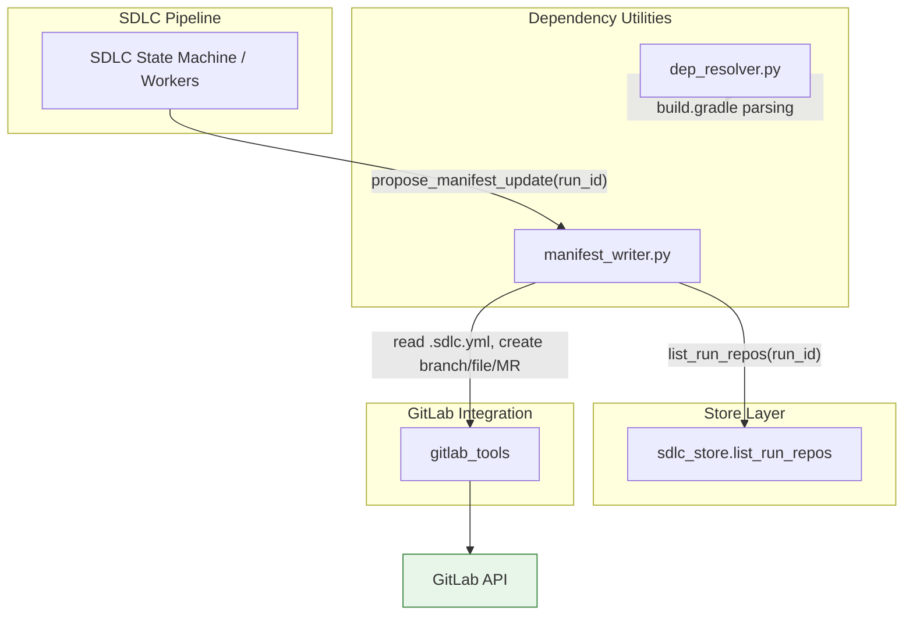
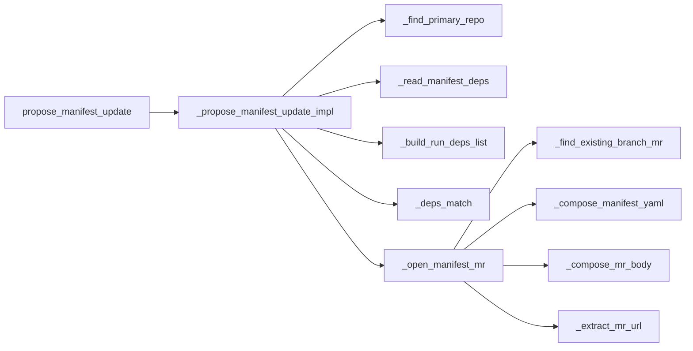
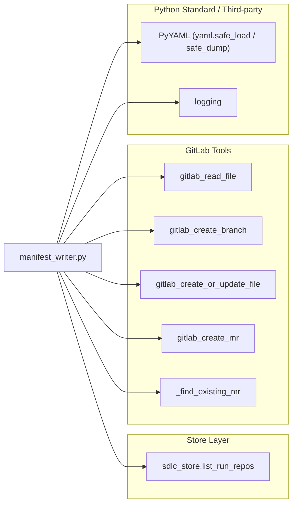
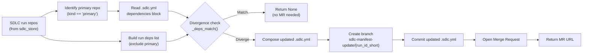
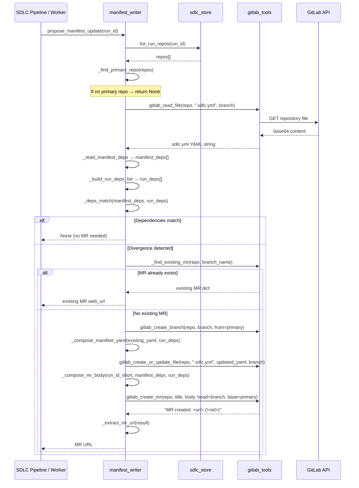
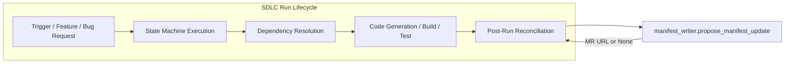

# Dependency Utilities — Manifest Writer

## Brief Introduction

The **Manifest Writer** module (`agents/manifest_writer.py`) is a best-effort
ergonomic component within the SDLC pipeline (Phase 6) that keeps a project's
`.sdlc.yml` dependency manifest in sync with the repositories actually used
during an SDLC run.

When a user modifies the dependency table at trigger time — diverging from what
`.sdlc.yml` declared — this module detects that divergence and automatically
opens a follow-up Merge Request against the primary repo's `.sdlc.yml`
`dependencies:` block. This ensures future runs pick up the change without
requiring the user to re-enter dependencies in the UI.

> **Design principle:** All errors are logged but never raised. The SDLC run is
> never blocked even if manifest update fails.

---

## Module Overview

| Attribute | Detail |
|---|---|
| **File** | `agents/manifest_writer.py` |
| **Parent module** | `dependency_utilities` (sibling of `dependency_utilities_resolution`) |
| **Public entry point** | `propose_manifest_update(run_id: str) -> str \| None` |
| **Returns** | MR URL if divergence detected & MR opened; `None` otherwise |
| **Failure mode** | Logs warning, returns `None` — never raises |
| **Trigger context** | SDLC pipeline Phase 6, post-run dependency reconciliation |

### Where It Fits



The Manifest Writer is invoked by the SDLC pipeline after run repositories are
finalized. It sits alongside the [dependency_utilities_resolution](dependency_utilities_resolution.md)
module (which handles Maven/Gradle dependency parsing) under the broader
`dependency_utilities` grouping. It relies on the [store_layer](../storage/store_layer.md)
for run-repo persistence and on [gitlab_tools](../connectors/gitlab_tools.md) for all GitLab
API interactions.

---

## Architecture & Component Relationships

### Internal Component Graph



### Component Reference

| Component | Visibility | Responsibility |
|---|---|---|
| `propose_manifest_update` | Public | Entry point; wraps implementation in try/except to guarantee no exception escapes |
| `_propose_manifest_update_impl` | Private | Orchestrates the full flow: fetch repos → identify primary → read manifest → compare → open MR |
| `_find_primary_repo` | Private | Locates the repo with `kind == "primary"` from the run's repo list |
| `_read_manifest_deps` | Private | Reads `.sdlc.yml` from GitLab and extracts the `dependencies:` block as a list of dicts |
| `_build_run_deps_list` | Private | Builds the as-built dependency list from run repos (excludes primary repo) |
| `_deps_match` | Private | Compares manifest and run deps as normalized sets of `(repo, ref, kind, build_order)` tuples |
| `_open_manifest_mr` | Private | Creates a branch, writes updated `.sdlc.yml`, and opens a Merge Request |
| `_find_existing_branch_mr` | Private | Idempotency check — returns an existing MR for the branch if one already exists |
| `_compose_manifest_yaml` | Private | Preserves existing top-level keys and replaces the `dependencies:` block with run deps |
| `_compose_mr_body` | Private | Generates a human-readable MR description listing added, removed, and modified dependencies |
| `_extract_mr_url` | Private | Parses the MR creation result string to extract the web URL |

---

## Dependencies

### External Module Dependencies



| Dependency | Module Reference | Purpose |
|---|---|---|
| `store.sdlc_store.list_run_repos` | [store_layer](../storage/store_layer.md) | Retrieves all `sdlc_run_repos` rows for a given run, ordered by `build_order` then `repo` |
| `tools.gitlab_tools.gitlab_read_file` | [gitlab_tools](../connectors/gitlab_tools.md) | Reads `.sdlc.yml` content from a GitLab repo at a specific branch |
| `tools.gitlab_tools.gitlab_create_branch` | [gitlab_tools](../connectors/gitlab_tools.md) | Creates a feature branch for the manifest update (idempotent) |
| `tools.gitlab_tools.gitlab_create_or_update_file` | [gitlab_tools](../connectors/gitlab_tools.md) | Commits the updated `.sdlc.yml` to the new branch |
| `tools.gitlab_tools.gitlab_create_mr` | [gitlab_tools](../connectors/gitlab_tools.md) | Opens a Merge Request from the feature branch to the primary branch |
| `tools.gitlab_tools._find_existing_mr` | [gitlab_tools](../connectors/gitlab_tools.md) | Checks for an existing open MR on the branch (idempotency) |
| `yaml` (PyYAML) | — | Parses and serializes `.sdlc.yml` content |
| `logging` | — | Structured warning/info logging for diagnostics |

---

## Data Flow



### Data Schema

**Run repo entry** (from `sdlc_run_repos`):

| Field | Description |
|---|---|
| `repo` | GitLab namespace/project path (e.g. `npci/payment-service`) |
| `ref` | Branch or tag reference |
| `kind` | Repo role: `"primary"` or dependency kind |
| `build_order` | Numeric build ordering (or `None`) |

**`.sdlc.yml` dependencies block** — a YAML list of dicts with the same
`repo`, `ref`, `kind`, and `build_order` keys.

---

## Process Flow: Manifest Divergence Detection & MR Creation



---

## Key Design Decisions

### 1. Best-Effort & Non-Blocking

The public `propose_manifest_update` function wraps all logic in a `try/except`.
Any exception — whether from the database, GitLab API, or YAML parsing — is
caught, logged as a warning, and results in `None`. The SDLC run is never
blocked by a manifest update failure.

### 2. Idempotency

Before creating a new MR, the module checks for an existing open MR on the
branch `sdlc-manifest-update/{run_id_short}`. If one exists, its `web_url` is
returned instead of creating a duplicate. The underlying GitLab tools
(`gitlab_create_branch`, `gitlab_create_mr`) are also idempotent at the API
level.

### 3. Normalized Comparison

Dependencies are compared as sets of `(repo, ref, kind, build_order)` tuples.
This means order differences in the YAML list do not trigger false divergences.

### 4. Manifest Preservation

When composing the updated `.sdlc.yml`, `_compose_manifest_yaml` preserves all
existing top-level keys from the original manifest and only replaces the
`dependencies:` block. If no manifest exists, a minimal one is created.

> **Limitation:** `yaml.safe_dump` does not preserve comments or exact
> formatting from the original file. Key order is preserved in Python 3.7+.

### 5. MR Description Quality

The `_compose_mr_body` function generates a structured Markdown description
that categorizes changes into:
- **Added dependencies** — repos present in the run but not in the manifest
- **Removed dependencies** — repos in the manifest but not in the run
- **Modified dependencies** — repos present in both but with changed `ref`, `kind`, or `build_order`

---

## Error Handling

| Scenario | Behavior | Return Value |
|---|---|---|
| No repos found for run | Logs warning | `None` |
| No primary repo in run | Logs warning | `None` |
| Primary repo missing `repo` or `ref` | Logs warning | `None` |
| `.sdlc.yml` read fails or is absent | Logs debug, treats as empty deps | Proceeds with empty manifest deps |
| `.sdlc.yml` is not a YAML mapping | Logs debug, returns `[]` | Proceeds with empty manifest deps |
| `dependencies` block is not a list | Logs warning, returns `[]` | Proceeds with empty manifest deps |
| Dependencies match | Logs info | `None` |
| MR already exists for branch | Logs info, returns existing MR URL | Existing MR URL |
| Branch/file/MR creation fails | Logs warning | `None` |
| Any uncaught exception | Caught by public wrapper, logs warning | `None` |

---

## Integration with the SDLC Pipeline

The Manifest Writer is part of the broader SDLC pipeline ecosystem. It is
typically called after the run's repository set is finalized — often during
post-run reconciliation in the [sdlc_pipeline_workers](../sdlc/sdlc_pipeline_workers.md)
or [sdlc_state_machine](../sdlc/sdlc_state_machine.md) phases.



### Related Modules

| Module | Relationship |
|---|---|
| [dependency_utilities_resolution](dependency_utilities_resolution.md) | Sibling module; parses `pom.xml` and `build.gradle` for dependency resolution |
| [sdlc_pipeline_core](../sdlc/sdlc_pipeline_core.md) | Orchestrates the overall SDLC pipeline phases |
| [sdlc_state_machine](../sdlc/sdlc_state_machine.md) | Drives run state transitions; may invoke manifest update during reconciliation |
| [sdlc_pipeline_workers](../sdlc/sdlc_pipeline_workers.md) | Background workers that execute SDLC jobs and post-run tasks |
| [store_layer](../storage/store_layer.md) | Provides `sdlc_store.list_run_repos` for run-repo persistence |
| [gitlab_tools](../connectors/gitlab_tools.md) | All GitLab API operations (file read, branch, commit, MR) |
| [shared_core_sdlc_pipeline](../sdlc/shared_core_sdlc_pipeline.md) | Broader SDLC pipeline agent and tooling context |

---

## Public API

### `propose_manifest_update(run_id: str) -> Optional[str]`

Detect manifest divergence and open a follow-up MR if needed.

**Parameters:**

| Parameter | Type | Description |
|---|---|---|
| `run_id` | `str` | SDLC run identifier |

**Returns:**

| Return | Meaning |
|---|---|
| `str` (MR URL) | A Merge Request was successfully created (or already existed) |
| `None` | No divergence detected, or any error occurred (logged but not raised) |

**Example call:**

```python
from agents.manifest_writer import propose_manifest_update

mr_url = propose_manifest_update("a1b2c3d4-e5f6-7890-abcd-ef1234567890")
if mr_url:
    print(f"Manifest update MR opened: {mr_url}")
else:
    print("No manifest update needed (or update failed silently)")
```

---

## Summary

The Manifest Writer is a small but important ergonomic module that closes the
loop between UI-driven dependency changes and the `.sdlc.yml` manifest. By
automatically detecting divergence and opening a follow-up MR, it ensures that
future SDLC runs use the correct dependency set without manual manifest
editing. Its best-effort, non-blocking design guarantees that manifest update
failures never disrupt the primary SDLC workflow.
