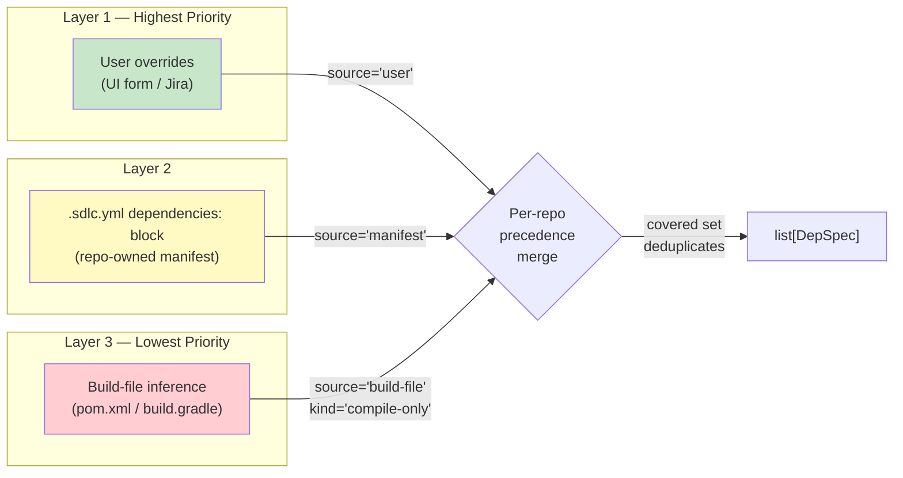
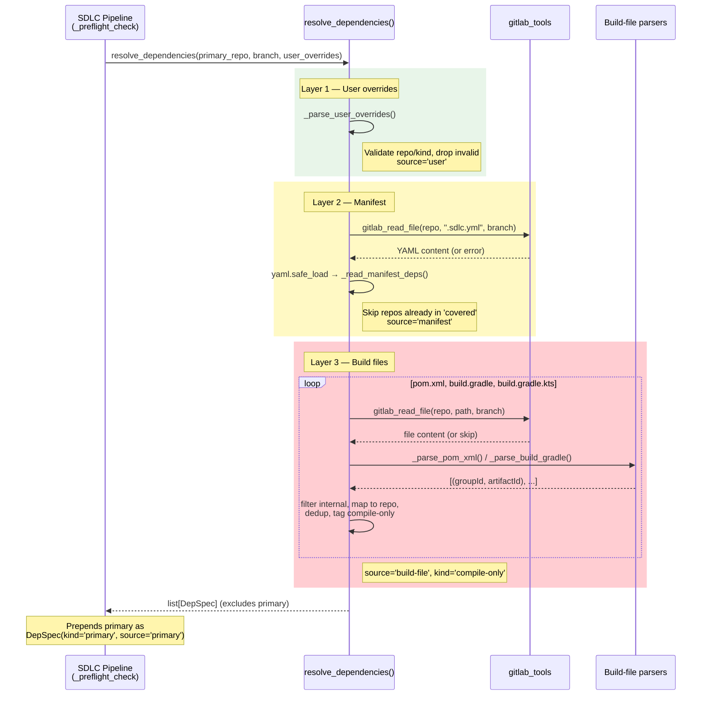
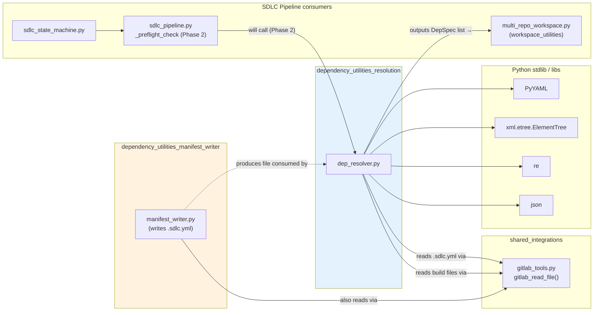
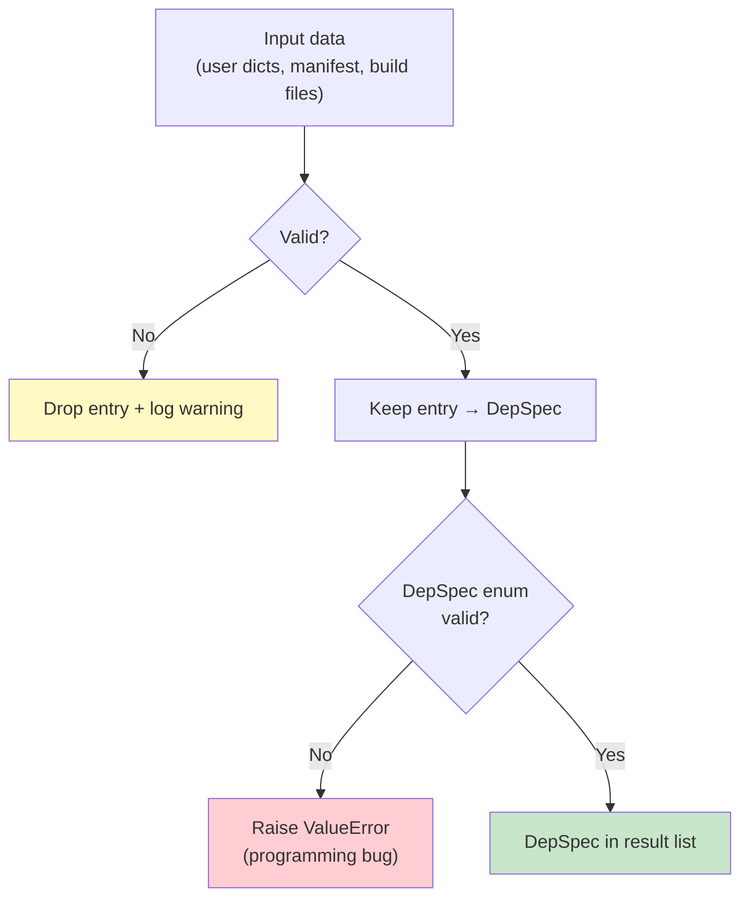

# Dependency Utilities — Resolution

> **Module ID:** `dependency_utilities_resolution`
> **Source file:** `agents/dep_resolver.py`
> **Parent module:** [dependency_utilities](#) (sibling: [dependency_utilities_manifest_writer](dependency_utilities_manifest_writer.md))
> **Grandparent:** [agent_system](#) → [shared_core](#)

---

## 1. Introduction

The **Dependency Resolution** module is a pure-function library that determines
*which additional repositories* must be checked out alongside a primary repo
when an SDLC (Software Development Lifecycle) run is triggered. It is the
authoritative answer to the question:

> *"Given repo X on branch Y, what other repos do I need to clone, and in what
> role (editable vs. compile-only), to build and test this change?"*

The module is intentionally side-effect-free at the resolution layer — it
produces a list of `DepSpec` records. The actual GitLab cloning / workspace
materialization is delegated to the
[workspace_utilities](#) module
(`agents/multi_repo_workspace.py`) and the SDLC pipeline's preflight stage.

### Design philosophy

| Principle | How it's enforced |
|---|---|
| **User is the final authority** | User overrides always win; lower-priority layers are dropped for any repo the user already named. |
| **Manifest is the durable answer** | The `.sdlc.yml` `dependencies:` block is the repo-owned, version-controlled source of truth for steady-state runs. |
| **Build-file inference is last-resort & tagged** | `pom.xml` / `build.gradle` parsing only runs when no higher layer covers a repo, and its outputs are always `source='build-file'`, `kind='compile-only'` — the LLM can never silently promote an inferred dep to editable. |
| **Fail-soft, never crash the pipeline** | Every external read (GitLab, YAML, XML) is wrapped; parse failures degrade to "no inferred deps" rather than raising. Hard validation failures are deferred to preflight. |

---

## 2. Architecture Overview

```mermaid
flowchart TB
    subgraph Callers["SDLC Pipeline (consumers)"]
        PF["_preflight_check<br/>(Phase 2 wiring)"]
    end

    subgraph Resolver["dep_resolver.py — this module"]
        ENTRY["resolve_dependencies()<br/>public entry point"]
        L1["_parse_user_overrides()<br/>Layer 1 — user input"]
        L2["_read_manifest_deps()<br/>Layer 2 — .sdlc.yml"]
        L3["_read_build_file_deps()<br/>Layer 3 — build files"]
        DS["DepSpec dataclass<br/>validated record"]
    end

    subgraph Parsers["Build-file parsers"]
        POM["_parse_pom_xml()"]
        GRD["_parse_build_gradle()"]
        NS["_strip_xml_namespace()"]
    end

    subgraph External["External dependencies"]
        GL["gitlab_tools.gitlab_read_file()"]
        YAML["PyYAML safe_load"]
        ET["xml.etree.ElementTree"]
    end

    subgraph Env["Configuration (env vars)"]
        E1["INTERNAL_GROUP_PREFIXES"]
        E2["INTERNAL_GITLAB_GROUP"]
        E3["INTERNAL_ARTIFACT_TO_REPO_MAP"]
    end

    PF --> ENTRY
    ENTRY --> L1
    ENTRY --> L2
    ENTRY --> L3
    L1 --> DS
    L2 --> YAML
    L2 --> GL
    L3 --> GL
    L3 --> POM
    L3 --> GRD
    L3 --> E1
    L3 --> E2
    L3 --> E3
    POM --> NS
    POM --> ET
    GRD --> DS
    L2 --> DS
    L3 --> DS

    DS -->|list[DepSpec]| PF
```

---

## 3. Core Components

### 3.1 `DepSpec` — the resolution record

A validated dataclass representing one repo participating in an SDLC run.

| Field | Type | Valid values | Description |
|---|---|---|---|
| `repo` | `str` | `namespace/project` path | GitLab repo path, e.g. `"npci/payments-sdk"`. Whitespace-stripped on init. |
| `ref` | `str` | branch / tag | Defaults to `"main"` if empty. |
| `kind` | `str` | `primary` \| `editable` \| `compile-only` | Role of the repo in the run. `editable` = LLM may modify; `compile-only` = build dependency only. |
| `source` | `str` | `user` \| `manifest` \| `build-file` \| `primary` | Provenance — where this entry was discovered. |
| `build_order` | `int \| None` | optional | Manual override for topological sort; `None` = "let the sorter decide". |

`__post_init__` enforces the enum constraints and raises `ValueError` on
violation — this is the one place the module raises, because an invalid
`DepSpec` indicates a programming bug, not a runtime data issue.

### 3.2 `resolve_dependencies()` — public entry point

```python
def resolve_dependencies(
    primary_repo: str,
    primary_branch: str,
    user_overrides: Iterable[dict] | None = None,
    *,
    fetch_manifest: bool = True,
    fetch_build_files: bool = True,
) -> list[DepSpec]
```

The single public API. Orchestrates the three-layer precedence resolution and
returns a flat list of `DepSpec` records **excluding** the primary repo itself
(callers prepend it separately as `kind='primary'`, `source='primary'`).

**Precedence is applied per-repo, not per-layer:** if `user_overrides`
mentions `npci/payments-sdk`, both the manifest's and build-file's entries for
that same repo are silently dropped. A `covered` set tracks repos already
resolved by a higher-priority layer.

The `fetch_manifest` / `fetch_build_files` flags allow callers (and tests) to
selectively disable layers — e.g. a dry-run might disable build-file inference.

### 3.3 Layer 1 — `_parse_user_overrides()`

Validates and normalizes user-supplied dependency entries (from the UI form or
parsed from a Jira description).

- **Input shape:** `{"repo": "...", "ref": "...", "kind": "...", "build_order": int?}`
- **Required fields:** `repo` (must contain `/`) and `kind` (`editable` or `compile-only`).
- **Behavior:** Invalid entries are *dropped with a warning* — never raised.
  This is deliberate: preflight is the place to hard-fail on bad user input;
  the resolver should be resilient.
- **Output:** `DepSpec` records with `source='user'`.

### 3.4 Layer 2 — `_read_manifest_deps()` / `_read_manifest_yaml()`

Reads the optional `dependencies:` block from `.sdlc.yml` in the primary repo.

- Fetches the file via `gitlab_read_file()`.
- Parses with `yaml.safe_load()`.
- Each entry must be a mapping with a valid `repo` path; `kind` defaults to
  `compile-only` if missing or invalid.
- Returns `DepSpec` records with `source='manifest'`.
- Any read/parse failure → empty list (preflight surfaces GitLab errors
  separately).

> **Relationship to [dependency_utilities_manifest_writer](dependency_utilities_manifest_writer.md):**
> The manifest *writer* (`agents/manifest_writer.py`) is the module that
> *generates and persists* the `.sdlc.yml` file. This resolver is the
> *reader* — it consumes the same `dependencies:` schema the writer produces.
> The two modules share the `.sdlc.yml` contract but are otherwise decoupled.

### 3.5 Layer 3 — `_read_build_file_deps()` and the parsers

The lowest-priority, inference-only layer. Parses Maven and Gradle build files
for internal dependency coordinates.

#### `_read_build_file_deps()`

Iterates over three candidate files in the primary repo:

| File | Parser |
|---|---|
| `pom.xml` | `_parse_pom_xml()` |
| `build.gradle` | `_parse_build_gradle()` |
| `build.gradle.kts` | `_parse_build_gradle()` |

For each parsed `(groupId, artifactId)` pair:
1. **Filter** via `_is_internal_group()` — only deps whose `groupId` starts
   with one of `INTERNAL_GROUP_PREFIXES` (default `org.npci.`) are kept.
   Third-party deps are left to Maven/Gradle to resolve at build time.
2. **Map** via `_resolve_artifact_to_repo()` — converts the Maven coordinate
   to a GitLab repo path using the artifact map (env override) or the
   heuristic `{INTERNAL_GITLAB_GROUP}/{artifactId}`.
3. **Deduplicate** across all three files using a `seen` set.
4. **Emit** a `DepSpec` with `kind='compile-only'`, `source='build-file'`.

#### `_parse_pom_xml(content)` — Maven POM parser

Extracts direct `(groupId, artifactId)` pairs from `<dependencies>` blocks,
**explicitly ignoring** `<dependencyManagement>` (those are version-only
declarations, not actual runtime deps).

- Uses `xml.etree.ElementTree` with a manual tree walk to distinguish
  `<dependencies>` inside `<dependencyManagement>` from real dependency blocks.
- `_strip_xml_namespace()` removes the default `xmlns` declaration so plain
  tag matching works (POM 4.0.0 namespace would otherwise prefix every tag).
- Malformed XML → `[]` (safe degradation).

#### `_parse_build_gradle(content)` — Gradle parser

A single regex (`_GRADLE_DEP_RE`) handles both Groovy and Kotlin DSL syntax,
matching common configuration keywords:

`implementation`, `api`, `compile`, `runtimeOnly`, `compileOnly`,
`testImplementation`, `testCompile`, `annotationProcessor`

…followed by a quoted coordinate string `group:artifact:version`.

### 3.6 Configuration helpers

| Function / constant | Purpose |
|---|---|
| `_INTERNAL_GROUP_PREFIXES` | Tuple of lowercased groupId prefixes (from `INTERNAL_GROUP_PREFIXES` env, default `org.npci.`). |
| `_INTERNAL_GITLAB_GROUP` | Default GitLab namespace for heuristic artifact→repo mapping (from `INTERNAL_GITLAB_GROUP` env, default `npci`). |
| `_load_artifact_map()` | Parses `INTERNAL_ARTIFACT_TO_REPO_MAP` env (JSON dict `groupId:artifactId → gitlab/path`) for explicit overrides when the heuristic is wrong. |
| `_is_internal_group(group_id)` | Returns `True` if the groupId matches any internal prefix. |
| `_resolve_artifact_to_repo(...)` | Maps a Maven coordinate to a GitLab repo path (artifact map first, then heuristic). |

---

## 4. Three-Layer Precedence Model



**Key rule:** precedence is *per-repo*, not per-layer. The `covered` set
ensures that once a repo is resolved by a higher layer, lower layers skip it
entirely. This means a user can override *one* dep from the manifest while
still letting the manifest supply the rest.

---

## 5. Data Flow



---

## 6. Dependency Graph



### External dependencies

| Dependency | Type | Used for |
|---|---|---|
| `tools.gitlab_tools.gitlab_read_file` | Internal ([shared_integrations](#) → `gitlab_tools`) | Fetching `.sdlc.yml`, `pom.xml`, `build.gradle` from GitLab |
| `yaml` (PyYAML) | Third-party | Parsing `.sdlc.yml` manifest |
| `xml.etree.ElementTree` | Stdlib | Parsing `pom.xml` |
| `re` | Stdlib | XML namespace stripping; Gradle dependency regex |
| `json` | Stdlib | Parsing `INTERNAL_ARTIFACT_TO_REPO_MAP` env var |

### Environment variables

| Variable | Default | Purpose |
|---|---|---|
| `INTERNAL_GROUP_PREFIXES` | `org.npci.` | Comma-separated groupId prefixes identifying internal artifacts. |
| `INTERNAL_GITLAB_GROUP` | `npci` | Default GitLab namespace for heuristic artifact→repo mapping. |
| `INTERNAL_ARTIFACT_TO_REPO_MAP` | *(empty)* | JSON dict mapping `groupId:artifactId` → `gitlab/namespace/path` for explicit overrides. |

---

## 7. How This Module Fits Into the System

### Position in the SDLC pipeline

The resolver sits at the **preflight stage** of the SDLC pipeline — before any
code is generated or tests are run, the system needs to know the full set of
repos that form the build context.


### Current status (per source docstring)

> *"Phase 1 status: defined but not yet called by the pipeline. Phase 2 wires
> it into `_preflight_check`."*

The module is fully implemented and tested as a standalone library. The
integration point is the SDLC pipeline's preflight stage
([sdlc_pipeline_core](#) / `agents/sdlc_pipeline.py`), which will call
`resolve_dependencies()` and pass the resulting `DepSpec` list to the
[workspace_utilities](#) module (`agents/multi_repo_workspace.py`) for
cloning.

### Relationship to sibling modules

| Module | Relationship |
|---|---|
| [dependency_utilities_manifest_writer](dependency_utilities_manifest_writer.md) | **Producer/consumer pair.** The manifest writer *generates* `.sdlc.yml`; this resolver *reads* it. They share the `dependencies:` schema contract but are otherwise decoupled. |
| [workspace_utilities](#) (`multi_repo_workspace.py`) | **Downstream consumer.** Receives the `DepSpec` list and performs the actual GitLab cloning / workspace materialization. |
| [sdlc_pipeline_core](#) (`sdlc_pipeline.py`) | **Orchestrator.** Will call `resolve_dependencies()` during preflight (Phase 2). |
| [sdlc_state_machine](#) (`sdlc_state_machine.py`) | **Pipeline driver.** Drives the SDLC stages that depend on a correctly resolved workspace. |

### Security & safety considerations

- **No auto-promotion of inferred deps:** Build-file inferences are always
  `kind='compile-only'`. Only a human (via user overrides) can mark a dep as
  `editable`, preventing the LLM from silently modifying repos it shouldn't.
- **Internal-only filtering:** Third-party Maven/Gradle dependencies are
  intentionally excluded — they're resolved by the build tool at compile time,
  not cloned as separate repos.
- **Fail-soft design:** All GitLab/YAML/XML errors degrade gracefully to
  "no inferred deps" rather than crashing the pipeline. Hard failures
  (invalid `DepSpec` enums) only occur on programming bugs, not bad data.

---

## 8. Validation & Error Handling Summary



| Error class | Handling strategy | Rationale |
|---|---|---|
| Malformed user override (missing repo, bad kind) | Drop + `logger.warning` | Preflight is the hard-fail gate; resolver stays resilient. |
| `.sdlc.yml` absent or unreadable | Return `[]` for that layer | Absence is normal — most repos have no multi-repo deps. |
| `.sdlc.yml` `dependencies:` not a list | Ignore + warning | Degrade safely. |
| `pom.xml` XML parse error | Return `[]` | Missing pom data = "no inferred deps" (safe). |
| GitLab fetch exception | Skip that file | Preflight surfaces GitLab connectivity errors separately. |
| `DepSpec` enum violation | `raise ValueError` | Indicates a code bug in the resolver itself, not bad input data. |

---

## 9. API Reference (quick)

```python
from agents.dep_resolver import resolve_dependencies, DepSpec

# Full resolution with all three layers
deps = resolve_dependencies(
    primary_repo="npci/payments-gateway",
    primary_branch="feature/new-endpoint",
    user_overrides=[
        {"repo": "npci/payments-sdk", "ref": "main", "kind": "editable"},
    ],
)

# deps does NOT include the primary repo — prepend it yourself:
all_repos = [
    DepSpec(repo="npci/payments-gateway", ref="feature/new-endpoint",
            kind="primary", source="primary"),
    *deps,
]

# Dry-run: manifest only, no build-file inference
deps = resolve_dependencies(
    "npci/payments-gateway", "main",
    fetch_build_files=False,
)

# Each DepSpec:
#   DepSpec(repo='npci/payments-sdk', ref='main', kind='editable',
#           source='user', build_order=None)
#   DepSpec(repo='npci/common-lib', ref='main', kind='compile-only',
#           source='manifest', build_order=None)
#   DepSpec(repo='npci/crypto-utils', ref='main', kind='compile-only',
#           source='build-file', build_order=None)
```
