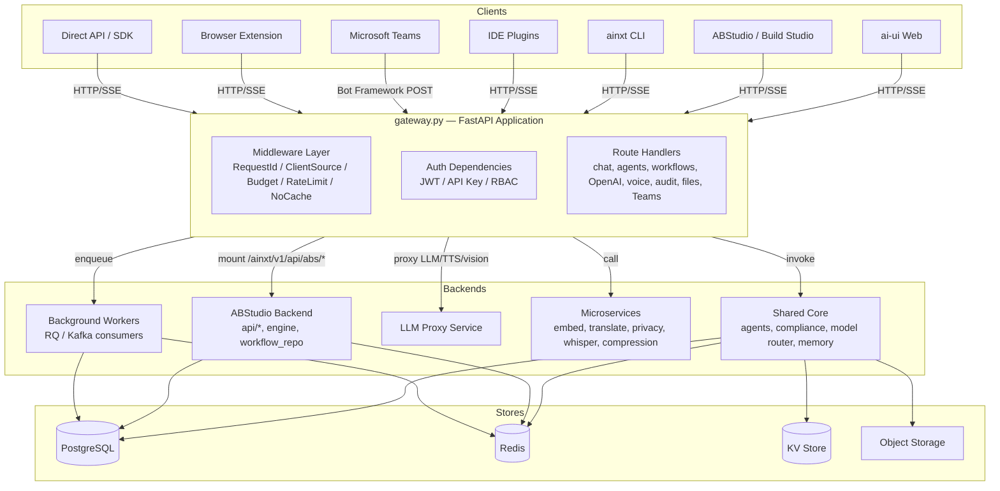
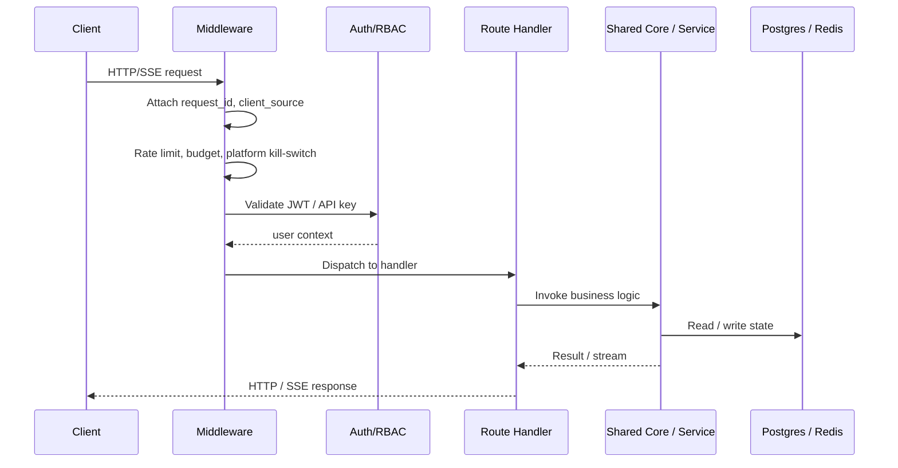

# Gateway Module Overview

## Purpose

The `gateway` module is the central FastAPI HTTP/SSE API facade for the AiNxt platform. Implemented primarily in `gateway.py`, it exposes the public REST and Server-Sent Events surface that all clients — the web UI (`ai-ui`), ABStudio / Build Studio, IDE plugins, CLI, Microsoft Teams, browser extensions, and direct API consumers — use to interact with the platform.

Its responsibilities include:

- **Request ingress & routing** — mounts all platform API endpoints, ABStudio routes, shared routers, and static SPA catch-alls.
- **Authentication & authorization** — enforces JWT/API-key auth and RBAC via shared dependencies.
- **Cross-cutting guardrails** — applies rate limiting, compliance scanning, budget gating, prompt-injection checks, and the platform kill-switch.
- **Real-time streaming** — serves SSE streams for chat, agent runs, workflow execution, and OpenAI-compatible completions.
- **Lifecycle & observability** — startup/shutdown orchestration, health checks, Prometheus metrics, distributed tracing, and audit-log exposure.
- **Asset serving** — serves the main React SPA, the ABStudio SPA, and generated file downloads.
- **Integration bridging** — forwards voice, vision, TTS, indexing, and Teams traffic to the appropriate backend services and workers.

In short, the gateway is the single entry point that turns external client requests into internal calls against the shared core, ABStudio backend, LLM proxy, microservices, and background workers.

---

## High-Level Architecture

---

## Module Decomposition

`gateway.py` is organized into cohesive endpoint groups. Each group is documented in its own module reference.

```mermaid
graph TB
    subgraph "gateway.py"
        HM[Health & Monitoring]
        AM[Agent Management]
        WM[Workflow Management]
        CM[Chat & Messaging]
        OAI[OpenAI-Compatible Endpoints]
        MTL[Model & Tool Listing]
        VT[Voice & TTS]
        IDX[Indexing & Search]
        AT[Audit & Tracing]
        FAS[File & Asset Serving]
        SG[Security & Governance]
        TI[Teams Integration]
    end

    HM -->|metrics / health / startup / shutdown| MON[Monitoring Stack]
    AM -->|CRUD + run| AGENTS[AgentBuilder / AgentRunner]
    WM -->|CRUD + execute| WF[WorkflowEngine / NativeEngine]
    CM -->|streaming chat + history| CHAT[Chat Worker / Memory]
    OAI -->|/v1/*| LLM_PROXY[LLM Proxy]
    VT -->|TTS / STT| SPEECH[LLM Proxy / Whisper Service]
    IDX -->|enqueue / search| INDEX[Index Worker / Hybrid Retriever]
    AT -->|trace / audit| AUDIT[Trace Store / Audit Tables]
    FAS -->|SPAs + downloads| STATIC[Static Files / Generated Artifacts]
    TI -->|Bot Framework| TEAMS_SVC[Teams Adapter / Notifier]
```

---

## Request Lifecycle

A typical request flows through the gateway as follows:

---

## Core Components

| Submodule | Key Responsibilities | Documentation |
|---|---|---|
| **Health & Monitoring** | `/health`, `/metrics`, `/health/circuit-breakers`, startup/shutdown, adaptive LLM semaphore, platform kill-switch. | [health_and_monitoring](../observability/health_and_monitoring.md) |
| **Agent Management** | Agent CRUD, enable/disable, synchronous/async execution, mid-build `talk_to_agent`. | [agent_management](../agents/agent_management.md) |
| **Workflow Management** | Legacy workflow CRUD + execution via `WorkflowEngine`; ABStudio graph workflows via `NativeEngine`. | [workflow_management](../workflows/workflow_management.md) |
| **Chat & Messaging** | `/ask`, `/ask/image`, async `/ask/submit` + `/ask/stream`, chat history, follow-ups, prompt enhancement, memory. | [chat_and_messaging](../chat/chat_and_messaging.md) |
| **OpenAI-Compatible Endpoints** | `/v1/chat/completions`, `/v1/responses`, `/v1/models` for IDE/SDK clients. | [openai_compatible_endpoints](../llm/openai_compatible_endpoints.md) |
| **Voice & TTS** | Text-to-speech and speech-to-text endpoints, routing to LLM proxy or local Whisper. | [voice_and_tts](../ui/voice_and_tts.md) |
| **Indexing & Search** | Codebase indexing enqueue/status and `/codebase/search` hybrid retrieval. | [indexing_and_search](../knowledge/indexing_and_search.md) |
| **Audit & Tracing** | Per-request traces, telemetry spans, governance/SDLC audit log, client activity. | [audit_and_tracing](../security/audit_and_tracing.md) |
| **File & Asset Serving** | Main SPA, ABStudio SPA, generated file downloads with TTL and path-traversal protection. | [file_and_asset_serving](../documents/file_and_asset_serving.md) |
| **Teams Integration** | Bot Framework webhook, command routing, HITL approval cards, proactive notifications. | [teams_integration](../connectors/teams_integration.md) |
| **Model & Tool Listing** | Model catalog, local models, tool/security-scan listings. | *(docs pending)* |
| **Security & Governance** | Guardrails reload, `NoCacheMiddleware`, rate-limit key helper. | *(docs pending)* |

---

## Key Design Decisions

1. **Single FastAPI application** — `gateway.py` mounts all routes in one process, simplifying deployment and shared middleware.
2. **Route registration order matters** — API and ABStudio routes are registered before the SPA catch-all `GET /{full_path:path}` so static-file serving never shadows API endpoints.
3. **Middleware-first guardrails** — request IDs, client-source detection, budget, rate limits, and cache-control headers are applied uniformly before handlers run.
4. **SSE for real-time UX** — chat, agent runs, workflow execution, and OpenAI-compatible endpoints stream tokens/events via Server-Sent Events.
5. **Async offload for heavy work** — long-running chat, indexing, document generation, and agent jobs are enqueued to RQ workers rather than holding HTTP connections.
6. **Dual workflow support** — the gateway retains the legacy flat-step `WorkflowEngine` while ABStudio provides the modern graph-based `NativeEngine`.
7. **Resilient observability** — tracing and audit writes are fire-and-forget or Kafka-backed so observability failures never block user requests.

---

## Related Modules

- [shared_core](shared_core.md) — compliance, model routing, agent framework, memory, telemetry.
- abstudio_backend — ABStudio API routes, native engine, workflow repo, agent factory.
- [llm_proxy](../llm/llm_proxy.md) — centralized LLM/TTS/vision proxy.
- [workers](../workers/workers.md) — background job consumers and schedulers.
- [shared_api_routers](shared_api_routers.md) — additional REST routers mounted by the gateway.