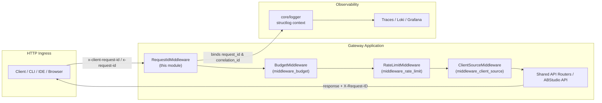
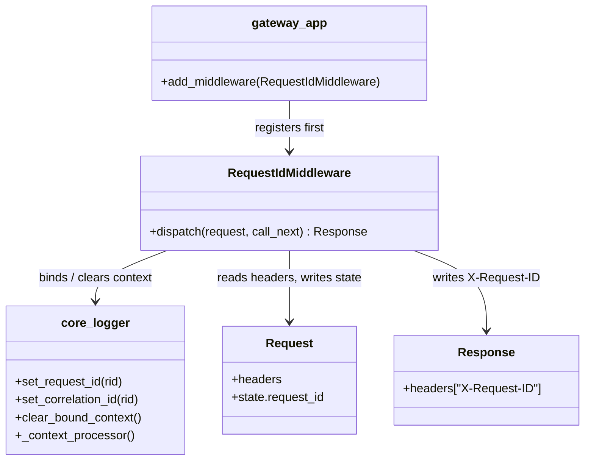
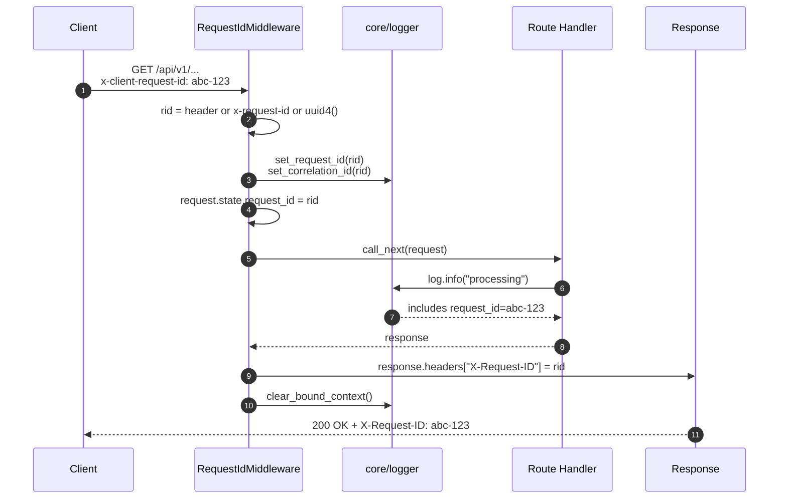
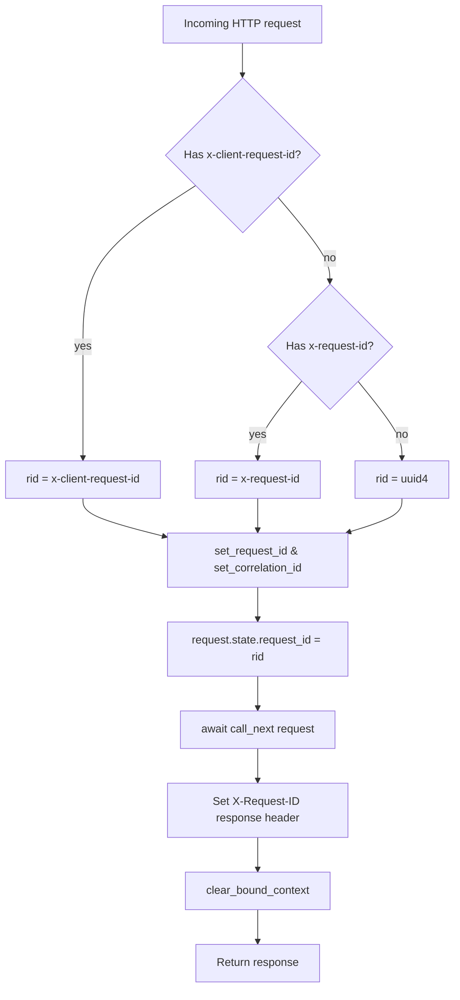

# `middleware_request_id` — Request ID Propagation Middleware

## Brief Introduction

The `middleware_request_id` module provides a single Starlette middleware —
`RequestIdMiddleware` — that guarantees every HTTP request entering the platform
is assigned a stable, globally traceable identifier from the moment it crosses
the gateway boundary. The resolved identifier is:

* bound to the thread-local / context-var logger so every downstream log line
  automatically carries the same `request_id` / `correlation_id`;
* exposed to route handlers via `request.state.request_id`; and
* echoed back to the caller in the `X-Request-ID` response header.

By centralising request ID assignment at the outermost middleware layer, the
rest of the system (routers, gateways, agents, workers, observability pipelines)
can rely on a consistent correlation key without each component re-implementing
its own ID generation logic.

---

## Core Functionality

`RequestIdMiddleware.dispatch` performs the following steps for every request:

1. **Resolve the incoming request ID**
   * Prefer `x-client-request-id` (set by `ainxt-cli`, IDE plugins, browser UI).
   * Fall back to `x-request-id` (generic HTTP correlation header).
   * Generate a fresh `uuid.uuid4()` when neither header is present.

2. **Bind the ID to the logging context**
   * Calls `set_request_id(rid)` and `set_correlation_id(rid)` from
     `core/logger.md`.
   * From this point on, every log line emitted by any downstream code includes
     the same `request_id` and `correlation_id` via the structlog context
     processor.

3. **Make the ID available to handlers**
   * Stores the resolved ID in `request.state.request_id` so route handlers can
     access it directly when needed (e.g. for tracing downstream calls).

4. **Continue the request**
   * Awaits `call_next(request)`, allowing the rest of the middleware stack and
     the route handler to execute with the ID already bound.

5. **Echo the ID in the response**
   * Sets `response.headers["X-Request-ID"] = rid` so clients can correlate
     their own logs with server-side traces.

6. **Clean up the logging context**
   * Calls `clear_bound_context()` after the response is produced. This prevents
     reused Gunicorn/uvicorn worker threads from leaking a stale request ID into
     the next request.

---

## Architecture

`RequestIdMiddleware` is intentionally placed at the **very beginning** of the
middleware stack (registered in [`gateway.md`](gateway.md) before
`BudgetMiddleware`). This ensures that:

* Budget/rate-limit decisions can be logged with the request ID.
* Every router, gateway client, and agent invocation shares the same
  correlation key.
* The `client_source` middleware (which runs later) can also attach its own
  context without overwriting the request ID.

---

## Component Relationships

### Key component

| Component | File | Responsibility |
|-----------|------|----------------|
| `RequestIdMiddleware` | `middleware/request_id_middleware.py` | Resolve, propagate, echo, and clean up the per-request correlation ID. |

---

## Data Flow

The same flow applies when no correlation header is supplied: the middleware
generates a UUID at step 2 and the rest of the lifecycle proceeds identically.

---

## Process Flow

---

## How It Fits into the Overall System

`middleware_request_id` is a foundational observability primitive. It sits in
the shared core middleware layer and is consumed by many other parts of the
platform:

* **Gateway / API entry point** — registered in [`gateway.md`](gateway.md) as
  the first middleware so every request is tagged before routing.
* **Logging & tracing** — relies on `core/logger.md` context
  variables. The logger's `_context_processor` injects `request_id` and
  `correlation_id` into every structured log event, which is then shipped to
  Loki/Grafana and the trace store.
* **Budget & rate limiting** — `middleware_budget.md`
  and `middleware_rate_limit.md` run after this
  middleware, so their audit and denial logs include the request ID.
* **Client source tracking** — [`middleware_client_source.md`](middleware_client_source.md)
  enriches the same logging context with the originating client channel
  (web, CLI, IDE, etc.).
* **Downstream routers & agents** — route handlers, gateway clients, LLM proxy
  calls, and agent workers can read `request.state.request_id` or rely on the
  logger context to propagate the same correlation key through internal HTTP
  calls and background jobs.

Because the middleware clears the bound context after each response, the
platform can safely run under traditional threaded workers (Gunicorn) without
risk of one request's ID bleeding into another.

---

## References

* `core/logger.md` — structlog context helpers
  (`set_request_id`, `set_correlation_id`, `clear_bound_context`).
* [`gateway.md`](gateway.md) — FastAPI/Starlette application where the
  middleware is registered.
* `middleware_budget.md` — budget enforcement
  middleware that runs after request ID assignment.
* `middleware_rate_limit.md` — rate limiting
  middleware that runs after request ID assignment.
* [`middleware_client_source.md`](middleware_client_source.md) — client source
  middleware that enriches the same logging context.
