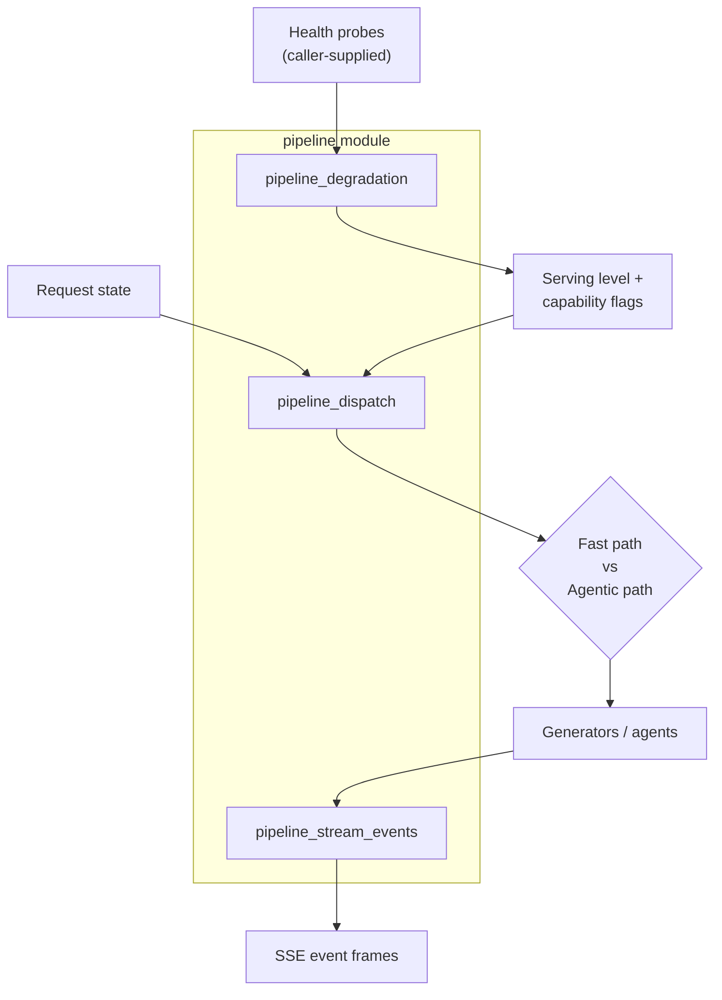
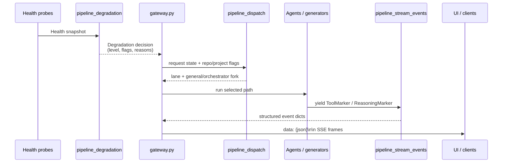

# Pipeline Module

The `pipeline` module is a small, pure-policy layer in the `shared_core` subsystem that makes the request-handling pipeline explicit, observable, and resilient. It contains no I/O and no side effects; instead it provides deterministic decision logic and structured event contracts that upstream callers (primarily the gateway) use to route requests and stream responses.

## Purpose

- **Degradation ladder**: Map a snapshot of subsystem health to the highest serving level the platform can still deliver, with a guaranteed degraded-but-alive floor.
- **Dispatch decision**: Make the fast-path vs. agentic-path fork explicit, recordable, and testable without rewriting the legacy side-effecting dispatch lanes.
- **Stream events**: Build structured SSE event payloads for tool activity, reasoning deltas, and plan panels so that clients can render rich streaming UI while remaining backward-compatible.

## Architecture Overview

The module is intentionally stateless. Callers supply inputs (a `Health` snapshot, a request state, or generator yields) and receive pure data structures that they then act upon. This makes every decision unit-testable and safe to import in bare environments.

## Sub-modules

| Sub-module | File | Responsibility |
|------------|------|----------------|
| pipeline_degradation | `pipeline/degradation.py` | Health-to-serving-level policy with a fail-safe floor. |
| pipeline_dispatch | `pipeline/dispatch.py` | Explicit lane and fork decisions for the request lifecycle. |
| pipeline_stream_events | `pipeline/stream_events.py` | Pure builders for structured SSE events. |

## How It Fits Into the System

The `pipeline` module sits between low-level subsystem health probes and the gateway's request dispatch / streaming loops:

- **Upstream consumers**: `gateway.py` uses `degrade()` to decide which capabilities are available, `decide_fork()` / `shape_of()` to route requests, and the event builders to enrich SSE streams.
- **Downstream dependencies**: `pipeline_dispatch.py` imports `planner.shape` for shape selection; the other files are stdlib-only.
- **Related modules**: See [shared_core](shared_core.md) for the broader subsystem, and [gateway](gateway.md) for the request lifecycle that consumes these decisions.

## Design Principles

1. **Pure policy, no I/O**: Every function is deterministic and raises no network or disk exceptions.
2. **Fail-safe**: On any unexpected error, the code returns the safest fallback (local-only floor, general path, or `None` shape) rather than crashing.
3. **Backward-compatible**: Stream events are additive; clients that do not understand new keys ignore them.
4. **Explicit over implicit**: The dispatch fork and degradation ladder are made visible and recordable, replacing implicit early-return logic elsewhere.
