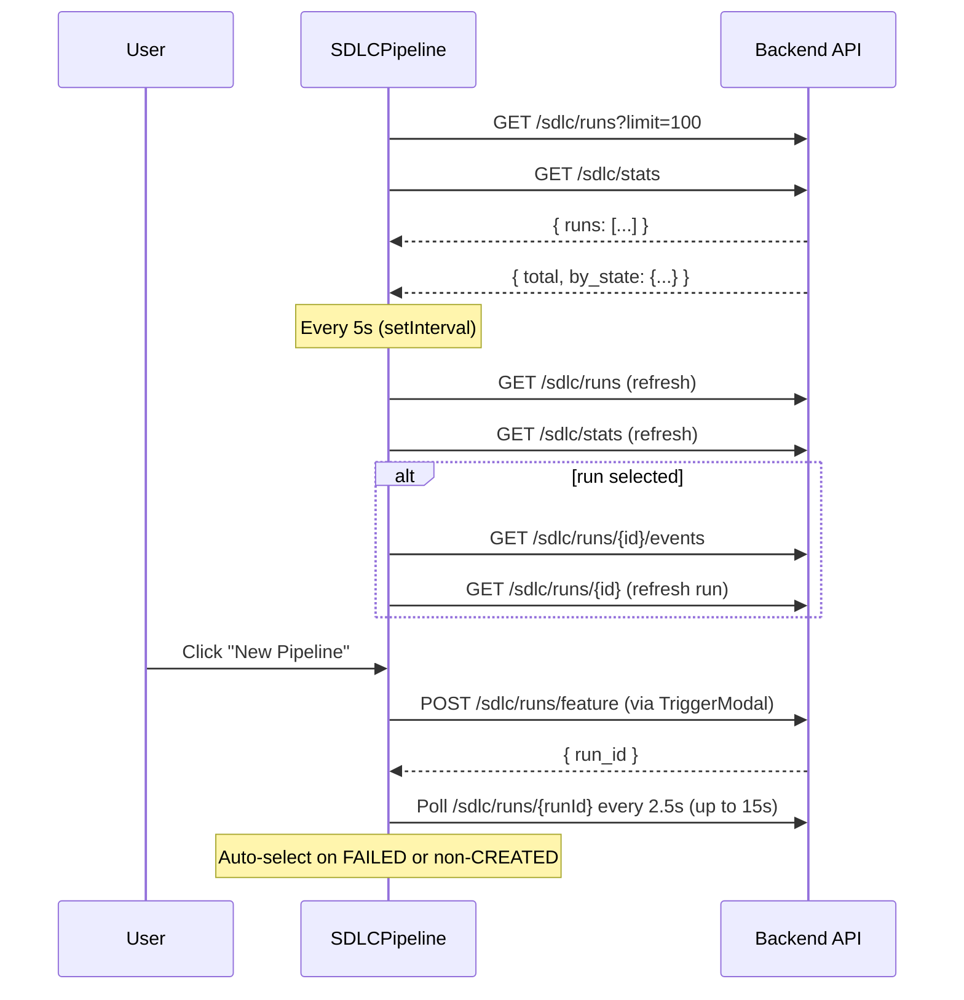
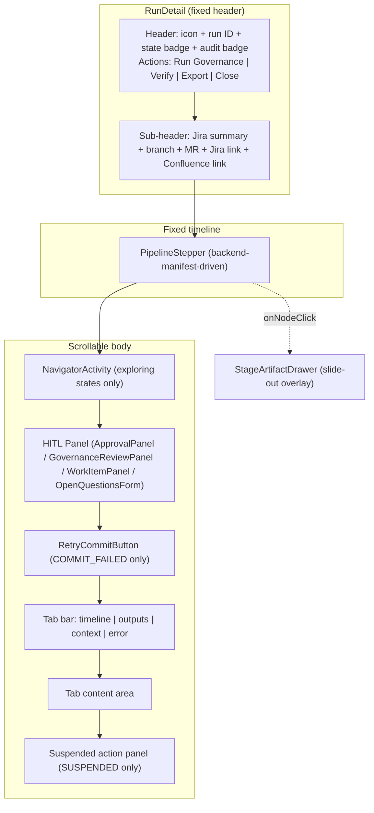
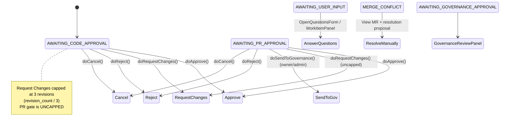
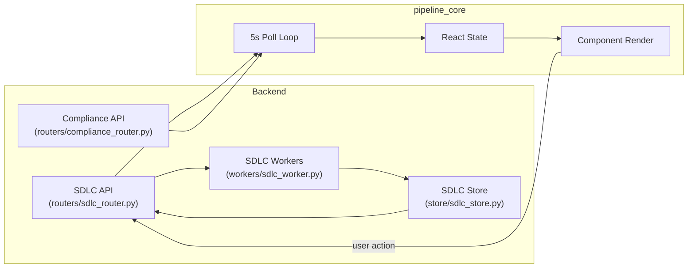
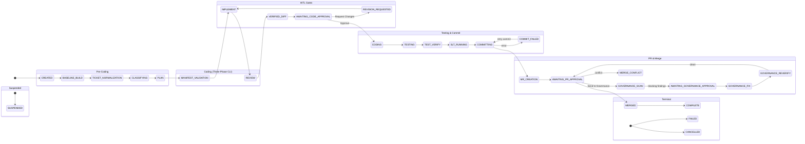

# Pipeline Core — SDLC Pipeline Dashboard

## 1. Introduction

The **pipeline_core** module is the primary frontend dashboard for the AI-driven Software Development Lifecycle (SDLC) pipeline. It lives in `ai-ui/src/components/SDLCPipeline.jsx` and provides engineers with a real-time, interactive view of every active and historical pipeline run — from initial ticket classification through code generation, testing, governance review, merge-request approval, and final merge.

The module is the **human-in-the-loop (HITL) control surface** for the SDLC pipeline: it surfaces approval gates, clarifying-question prompts, suspended-stage recovery actions, governance review panels, and audit-chain verification. It is designed as a master–detail dashboard (run list + run detail) with a 5-second auto-poll loop, backend-manifest-driven stage timelines, and tabbed artifact inspection.

### Core Responsibilities

| Responsibility | Description |
|---|---|
| **Run listing & filtering** | Fetch, filter (by type and state), search, and display all pipeline runs with live status badges. |
| **Run detail inspection** | Show a fixed stage timeline, scrollable tabbed body (timeline / outputs / context / error), and contextual HITL panels. |
| **HITL gate management** | Render approval, rejection, request-changes, cancel, and governance-send actions at the appropriate run states. |
| **Suspended-stage recovery** | Provide retry / go-back / waive / baseline-repair / governance-resume panels for runs in the `SUSPENDED` state. |
| **Audit & compliance** | Verify the cryptographic event chain and export compliance reports for any run. |
| **Artifact inspection** | Open a slide-out drawer to view per-stage artifacts (planning, coding, testing, governance, etc.). |

---

## 2. Architecture Overview

```mermaid
graph TB
    subgraph "pipeline_core (SDLCPipeline.jsx)"
        SDLCPipeline["SDLCPipeline<br/>(root dashboard)"]
        RunCard["RunCard<br/>(list item)"]
        RunDetail["RunDetail<br/>(detail panel)"]
        EventLog["EventLog<br/>(timeline tab)"]
        ApprovalPanel["ApprovalPanel<br/>(HITL actions)"]
        StageActionPanel["StageActionPanel<br/>(suspended recovery)"]
        BaselineActionPanel["BaselineActionPanel"]
        GovernanceResumePanel["GovernanceResumePanel"]
        RetryCommitButton["RetryCommitButton"]
        OutputsTab["OutputsTab"]
        ContextTab["ContextTab"]
        StageArtifactDrawer["StageArtifactDrawer"]
    end

    subgraph "Shared SDLC UI (sdlc/)"
        PipelineStepper["PipelineStepper"]
        statusModel["statusModel.js"]
        GateSignalRow["GateSignalRow"]
        GovernanceReviewPanel["GovernanceReviewPanel"]
        PlanningArtifactView["PlanningArtifactView"]
        ManifestValidationPanel["ManifestValidationPanel"]
    end

    subgraph "External UI dependencies"
        DiffApprovalPanel["DiffApprovalPanel"]
        OpenQuestionsForm["OpenQuestionsForm"]
        WorkItemPanel["WorkItemPanel"]
        NavigatorActivity["NavigatorActivity"]
        TriggerModal["TriggerModal"]
        DialogProvider["DialogProvider<br/>(toast / confirm)"]
    end

    SDLCPipeline --> RunCard
    SDLCPipeline --> RunDetail
    SDLCPipeline --> TriggerModal
    RunDetail --> PipelineStepper
    RunDetail --> EventLog
    RunDetail --> ApprovalPanel
    RunDetail --> StageActionPanel
    RunDetail --> BaselineActionPanel
    RunDetail --> GovernanceResumePanel
    RunDetail --> RetryCommitButton
    RunDetail --> OutputsTab
    RunDetail --> ContextTab
    RunDetail --> StageArtifactDrawer
    RunDetail --> NavigatorActivity
    RunDetail --> GovernanceReviewPanel
    RunDetail --> ManifestValidationBanner
    RunDetail --> AnsweredQuestionsView

    ApprovalPanel --> DiffApprovalPanel
    ApprovalPanel --> GateSignalRow
    ApprovalPanel --> OpenQuestionsForm
    ApprovalPanel --> WorkItemPanel
    PipelineStepper --> statusModel
    RunCard --> statusModel
    RunDetail --> statusModel
```



### Layout Structure

The `SDLCPipeline` root renders a three-region vertical layout:

1. **Top bar** — title, manual refresh, and "New Pipeline" trigger button (gated by user AD-level / admin role).
2. **Stats bar** — aggregate counts: total runs, pending approvals, in-progress, complete, failed.
3. **Filter bar** — dual filter rows: run-type filter (`all | feature | bug | pr_review | governance`) and state filter (`all | needs-approval | running | complete | failed`).
4. **Master–detail body** — a 288px run list on the left and a flexible detail panel on the right.

---

## 3. Component Reference

### 3.1 `SDLCPipeline` — Root Dashboard

The top-level component that owns all dashboard state and the polling lifecycle.

**Key state:**

| State | Purpose |
|---|---|
| `runs` | Array of run objects fetched from `GET /sdlc/runs` |
| `selected` | The currently selected run object (or `null`) |
| `events` | Event log for the selected run |
| `filter` / `stateFilter` | Active type and state filters |
| `searchQ` | Free-text search across Jira key, summary, governance ID/branch/repo |
| `stats` | Aggregate pipeline statistics from `GET /sdlc/stats` |
| `showTrigger` | Controls visibility of the `TriggerModal` |

**Polling architecture:**

The component uses a `setInterval` at **5 seconds** that:
- Reloads the run list and stats.
- If a run is selected (tracked via `selectedRef` to avoid stale closures), reloads its events and refreshes the run object itself so state transitions (e.g. approval → `COMPLETE`) are reflected immediately.



**`handleTriggered(runId)`:**

After a new pipeline is triggered, this function polls the new run every 2.5 seconds for up to 15 seconds (6 attempts). If the run immediately `FAILED` (e.g. language detection blocked), it auto-selects the run so the engineer sees the error without manual navigation. If the run transitions past `CREATED`, it selects the run and stops early polling.

---

### 3.2 `RunCard` — List Item

Renders a single run in the left-hand list. It classifies the run state into four visual categories:

| Category | States | Visual cue |
|---|---|---|
| **Running** | Any non-terminal, non-HITL, non-questions, non-commit-failed state | Spinning `Loader2` icon + cancel button |
| **HITL / Questions** | `AWAITING_*_APPROVAL`, `MERGE_CONFLICT`, `AWAITING_USER_INPUT`, `AWAITING_GOVERNANCE_APPROVAL` | Pulsing `HelpCircle` (questions) or state badge |
| **Commit Failed** | `COMMIT_FAILED` | Orange `RotateCcw` icon |
| **Terminal** | `COMPLETE`, `MERGED`, `FAILED`, `CANCELLED` | No spinner, no cancel |

The card supports inline cancellation via a confirm dialog (`POST /sdlc/runs/{id}/cancel`). Run type determines the left-border accent colour: blue (feature), amber (bug), violet (governance).

---

### 3.3 `RunDetail` — Detail Panel

The most complex component in the module. It renders a fixed header, a fixed stage timeline, and a scrollable body that adapts to the run's current state.

**Structural layout:**



**Key behaviours:**

- **Auto-tab-switch:** When `run.state` transitions to `FAILED`, the active tab auto-switches to `error`.
- **Suspended panel re-arm:** When the run (re-)enters `SUSPENDED`, `panelDismissed` is reset to `false` so the action panel reappears for a new suspension.
- **Attention ring:** The scrollable body gets an amber ring when `needsAttention(run.state)` is true (all gate states + `COMMIT_FAILED` + `SUSPENDED`).
- **Stage artifact drawer:** Clicking a stepper node opens `StageArtifactDrawer` — a 384px right-side overlay that fetches and renders the stage's artifact via `GET /sdlc/runs/{id}/stages/{stage}/artifact`.

**`verifyChain()`:**

Calls `GET /compliance/runs/{id}/verify` to cryptographically verify the run's event chain. The result is displayed as an "Audit OK" / "Audit Fail" badge in the header.

**`runGovernanceNow()`:**

Triggers a standalone governance review via `POST /sdlc/governance-review` with `{ run_id, auto_fix: true }`. This is independent of the in-pipeline `GOVERNANCE_REVIEW` gate and reuses the run's verified diff.

**`exportReport()`:**

Downloads a JSON compliance report from `GET /compliance/runs/{id}/report` as a blob.

---

### 3.4 `EventLog` — Timeline Tab

Renders the chronological event log for a run. Key features:

- **Filtering:** Bare state-transition rows emitted by `_set_state()` (actor = `sdlc-state-machine` with no output/data) are filtered out to reduce noise.
- **Expand/collapse:** Each event row expands to show its content in priority order: `data.structured` (formatted text) → `output` (monospace) → `data` (JSON) → "No details available".
- **Copy:** Each event has a hover-revealed copy button that copies the structured/output/JSON content to the clipboard.

---

### 3.5 `ApprovalPanel` — HITL Action Panel

The central human-approval surface. It renders different action sets depending on the run state:



**API actions:**

| Action | Endpoint | Body |
|---|---|---|
| Approve | `POST /sdlc/runs/{id}/approve` | `{ feedback, approved_by, skip_tests_override }` |
| Reject | `POST /sdlc/runs/{id}/reject` | `{ reason, rejected_by }` |
| Request Changes | `POST /sdlc/runs/{id}/request-changes` | `{ feedback, revised_by, file_comments }` |
| Cancel | `POST /sdlc/runs/{id}/cancel` | `{ reason, cancelled_by }` |
| Send to Governance | `POST /sdlc/runs/{id}/governance/start` | (empty body) |

**Sub-components rendered inside ApprovalPanel:**

- `MultiRepoApprovalView` — multi-repo context display
- `GateSignalRow` — trust-calibrated signal row (coverage, grounding, manifest validation)
- `DesignScopeView` — labelled scope for design/solution gates
- `DiffApprovalPanel` — verified diff viewer with per-file comment collection
- `OpenQuestionsForm` — clarifying questions gate (GATE 2, classify-raised)
- `WorkItemPanel` — ticket normalization gate (GATE 1, `gate_kind="normalization"`)

**Revision cap logic:** Request Changes at design/solution gates is capped at 3 revisions (`revision_count` tracked in `run.context`). The PR-approval gate is uncapped. The `fileComments` array (collected by `DiffApprovalPanel`) can be submitted alongside or instead of whole-run feedback.

**Skip-tests override:** At design/solution gates, a checkbox allows opting out of tests + SLT on resume. This is initialised from `run.context.skip_tests` and sent as `skip_tests_override` on approve.

---

### 3.6 Suspended-Stage Recovery Panels

When a run enters the `SUSPENDED` state, `RunDetail` renders a contextual recovery panel based on `run.context.suspended_at_stage`:

| Suspended stage | Panel | Actions |
|---|---|---|
| `BASELINE_BUILD` | `BaselineActionPanel` | "I'll fix the repo" (re-check baseline), "Let the agent fix it" (agent repair), "Skip compilation & continue" |
| `GOVERNANCE_SCAN` | `GovernanceResumePanel` | "Resume Governance Scan" (`POST /sdlc/runs/{id}/resume` with `target_stage=GOVERNANCE_SCAN`) |
| `PLAN` (manifest validation) | `ManifestValidationBanner` + `StageActionPanel` | Manifest validation verdict + generic retry/go-back/waive |
| Any other stage | `StageActionPanel` | Retry, Go Back (to any earlier stage), Waive (if not mandatory) |

**`StageActionPanel` modes:**

- **Retry** — re-run the current stage (`POST /sdlc/runs/{id}/resume` with `mode=retry`, `target_stage=current`).
- **Go Back** — resume from an earlier stage (selectable dropdown of `resumableStageOrder`).
- **Waive** — skip a non-mandatory stage (requires a reason). Mandatory stages (`CLASSIFYING`, `IMPLEMENT`, `COMMITTING`) cannot be waived.

**Resumable stage order** (mirrors `store/sdlc_artifacts.stage_sequence_for()`):

```
NORMALIZE → CLASSIFYING → PLAN → IMPLEMENT → REVIEW → TEST_VERIFY → COMMITTING → GOVERNANCE_SCAN
```

---

### 3.7 `RetryCommitButton` — Commit-Failed Recovery

Shown only when `run.state === "COMMIT_FAILED"`. Calls `POST /sdlc/runs/{id}/retry-commit` to re-enqueue the GitLab commit/MR creation without regenerating code. Displays the returned `job_id` on success.

---

### 3.8 `OutputsTab` & `ContextTab`

**`OutputsTab`** renders structured output sections from `run.context`:

- Repo Detection (language, tech stack, framework, confidence)
- Classification (feature: intent, complexity, effort, affected components, risks)
- Bug Triage (severity, category, assignee, reproduction, triage steps)
- Root Cause Analysis (root cause, code path, missing test)
- Technical Analysis (sub-tasks, files to change, regression risk)
- Solution/Fix Design (approach, implementation plan, testing/rollback strategy)
- Generated Code (implementation files + test files)
- Test Results (status, passed/failed counts, errors)
- PR Review (score, decision, summary, blocking issues, suggestions)
- Links (Jira, Confluence, GitLab issue, PR, branch)

**`ContextTab`** renders all remaining `run.context` keys (excluding a skip-set of internal keys) as expandable JSON blocks.

---

## 4. State Model & Status Styling

All run-state colours, labels, icons, and classifiers are defined in the shared [`sdlc/statusModel.js`](../sdlc/sdlc_status_model.md) module. This is the **single source of truth** — `SDLCPipeline.jsx` imports `statusStyle` and `needsAttention` from it and derives no styling locally.

### Terminal States

```javascript
const _TERMINAL_STATES = new Set(["COMPLETE", "MERGED", "FAILED", "CANCELLED"]);
// COMMIT_FAILED is intentionally NOT terminal — it is resumable
```

### Gate / Attention States

The `ATTENTION_STATES` set (from `statusModel.js`) includes all `AWAITING_*` states, `MERGE_CONFLICT`, `COMMIT_FAILED`, and `SUSPENDED`. These trigger the amber attention ring on the detail panel body.

### State Aliases

`AWAITING_CODE_APPROVAL` is the renamed replacement for `AWAITING_DESIGN_APPROVAL`. Both keys share identical visuals in `statusModel.js`, and the dashboard's "Needs Approval" filter matches either value to handle legacy rows.

---

## 5. Backend-Manifest-Driven Timeline

The stage timeline is rendered by [`PipelineStepper`](../sdlc/sdlc_pipeline_stepper.md), which fetches a canonical pipeline manifest from `GET /sdlc/pipeline-manifest?type={feature|bug|governance|pr_review}`. The manifest provides:

- **`nodes`** — ordered array of stage definitions (`id`, `label`, `icon_key`, `kind`, `isGate`, `optional`, `description`).
- **`aliases`** — mapping from raw run/event states to manifest node IDs.

`PipelineStepper` computes a live per-node status (`done | active | gate | failed | pending | skipped`) by comparing the manifest against the run's current state and event history. Key logic:

- **Active node resolution:** Direct match → alias lookup → `null` (defensive).
- **Governance sub-phase re-pointing:** When `state === "AWAITING_GOVERNANCE_APPROVAL"`, the active node is re-pointed to `GOVERNANCE_FIX` or `GOVERNANCE_REVERIFY` based on context flags (`governance_rescanning`, `governance_submitted_to_teams`).
- **Optional stages:** `GOVERNANCE_SCAN`, `GOVERNANCE_FIX`, `GOVERNANCE_REVERIFY` are rendered as `skipped` (not `pending`) when governance was not opted-in at trigger time.
- **Terminal collapse:** On terminal runs, only the matching terminal node is highlighted; everything up to `maxReachedIdx` is `done`.

The manifest is cached at module level (`_MANIFEST_CACHE`) keyed by run type, surviving re-renders and remounts to avoid refetching on every 5-second poll.

---

## 6. API Endpoints Used

```mermaid
erDiagram
    SDLCPipeline ||--o{ "GET /sdlc/runs" : "list runs"
    SDLCPipeline ||--o{ "GET /sdlc/stats" : "aggregate stats"
    SDLCPipeline ||--o{ "GET /sdlc/runs/{id}" : "single run"
    SDLCPipeline ||--o{ "GET /sdlc/runs/{id}/events" : "event log"
    SDLCPipeline ||--o{ "POST /sdlc/runs/{id}/cancel" : "cancel run"
    SDLCPipeline ||--o{ "POST /sdlc/runs/{id}/approve" : "approve"
    SDLCPipeline ||--o{ "POST /sdlc/runs/{id}/reject" : "reject"
    SDLCPipeline ||--o{ "POST /sdlc/runs/{id}/request-changes" : "request changes"
    SDLCPipeline ||--o{ "POST /sdlc/runs/{id}/resume" : "resume from stage"
    SDLCPipeline ||--o{ "POST /sdlc/runs/{id}/retry-commit" : "retry commit"
    SDLCPipeline ||--o{ "POST /sdlc/runs/{id}/governance/start" : "send to governance"
    SDLCPipeline ||--o{ "POST /sdlc/governance-review" : "standalone governance"
    SDLCPipeline ||--o{ "GET /sdlc/pipeline-manifest" : "stage manifest"
    SDLCPipeline ||--o{ "GET /sdlc/runs/{id}/stages/{stage}/artifact" : "stage artifact"
    SDLCPipeline ||--o{ "GET /compliance/runs/{id}/verify" : "audit chain"
    SDLCPipeline ||--o{ "GET /compliance/runs/{id}/report" : "compliance report"
```



All API calls use the shared `apiFetch` wrapper from [`config.js`](config.md), which handles authentication headers and error normalisation.

---

## 7. Data Flow



The frontend is a **poll-based consumer** of the SDLC backend. It does not use WebSockets or SSE for pipeline state updates — instead, the 5-second interval refreshes the run list, stats, and selected run/events. User actions (approve, reject, request changes, resume, cancel, trigger) are fire-and-forget POSTs that the backend enqueues as background jobs; the poll loop then picks up the resulting state transitions.

---

## 8. Run State Machine (UI Perspective)

The dashboard handles the following run states, grouped by category:



> **Note:** The diagram above is a simplified UI-perspective view. The authoritative state machine lives in the backend ([`agents/sdlc_state_machine.py`](../sdlc/shared_core_sdlc_pipeline.md#sdlc-state-machine)) and the stage manifest in [`store/sdlc_stage_manifest.py`](../sdlc/shared_core_sdlc_pipeline.md). The UI never drives state transitions directly — it only sends action requests that the backend validates and executes.

---

## 9. Dependencies

### Internal (ai-ui)

| Dependency | Module | Purpose |
|---|---|---|
| `PipelineStepper` | [sdlc_pipeline_stepper](../sdlc/sdlc_pipeline_stepper.md) | Backend-manifest-driven stage timeline |
| `statusModel.js` | [sdlc_status_model](../sdlc/sdlc_status_model.md) | Shared state colours, labels, icons, classifiers |
| `GateSignalRow` | [sdlc_gate_signal](../sdlc/sdlc_gate_signal.md) | Trust-calibrated signal row at HITL gates |
| `GovernanceReviewPanel` | [sdlc_governance_review](../sdlc/sdlc_governance_review.md) | Domain-approval gate for governance findings |
| `PlanningArtifactView` | [sdlc_planning_artifact](../sdlc/sdlc_planning_artifact.md) | PLAN/ANALYZING/DESIGNING artifact viewer |
| `ManifestValidationPanel` | — | Manifest validation verdict display |
| `NavigatorActivity` | — | Live agent navigator feed during exploring states |
| `DiffApprovalPanel` | [diff_approval](../sdlc/diff_approval.md) | Verified diff viewer with per-file comments |
| `OpenQuestionsForm` | [open_questions](open_questions.md) | Clarifying questions gate form |
| `WorkItemPanel` | [work_item_panel](../ui/work_item_panel.md) | Ticket normalization gate form |
| `MultiRepoApprovalView` | [multi_repo_approval](../sdlc/multi_repo_approval.md) | Multi-repo context display |
| `DepTable` | [dep_table](dep_table.md) | Dependency table |
| `DialogProvider` | [ui_dialog](../ui/ui_dialog.md) | Toast notifications and confirm dialogs |
| `config.js` | [config](config.md) | `API_BASE` and `apiFetch` |
| `securityValidation.js` | [ai_ui_frontend_utils](../ui/ai_ui_frontend_utils.md) | Input validation (`validateJiraKey`, `validateSummary`, etc.) |
| `useMultiRepoEnabled` | — | Hook for multi-repo feature flag |
| `toIST` | — | Timestamp formatting utility |

### Backend (via API)

| Backend module | Documentation |
|---|---|
| `routers/sdlc_router.py` | [sdlc_router](shared_api_routers.md) — all SDLC run, approval, resume, and governance endpoints |
| `routers/compliance_router.py` | [compliance_router](shared_api_routers.md) — audit chain verification and report export |
| `workers/sdlc_worker.py` | [sdlc_pipeline_workers](../sdlc/sdlc_pipeline_workers.md) — background job execution |
| `store/sdlc_store.py` | [store_layer](../storage/store_layer.md) — run persistence and state management |
| `store/sdlc_stage_manifest.py` | [store_layer](../storage/store_layer.md) — canonical pipeline manifest |
| `agents/sdlc_state_machine.py` | [shared_core_sdlc_pipeline](../sdlc/shared_core_sdlc_pipeline.md) — authoritative state machine |

---

## 10. Stage Artifact Drawer

The `StageArtifactDrawer` is a 384px right-side overlay that opens when a stepper node is clicked. It fetches the stage artifact via `GET /sdlc/runs/{id}/stages/{stage}/artifact` and renders it through a stage-specific renderer:

| Stage | Renderer | Notes |
|---|---|---|
| `PLAN`, `ANALYZING`, `DESIGNING` | `PlanningArtifactView` + `ManifestValidationBanner` | Self-fetching; falls back to `run.context` |
| `IMPLEMENT` | `DiffApprovalPanel` (read-only) | Reuses the verified-diff viewer |
| `REVIEW` | `ReviewVerdictView` | Renders from run events |
| `GOVERNANCE_REVIEW` / `AWAITING_GOVERNANCE_APPROVAL` | `GovernanceReviewPanel` | Full governance review surface |
| `MANIFEST_VALIDATION` | `ManifestValidationPanel` | Structured pass/reject panel |
| `CLASSIFYING` | `ClassifyArtifact` | Risk score, complexity, type |
| `ANALYZING` (bug) | `AnalyzeArtifact` | Root cause, hypotheses, code path |
| `CODING` | `CodingArtifact` | Changed files, fix attempt |
| `TESTING` | `TestingArtifact` | Pass/fail counts, test report |
| Other | `FallbackArtifact` | Generic JSON renderer |

If an artifact has a `loop_transcript`, it is rendered as an additional `LoopTranscriptView` section below the primary renderer.

---

## 11. Security & Access Control

- **Trigger access:** The "New Pipeline" button is gated by `_canTrigger = _adLevel <= 6 || _isAdminSDLC` (all AD levels can trigger).
- **Send to Governance:** The "Send to Governance" button at the PR-approval gate is gated by `canSendToGovernance = isPrGate && run.type !== "governance" && (isAdminUser || isRunOwner)`. Owner matching mirrors the backend's `_is_run_owner()` logic, checking `triggered_by_email`, `triggered_by_user_id`, and `created_by` against the current user.
- **Input validation:** All HITL text inputs (feedback, rejection reason, revision feedback) are validated via `validateSummary()` from [`securityValidation.js`](../ui/ai_ui_frontend_utils.md) before submission.
- **API authentication:** All API calls go through `apiFetch`, which attaches the appropriate authentication headers.

---

## 12. Key Design Decisions

1. **Polling over WebSockets:** The dashboard uses a 5-second poll interval rather than real-time push. This simplifies the architecture and is sufficient for the SDLC pipeline's typical stage durations (minutes to hours). The `selectedRef` pattern avoids stale-closure bugs in the interval callback.

2. **Backend-manifest-driven timeline:** The stage timeline is not hardcoded in the frontend. It fetches a canonical manifest from the backend, ensuring the UI always reflects the current pipeline definition. The manifest is cached per run-type at module level.

3. **Single status model:** All state colours, labels, and icons live in [`statusModel.js`](../sdlc/sdlc_status_model.md), eliminating the drift that occurred when `STATE_STYLE`, `FEATURE_STAGE_ORDER`, `BUG_STAGE_ORDER`, and `STAGE_ICONS` were hand-maintained in `SDLCPipeline.jsx`.

4. **Suspended-panel visibility keyed off live state:** The suspended action panel's visibility is driven by the live `run.state === "SUSPENDED"`, never by `run.context.suspended_at_stage` (which the backend does not clear on resume). This prevents the panel from lingering or reappearing after the run has moved on.

5. **COMMIT_FAILED is not terminal:** Unlike `FAILED`, `COMMIT_FAILED` is a resumable state. It is intentionally excluded from `_TERMINAL_STATES` so the run card shows a retry affordance and the detail panel shows `RetryCommitButton`.

6. **Revision cap differentiation:** Request Changes at design/solution gates is capped at 3 revisions; the PR-approval gate is uncapped. This matches the backend's different handling of pre-code vs. PR-stage revisions.
