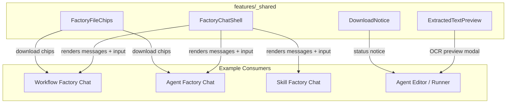
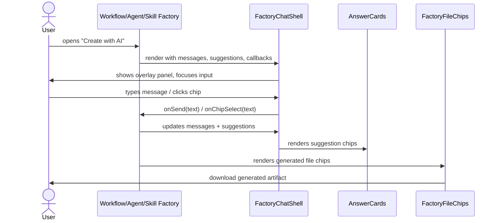
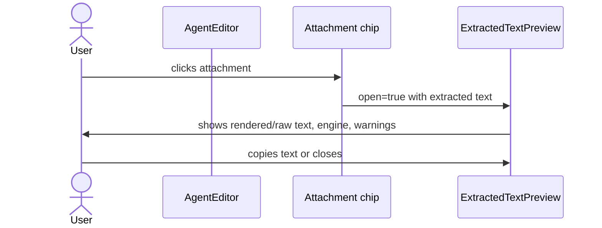
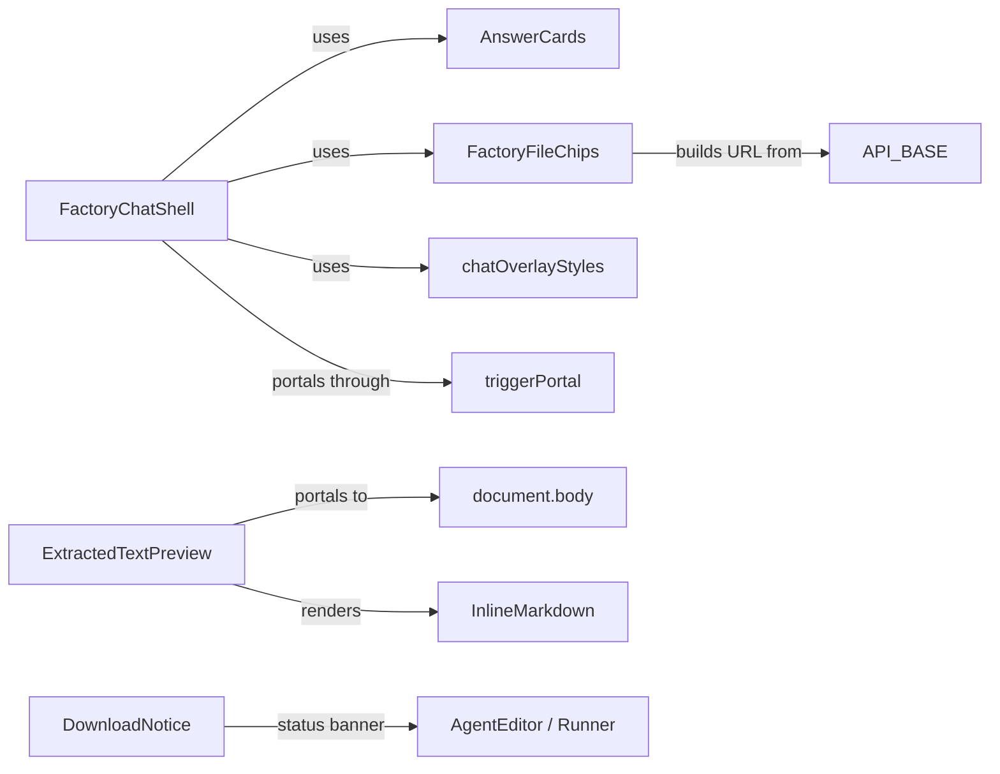

# shared_features — ABStudio Frontend Shared Components

The `shared_features` module lives under `ABStudio/frontend/src/features/_shared/` and contains small, reusable React components that are consumed by multiple feature areas in the ABStudio frontend. These components are intentionally decoupled from any single feature so that Workflow, Agent, Skill, and Trigger factories can share a consistent look-and-feel without dragging in feature-specific state machines.

## Purpose

- Provide **common UI primitives** for factory-style chat overlays, file downloads, and OCR text previews.
- Keep **cross-cutting presentation concerns** (focus trapping, portals, markdown rendering, accessibility) in one place.
- Avoid duplication between the Workflow Factory, Agent Factory, Skill Factory, and Agent Runner chat experiences.

## Architecture Overview

The module is **presentation-only**: it does not own business logic, API clients, or state stores. Callers supply data and callbacks via props, and the shared components handle rendering, animation, accessibility, and portal behavior.

## Component Inventory

| Component | File | Responsibility |
|-----------|------|----------------|
| `FactoryChatShell` | `FactoryChatShell.jsx` | Shared chrome for "Create with AI" chat overlays (Workflow, Agent, Skill factories). Provides header, animated panel, scrollable message list, suggestion chips, input area, focus trap, and Escape-to-close. |
| `FactoryFileChips` | `FactoryFileChips.jsx` | Download-chip strip for generated files produced by factory chats. |
| `ExtractedTextPreview` | `ExtractedTextPreview.jsx` | Read-only modal that previews text extracted by the OCR pipeline before it is sent to the model. |
| `DownloadNotice` | `DownloadNotice.jsx` | Inline status notice for consumed (HTTP 410) or failed downloads. |

## Data Flow

### Factory Chat Overlay

### OCR Text Preview

## Core Components

### `FactoryChatShell`

The canonical chat overlay used by all three AI-assisted builders. It is a controlled component: the parent owns `messages`, `inputValue`, `suggestions`, and the loading state.

Key responsibilities:
- Renders a **framer-motion** animated modal inside a React portal (portal container from the trigger system).
- Implements **accessibility**: `role="dialog"`, `aria-modal`, `aria-labelledby`, focus trap, focus restore on unmount, and `Escape` to close.
- Supports **stage-aware placeholder text** and **disabled input** for non-clarifying stages.
- Renders user/assistant bubbles; assistant content is passed through `ReactMarkdown` with GitHub-flavored markdown support.
- Renders **Claude-style step blocks** (`StepsBlock`) to show pipeline progress.
- Provides extension slots: `hero`, `renderMessageExtras`, `belowMessages`, `renderAboveInput`, `footer`, and `bodyOverlay`.

> **Design note:** Backdrop clicks intentionally do **not** close the panel, so an accidental click does not discard an in-progress build.

### `FactoryFileChips`

A small chip list for generated files returned by factory endpoints. Each chip is a button that triggers the caller's `onDownload` handler. The component also exports `absoluteDownloadUrl(file)` so callers can build full download URLs without re-importing `API_BASE`.

### `ExtractedTextPreview`

A portal-based modal that displays the result of the backend OCR pipeline. It is used by attachment chips so users can verify what the model will actually see before sending.

Key responsibilities:
- Escapes clipping from `overflow: hidden` ancestors by portaling to `document.body`.
- Locks body scroll while open.
- Offers two view modes: **rendered** (lightweight markdown) and **raw** (exact model input).
- Shows metadata: character count, OCR'd image count, table count, cache hit, and pipeline warnings.
- Includes a lightweight, inline markdown renderer that handles headings, blockquotes, tables, fenced code, and image captions without adding heavy dependencies.
- Exports `EngineBadge` for internal/debug screens that want to surface the extraction engine label.

### `DownloadNotice`

A tiny inline banner for download status. Supports two kinds:
- `gone` — HTTP 410, file already consumed.
- `error` — any other failure.

## Dependencies

| Dependency | Usage |
|------------|-------|
| `react` / `react-dom` | Component model and portals. |
| `framer-motion` | Enter/exit animations in `FactoryChatShell`. |
| `react-markdown` + `remark-gfm` | Markdown rendering for assistant messages. |
| `../../styles/chatOverlayStyles` | Shared styling tokens for the chat overlay. |
| `../../utils/stripEmoji` | Removes emoji from assistant markdown content. |
| `../../components/common/AnswerCards` | Renders suggestion chips. |
| `../triggers/triggerPortal` | Provides the portal container for the overlay. |
| `../../config/api` | `API_BASE` used by `FactoryFileChips`. |

## Relationship to Other Modules

- **workflow_factory_pipeline** / **agent_factory_pipeline** / **skill_factory_pipeline**: These backend pipelines generate the plans and artifacts that `FactoryChatShell` and `FactoryFileChips` present.
- **workflows_feature** / **agents_feature** / **skills_feature**: The frontend feature pages instantiate `FactoryChatShell` with feature-specific props and callbacks.
- **api_documents** / **core_ocr**: The backend OCR pipeline produces the text, warnings, and engine metadata consumed by `ExtractedTextPreview`.
- **common_components**: `AnswerCards` and other common primitives are composed inside `FactoryChatShell`.

## Visual: Component Interaction

## Notes for Maintainers

- Keep components in this folder **strictly presentational**. If a component needs to fetch data or own feature state, move it to the appropriate feature folder.
- `FactoryChatShell` is designed to be extended via props, not by forking. Prefer adding new slots (e.g., `renderAboveInput`) over copying the shell.
- `ExtractedTextPreview`'s inline markdown renderer is intentionally minimal. If the OCR pipeline starts emitting richer markdown, evaluate whether to adopt a full library or extend the renderer carefully to avoid XSS.
- All components use inline styles rather than CSS modules to keep the shared package self-contained and easy to import from any feature.
