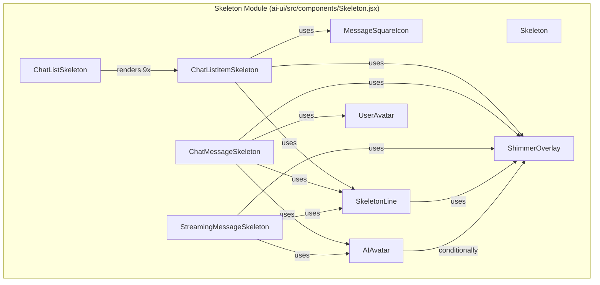
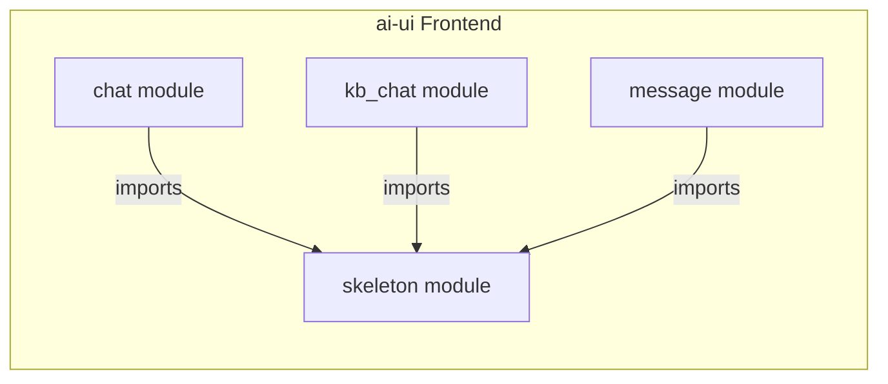
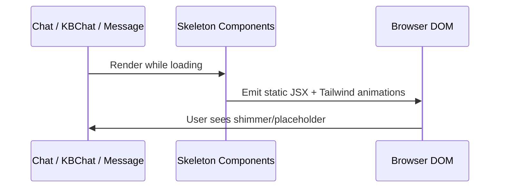
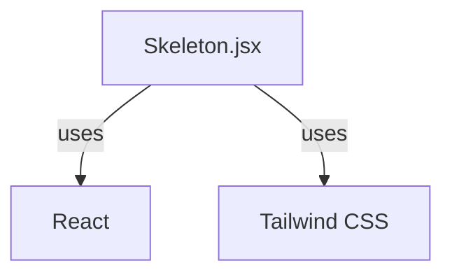
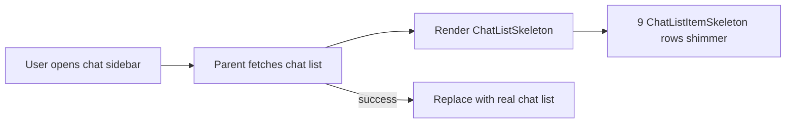
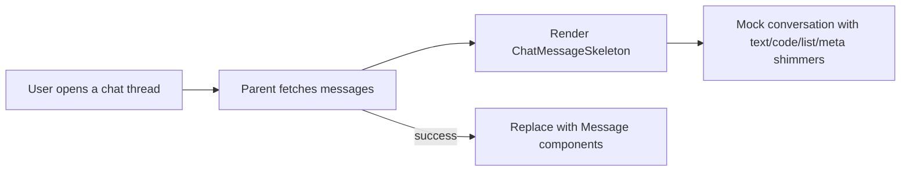

# Skeleton Module

## Brief Introduction

The **Skeleton** module is a React component library within the `ai-ui` frontend that provides loading placeholders and shimmer-based skeleton screens. It is responsible for rendering visually consistent placeholder UIs while asynchronous data (such as chat history, chat lists, and streaming assistant responses) is being fetched or generated. The module is intentionally presentational: it contains no business logic, state management, or API calls, and instead focuses on accessibility-friendly, animated placeholders that mirror the final layout of chat interfaces.

The module lives in `ai-ui/src/components/Skeleton.jsx` and exports a set of reusable skeleton components used across the AI chat experience, including generic skeletons, chat list skeletons, full conversation skeletons, and streaming message skeletons.

---

## Core Functionality

| Capability | Description |
|------------|-------------|
| Generic placeholder | `Skeleton` provides a basic animated pulse block for arbitrary UI regions. |
| Shimmer overlay | `ShimmerOverlay` adds a moving light reflection across placeholder surfaces. |
| Avatar placeholders | `AIAvatar` and `UserAvatar` render assistant/user avatar stand-ins with size variants. |
| Line placeholders | `SkeletonLine` renders rounded text-line placeholders with configurable width, height, and stagger delay. |
| Chat list loading | `ChatListSkeleton` renders a scrollable list of `ChatListItemSkeleton` entries. |
| Conversation loading | `ChatMessageSkeleton` renders a full mock conversation including text, code blocks, lists, and meta rows. |
| Streaming indicator | `StreamingMessageSkeleton` renders the "AI is thinking" placeholder during response generation. |

---

## Architecture

The Skeleton module is a pure presentational layer. It depends only on React and Tailwind CSS utility classes, and has no runtime dependencies on other application modules. Other modules (such as [chat](../chat/chat.md), [kb_chat](../knowledge/kb_chat.md), and [message](../chat/message.md)) import these components to show loading states while waiting for backend responses.

### Component Hierarchy



### Module Position in the System



> See [chat](../chat/chat.md), [kb_chat](../knowledge/kb_chat.md), and [message](../chat/message.md) for how these loading states are integrated into the chat experience.

---

## Component Reference

### `Skeleton`

A minimal, generic pulse skeleton. Accepts an optional `className` for sizing and layout.

```jsx
<Skeleton className="h-4 w-32 rounded" />
```

### `ShimmerOverlay`

Internal helper that renders a diagonal white-transparent gradient moving across a placeholder. Used by `SkeletonLine`, `ChatListItemSkeleton`, `ChatMessageSkeleton`, and `StreamingMessageSkeleton` to create the shimmer effect.

### `AIAvatar`

Renders a square placeholder avatar for the assistant. Supports `sm`, `md`, and `lg` sizes and an `isAnimating` flag that shows a bouncing-dot typing indicator below the avatar.

### `UserAvatar`

Renders a circular placeholder avatar for the user. Supports the same size variants as `AIAvatar`.

### `SkeletonLine`

A rounded rectangle placeholder representing a line of text. Props:

| Prop | Type | Default | Description |
|------|------|---------|-------------|
| `width` | `string` | required | Tailwind width class (e.g. `w-full`, `w-3/4`). |
| `height` | `string` | `h-3` | Tailwind height class. |
| `className` | `string` | `""` | Additional utility classes. |
| `delay` | `number` | `0` | Animation delay in milliseconds for staggered effects. |

### `ChatListItemSkeleton`

Represents a single row in the chat history sidebar. Includes an icon, two lines of text, a timestamp chip, and a hover action placeholder. The `index` prop drives staggered animation delays.

### `ChatListSkeleton`

Renders nine `ChatListItemSkeleton` rows in a vertical flex container. Used while the chat list is loading.

### `ChatMessageSkeleton`

Renders a full mock conversation with assistant and user messages. The conversation is hard-coded as a local array containing:

- Text paragraphs
- A code block with window controls
- A bulleted list
- Typing indicator
- Meta rows (model name, response time)
- User read-status indicators

This component is useful for the initial load of a chat thread where the layout needs to resemble the final message list.

### `StreamingMessageSkeleton`

A compact skeleton shown while the assistant is generating a response. It includes the AI avatar with animation, three placeholder lines, and a "AiNxt is thinking" indicator with bouncing dots.

---

## Data Flow

The Skeleton module does not fetch or transform data. Its "data" is the static mock conversation array inside `ChatMessageSkeleton`. The flow is strictly presentational:



When the parent module finishes loading, it unmounts the skeleton and renders the real content. No state is shared back to the skeleton.

---

## Styling and Theming

All components use Tailwind CSS utility classes. The color palette is aligned with the `ai-ui` design system:

- **Indigo** (`indigo-50`, `indigo-100`, `indigo-400`, `indigo-500`, `indigo-600`) for assistant-related elements.
- **Gray** (`gray-100`, `gray-200`, `gray-300`, `gray-400`) for neutral placeholders and user avatars.
- **White/transparent overlays** for shimmer reflections.

Animations rely on Tailwind's built-in utilities:

- `animate-pulse` for the generic skeleton.
- `animate-shimmer` for the moving gradient overlay (requires a custom Tailwind keyframe).
- `animate-bounce` for typing dots.

---

## Dependencies

The Skeleton module has no internal JavaScript dependencies beyond React. It does not import from other application modules, stores, hooks, or utilities.



### Consumers

The following modules are known consumers of the Skeleton components:

- [chat](../chat/chat.md) — loading states for the main chat interface.
- [kb_chat](../knowledge/kb_chat.md) — loading states for knowledge-base chat.
- [message](../chat/message.md) — placeholder rendering while message content is prepared.

---

## Process Flows

### Chat List Loading



### Conversation Loading



> See [message](../chat/message.md) for the real message rendering logic.

### Streaming Response

```mermaid
flowchart LR
    A[User sends a message] --> B[Parent waits for assistant stream]
    B --> C[Render StreamingMessageSkeleton]
    C --> D[AI avatar bounces + "AiNxt is thinking"]
    B -->|first token arrives| E[Replace with streaming Message]
```

---

## Design Notes

- **No business logic**: The module is intentionally free of API calls, hooks, and state. This keeps it lightweight and reusable.
- **Static mock data**: `ChatMessageSkeleton` uses a hard-coded conversation array so that the placeholder closely matches the final UI without needing real messages.
- **Accessibility**: While the components are visual placeholders, consumers should ensure that loading regions are announced appropriately (e.g., via `aria-busy` and `aria-live` in the parent component).
- **Performance**: All animations are CSS-only, avoiding JavaScript-driven animation overhead.

---

## Related Documentation

- [chat](../chat/chat.md)
- [kb_chat](../knowledge/kb_chat.md)
- [message](../chat/message.md)
- [ai_ui_frontend_app_core](../ui/ai_ui_frontend_app_core.md)
