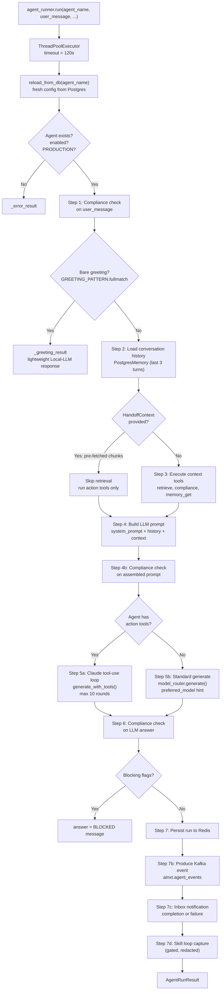
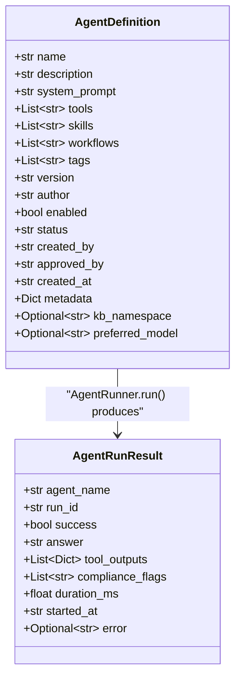
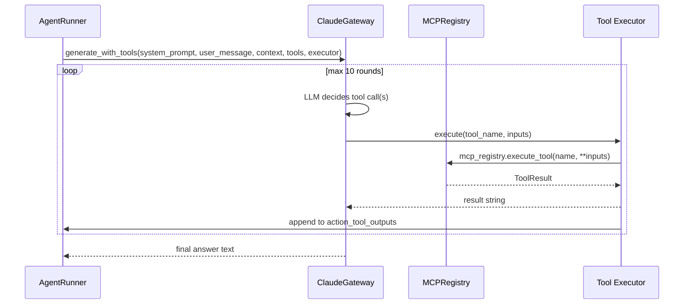
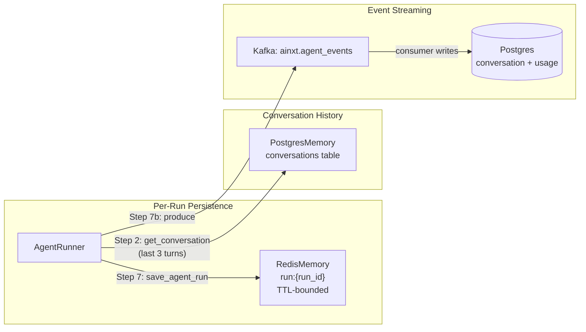

# Core Agent Framework

## Introduction

The **Core Agent Framework** (`agents/agent_builder.py`) is the foundational agent lifecycle layer of the NPCI Agentic Platform. It provides two complementary engines:

- **AgentBuilder** — a CRUD + persistence manager that stores reusable `AgentDefinition` configurations (system prompt, tools, skills, governance status, model hints) with Postgres as the source of truth and Redis as a fast runtime cache.
- **AgentRunner** — an execution engine that orchestrates a single agent run through a seven-step pipeline: input compliance → tool execution → context assembly → prompt compliance → LLM generation (with optional Claude tool-use loop) → output compliance → persistence + event emission.

Together they enable engineers to define named agents, assign MCP tools and skills, enforce PCI/PII compliance at three checkpoints, route to the best LLM via the model router, and persist every run for conversation continuity and analytics.

The module also bootstraps five built-in platform agents (`question_answerer`, `bug_fixer`, `code_generator`, `code_reviewer`, `incident_responder`) on first boot, seeding them into Postgres with `on_conflict='ignore'` so admin customisations are never overwritten.

---

## Architecture Overview

```mermaid
graph TB
    subgraph "Core Agent Framework"
        AB["AgentBuilder<br/>CRUD + Persistence"]
        AR["AgentRunner<br/>Execution Engine"]
        BP["_bootstrap_platform_agents<br/>First-boot seeding"]
    end

    subgraph "Data Stores"
        PG[("Postgres<br/>agents_pg table<br/>Source of Truth")]
        RD[("Redis db=2<br/>Runtime Cache")]
        PM[("PostgresMemory<br/>Conversation History")]
        RM[("RedisMemory<br/>Run Records")]
    end

    subgraph "Execution Dependencies"
        CE["ComplianceEngine<br/>PCI/PII checks"]
        MR["ModelRouter<br/>LLM routing + fallback"]
        MCR["MCPRegistry<br/>Tool/Skill execution"]
        CG["ClaudeGateway<br/>Tool-use loop"]
        HC["HandoffContext<br/>A2A context forwarding"]
    end

    subgraph "Event & Notification"
        KP["Kafka Producer<br/>ainxt.agent_events"]
        IS["Inbox Store<br/>Completion/failure notifications"]
        SL["Skill Loop Store<br/>Self-improvement capture"]
    end

    BP -->|"seeds 5 agents<br/>on_conflict=ignore"| AB
    AB -->|"load / upsert / reload"| PG
    AB -->|"persist / load cache"| RD
    AR -->|"reload_from_db before run"| AB
    AR -->|"Step 1,4,6: compliance"| CE
    AR -->|"Step 3: execute tools"| MCR
    AR -->|"Step 2: load history"| PM
    AR -->|"Step 5: generate"| MR
    AR -->|"Step 5: tool-use loop"| CG
    AR -->|"context_json input"| HC
    AR -->|"Step 7: save run"| RM
    AR -->|"Step 7b: produce event"| KP
    AR -->|"Step 7c: notify"| IS
    AR -->|"Step 7d: skill loop"| SL
```



---

## Component Relationships

### AgentBuilder

`AgentBuilder` is the configuration registry. It maintains an in-memory `Dict[str, AgentDefinition]` cache that is hydrated from two sources at construction time:

1. **Postgres first** — loads all enabled `PRODUCTION` agents from the `agents_pg` table (`AgentRecord`).
2. **Redis second** — fills any agents that exist in cache but were not yet synced to Postgres (backward-compat for pre-migration agents).

| Method | Purpose |
|--------|---------|
| `create(definition, _pg_on_conflict)` | Register/overwrite an agent in memory + Redis + Postgres |
| `get(name)` | Retrieve an `AgentDefinition` by name |
| `list_all(enabled_only)` | List all (or enabled-only) agents |
| `delete(name)` | Remove from memory + Redis |
| `enable(name)` / `disable(name)` | Toggle the `enabled` flag |
| `discover(tag, query)` | Filter by tag or name/description substring |
| `reload_from_db(name)` | Hot-reload one or all agents from Postgres (no restart) |
| `_upsert_to_postgres(definition, on_conflict)` | Write to `agents_pg` (update or ignore) |
| `_load_from_postgres()` | Bulk-load PRODUCTION agents at startup |
| `_load_from_redis()` | Backward-compat cache fill |

> **Governance lifecycle**: New user-created agents start as `DRAFT`. Only agents with `status == "PRODUCTION"` are loaded and executable. The governance approval flow (see [governance_router](shared_api_routers.md)) promotes agents through `DRAFT → PENDING_APPROVAL → APPROVED → PRODUCTION`.

### AgentRunner

`AgentRunner` is the execution engine. It accepts an agent name and a user message, then drives the seven-step pipeline inside a timeout-guarded thread (`ThreadPoolExecutor`, default 120s).



### _bootstrap_platform_agents

Seeds five built-in agents on first boot. Each is created with `status="PRODUCTION"` and `_pg_on_conflict="ignore"` so that:

- On first boot, the agents are inserted into Postgres.
- On subsequent boots, admin-customised system prompts are preserved.
- The in-memory cache is already populated from Postgres before this function runs, so existing agents are skipped.

| Agent | Tools | Skills | Purpose |
|-------|-------|--------|---------|
| `question_answerer` | retrieve, compliance | answer_question | Retrieve KB context and answer engineering questions |
| `bug_fixer` | retrieve, execute_and_heal | fix_bug | Analyse bug, generate fix, execute in Docker, verify |
| `code_generator` | retrieve, compliance | generate_code | Generate production-grade code from a spec |
| `code_reviewer` | retrieve, compliance | code_review | Review for bugs, security, PCI/DSS violations |
| `incident_responder` | retrieve, compliance | incident_response | Analyse incident, identify root cause, propose remediation |

---

## Data Models

### AgentDefinition



**Key fields:**

- **`status`** — Governance lifecycle: `DRAFT | PENDING_APPROVAL | APPROVED | PRODUCTION | DEPRECATED`. Only `PRODUCTION` agents are executable.
- **`kb_namespace`** — Scopes the `retrieve` tool to a specific KB domain (e.g. `docs_kb:hr`). Falls back to `agent_kb:{agent_name}`.
- **`preferred_model`** — Per-agent model hint (`"auto" | "claude" | "gpt" | "ollama"` or `"local:<model_id>"`). Forwarded to `ModelRouter.generate()`.

---

## Tool Execution Strategy

The `AgentRunner` distinguishes between two categories of tools:

### Context Tools (pre-LLM)

Tools in `_CONTEXT_TOOLS = {"retrieve", "compliance", "memory_get", "memory_recall"}` are executed **before** the LLM call. They accept a plain query string and return text that enriches the prompt.

Tool aliases are resolved before lookup:
- `retrieve_tool` → `retrieve`
- `compliance_tool` → `compliance`
- `generate_answer_tool` → `llm_generate`

Unknown tools are inspected via the MCP registry: if their only required parameter is `query`, they are treated as context tools and pre-executed.

### Action Tools (LLM-driven)

Action tools (`jira_*`, `gitlab_*`, `confluence_*`, `execute_code`, `call_agent`, etc.) require structured parameters decided by the LLM. They are **deferred** to the Claude tool-use loop:

1. Hardcoded schemas in `_CLAUDE_TOOL_SCHEMAS` provide Claude input_schema definitions for known platform tools.
2. Dynamic schemas are built from the MCP registry for any tool not known at write-time.
3. `ClaudeGateway.generate_with_tools()` drives the loop, calling `_make_tool_executor()` which delegates to `mcp_registry.execute_tool()`.
4. The loop runs up to `_MAX_TOOL_ITERATIONS = 10` rounds.



### Skill Execution

Skills are loaded from the `SkillRecord` DB table and executed via `exec()` of their Python code (which must define a `run(input: str) -> dict` function). Two skill types are supported:

- **Execution skills** — code is `exec()`'d and `run()` is called with the user message.
- **Behavioral skills** (`skill_type == "behavioral"`) — plain-text SOP instructions injected into the system prompt as a `## Domain Rules & SOPs` section.

If a referenced skill doesn't exist, `_autogenerate_skill()` uses the LLM to generate Python code from the skill name, saves it as `PRODUCTION`, and returns the new `SkillRecord`.

---

## Compliance Enforcement

Compliance is enforced at **three checkpoints** during every agent run, using the [ComplianceEngine](decision_engines.md) (from the `decision_engines` module):

| Stage | When | Action on Block |
|-------|------|-----------------|
| **Input** | Step 1 — on raw `user_message` | Flags logged; run continues (flags surfaced in result) |
| **Prompt** | Step 4b — on assembled LLM prompt | Flags logged; run continues |
| **Answer** | Step 6 — on LLM output | Answer replaced with `[BLOCKED: compliance violation detected in output]` |

Only findings with `action == "block"` in the compliance config are treated as blocking. Non-blocking findings (e.g. `EMAIL`, `MOBILE` detected in code) are logged but do not trigger a block.

---

## Agent-to-Agent Handoff

When `context_json` is provided (a `HandoffContext.to_json()` string from the [agent_orchestration](agent_orchestration.md) module), the receiving agent:

1. Deserializes the `HandoffContext` — extracts pre-fetched `retrieved_chunks` and `prior_outputs`.
2. **Skips the retrieval step** — uses the handoff context as a synthetic `retrieve` output.
3. Runs only action tools (non-context tools) from the agent definition.
4. Adopts the handoff's `session_id` for memory continuity if provided.

This enables efficient multi-agent orchestration where a router agent retrieves context once and forwards it to specialist agents without redundant KB lookups.

---

## Memory & Persistence



- **RedisMemory** stores the immediate run record (question, answer, tool history, compliance flags) with a TTL for fast retrieval.
- **PostgresMemory** provides conversation history — the last 3 turns (6 messages) are injected into the LLM prompt so the agent remembers prior context.
- **Kafka** (`ainxt.agent_events`) emits a `conversation_turn` event with token estimates and cost, consumed by the [kafka_event_consumer](kafka_event_consumer.md) worker which writes to Postgres for analytics.

---

## Model Routing

The `AgentRunner._generate()` method routes to the LLM via the [ModelRouter](model_routing.md):

1. If the agent has action tools → Claude tool-use loop (`ClaudeGateway.generate_with_tools()`).
2. Otherwise → `model_router.generate(prompt, model_hint=definition.preferred_model)`.
3. If the preferred model fails, a fallback to `model_router.generate(prompt, model_hint=None)` is attempted.

The greeting short-circuit uses `model_router.generate(user_message, model="simple")` for a lightweight Local-LLM response.

---

## Dependency Map

```mermaid
graph TD
    CAF["core_agent_framework<br/>(agent_builder.py)"]

    CAF -->|"compliance_engine.validate_input()"| DE["decision_engines<br/>(ComplianceEngine)"]
    CAF -->|"HandoffContext.from_json()"| AO["agent_orchestration<br/>(HandoffContext)"]
    CAF -->|"mcp_registry.execute_tool()"| MS["mcp_system<br/>(MCPRegistry)"]
    CAF -->|"model_router.generate()"| MR["model_routing<br/>(ModelRouter)"]
    CAF -->|"claude_gateway.generate_with_tools()"| CG["claude_gateway<br/>(ClaudeGateway)"]
    CAF -->|"PostgresMemory.get_conversation()"| MEM["memory_system<br/>(PostgresMemory)"]
    CAF -->|"RedisMemory.save_agent_run()"| MEM2["memory_system<br/>(RedisMemory)"]
    CAF -->|"AgentRecord, SkillRecord"| DB["database<br/>(db/models.py)"]
    CAF -->|"produce() Kafka event"| KP["core_infrastructure<br/>(kafka_producer)"]
    CAF -->|"publish_inbox_item()"| SL["store_layer<br/>(inbox_store)"]
    CAF -->|"record_run_signature()"| SL2["store_layer<br/>(skill_loop_store)"]
    CAF -->|"GREETING_PATTERN"| CL["model_routing<br/>(classifier)"]
    CAF -->|"MODEL_COST_PER_1M"| CI["core_infrastructure<br/>(model_registry)"]
```



---

## Singletons

At module load time, two singletons are instantiated:

```python
agent_builder = AgentBuilder()           # loads from Postgres + Redis
_bootstrap_platform_agents(agent_builder) # seeds 5 built-in agents (ignore conflicts)
agent_runner = AgentRunner(agent_builder) # binds to the builder
```

These are imported throughout the platform:
- `gateway.py` uses `agent_runner` for `run_agent` / `talk_to_agent` endpoints.
- `mcp/registry.py` registers a `call_agent` tool that delegates to `agent_runner.run()`.
- The [agents_router](shared_api_routers.md) exposes agent CRUD via the builder.

---

## Configuration & Environment

| Setting | Default | Description |
|---------|---------|-------------|
| `_AGENT_TIMEOUT_SECS` | 120 | Wall-clock timeout per agent run |
| `_MAX_TOOL_ITERATIONS` | 10 | Max LLM↔tool back-and-forth cycles in tool-use loop |
| `REDIS_HOST` / `REDIS_PORT` | from `core.config` | Redis connection for runtime cache |
| `RDB_WORKFLOW` | from `core.config` | KV database ID for agent builder cache |
| `ENABLE_SKILL_LOOP` | False | Gate for self-improving skill loop capture |
| `SKILL_LOOP_SOURCES` | — | Source set; `agent_run` must be included for capture |
| `COMPLIANCE_CONFIG` | env or file | Compliance type actions (redact/block/off) |

---

## Related Documentation

- [decision_engines](decision_engines.md) — ComplianceEngine, DecisionEngine, HardBlockEngine
- [agent_orchestration](agent_orchestration.md) — OrchestratorAgent, MultiAgentRunner, HandoffContext, RouterAgent
- [mcp_system](mcp_system.md) — MCPRegistry, ToolRegistry, SkillRegistry
- [model_routing](model_routing.md) — ModelRouter, classifier, gateway fallback chains
- [memory_system](memory_system.md) — PostgresMemory, RedisMemory, MemoryService
- [database](database.md) — AgentRecord, SkillRecord, SessionLocal
- [core_infrastructure](core_infrastructure.md) — logger, config, kafka_producer, model_registry
- [store_layer](store_layer.md) — inbox_store, skill_loop_store
- [shared_api_routers](shared_api_routers.md) — agents_router, governance_router
- [claude_gateway](claude_gateway.md) — ClaudeGateway tool-use API
