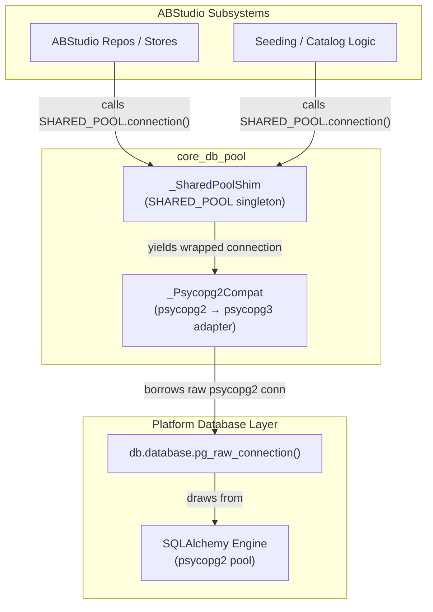
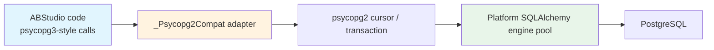
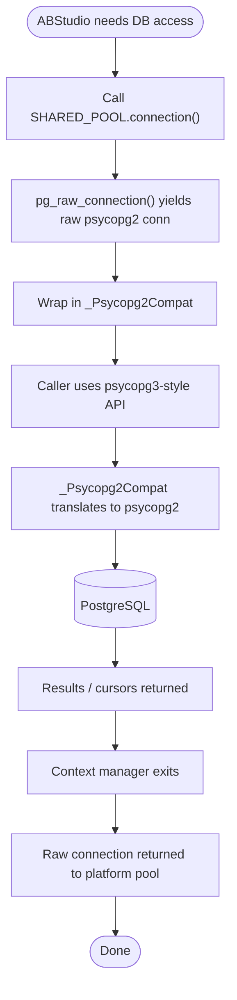
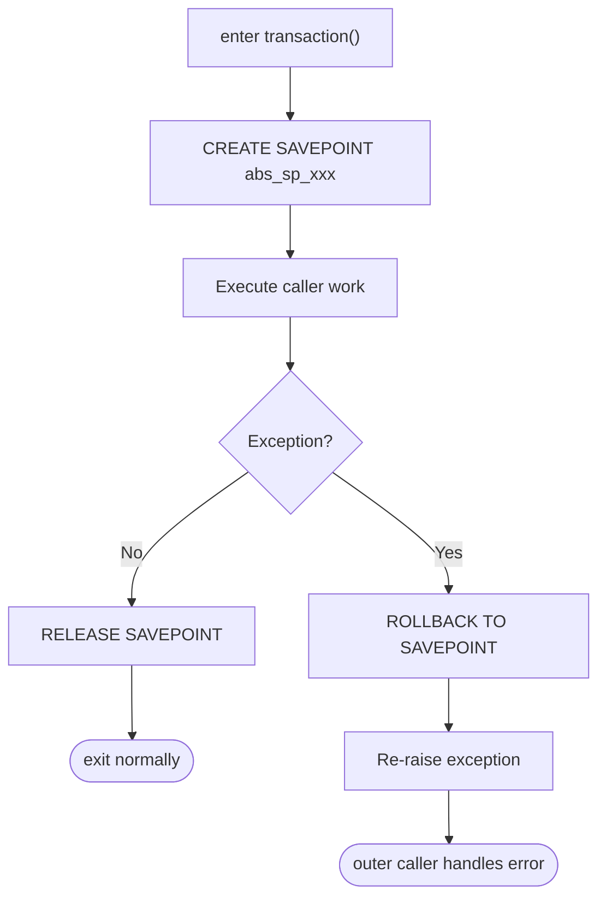
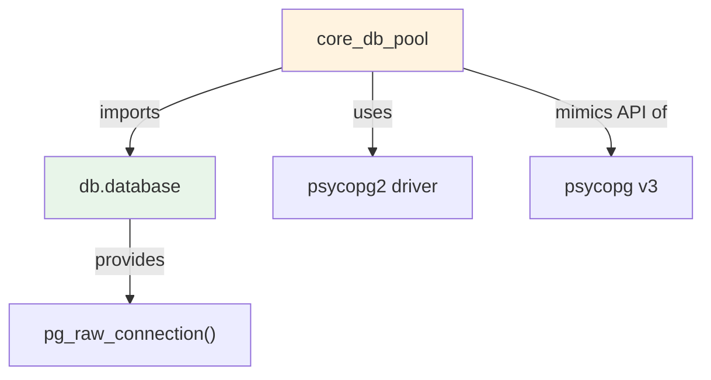

# core_db_pool — Shared Database Pool Bridge

The `core_db_pool` module provides a lightweight bridge that lets the ABStudio subsystem reuse the platform's shared PostgreSQL connection pool instead of maintaining its own. It exposes a `psycopg_pool.ConnectionPool`-compatible surface (`SHARED_POOL`) while internally borrowing raw connections from the platform SQLAlchemy engine via [`db.database.pg_raw_connection()`](database.md). Because the platform engine is backed by **psycopg2** and ABStudio code expects the **psycopg3** API, the module also contains a driver compatibility shim that translates psycopg3-style calls (`conn.execute(...)`, `with conn.transaction():`, etc.) to psycopg2 operations.

In short, `core_db_pool` ensures the entire in-process application shares one set of Postgres connections and one pool lifecycle, eliminating duplicate pools and connection contention between ABStudio and the rest of the backend.

---

## 1. Module Responsibilities

| Responsibility | Description |
| --- | --- |
| **Pool unification** | Provide a single `SHARED_POOL` singleton that every ABStudio subsystem uses instead of creating independent pools. |
| **Driver bridging** | Adapt raw `psycopg2` connections (from the platform engine) to the `psycopg3`-style interface expected by ABStudio repositories. |
| **Transaction safety** | Offer a savepoint-scoped `transaction()` context manager so per-row errors do not abort the entire surrounding transaction. |
| **Lifecycle passthrough** | Delegate connection acquisition/return to the platform pool; `close()` is intentionally a no-op because the platform owns the pool. |

---

## 2. Architecture



### 2.1 Component Breakdown

#### `_SharedPoolShim`
A minimal stand-in for `psycopg_pool.ConnectionPool`. It exposes only the surface ABStudio actually uses:

- `.connection()` — context manager that borrows a raw connection from `pg_raw_connection()`, wraps it in `_Psycopg2Compat`, and yields it.
- `.close()` — no-op. The underlying pool is owned by `db.database` and must outlive ABStudio.

#### `_Psycopg2Compat`
Wraps a raw `psycopg2` connection and presents a `psycopg3`-style API:

- `.execute(sql, params=None)` — creates a cursor, executes the statement, and returns the cursor (mirroring psycopg3's `conn.execute()`).
- `.cursor()` — returns a new psycopg2 cursor.
- `.commit()` / `.rollback()` — pass through to the raw connection.
- `.transaction()` — savepoint-scoped context manager. On exception it rolls back to the savepoint and re-raises, leaving the outer transaction usable.
- `__getattr__` — delegates unknown attributes (e.g., `.closed`, `.info`) to the underlying psycopg2 connection.

---

## 3. Component Interaction

```mermaid
sequenceDiagram
    participant Caller as ABStudio Caller
    participant Shim as _SharedPoolShim
   Compat as _Psycopg2Compat
    participant Raw as pg_raw_connection()
    participant DB as PostgreSQL

    Caller->>Shim: with SHARED_POOL.connection() as conn
    Shim->>Raw: acquire raw psycopg2 connection
    Raw-->>Shim: raw_conn
    Shim->>Compat: _Psycopg2Compat(raw_conn)
    Compat-->>Shim: wrapped_conn
    Shim-->>Caller: conn

    alt execute query
        Caller->>Compat: conn.execute(sql, params)
        Compat->>DB: cursor.execute(sql, params)
        DB-->>Compat: cursor
        Compat-->>Caller: cursor
    end

    alt transaction block
        Caller->>Compat: with conn.transaction()
        Compat->>DB: SAVEPOINT abs_sp_xxx
        Note over Compat: yield self
        Caller->>Compat: [work]
        alt success
            Compat->>DB: RELEASE SAVEPOINT
        else exception
            Compat->>DB: ROLLBACK TO SAVEPOINT
            Compat-->>Caller: re-raise
        end
    end

    Caller->>Shim: exit context
    Shim->>Raw: return raw connection to platform pool
```

---

## 4. Data Flow



1. ABStudio repositories issue `conn.execute(...).fetchone()` or `with conn.transaction():` against `SHARED_POOL.connection()`.
2. `_SharedPoolShim` obtains a raw `psycopg2` connection from the platform and wraps it with `_Psycopg2Compat`.
3. `_Psycopg2Compat` translates each call into the equivalent `psycopg2` cursor or savepoint operation.
4. Results and cursors flow back to ABStudio unchanged.
5. When the context exits, the raw connection is returned to the platform pool.

---

## 5. Process Flow: Borrowing a Connection



---

## 6. Transaction Semantics

The `transaction()` context manager is one of the most important parts of the adapter because `psycopg2` aborts the **entire** transaction on any error, whereas `psycopg3` can keep the transaction alive. The shim uses a savepoint to isolate each block:



This design lets ABStudio seeding loops catch per-row failures and continue with sibling rows without invalidating the whole transaction.

---

## 7. Dependencies

### 7.1 Internal Dependencies

| Dependency | Module | Role |
| --- | --- | --- |
| `pg_raw_connection()` | [`db.database`](database.md) | Provides raw `psycopg2` connections from the platform's shared SQLAlchemy engine. |

### 7.2 External Dependencies

| Dependency | Purpose |
| --- | --- |
| `psycopg2` | The actual PostgreSQL driver used by the platform engine. |
| `psycopg` (v3) | The API style ABStudio code is written against. |
| `contextlib.contextmanager` | Used for the `transaction()` context manager. |

### 7.3 Dependency Diagram



---

## 8. How It Fits Into the System

`core_db_pool` sits at the boundary between the ABStudio backend and the platform database layer:

- **ABStudio repositories and stores** (e.g., workflow, agent, skill, trigger persistence) import `SHARED_POOL` and use it as if it were a standard `psycopg_pool.ConnectionPool`.
- **The platform database layer** ([`db.database`](database.md)) owns the real connection pool, RLS context, and engine lifecycle.
- **Other core modules** such as [`core_workflow_repo`](core_workflow_repo.md) rely on this bridge to perform CRUD operations without duplicating pool configuration or connection limits.

By centralizing pool access through `SHARED_POOL`, the system avoids:

- Multiple pools competing for the same Postgres `max_connections` budget.
- Inconsistent transaction/connection handling between ABStudio and platform code.
- Leaked or double-closed pools when ABStudio subsystems start up or shut down.

---

## 9. Usage Example

```python
from ABStudio.backend.app.core.db_pool import SHARED_POOL

# ABStudio code uses psycopg3-style calls
with SHARED_POOL.connection() as conn:
    row = conn.execute("SELECT id, name FROM agents WHERE id = %s", (agent_id,)).fetchone()

    with conn.transaction():
        conn.execute("INSERT INTO audit_log (event) VALUES (%s)", ("agent_updated",))
```

The caller does not need to know that the underlying driver is `psycopg2` or that the connection is borrowed from a platform-owned pool.

---

## 10. References

- [`database.md`](database.md) — Platform database layer that owns the shared engine and `pg_raw_connection()`.
- [`core_workflow_repo.md`](core_workflow_repo.md) — Example ABStudio repository that consumes `SHARED_POOL` for workflow/agent persistence.
- [`core_config.md`](core_config.md) — Configuration values such as `agentchain_postgres_uri` that feed the shared engine.
