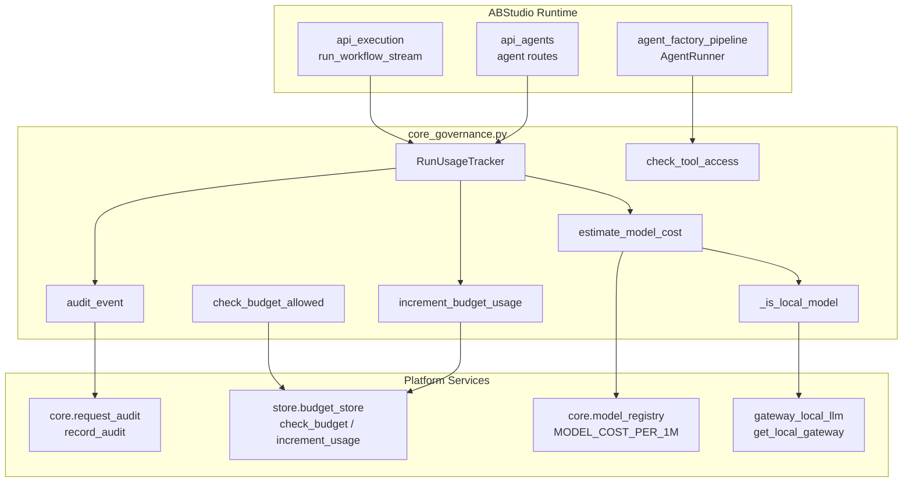
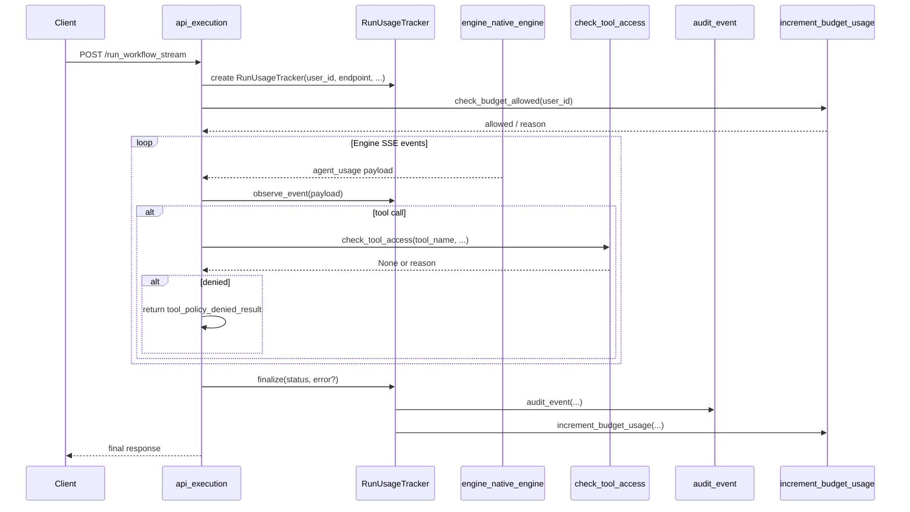
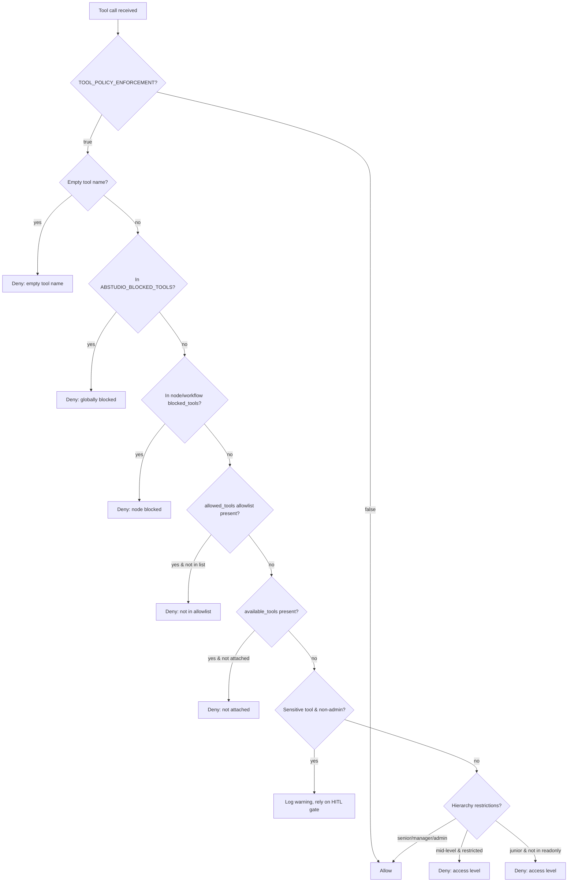
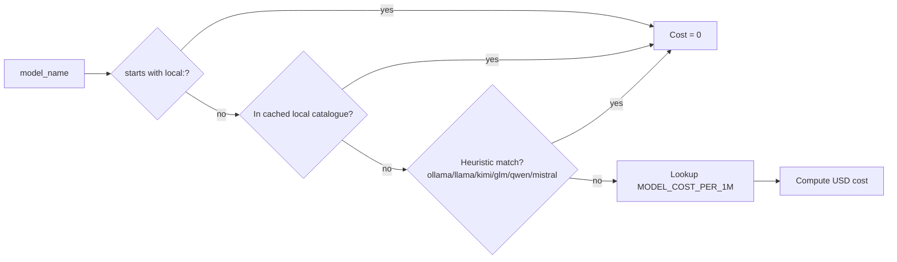
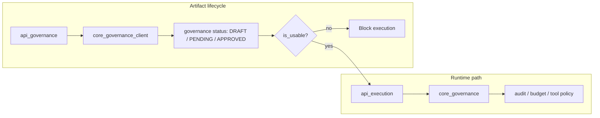

# core_governance

The `core_governance` module is the ABStudio runtime governance adapter. It wraps platform-level audit, budget, and tool-policy services with ABStudio-specific context labels, ensuring that workflow and agent executions are observable, cost-controlled, and policy-compliant without duplicating logic that already exists in the platform.

This module is intentionally **fail-open** for infrastructure unavailability (audit or budget store outages must never break a user's run) and **fail-closed** for explicit policy denies (a blocked tool call returns a structured error to the LLM rather than crashing the workflow).

---

## Core responsibilities

1. **Audit logging** — emit best-effort audit events for workflow/agent runs via the platform audit helper.
2. **Budget enforcement** — preflight budget checks and increment usage after a run.
3. **Cost estimation** — estimate token and USD costs, with special handling for in-house/local models that are cost-exempt.
4. **Tool access policy** — evaluate global, node-level, allowlist, attachment, and hierarchy-based restrictions on tool calls.
5. **Per-run usage tracking** — aggregate token/cost/latency across an entire run and finalize audit + budget records.

---

## Architecture

### Component overview

| Component | Type | Purpose |
|-----------|------|---------|
| `_flag` | Function | Parse boolean environment variables with safe defaults. |
| `_csv_set` | Function | Parse comma-separated environment variables into a `Set[str]`. |
| `_estimate_tokens` | Function | Rough token count from character length when exact usage is unavailable. |
| `_is_local_model` | Function | Detect in-house/local models that are exempt from cost charging. |
| `estimate_model_cost` | Function | Estimate USD cost from token counts using the platform pricing table. |
| `audit_event` | Function | Emit a best-effort ABStudio audit event. |
| `check_budget_allowed` | Function | Preflight budget check; fails open if the budget store is unavailable. |
| `increment_budget_usage` | Function | Record token/cost/requests in the platform budget store. |
| `RunUsageTracker` | Dataclass | Track and finalize usage for a single workflow or agent run. |
| `ToolPolicyDenied` | Exception | Structured exception raised when a tool call is denied. |
| `check_tool_access` | Function | Evaluate multi-layer tool policy and return a denial reason or `None`. |
| `tool_policy_denied_result` | Function | Format a policy denial as a JSON-serialised result for the LLM. |

---

## Configuration toggles

All toggles are read from environment variables and default to enabled unless noted otherwise.

| Variable | Default | Meaning |
|----------|---------|---------|
| `ABSTUDIO_GOVERNANCE_AUDIT_ENABLED` | `true` | Enable audit event emission. |
| `ABSTUDIO_BUDGET_ENFORCEMENT_ENABLED` | `true` | Enable budget preflights and usage increments. |
| `ABSTUDIO_TOOL_POLICY_ENFORCEMENT_ENABLED` | `true` | Enable tool access policy checks. |
| `ABSTUDIO_BUDGET_PRODUCT_ID` | `abstudio` | Product ID passed to the budget store. |
| `ABSTUDIO_BLOCKED_TOOLS` | `""` | Globally blocked tool names. |
| `ABSTUDIO_SENSITIVE_TOOLS` | `""` | Tool names that trigger HITL/admin warnings. |
| `ABSTUDIO_RESTRICTED_TOOLS_MID` | `""` | Tools blocked for mid-level users (`ad_level` 4–5). |
| `ABSTUDIO_READONLY_TOOLS` | `""` | Allowlist for junior users (`ad_level` 6+). |

---

## Data flow: workflow run with governance

---

## Tool policy evaluation

`check_tool_access` evaluates restrictions in the following order; the first match wins.

### Hierarchy rules

| Effective level | Who | Effect |
|-----------------|-----|--------|
| `ad_level` 0–2 | Senior executives | All tools allowed. |
| `ad_level` 3 or `is_hod=True` | Managers / HODs | Full access, including sensitive tools. |
| `ad_level` 4–5 | Mid-level | Blocked from `ABSTUDIO_RESTRICTED_TOOLS_MID`. |
| `ad_level` 6+ | Junior | Only tools in `ABSTUDIO_READONLY_TOOLS` are permitted. |

Admins and security-team members bypass hierarchy restrictions entirely.

---

## Cost estimation and local models

The module distinguishes **local/in-house models** from commercial models so that budget records are not charged for on-premise or self-hosted inference.

The local model catalogue is cached for five minutes and is populated from:

- `LOCAL_VISION_MODELS`, `LOCAL_SIMPLE_MODELS`, `LOCAL_MEDIUM_MODELS`, `LOCAL_COMPLEX_MODELS`
- `LOCAL_LLM_MODEL_NAME` / `LOCAL_LLM_MODEL`
- The live local gateway catalogue via `gateway_local_llm.get_local_gateway().list_models()`

If the gateway is unavailable, the cache falls back to environment-declared IDs so detection still works offline.

---

## Relationship to other governance modules

ABStudio has three governance-related concepts that are often confused:

| Module | File | Concern |
|--------|------|---------|
| `core_governance` | `ABStudio/backend/app/core/governance.py` | **Runtime governance**: audit, budget, tool policy, cost tracking during workflow/agent execution. |
| `core_governance_client` | `ABStudio/backend/app/core/governance_client.py` | **Artifact lifecycle governance**: `is_usable()` checks whether an agent/workflow/skill is approved for execution. |
| `api_governance` | `ABStudio/backend/app/api/governance.py` | **HTTP API for approvals**: submit, status, and withdraw endpoints that drive the artifact lifecycle. |

For details on the approval workflow API, see [api_governance.md](api_governance.md). For the artifact-usability check, see [core_governance_client.md](core_governance_client.md).

---

## Integration with the wider system

`core_governance` is consumed by execution paths across ABStudio:

- **[api_execution](api_execution.md)** — `run_workflow_stream`, `run_workflow`, and `resume_workflow_stream_endpoint` create a `RunUsageTracker` and observe engine events.
- **[api_agents](api_agents.md)** / **[api_agent_chat](api_agent_chat.md)** — agent chat routes use the tracker and tool policy checks.
- **[agent_factory_pipeline](agent_factory_pipeline.md)** — `AgentRunner` invokes `check_tool_access` before dispatching tools.
- **[core_llm_handler](core_llm_handler.md)** — model names observed in usage payloads flow into `estimate_model_cost`.
- **[core_workflow_repo](core_workflow_repo.md)** — workflow definitions supply `node_data` such as `allowed_tools` and `blocked_tools`.

The module itself delegates to platform services rather than reimplementing them:

- **[core.request_audit](core_infrastructure.md)** for audit persistence.
- **[store.budget_store](store_layer.md)** for budget checks and usage increments.
- **[core.model_registry](core_infrastructure.md)** for per-model pricing.
- **[gateway_local_llm](local_llm_gateway.md)** for local model discovery.

---

## Error handling philosophy

- **Audit failures are non-fatal.** `audit_event` catches all exceptions and logs them at debug level.
- **Budget store failures are non-fatal.** `check_budget_allowed` and `increment_budget_usage` return/fail open and log warnings.
- **Tool policy denies are fatal to the tool call but not the run.** `check_tool_access` returns a reason string; callers convert it to a `tool_policy_denied` JSON result that the LLM can reason about.

---

## References

- [api_execution.md](api_execution.md) — workflow execution endpoints that consume this module.
- [api_governance.md](api_governance.md) — HTTP API for artifact approval.
- [core_governance_client.md](core_governance_client.md) — artifact usability checks.
- [core_config.md](core_config.md) — environment configuration patterns.
- [core_llm_handler.md](core_llm_handler.md) — model usage and fallback handling.
- [core_workflow_repo.md](core_workflow_repo.md) — workflow and node persistence.
- [agent_factory_pipeline.md](agent_factory_pipeline.md) — agent runtime that uses tool policy.
