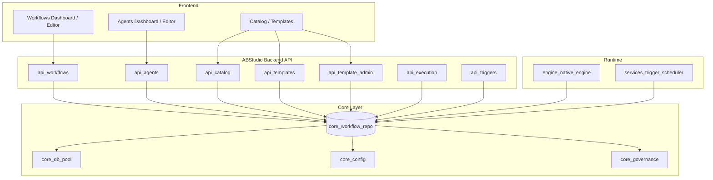
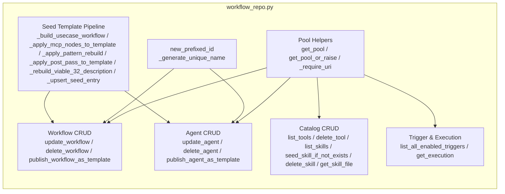
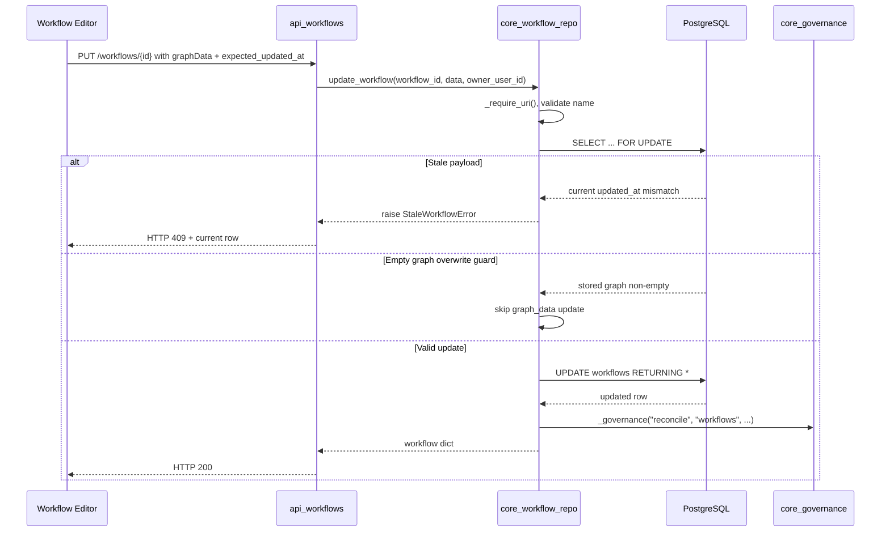
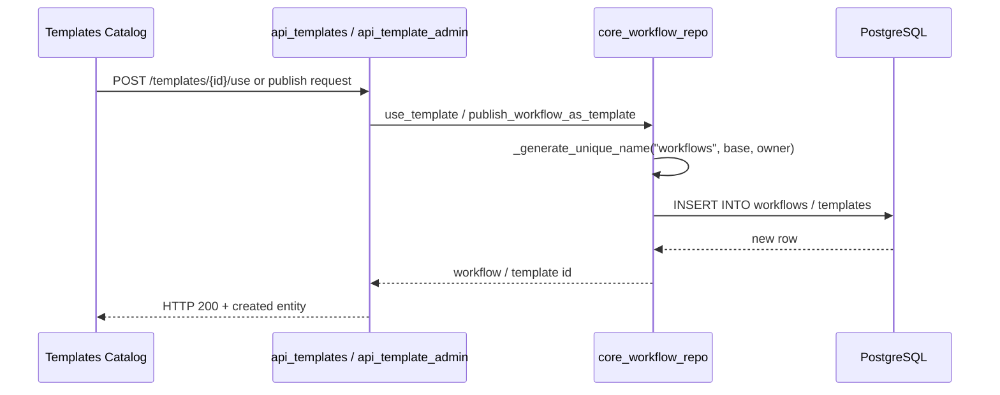
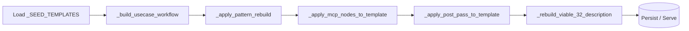

# core_workflow_repo

## Brief Introduction

`core_workflow_repo` is the persistent repository layer for **ABStudio** workflows, agents, skills, tools, templates, and trigger executions. Located at `ABStudio/backend/app/core/workflow_repo.py`, it provides CRUD operations, seed-template management, catalog publishing, and concurrency-safe updates backed by a shared PostgreSQL connection pool (with an in-memory fallback for local development).

This module is the single source of truth for workflow and agent storage in the ABStudio backend. It is consumed by the FastAPI route modules, the execution engine, the scheduler, and the factory pipelines.

---

## Core Functionality

### 1. Persistent CRUD for Workflows and Agents

The module exposes async CRUD functions for the primary ABStudio entities:

| Entity | Key Functions |
|--------|---------------|
| **Workflows** | `update_workflow`, `delete_workflow`, `publish_workflow_as_template` |
| **Agents** | `update_agent`, `delete_agent`, `publish_agent_as_template` |
| **Skills** | `list_skills`, `seed_skill_if_not_exists`, `delete_skill`, `get_skill_file` |
| **Tools** | `list_tools`, `delete_tool` |
| **Triggers** | `list_all_enabled_triggers` |
| **Executions** | `get_execution` |
| **Templates / Seeds** | `get_usecase_template`, `get_viable_32_usecase_templates`, `_upsert_seed_entry` |

All database operations run inside `asyncio.to_thread` wrappers so the async event loop is not blocked by synchronous psycopg calls.

### 2. Shared Connection Pool Management

- `_pool` is bound to `app.core.db_pool.SHARED_POOL` during `init_db()`.
- `get_pool()` returns the pool (or `None` in in-memory fallback mode).
- `get_pool_or_raise()` and `_get_pool()` raise `RuntimeError` if the pool is not initialized.
- `_require_uri()` guards operations when PostgreSQL is not configured.

See [core_db_pool.md](core_db_pool.md) for details on the shared pool shim.

### 3. Optimistic Concurrency and Data Integrity

`update_workflow` supports optimistic concurrency via `expected_updated_at`. If the stored `updated_at` timestamp does not match, a `StaleWorkflowError` is raised carrying the current row, allowing callers (e.g., [api_workflows.md](api_workflows.md)) to surface an HTTP 409 conflict.

The function also refuses to overwrite a non-empty workflow graph with an empty `{nodes: [], edges: []}` payload unless `allow_empty_graph=true` is explicitly set, protecting users from frontend autosave races.

### 4. Unique Name Generation

`_generate_unique_name(table, base_name, owner_user_id)` appends numeric suffixes (`" 2"`, `" 3"`, ...) to avoid uniqueness violations during clone/instantiate flows such as "Use Template" and "Duplicate Workflow". The result is trimmed to stay within the 100-character name limit.

### 5. Seed Template Post-Processing

Several private functions normalize seed templates at boot or after edits:

- `_apply_post_pass_to_template`: Normalizes agent, condition, loop, start, and end nodes; applies tool backfills/removals; derives the `hitl` flag from final agent configs.
- `_apply_pattern_rebuild`: Reclassifies template patterns (`sequential`, `parallel`, `conditional`, `loop`, etc.) and layers HITL gate overrides.
- `_apply_mcp_nodes_to_template`: Inlines MCP server tools as plain tool chips on agent nodes (replacing legacy floating MCP nodes).
- `_rebuild_viable_32_description`: Replaces narrative descriptions for Viable-32 templates while preserving the `[UC-nn | Viable-32 | <tier>]` prefix.
- `_build_usecase_workflow`: Expands a use-case spec (sequential, parallel, conditional stages) into a full `graph_data` dict for `_SEED_TEMPLATES`.
- `_upsert_seed_entry`: Atomically patches `_SEED_TEMPLATES` in source and updates in-memory caches without requiring a restart.

### 6. Catalog Publishing

- `publish_workflow_as_template(name, ...)` promotes a workflow to the `templates` catalog table.
- `publish_agent_as_template(name, ...)` promotes an agent to the `agent_templates` catalog table.

Both functions reuse existing catalog rows by name to avoid duplicates on re-approval, and support `public` or `department`-scoped visibility.

### 7. Governance Reconciliation

After updating a workflow or agent, the module calls `_governance("reconcile", ...)` to keep governance status in sync. See [core_governance.md](core_governance.md) and [api_governance.md](api_governance.md) for the approval lifecycle.

---

## Architecture

### High-Level Position

### Internal Component Structure

---

## Data Flows

### Workflow Update Flow

### Template Instantiation / Publishing Flow

### Seed Template Boot Pipeline

---

## Component Interaction

### With API Routes

- [api_workflows.md](api_workflows.md): `list_workflows`, `create_workflow_route`, `update_workflow_route`, etc., delegate to `update_workflow`, `delete_workflow`, and duplicate helpers.
- [api_agents.md](api_agents.md): `create_agent_route`, `update_agent_route`, `delete_agent_route` use `update_agent` and `delete_agent`.
- [api_catalog.md](api_catalog.md): `list_skills_catalog`, `list_tools_catalog`, `delete_catalog_skill`, `delete_tool_route` use `list_skills`, `list_tools`, `delete_skill`, `delete_tool`.
- [api_templates.md](api_templates.md) / [api_template_admin.md](api_template_admin.md): template listing, usage, and admin seeding flows rely on seed-template helpers and `_upsert_seed_entry`.
- [api_execution.md](api_execution.md): fetches workflow/agent rows and records executions via `get_execution`.
- [api_triggers.md](api_triggers.md): `list_all_enabled_triggers` feeds the scheduler at startup.

### With Runtime and Scheduler

- [engine_native_engine.md](engine_native_engine.md): loads workflow `graph_data` and agent/tool definitions stored by this repo.
- [services_trigger_scheduler.md](services_trigger_scheduler.md): uses `list_all_enabled_triggers` to re-register scheduled jobs after a restart.

### With Core Modules

- [core_db_pool.md](core_db_pool.md): shares the single `_SharedPoolShim` instance; no separate pool is created.
- [core_config.md](core_config.md): reads `postgres_enabled()` and other configuration flags.
- [core_governance.md](core_governance.md): reconciles governance status after workflow/agent mutations.

### With Models

- [app_models.md](app_models.md): defines the Pydantic request/response shapes (`Workflow`, `AgentNode`, `TriggerOut`, etc.) that API routes pass into repository functions.

---

## Key Design Decisions

1. **Single shared pool**: The module does not create its own connection pool. It binds to the platform-wide `SHARED_POOL` from `core_db_pool`, reducing connection overhead and simplifying lifecycle management.
2. **Async wrapper over sync driver**: All DB calls are wrapped in `asyncio.to_thread` so the repository can be used from async FastAPI handlers while using the mature synchronous psycopg driver.
3. **Optimistic concurrency for workflows**: Prevents silent overwrites in the collaborative canvas editor.
4. **Empty-graph guard**: Avoids data loss from frontend autosave races.
5. **Idempotent seed post-processing**: Multiple passes (`_apply_*`) can run repeatedly without corrupting templates, enabling safe boot-time normalization and runtime admin edits.
6. **MCP tool inlining**: Legacy MCP nodes are removed and their tools are attached directly to agent nodes, simplifying the canvas layout and leveraging the engine's existing catalog-tool resolution.

---

## References

- [core_db_pool.md](core_db_pool.md) — shared PostgreSQL pool shim
- [core_config.md](core_config.md) — configuration and feature flags
- [core_governance.md](core_governance.md) — governance reconciliation
- [api_workflows.md](api_workflows.md) — workflow HTTP endpoints
- [api_agents.md](api_agents.md) — agent HTTP endpoints
- [api_catalog.md](api_catalog.md) — skills/tools catalog endpoints
- [api_templates.md](api_templates.md) — user template endpoints
- [api_template_admin.md](api_template_admin.md) — admin template/seed endpoints
- [api_execution.md](api_execution.md) — workflow execution endpoints
- [api_triggers.md](api_triggers.md) — trigger management endpoints
- [engine_native_engine.md](engine_native_engine.md) — workflow runtime engine
- [services_trigger_scheduler.md](services_trigger_scheduler.md) — trigger scheduler
- [app_models.md](app_models.md) — Pydantic data models
