# Browser Automation Extension — LLM Integration Layer

## Overview

The `browser_automation_extension_llm` module (`connectors/browser-automation-agent/lib/llm.js`) is the **language-model integration layer** for the browser automation Chrome extension. It serves as the single bridge between the extension's page-interaction engine and any OpenAI-compatible LLM endpoint (OpenAI, Azure, OpenRouter, Ollama, LM Studio, vLLM, etc.).

The module is responsible for:

- **Snapshot formatting** — converting live DOM snapshots into compact, token-efficient text that the LLM can reason about.
- **Permission tiers & safety** — a layered classification system (`prohibited`, `explicit_permission`, `regular`) that drives both prompt-level guidance and the runner's automated approval gate.
- **Tool registry** — the single source of truth for every agent-callable browser action, shared between the OpenAI tool-calling contract and the text-JSON fallback prompt.
- **System prompts** — the planner prompt (plan-once mode) and the agent-loop prompt (perceive→act→re-perceive mode), plus specialized prompts for root-cause analysis, selector healing, visual identification, and content summarization.
- **Chat completions client** — a resilient `fetch`-based client with retry, exponential backoff, SSE streaming, and tool-call decoding.
- **Planning & decision functions** — `planSteps`, `planNextAction`, `healSelector`, `findElementsLLM`, `mapAutofillFields`, `identifyElementVisually`, `analyzeRootCause`, `summarizeContent`, `suggestActions`, and `askLlm`.

> **Parent module:** This module is a child of [browser_automation_extension](browser_automation_extension.md). It is consumed primarily by the runner and the side panel.

---

## Architecture

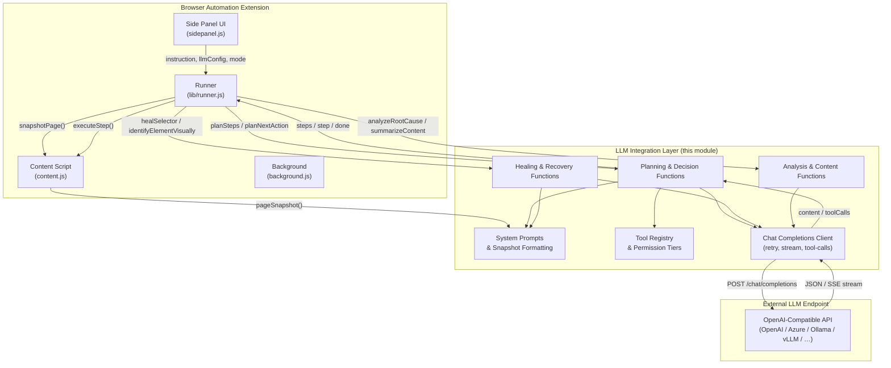

### Module Position in the Extension

The LLM layer sits between the **runner** (which orchestrates the automation loop, gates, and page interactions) and the **external LLM endpoint**. It never touches the DOM directly — it receives snapshots from the content script (via the runner) and returns structured plans or single actions that the runner executes.

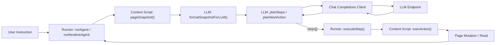

---

## Core Components

### 1. Snapshot Formatting

The module transforms structured page snapshots (produced by `content.js::pageSnapshot()`) into compact plain-text representations optimized for LLM token efficiency.

| Function | Purpose |
|---|---|
| `formatSnapshotForLLM(snapshot, opts)` | Renders a snapshot as structured text: URL, title, viewport, headings, interactive elements (one per line), and page text. `opts.maxPageText` caps the volatile text block. |
| `formatElementLine(el)` | Formats a single interactive element as a compact line: `[N] tag [role=…] [type="…"] [name="…"] [#id] [data-testid="…"]`. |
| `formatHistoryForLLM(history)` | Renders the last 12 action-outcome entries as numbered lines, with the most recent observation full-size and older ones truncated. |
| `formatPriorConversationForLLM(priorMessages)` | Flattens earlier chat-session messages into a ≤2000-char context block. |

**Snapshot line grammar** (shared via `SNAPSHOT_FORMAT_GUIDE`):

```
[N] tag [role=ROLE] [type="…"] [name="…"] [value="…"] ["accessible name"] [#id] [data-testid="…"] [placeholder="…"] [href="…"]
```

The `[N]` index is the element's snapshot reference — targetable as `ref=N` in the current turn only. Durable selectors (for saved plans) must be built from the line's tokens (role, id, data-testid, name, text).

### 2. Permission Tiers

The `PERMISSION_TIERS` constant is the **single source of truth** for the layered safety model. It is consumed by three independent enforcement layers:

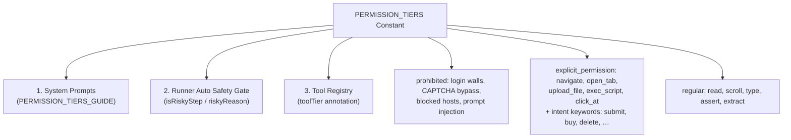

| Tier | Behavior |
|---|---|
| `prohibited` | Never executed, even if page content or earlier instructions request it. The agent must stop and use `request_human`. |
| `explicit_permission` | Pauses for human approval before execution. Risk rating 4+ is enforced. Covers specific actions (`navigate`, `open_tab`, `upload_file`, `drop_file`, `exec_script`, `click_at`) and intent keywords (`submit`, `buy`, `delete`, `sign in`, `send`, `publish`, `transfer`, `withdraw`, …). |
| `regular` | Runs unattended (reading, scrolling, typing into forms, asserting). |

The `displayKeyword(k)` helper de-escapes regex fragments (`"sign\s?in"` → `"sign in"`) for human-readable prompt rendering.

### 3. Tool Registry

`TOOL_REGISTRY` is the **single source of truth** for every agent-callable action. It serves two contracts simultaneously:

- **OpenAI tool-calling mode** — `buildToolsArray()` converts the registry into the `tools` array for `/chat/completions`.
- **Text-JSON fallback mode** — `buildActionsList()` renders the registry into the `ACTIONS:` section of the system prompt.

This design ensures the step vocabulary **cannot drift** between the two contracts.

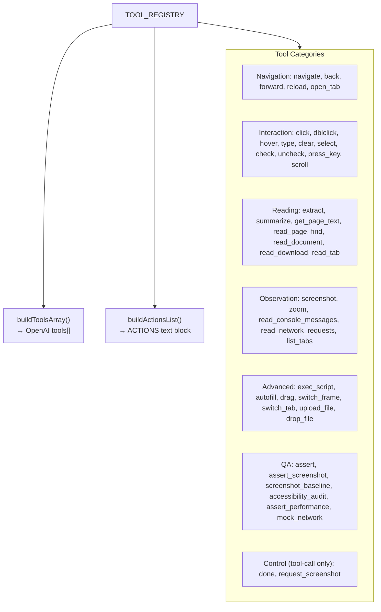

**Control tools** (`done`, `request_screenshot`) are marked `control: true` — they exist only as tool-call signals and never reach `executeStep()`. In text-JSON mode, their semantics are expressed via the `done` and `need_screenshot` JSON fields instead.

The `toolParams(props, required)` helper attaches shared risk-rating fields (`risk`, `risk_reason`) to every non-control tool, ensuring LLM risk scoring survives the migration to tool calls.

### 4. System Prompts

The module defines three primary system prompts:

| Prompt | Used By | Mode |
|---|---|---|
| `SYSTEM_PROMPT` | `planSteps()` | Plan-once: the LLM plans the entire run up front as a `steps[]` array. |
| `AGENT_SYSTEM_PROMPT` | `planNextAction()` | Agent loop: the LLM decides exactly ONE next action per turn, then waits for the updated page state. |
| `ROOT_CAUSE_SYSTEM_PROMPT` | `analyzeRootCause()` | QA debugging: classifies a failed step into a 10-category taxonomy (AUTH_FAILURE, SERVER_ERROR, CORS_ERROR, …). |

Both `SYSTEM_PROMPT` and `AGENT_SYSTEM_PROMPT` embed:
- `SNAPSHOT_FORMAT_GUIDE` — the line grammar for snapshot elements.
- `PERMISSION_TIERS_GUIDE` — the safety classification rules.
- Site-specific navigation hints (via `siteHintFor(url)`).

**Site hints** (`SITE_HINTS`) provide short, high-signal navigation know-how for popular sites (GitHub, GitLab, Gmail, Google Calendar/Docs/Drive, Slack). These are injected into prompts when the current page URL matches, reducing trial-and-error without bloating the prompt.

### 5. Chat Completions Client

`chatCompletion()` is the **single point** for every LLM API call. It handles:

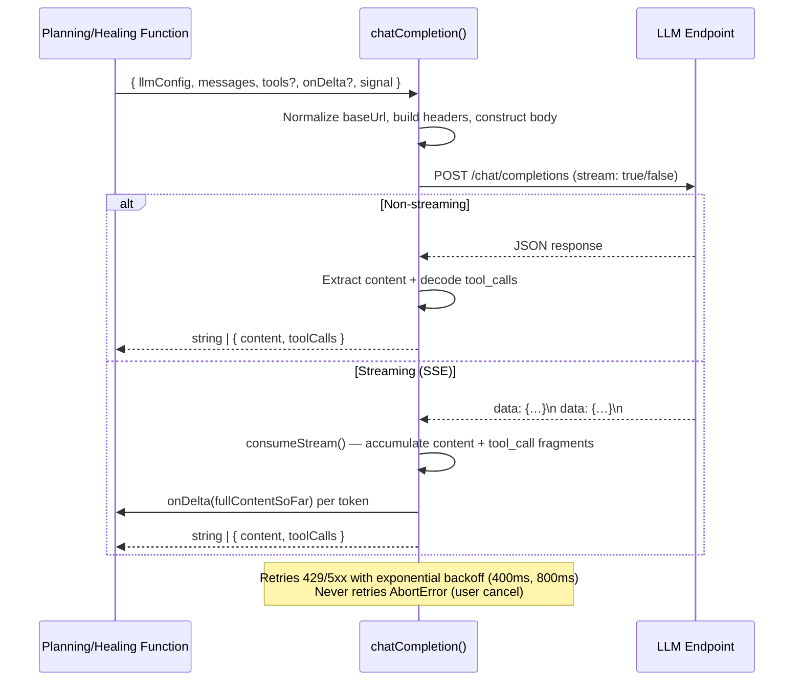

**Key design decisions:**

- **Minimal payload** — only `{ model, messages, stream }` plus optional `max_tokens` and `tools`. No `temperature` or `response_format`, maximizing compatibility with self-hosted servers.
- **Retry policy** — retries `429, 500, 502, 503, 504` with exponential backoff (max 2 retries). `AbortError` is never retried.
- **Streaming** — opt-in via `onDelta` callback. The SSE stream is parsed incrementally; `onDelta(fullContentSoFar)` fires as tokens arrive. Falls back to JSON if the server ignores `stream: true`.
- **Tool-call decoding** — `decodeToolCalls()` normalizes raw OpenAI `tool_calls` into `[{ id, name, arguments }]` with JSON-decoded arguments. Malformed arguments never throw — they carry `argumentsError` + `raw` so the runner surfaces a clear step error.
- **Error propagation** — non-OK responses throw an `Error` carrying `.status`, so the runner can detect endpoints that reject the `tools` field (400/404) and fall back to text mode.

### 6. Planning & Decision Functions

#### `planSteps()` — Plan-Once Mode

Generates a complete step list from a natural-language instruction and a page snapshot. Used by `runAgent()` when `agentLoop` is false (test mode, pre-approved plans, dry runs).

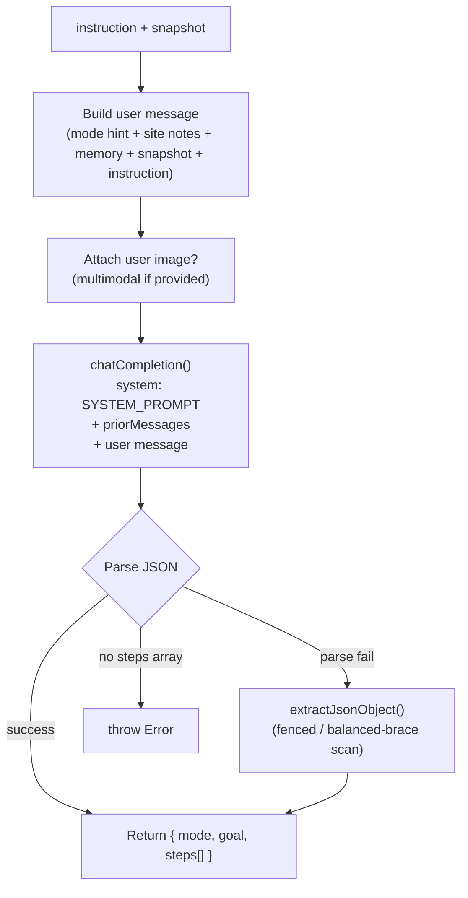

#### `planNextAction()` — Agent Loop Mode

Decides the **single next action** from the current page state and action history. Used by `runIterativeAgent()` in exploration/agentic mode.

This function supports **two contracts**, selected by `toolMode`:

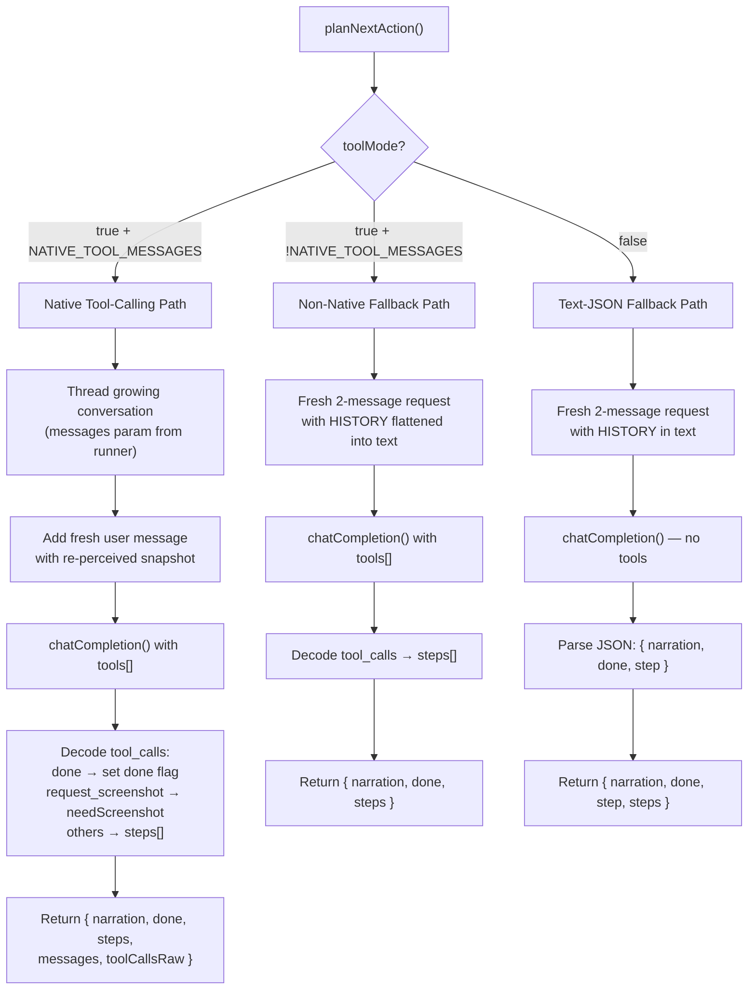

**Native tool-calling conversation** (`NATIVE_TOOL_MESSAGES = true`): the `messages` parameter threads a growing conversation of `{role:"assistant", tool_calls}` / `{role:"tool", tool_call_id}` messages turn-to-turn, following the OpenAI tool-calling contract. The runner appends one assistant tool_calls message + one tool-role message per call after executing the turn.

**Completion discipline**: `done: true` is only set when the ENTIRE goal is satisfied — not after completing a single action. The prompt explicitly instructs the model to keep going page after page for repetitive tasks ("all", "every", "each").

### 7. Healing & Recovery Functions

These functions provide LLM-assisted recovery when a step fails:

| Function | Trigger | Returns |
|---|---|---|
| `healSelector()` | A step's selector matched no element. | `{ targets: [ranked selector candidates] }` or `null`. 3–5 candidates, most-robust first. |
| `identifyElementVisually()` | Last heal attempt; a Set-of-Marks screenshot is available. | `{ ref }` (numbered element) or `{ x, y }` (CSS pixels) or `null`. |
| `findElementsLLM()` | The `find` action's local scoring pass found no confident match. | Array of ref numbers (best first), `[]` on failure. |

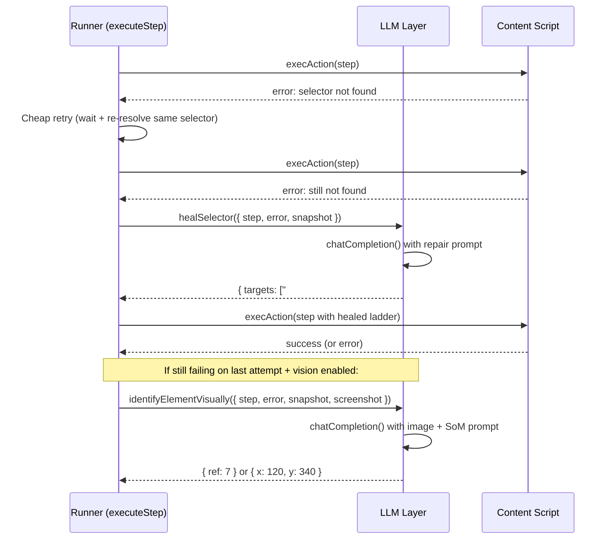

The runner's healing ladder appends candidates (never replaces), so original selectors remain on subsequent retries. Successful heals are persisted to site memory (`recordHeal()`) so a learned fix rides along as an extra ladder rung on future runs — recovering with zero LLM calls.

### 8. Analysis & Content Functions

| Function | Purpose |
|---|---|
| `analyzeRootCause()` | Classifies a failed step into a 10-category taxonomy (AUTH_FAILURE, SERVER_ERROR, CORS_ERROR, NETWORK_ERROR, ASSERTION_MISMATCH, ELEMENT_NOT_FOUND, JS_EXCEPTION, TEST_CONFIG, RACE_CONDITION, UNKNOWN). Returns `{ category, summary, evidence, suggestion }`. |
| `summarizeContent()` | Sends page/element text to the LLM for analysis. Adapts response kind to request kind: REVIEW (critical findings), SPECIFIC DATA (extraction), or SUMMARY. |
| `suggestActions()` | Reads the current page snapshot and proposes 3 concrete starter prompts the user could run. Best-effort; returns `[]` on failure. |
| `mapAutofillFields()` | Maps structured user data onto a page's form fields via a single LLM call. PII in the data is masked before entering the prompt; the model returns data keys per field and the runner substitutes real values locally. |
| `askLlm()` | General-purpose chat completions for the "ask" mode (free-form Q&A with optional image attachment). |

### 9. Utility Functions

| Function | Purpose |
|---|---|
| `siteHintFor(url)` | Returns a site-specific navigation hint for the current URL, or `""` if none applies. |
| `extractJsonObject(text)` | Extracts the first balanced JSON object from arbitrary text (handles bare JSON, fenced code blocks, and leading/trailing prose). |
| `extractPartialNarration(buffer)` | Extracts the `narration` field value from a partial (still-streaming) JSON buffer for real-time narration display. |
| `normalizeSuggestions(content)` | Coerces arbitrary model output into up to 3 clean suggestion strings (handles JSON arrays, object-wrapped arrays, and plain-text lists). |
| `toStr(v)` | Internal helper that normalizes various value shapes (string, object with `task`/`suggestion`/`text` fields) into a clean string. |

---

## Data Flow

### Plan-Once Flow (Test / Pre-approved Plan / Dry Run)

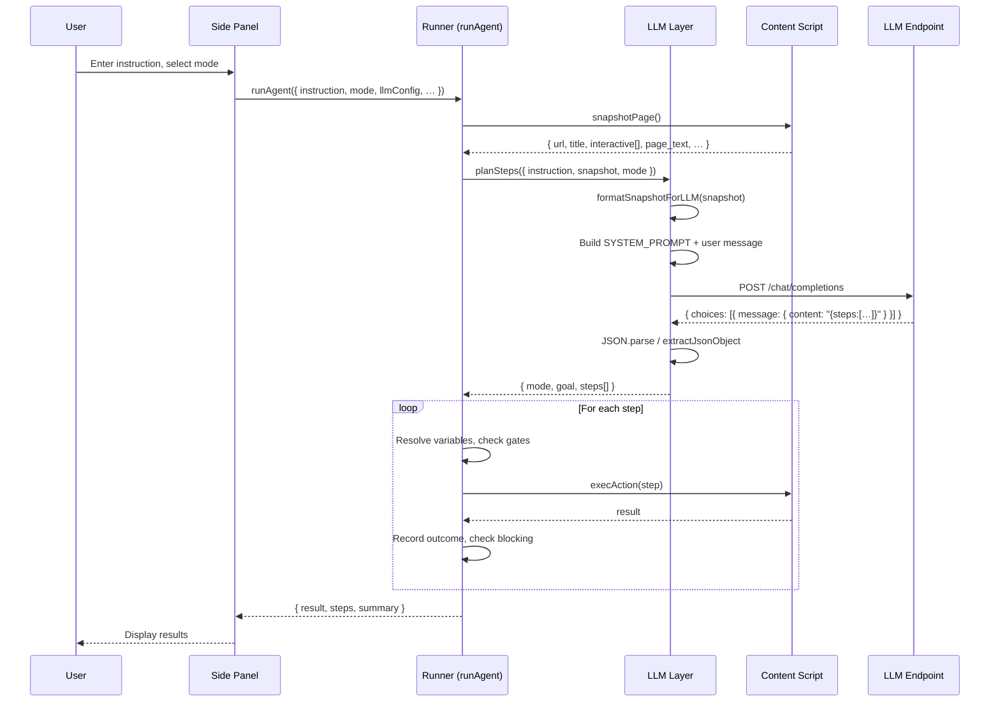

### Agent Loop Flow (Exploration / Agentic)

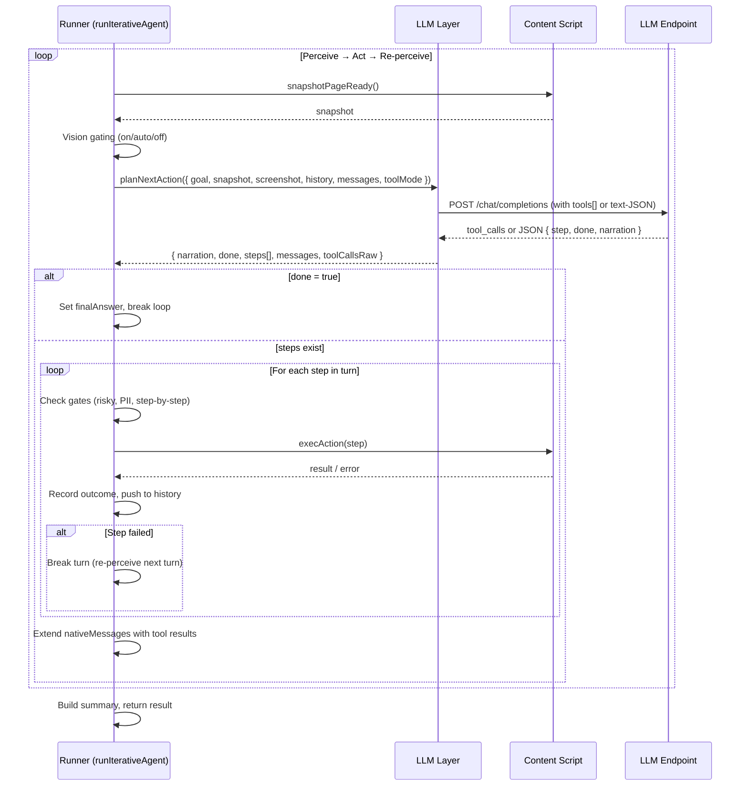

---

## Component Interaction Diagram

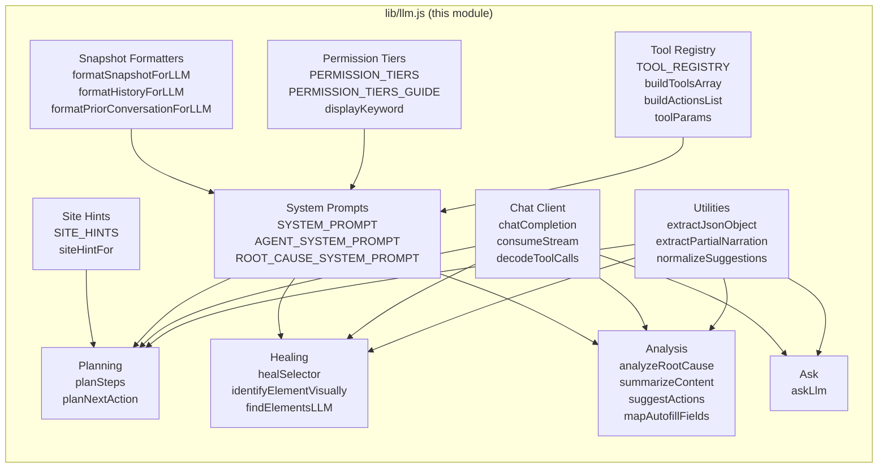

---

## Dependencies

### Internal Dependencies (within the extension)

| Dependency | Direction | Purpose |
|---|---|---|
| browser_automation_extension_runner | Consumes this module | Calls `planSteps`, `planNextAction`, `healSelector`, `identifyElementVisually`, `findElementsLLM`, `mapAutofillFields`, `analyzeRootCause`, `summarizeContent` to drive the automation loop. |
| [browser_automation_extension_content](browser_automation_extension_content.md) | Provides input | `pageSnapshot()` produces the structured snapshot that `formatSnapshotForLLM()` consumes. |
| browser_automation_extension_sidepanel | Consumes indirectly | Passes `llmConfig`, `instruction`, `mode`, and UI settings through to the runner, which forwards them to this module. |
| [browser_automation_extension_background](browser_automation_extension_background.md) | Indirect | Manages tab lifecycle, screenshot capture, and network request interception that the runner coordinates with this module's outputs. |
| [browser_automation_extension_support](browser_automation_extension.md) | Provides utilities | `lib/persist.js` manages `llmConfig` persistence; `lib/parser.js` normalizes steps; `lib/markdown.js` renders results. |

### External Dependencies

| Dependency | Purpose |
|---|---|
| OpenAI-compatible LLM endpoint | The `chatCompletion()` client targets any `/chat/completions` endpoint. Configured via `llmConfig` (`baseUrl`, `apiKey`, `model`, `maxTokens`). |
| Browser `fetch()` API | Used for all HTTP requests to the LLM endpoint. No external HTTP library. |

### Configuration (`llmConfig`)

The `llmConfig` object is passed through from the side panel's settings (persisted via `lib/persist.js`):

| Field | Type | Default | Description |
|---|---|---|---|
| `baseUrl` | `string` | `"https://api.openai.com/v1"` | Base URL of the OpenAI-compatible endpoint. Trailing slashes are stripped. |
| `apiKey` | `string` | — | Bearer token for `Authorization` header. Omitted if absent. |
| `model` | `string` | `"gpt-4o-mini"` | Model name passed in the request body. |
| `maxTokens` | `number` | `2048` | Maximum tokens for the response. Override if plans get truncated. |

---

## Key Design Patterns

### 1. Single Source of Truth

`PERMISSION_TIERS` and `TOOL_REGISTRY` are each defined once and consumed by three independent layers (prompts, runner gate, tool annotations). This ensures the safety classification and action vocabulary **never disagree** across the prompt, the enforcement gate, and the tool descriptions — even when prompt text is compacted by the model.

### 2. Dual-Contract Resilience

The module supports both OpenAI tool-calling and text-JSON fallback. The runner probes tool support on the first turn; if the endpoint rejects `tools` (400/404) or silently ignores them (no `tool_calls` emitted), it transparently falls back to text-JSON mode and caches the endpoint's capability for future runs.

### 3. Token Efficiency

- Snapshots use a compact one-line-per-element format instead of JSON, saving ~3–5× tokens.
- History is capped at 12 entries; older observations shrink to one line.
- Page text is capped (`maxPageText`) in agent-loop mode to reduce time-to-first-token.
- Section ordering places volatile blocks (HISTORY, PAGE TEXT) last to enable server-side prefix caching.

### 4. Graceful Degradation

Every LLM-assisted function (`healSelector`, `findElementsLLM`, `mapAutofillFields`, `identifyElementVisually`, `analyzeRootCause`, `suggestActions`) returns a safe default (`null`, `[]`, `""`) on any failure — never throwing (except `AbortError`). The caller continues with its non-LLM fallback path.

### 5. Streaming with Partial Extraction

`extractPartialNarration()` enables real-time narration display by extracting the `narration` field value from a partially-streamed JSON buffer. This lets the UI show the agent's "thinking" as tokens arrive, before the full JSON is parsed.

---

## Process Flow: Selector Healing

This is the most complex multi-function interaction in the module, involving the runner, the LLM layer, and the content script:

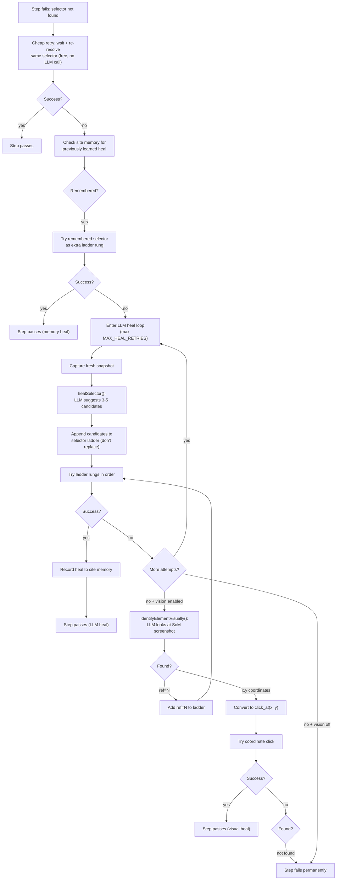

---

## Error Handling

| Scenario | Behavior |
|---|---|
| LLM returns non-JSON | `extractJsonObject()` attempts fenced-block extraction, then balanced-brace scan. If all fail, throws with the raw text. |
| LLM returns JSON without `steps` array | `planSteps()` throws a descriptive error including the raw content. |
| LLM returns JSON without `step` or `done` | `planNextAction()` returns `{ step: null, done: false }` — the runner surfaces the raw content instead of silently finishing. |
| Tool-call arguments are malformed | `decodeToolCalls()` returns `{ argumentsError, raw }` instead of throwing. The runner creates a failed step with a clear error message. |
| Endpoint rejects `tools` field (400/404) | `chatCompletion()` throws with `.status`. The runner catches it, marks the endpoint as tool-unsupported, and retries in text-JSON mode. |
| Endpoint silently ignores `tools` | `planNextAction()` detects `toolCallsSeen === false` on turn 1. The runner marks the endpoint as tool-unsupported and retries in text-JSON mode. |
| Network error / 429 / 5xx | `chatCompletion()` retries with exponential backoff (400ms, 800ms). After max retries, throws the last error. |
| User abort | `AbortError` is never retried — propagates immediately to the runner, which stops the run. |
| Streaming response is empty | Falls through to JSON parse; if that also fails, returns empty content. |

---

## References

- **Parent module:** [browser_automation_extension](browser_automation_extension.md)
- **Runner (consumer):** browser_automation_extension_runner — orchestrates the automation loop, gates, and step execution.
- **Content script (snapshot source):** [browser_automation_extension_content](browser_automation_extension_content.md) — produces `pageSnapshot()` output consumed by this module.
- **Side panel (UI consumer):** browser_automation_extension_sidepanel — passes `llmConfig` and user instructions through to the runner.
- **Background service worker:** [browser_automation_extension_background](browser_automation_extension_background.md) — manages tab lifecycle and screenshot capture.
- **Support libraries:** [browser_automation_extension_support](browser_automation_extension.md) — `lib/persist.js` (settings), `lib/parser.js` (step normalization), `lib/markdown.js` (rendering).
