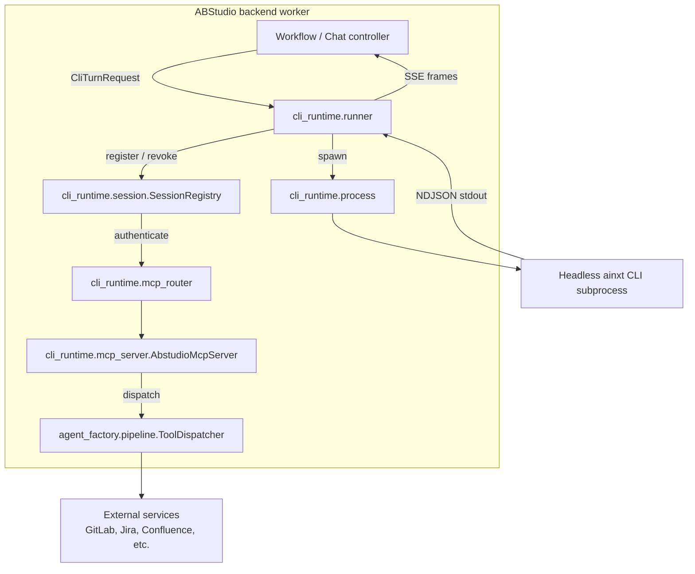
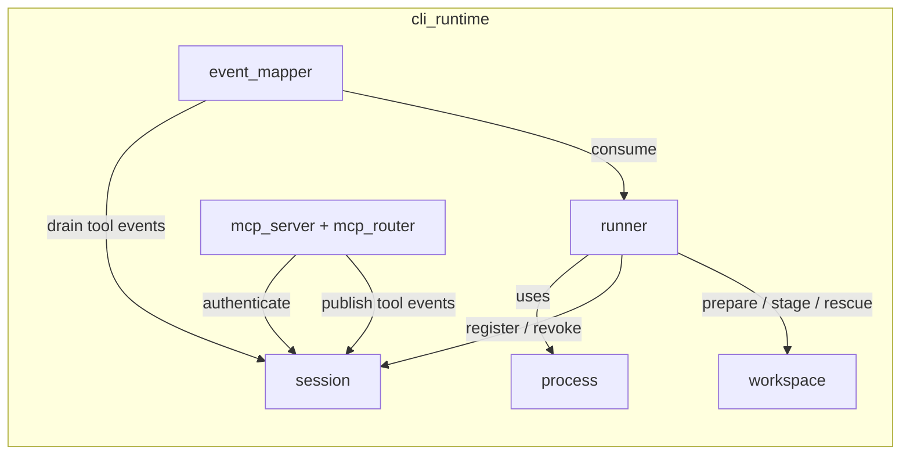
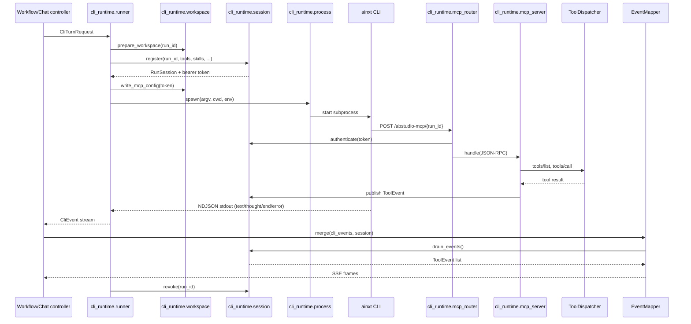

# cli_runtime

## Overview

The `cli_runtime` module is ABStudio's **CLI-subprocess execution backend**. It allows the platform to run an agent turn inside a headless `ainxt` CLI process rather than in the in-process `NativeEngine`, while keeping the experience identical for the frontend and the rest of the system.

The module's responsibilities are:

1. **Spawn and supervise** a sandboxed `ainxt` child process for each agent turn.
2. **Authenticate** the CLI's callbacks via a per-run, scoped bearer token.
3. **Expose every ABStudio tool** to the CLI through a single MCP (Model Context Protocol) server that reuses the same `ToolDispatcher` as the native engine.
4. **Translate** the CLI's NDJSON event stream into ABStudio's SSE vocabulary so the UI cannot tell whether a turn ran natively or through the CLI.
5. **Manage per-run workspaces**, including git checkouts, uploaded documents, generated files, and cleanup.

CLI mode is opt-in via environment configuration (`ABSTUDIO_CLI_MODE`, `ABSTUDIO_CLI_PATH`, `ABSTUDIO_CLI_API_KEY`). When disabled, the module is inert and the native engine continues to handle all runs.

## Architecture

### Design principles

- **Transport, not reimplementation**: Tool calls from the CLI are routed through the same `ToolDispatcher` the native engine uses. Credential resolution, sandboxing, retries, audit logging, and output capping all happen in one place.
- **Per-run identity**: The CLI subprocess holds no user JWT. Instead, the runner mints a short-lived bearer token scoped to one run, one agent, and a fixed allow-list of tools and skills.
- **Event parity**: The frontend receives the same `agent_token`, `tool_call_start`, `tool_call_result`, `agent_usage`, and `agent_complete` frames regardless of execution path.
- **Fail-closed security**: `read_skill_file` is gated by the agent's attached skill list; unresolvable tools are dropped with a warning; tokens are revoked in a `finally` block.
- **Cross-platform subprocess support**: Production uses `asyncio.create_subprocess_exec`, while Windows development machines fall back to a threaded `subprocess.Popen` backend.

### Component map

| Sub-module | Files | Responsibility |
|------------|-------|----------------|
| [cli_runtime_session](cli_runtime_session.md) | `session.py` | Per-run identity, scoped tokens, and the in-process tool-event bus. |
| [cli_runtime_runner](cli_runtime_runner.md) | `runner.py`, `process.py` | Spawn the CLI, stream NDJSON events, enforce timeouts/concurrency, and guarantee teardown. |
| cli_runtime_mcp | `mcp_server.py`, `mcp_router.py` | JSON-RPC MCP surface the CLI calls back into; dispatches tools through `ToolDispatcher`. |
| cli_runtime_events | `event_mapper.py` | Translate CLI events into ABStudio SSE frames and accumulate turn results. |
| cli_runtime_workspace | `workspace.py` | Per-run directories, MCP `config.toml`, prompt files, git clones, document staging, and file rescue. |

## Data flow of a single CLI turn

## Configuration

Configuration is loaded from environment variables by `cli_runtime.config.cli_runtime_config()` and captured into an immutable `CliRuntimeConfig` snapshot at the start of each run.

| Variable | Purpose |
|----------|---------|
| `ABSTUDIO_CLI_MODE` | Enable CLI execution. |
| `ABSTUDIO_CLI_PATH` / `AINXT_CLI_BIN` | Path or name of the `ainxt` binary. |
| `ABSTUDIO_CLI_API_KEY` | Gateway API key the CLI uses for LLM traffic. |
| `ABSTUDIO_CLI_WORKSPACE_ROOT` | Override the per-run workspace root. Defaults to `{RUNTIME_ARTIFACTS_DIR}/cli_runs`. |
| `ABSTUDIO_CLI_WORKSPACE_TTL_SECONDS` | How long to keep workspaces before `sweep_workspaces` deletes them. |
| `ABSTUDIO_CLI_MAX_CONCURRENCY` | Per-process cap on concurrent CLI subprocesses. |
| `ABSTUDIO_CLI_RUN_TIMEOUT_S` | Hard timeout for one turn. |
| `ABSTUDIO_CLI_KILL_GRACE_S` | Grace period between `terminate` and `kill`. |
| `ABSTUDIO_CLI_MAX_TURNS` | Default `--max-turns` passed to the CLI. |
| `ABSTUDIO_CLI_MCP_BASE_URL` | Base URL for the MCP callback endpoint. |
| `ABSTUDIO_CLI_MCP_SERVER_NAME` | Server name used in the MCP config and `--allow` rule. |
| `ABSTUDIO_CLI_EXPOSE_DRAFT_TOOLS` | Whether to include draft/canonical tools in the MCP manifest. |

## Security model

- **No user JWT in the child**: The CLI receives only a per-run bearer token that is valid for the lifetime of the subprocess and scoped to the agent's tool/skill allow-list.
- **Loopback-only MCP endpoint**: The MCP callback URL points to `127.0.0.1` and the token never leaves the host.
- **Constant-time token comparison**: `RunSession.token_matches` uses `hmac.compare_digest`.
- **Coarse auth failures**: The router returns the same reason for "no such run" and "wrong token" to prevent run enumeration.
- **Skill scope fail-closed**: `read_skill_file` is denied when the skill is not in the agent's attached skill list, even if the allow-list is empty.
- **Credential redaction**: Tool arguments are redacted before logging or SSE emission; git clone stderr is scrubbed of embedded tokens.

## Relationship to other modules

- **[agent_factory_pipeline](../agents/agent_factory_pipeline.md)**: `cli_runtime_mcp` delegates tool execution to `ToolDispatcher` from `agent_factory.pipeline`, ensuring the CLI and native engine share one tool implementation.
- **[core_mcp_manager](../mcp/core_mcp_manager.md)**: The CLI MCP server implements the same MCP protocol shape and description-truncation budget used by the in-process MCP manager.
- **[engine_native_engine](../agents/engine_native_engine.md)**: Event payloads (`agent_usage`, `tool_call_result`, `complete.output`) are intentionally identical to those produced by `NativeEngine` so that cost tracing, loop detection, and the debug log work unchanged.
- **[api_execution](../api/api_execution.md) / [api_chat](../api/api_chat.md)**: These API layers call `run_cli_turn` when an agent node is configured for CLI execution and consume the resulting SSE stream through `event_mapper.merge`.
- **[app_models](../core/app_models.md)**: `CliTurnRequest` is built from workflow/agent models such as `AgentNode`, `RunRequest`, and `McpNode`.

## Operational notes

- **Concurrency**: `get_semaphore()` creates a process-wide `asyncio.Semaphore`. With `N` uvicorn workers, the effective host-level cap is `N × max_concurrency`.
- **Cancellation**: `asyncio.CancelledError` propagates after the child is killed, so a stopped run is not reported as successful.
- **Workspace cleanup**: `sweep_workspaces` removes directories older than the TTL based on directory mtime. It is safe to run concurrently from multiple workers.
- **Tool-less run detection**: If `tools/list` returns zero tools despite a non-empty allow-list, the runner logs an error. This is the most common silent failure mode and usually means `AINXT_FOLDER_TRUST=0` did not reach the child or the MCP URL is unreachable.
- **Engine-native fallbacks**: `ask_human` and `spawn_swarm` cannot execute inside a subprocess. The MCP server returns a sentinel payload (`__abstudio_engine_native__`) that the bridge intercepts and runs through the native path.
