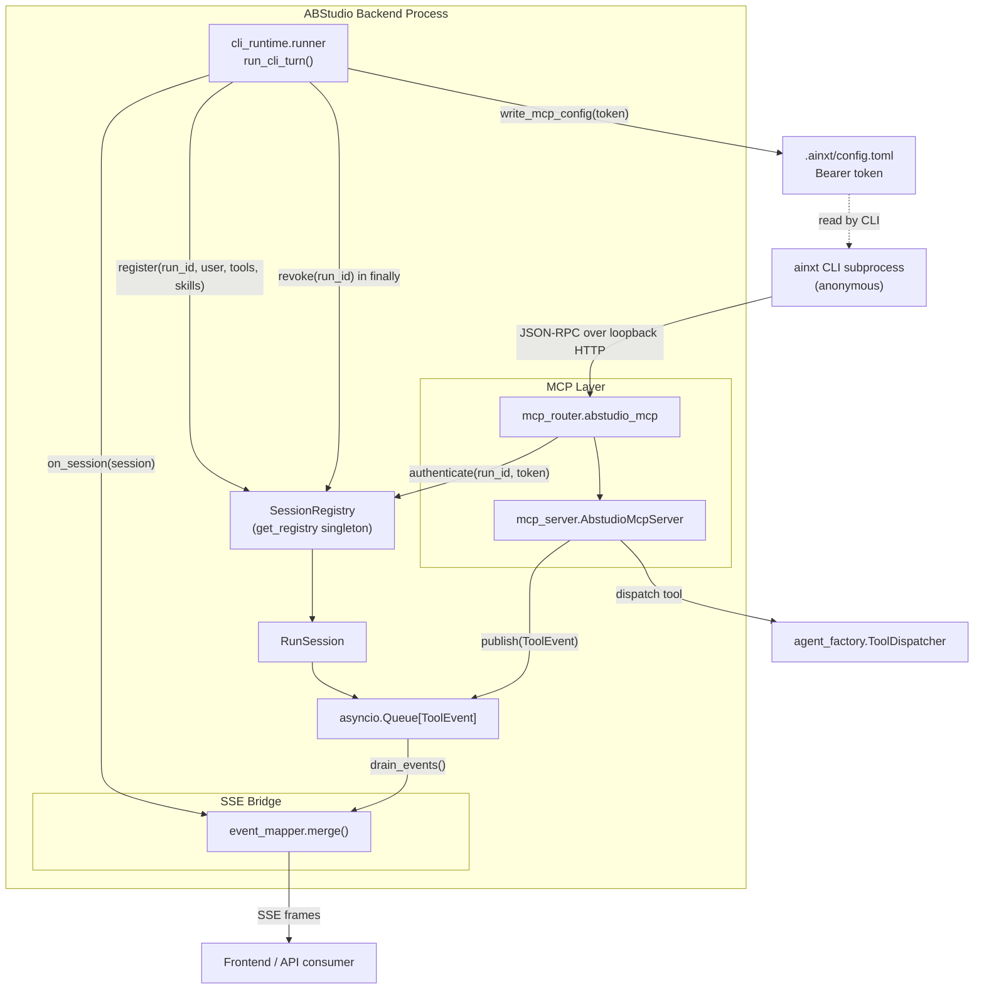
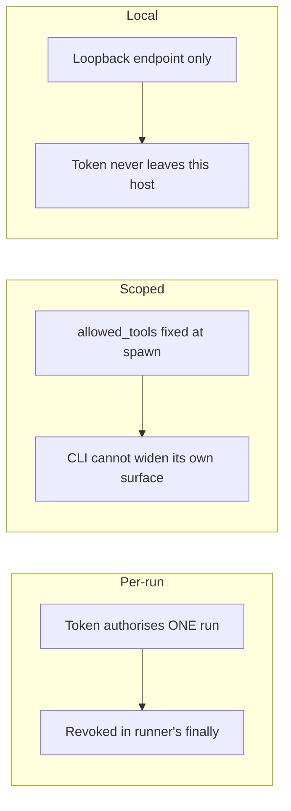
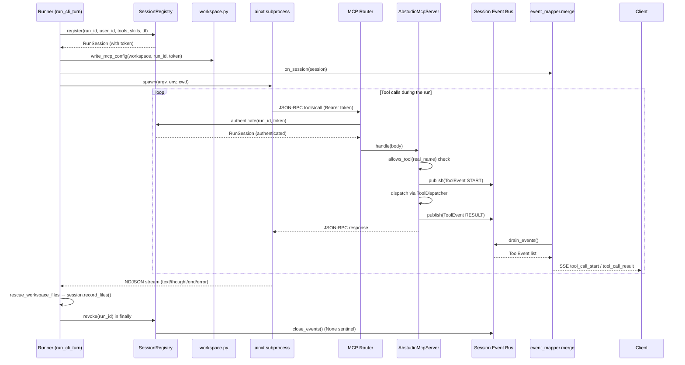
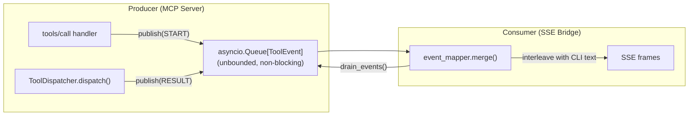
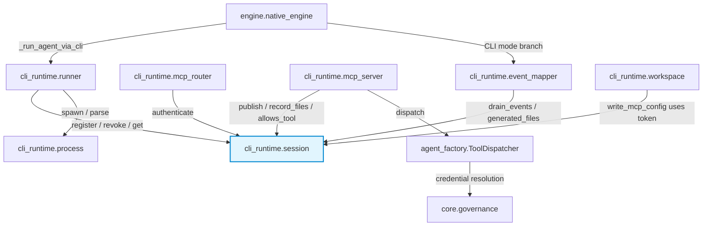
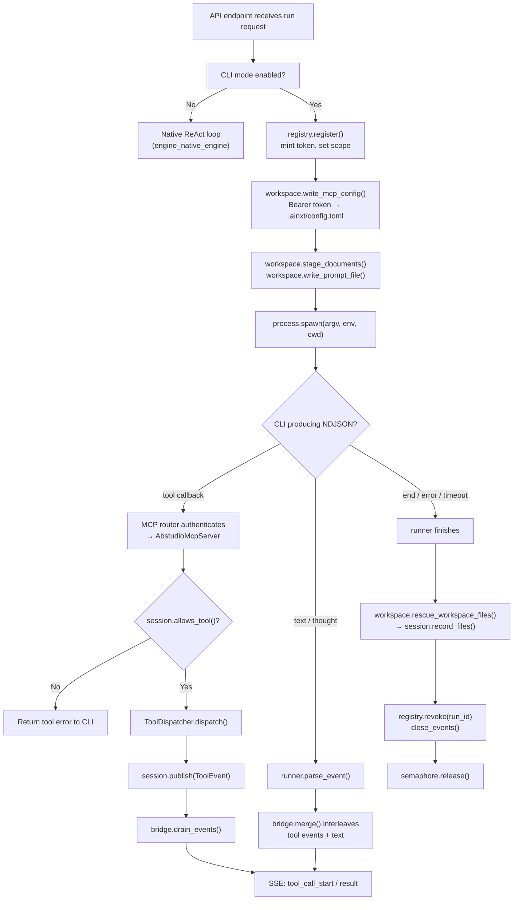

# cli_runtime_session

## Introduction

The `cli_runtime_session` module is the **identity and event-bus backbone** for
every agent turn executed through the spawned `ainxt` CLI runtime. A headless
CLI process is anonymous — it holds no JWT and knows nothing about the user who
started it. This module gives that ephemeral process a scoped, per-run identity
and provides the in-process channel through which tool-activity events flow back
to the SSE stream.

It lives at `ABStudio/backend/app/cli_runtime/session.py` and exports three
primary components:

| Component | Role |
|---|---|
| `RunSession` | Per-run state: identity, scope, token, live event bus, generated-file accumulator. |
| `SessionRegistry` | Process-local map of `run_id → RunSession` with authenticated lookup, TTL, and housekeeping. |
| `ToolEvent` | One tool-activity frame published by the MCP layer and consumed by the SSE bridge. |

The module also exposes a module-level singleton accessor `get_registry()` so
the runner (which creates sessions) and the MCP router (which authenticates
them) share one registry within the same process.

---

## Architecture



### Where it fits in the system

The session module sits between the **runner** (which spawns the CLI) and the
**MCP layer** (which serves tool calls back to the CLI). It is consumed by:

- **[cli_runtime_runner](cli_runtime_runner.md)** — calls `registry.register()`
  before spawn and `registry.revoke()` in a `finally` block; passes the session
  to the SSE bridge via an `on_session` callback.
- **cli_runtime_mcp** — the MCP router calls
  `registry.authenticate()` on every inbound JSON-RPC message; the MCP server
  publishes `ToolEvent` frames onto the session's event bus.
- **cli_runtime_events** — the `merge()` bridge drains
  tool events from the session bus and interleaves them with CLI text frames.
- **[engine_native_engine](../agents/engine_native_engine.md)** — when `ABSTUDIO_CLI_MODE`
  is enabled, `NativeEngine._run_agent_via_cli()` delegates agent-node execution
  to the CLI runtime, which in turn relies on this session module.
- **[api_execution](../api/api_execution.md)** / **[api_factories](../api/api_factories.md)**
  — workflow and agent-runner endpoints stream SSE to the frontend; the tool
  activity surfaced in those streams originates here when the CLI path is active.

---

## Core Components

### ToolEvent

```python
@dataclass
class ToolEvent:
    kind: str                       # "tool_call_start" | "tool_call_result"
    tool_name: str
    arguments: Optional[dict] = None
    result: Any = None
    error: str = ""
    duration_ms: int = 0
    generated_files: List[dict] = field(default_factory=list)
```

A single tool-activity frame mapped 1:1 onto an ABStudio SSE event. The `kind`
field is already the SSE event name, so the event mapper's conversion stays
trivial (see `tool_event_to_sse()` in cli_runtime_events).

Two constants are exported for kind values:

- `TOOL_EVENT_START` — `"tool_call_start"`
- `TOOL_EVENT_RESULT` — `"tool_call_result"`

### RunSession

`RunSession` is a dataclass holding everything the MCP layer needs to serve one
CLI run. It is **never persisted** — a session is only meaningful while its
subprocess is alive.

**Identity & scope fields**

| Field | Purpose |
|---|---|
| `run_id` | Unique run identifier (e.g. `abs-<hex>` or `wf-<thread>-<node>`). |
| `token` | Random `secrets.token_urlsafe(32)` bearer token, written into the run's `.ainxt/config.toml`. |
| `user_id`, `email` | Caller identity forwarded to `ToolDispatcher` for credential resolution. |
| `allowed_tools` | Fixed at spawn time from the agent definition; a prompt-injected CLI cannot widen this. |
| `allowed_skills` | Fixed skill allow-list for `read_skill_file` scope enforcement. |
| `workflow_artifact_dir` | Where `code_executor` writes artefacts. |
| `agent_name`, `node_id` | Labels for SSE payloads and logs. |
| `expires_at` | TTL backstop (default 960 s); the runner revokes explicitly on exit. |

**Live state fields**

| Field | Purpose |
|---|---|
| `events` | Unbounded `asyncio.Queue[Optional[ToolEvent]]` — the event bus. `None` is the drain sentinel. |
| `tool_calls` | Counter incremented by the MCP server on each `tools/call`. |
| `generated_files` | De-duplicated list of artefacts produced during the run. |
| `listed_tool_count` | Set by `tools/list`; `-1` means not yet served. Used to detect misconfiguration. |
| `handshake_done` | Set when the CLI sends `notifications/initialized`. |

**Key methods**

| Method | Description |
|---|---|
| `is_expired(now?)` | True if `now > expires_at`. |
| `token_matches(presented)` | Constant-time comparison via `hmac.compare_digest` — avoids timing side-channel. |
| `allows_tool(name)` | Membership check against `allowed_tools`. |
| `publish(event)` | Non-blocking `put_nowait` onto the event bus; never raises. |
| `close_events()` | Pushes `None` sentinel to tell a draining consumer to stop. |
| `drain_events()` | Non-blocking pop of all queued events; stops at `None`. |
| `record_files(files)` | Accumulates generated files, de-duplicated by `disk_name`. |

### SessionRegistry

A process-local `Dict[str, RunSession]` with an `asyncio.Lock`. Being
process-local is **correct by design**, not a limitation: the CLI child talks to
loopback, so it always reaches the worker that spawned it. (The cowork MCP
router needs Redis because its client is a remote desktop app that may hit any
worker; ours cannot.)

**Lifecycle methods**

| Method | Description |
|---|---|
| `register(...)` | Creates a `RunSession` with a minted token, stores it, returns it. `ttl_seconds` should exceed the run timeout. |
| `revoke(run_id)` | Removes the session and closes its event bus. Idempotent. |
| `get(run_id)` | Simple lookup (used by the SSE bridge to drain tool events). |
| `authenticate(run_id, token)` | Returns `(session, "")` on success or `(None, reason)` on failure. |
| `sweep_expired()` | Drops sessions past their TTL; returns count removed. |
| `active_count()` | Number of live sessions. |
| `clear()` | Revokes every session (shutdown / test teardown). |

**Authentication** uses a deliberately coarse failure reason —
`"unknown or expired run"` — so a caller probing the endpoint cannot
distinguish "no such run" from "wrong token" and enumerate live runs.

### get_registry()

Module-level singleton accessor. The router and the runner must share one
registry, and both live in the same process, so a singleton is the correct
wiring.

---

## Security Model

Three properties make the session safe:



1. **Per-run.** A token authorises one run, not a user or a session. It is
   revoked in the runner's `finally` block, so it is dead the moment the process
   exits. The TTL is only a backstop against a leak.
2. **Scoped.** `allowed_tools` and `allowed_skills` are fixed at spawn time from
   the agent definition. A prompt-injected CLI cannot widen its own surface.
3. **Local.** The MCP endpoint is loopback and the token never leaves this host.

Token comparison uses `hmac.compare_digest` to prevent timing attacks. The
`authenticate()` method returns an identical error string for all failure modes
to prevent run-id enumeration.

---

## Session Lifecycle



### Registration

The runner calls `registry.register()` **before** spawning the CLI. The
returned session carries a freshly minted token. The runner then writes the
token into the run's private `.ainxt/config.toml` as an `Authorization: Bearer`
header (see cli_runtime_workspace). The `on_session`
callback is invoked immediately so the SSE bridge can drain tool events for the
entire run, including the first tool call.

### Authentication

When the CLI calls back over loopback HTTP, the MCP router extracts `run_id`
from the path and the bearer token from the `Authorization` header, then calls
`registry.authenticate(run_id, token)`. On success the router constructs an
`AbstudioMcpServer` bound to that session and dispatches the JSON-RPC message.
On failure it returns `401` with the coarse reason.

### Revocation

The runner revokes the session in its `finally` block — **before** ensuring the
child is terminated and releasing the concurrency semaphore. This ordering
ensures the MCP endpoint is closed even if subsequent cleanup steps throw. The
TTL (`sweep_expired()`) is only a backstop for leaked sessions.

---

## Event Bus Data Flow

The CLI's `streaming-json` output contains no tool-call events — only `text`,
`thought`, `end`, and `error`. Tool activity for the UI can only come from the
side that actually executes the tools: the ABStudio MCP server. The session's
event bus is the channel that bridges the two.



**Design decisions:**

- **Unbounded queue.** Dropping a frame would desync the UI, and volume is
  bounded anyway by the CLI's own `--max-turns`.
- **Non-blocking publish.** `publish()` uses `put_nowait` and swallows
  exceptions — a full queue (theoretically impossible) must never break a tool
  call.
- **`None` sentinel.** `close_events()` pushes `None` to tell a draining
  consumer to stop. `drain_events()` stops at `None`.
- **Flush before text.** The `merge()` bridge drains queued tool events before
  each CLI text event so tool cards always precede the answer that references
  their results.

---

## Generated File Accumulation

Files produced during a run are accumulated in two places, both owned by the
session:

1. **`session.generated_files`** — de-duplicated by `disk_name` via
   `record_files()`. The MCP server calls this after each `tools/call` that
   produces files.
2. **`CliTurnResult.generated_files`** — the event mapper folds tool-event
   `generated_files` into the accumulated turn result, then at the end of the
   run replaces them with the session's authoritative list.

The runner also calls `workspace.rescue_workspace_files()` after the CLI exits
to capture any file the model wrote directly into its workspace (bypassing
`code_executor`), and records those on the session via `record_files()` so they
flow through the same generated-files path.

---

## Dependency Map



### Upstream consumers

| Consumer | How it uses the session |
|---|---|
| [cli_runtime_runner](cli_runtime_runner.md) | Creates, revokes, and looks up sessions; passes session to the bridge. |
| cli_runtime_mcp | Authenticates inbound JSON-RPC; publishes tool events; enforces tool scope. |
| cli_runtime_events | Drains the event bus; reads `generated_files` for the final result. |
| [engine_native_engine](../agents/engine_native_engine.md) | Delegates agent-node execution to the CLI runtime when CLI mode is on. |

### Downstream dependencies

The session module itself has **no internal ABStudio imports** — it depends only
on the Python standard library (`asyncio`, `hmac`, `secrets`, `time`,
`dataclasses`, `typing`). Its consumers wire it into the broader system:

- The MCP server dispatches tools through `agent_factory.pipeline.ToolDispatcher`
  (see [agent_factory_pipeline](../agents/agent_factory_pipeline.md)), which resolves user
  credentials and executes catalog tools.
- Tool-access policy is enforced by [core_governance](../sdlc/core_governance.md) inside
  the native engine and the MCP server's `allows_tool` check.

---

## Process Flow: End-to-End CLI Turn



---

## API Reference

### `get_registry() -> SessionRegistry`

Returns the process-wide singleton. Creates it on first call.

### `SessionRegistry.register(...) -> RunSession`

| Parameter | Default | Description |
|---|---|---|
| `run_id` | *(required)* | Unique run identifier. |
| `user_id` | `""` | Caller's user ID. |
| `email` | `""` | Caller's email. |
| `allowed_tools` | `None` → `[]` | Tool names this run may call. |
| `allowed_skills` | `None` → `[]` | Skill names for `read_skill_file` scope. |
| `workflow_artifact_dir` | `""` | Artefact directory for `code_executor`. |
| `agent_name` | `""` | Label for SSE / logs. |
| `node_id` | `""` | Label for SSE / logs. |
| `ttl_seconds` | `960` | Session TTL; should exceed run timeout. |

### `SessionRegistry.authenticate(run_id, presented_token) -> Tuple[Optional[RunSession], str]`

Returns `(session, "")` on success. On any failure (unknown run, expired,
token mismatch) returns `(None, "unknown or expired run")`.

### `RunSession.publish(event: ToolEvent) -> None`

Non-blocking, never raises. Uses `asyncio.Queue.put_nowait`.

### `RunSession.drain_events() -> List[ToolEvent]`

Non-blocking pop of all queued events. Stops at the `None` sentinel.

### `RunSession.record_files(files: List[dict]) -> None`

Accumulates generated files, de-duplicated by `disk_name`.

---

## Design Notes

- **Why process-local, not Redis?** The CLI child talks to loopback, so it
  always reaches the worker that spawned it. A distributed store would add
  latency and complexity for no benefit. The cowork MCP router is different —
  its client is a remote desktop app — and uses Redis; ours does not.
- **Why an unbounded queue?** Dropping a tool-event frame would desync the UI
  timeline. The volume is naturally bounded by the CLI's `--max-turns` cap, so
  memory growth is not a concern in practice.
- **Why coarse auth errors?** Returning distinct messages for "no such run" vs
  "wrong token" would let an attacker enumerate live run IDs. The identical
  `"unknown or expired run"` reason prevents that.
- **Why TTL if revocation is explicit?** The TTL is a backstop against a leaked
  session (e.g. the runner crashes before its `finally` runs). `sweep_expired()`
  cleans those up. The TTL is set to `run_timeout_s + 60` so a slow-but-healthy
  run is never cut off by its own credentials expiring.
- **Why `listed_tool_count`?** A silently empty `tools/list` response is the
  exact failure that sank an earlier attempt at this feature — the CLI would
  report a healthy handshake and then behave as if the agent had no tools.
  Tracking the count lets the runner log loudly when zero tools were exposed
  despite a non-empty allow-list.

---

## Related Documentation

- [cli_runtime_runner](cli_runtime_runner.md) — Spawns the CLI, manages session lifecycle, parses NDJSON events.
- cli_runtime_mcp — MCP router and server that authenticate against the registry and publish tool events.
- cli_runtime_events — Event mapper that merges CLI text with tool events from the session bus.
- cli_runtime_workspace — Workspace preparation, MCP config writing, file rescue.
- [engine_native_engine](../agents/engine_native_engine.md) — Native orchestration engine with optional CLI execution branch.
- [agent_factory_pipeline](../agents/agent_factory_pipeline.md) — `ToolDispatcher` used by the MCP server to execute catalog tools.
- [api_execution](../api/api_execution.md) — Workflow execution SSE endpoint.
- [api_factories](../api/api_factories.md) — Agent-runner chat endpoints.
- [core_governance](../sdlc/core_governance.md) — Tool-access policy enforcement.
