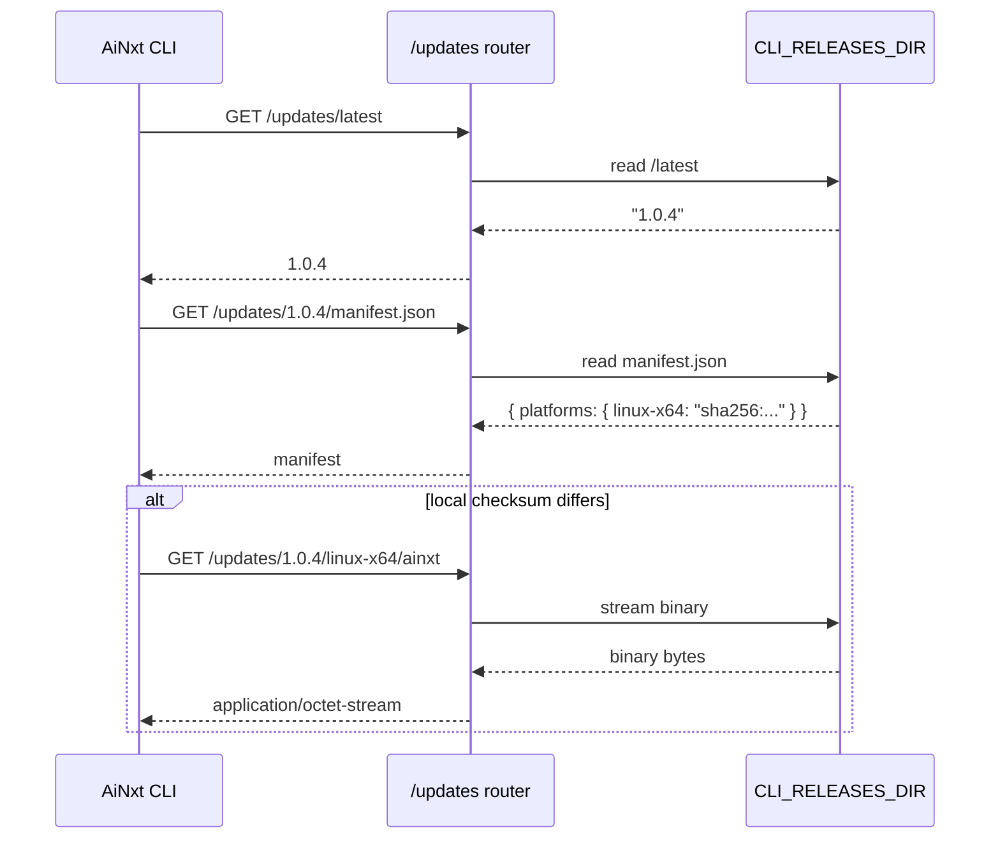
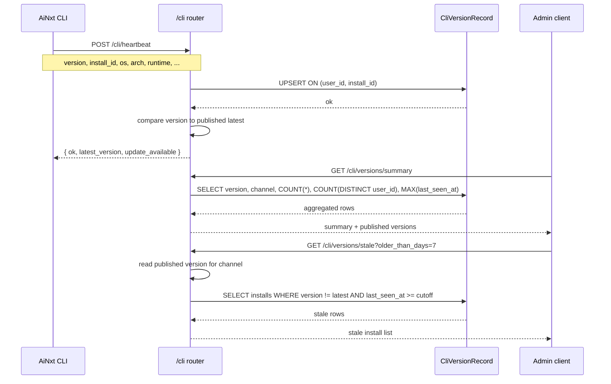

# CLI Updates Router

The `cli_updates_router` module provides the backend API surface for the AiNxt CLI's native self-updater and fleet-wide CLI version monitoring. It is implemented as a FastAPI router mounted under two prefixes: `/updates` for serving release artifacts, and `/cli` for recording and querying CLI installation telemetry.

This module enables the platform team to distribute CLI binaries without relying on external repositories, while maintaining visibility into which engineers are running which CLI versions across the organization.

---

## Core Responsibilities

1. **Serve CLI update artifacts** — version strings, per-platform manifests, and raw binaries from a local release directory.
2. **Receive CLI heartbeats** — record each CLI installation's version, environment metadata, and last-seen timestamp.
3. **Provide fleet analytics** — aggregate version adoption, list installations per user, and identify stale CLI installs for targeted update outreach.

---

## Module Architecture

The module defines two `APIRouter` instances in a single file:

- `router` — mounted at `/updates`, serves public (JWT-authenticated) update files.
- `cli_fleet_router` — mounted at `/cli`, serves heartbeat ingestion and admin fleet queries.

Both routers share the same local release directory (`CLI_RELEASES_DIR`) and the same authentication/authorization primitives from [`auth_router`](../auth/auth_router.md) and [`auth/dependencies`](../core/shared_core.md#authentication).

```mermaid
graph TB
    subgraph "cli_updates_router"
        R1["/updates router\nartifact serving"]
        R2["/cli router\nfleet monitoring"]
    end

    CLI[AiNxt CLI client]
    ADMIN[Admin dashboard / operator]
    FS[(Local filesystem\nCLI_RELEASES_DIR)]
    DB[(PostgreSQL\nCliVersionRecord)]

    CLI -->|GET /updates/{channel}| R1
    CLI -->|GET /updates/{version}/manifest.json| R1
    CLI -->|GET /updates/{version}/{platform}/{binary}| R1
    CLI -->|POST /cli/heartbeat| R2

    ADMIN -->|GET /cli/versions/summary| R2
    ADMIN -->|GET /cli/versions/users| R2
    ADMIN -->|GET /cli/versions/stale| R2

    R1 -->|read version files / manifests / binaries| FS
    R2 -->|upsert / query| DB
    R2 -->|read published channel version| FS
```

---

## Component Reference

### Data Models

#### `CliHeartbeatIn`

Pydantic request model for the heartbeat endpoint. All fields except `version` and `install_id` are optional and length-clamped to match the underlying `CliVersionRecord` schema.

| Field | Type | Description |
|-------|------|-------------|
| `version` | `str` (1–32) | Installed CLI version reported by the client. |
| `install_id` | `str` (8–64) | Stable per-installation identifier. |
| `channel` | `Optional[str]` (≤16) | Update channel (`latest`, `stable`, or `dev`). |
| `binary_name` | `Optional[str]` (≤64) | Name of the running binary. |
| `os` / `arch` | `Optional[str]` | Operating system and CPU architecture. |
| `os_release` | `Optional[str]` (≤128) | OS distribution/release string. |
| `runtime` / `runtime_version` | `Optional[str]` | Language runtime and version. |

#### `CliHeartbeatOut`

Response model returned by `cli_heartbeat`.

| Field | Type | Description |
|-------|------|-------------|
| `ok` | `bool` | Always `true` unless the request itself is invalid. |
| `latest_version` | `Optional[str]` | Current published version on the caller's channel. |
| `update_available` | `bool` | Whether the installed version differs from the published version. |

### Route Handlers

#### `latest_version(channel: str)`

`GET /updates/{channel}`

Returns the plain-text version string currently published for `latest` or `stable`. The channel is validated against a fixed allow-list to prevent filesystem traversal.

#### `version_manifest(version: str)`

`GET /updates/{version}/manifest.json`

Returns the per-version manifest containing platform-to-checksum mappings. The `version` path component is validated by `_safe()` before filesystem access.

#### `version_binary(version, platform, binary)`

`GET /updates/{version}/{platform}/{binary}`

Streams the requested binary with `application/octet-stream`. All three path components are strictly validated to prevent directory traversal.

#### `cli_heartbeat(payload: CliHeartbeatIn)`

`POST /cli/heartbeat`

Records or updates a CLI installation row keyed by `(user_id, install_id)`. Uses PostgreSQL `ON CONFLICT ... DO UPDATE` to:

- Insert a new row for first-seen installs.
- Increment `session_count` and refresh version/environment metadata for returning installs.
- Preserve the original `first_seen_at` timestamp.

The handler is intentionally resilient: database failures are logged but never propagated as HTTP errors, so a monitoring outage cannot degrade the CLI REPL. The response includes the latest published version for the install's channel and an `update_available` flag.

#### `versions_summary()`

`GET /cli/versions/summary` (admin only)

Aggregates installations by `version` and `channel`, returning install counts, distinct user counts, and the most recent heartbeat per version. Also reports the currently published version per channel so callers can flag rows as `is_latest`.

#### `versions_users(...)`

`GET /cli/versions/users` (admin only)

Paginated per-install list supporting optional filters by exact `version` and `channel`. Returns up to 2,000 rows per page with full metadata including `session_count`, `first_seen_at`, and `last_seen_at`.

#### `versions_stale(...)`

`GET /cli/versions/stale` (admin only)

Lists every install on a given channel whose reported version does not match the currently published version. Supports an `older_than_days` filter to narrow results to recently-active installs, and pagination up to 5,000 rows.

---

## Data Flow

### Update Check Flow



### Heartbeat and Fleet Analytics Flow



---

## Security and Validation

- **Authentication**: All endpoints require a valid JWT via [`get_current_user`](../auth/auth_router.md). Admin endpoints additionally require [`require_admin`](../auth/auth_router.md).
- **Path sanitization**: The `_safe()` helper rejects empty components, `.`, `..`, slashes, backslashes, and any string not matching `^[A-Za-z0-9][A-Za-z0-9._-]*$`. This prevents directory traversal when serving files from the local release directory.
- **Channel allow-list**: Only `latest` and `stable` are recognized channels; unknown values return `404`.
- **Payload clamping**: `CliHeartbeatIn` uses Pydantic `Field` constraints to enforce the same maximum lengths as `CliVersionRecord`, preventing database-level truncation errors.
- **Resilient telemetry**: Heartbeat database failures are logged but return HTTP `200` to the CLI, avoiding retry storms during transient DB outages.

---

## Dependencies

| Dependency | Purpose | Related Documentation |
|------------|---------|----------------------|
| `auth.dependencies.get_current_user` | JWT authentication for all routes. | [`auth_router`](../auth/auth_router.md) |
| `auth.dependencies.require_admin` | Admin authorization for fleet analytics. | [`auth_router`](../auth/auth_router.md) |
| `core.logger.logger` | Structured logging for update and fleet events. | [`shared_core.md#core_infrastructure`](../core/shared_core.md#core_infrastructure) |
| `db.database.SessionLocal` | SQLAlchemy session management. | [`shared_core.md#database`](../core/shared_core.md#database) |
| `db.models.CliVersionRecord` | Persistence model for CLI installation telemetry. | [`shared_core.md#database`](../core/shared_core.md#database) |

---

## Configuration

| Environment Variable | Default | Description |
|----------------------|---------|-------------|
| `CLI_RELEASES_DIR` | `/opt/ainxt/cli-releases` | Local directory containing channel files, version manifests, and platform binaries. |

Expected layout under `CLI_RELEASES_DIR`:

```text
/opt/ainxt/cli-releases/
├── latest                 # plain-text version, e.g. "1.0.4"
├── stable                 # plain-text version, e.g. "1.0.3"
└── 1.0.4/
    ├── manifest.json      # { "version": "1.0.4", "platforms": { "linux-x64": { "checksum": "sha256:..." } } }
    └── linux-x64/
        └── ainxt          # actual binary
```

---

## Integration with the Broader System

- The AiNxt CLI (desktop / terminal client) calls this router to discover and download updates. See [`desktop_app`](desktop_app.md) for the desktop-side integration and [`cli_runtime`](cli_runtime.md) for server-side CLI session management.
- Authentication reuses the same JWT machinery as the rest of the shared API routers. See [`auth_router`](../auth/auth_router.md) for token issuance and [`session_router`](../auth/session_router.md) for session revocation.
- Fleet analytics data is stored in the same PostgreSQL database used by the rest of the platform, modeled by `CliVersionRecord` in [`shared_core.md#database`](../core/shared_core.md#database).
- Admin dashboards that display version adoption or drive update campaigns consume the `/cli/versions/*` endpoints. These dashboards are typically part of the `ai_ui_frontend` admin surfaces.

---

## Operational Notes

- **Release publishing**: To publish a new CLI version, write the version string to the `latest` or `stable` channel file and place the corresponding `manifest.json` and platform binaries under `CLI_RELEASES_DIR/{version}/`.
- **Update nudging**: The CLI can use the `update_available` flag returned by `POST /cli/heartbeat` to render soft update prompts without a separate update-check request.
- **Stale install targeting**: Use `/cli/versions/stale?older_than_days=0` to find every non-current install, or set `older_than_days` to focus on recently active users who are likely to see an update banner.
- **Monitoring**: The router emits structured log lines prefixed with `[cli-updates]` and `[cli-fleet]`; these can be scraped by the platform's observability stack (see [`shared_core.md#observability`](../core/shared_core.md#observability)).
