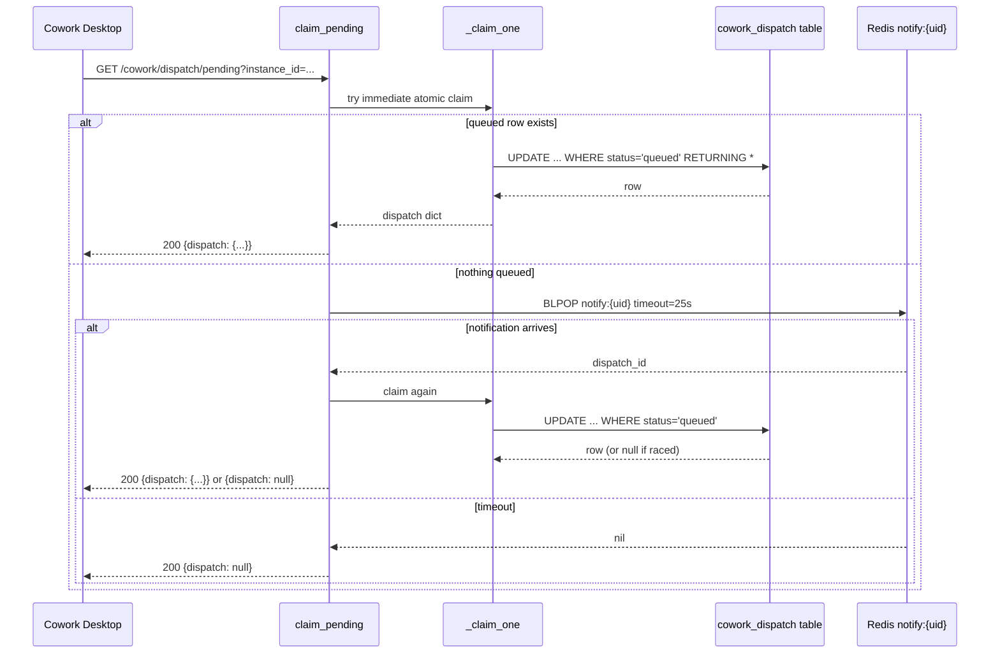
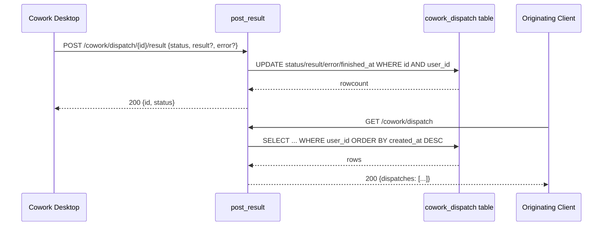
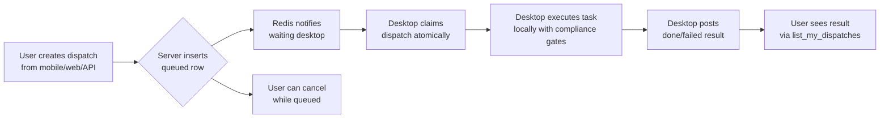
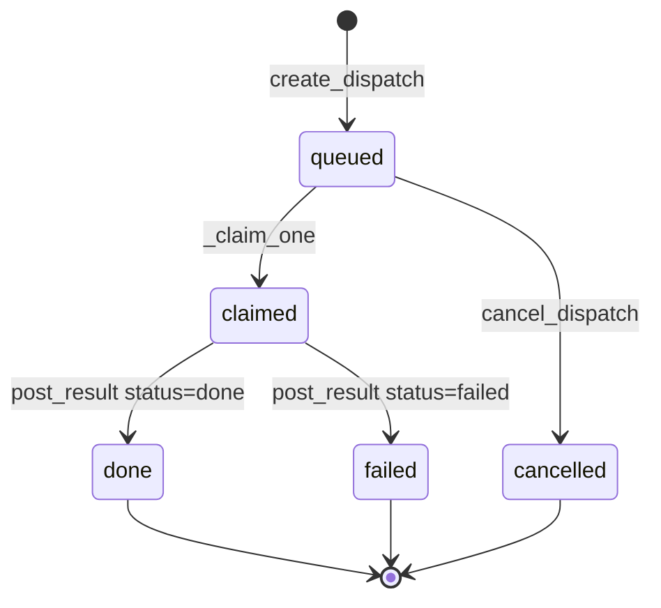

# Cowork Dispatch Router

## Brief Introduction

The `cowork_dispatch_router` module implements the server-side queue that enables **AiNxt Cowork** task hand-off from mobile/web/API clients to a user's **desktop session**. It lets a user kick off a task from any client and have it run on their own desktop, where computer-use, browser automation, and local file access live.

The router exposes a small, per-user dispatch queue with four main operations:

1. **Create a dispatch** — any client queues a task.
2. **Claim pending** — the user's running desktop long-polls and atomically claims the oldest queued item.
3. **Post result** — the desktop reports the outcome.
4. **List / cancel** — the originating client watches or cancels its dispatches.

All rows are scoped to the caller's JWT `sub`, so a user can only see, claim, or cancel their own dispatches. No connector or computer-use action runs inside this router; execution happens on the desktop under the same confirm and compliance gates as an interactive Cowork task.

---

## Core Functionality

### Dispatch Lifecycle

A dispatch moves through the following states:

| State | Meaning |
|-------|---------|
| `queued` | Task created, waiting for the desktop to claim it. |
| `claimed` | Desktop has atomically taken ownership and is running it. |
| `done` / `failed` | Desktop posted a result. |
| `cancelled` | User cancelled before the desktop claimed it. |

### Endpoints

| Method | Path | Handler | Purpose |
|--------|------|---------|---------|
| `POST` | `/cowork/dispatch` | `create_dispatch` | Queue a new task for the user's desktop. |
| `GET` | `/cowork/dispatch/pending` | `claim_pending` | Desktop long-poll to claim the next queued task. |
| `POST` | `/cowork/dispatch/{id}/result` | `post_result` | Desktop reports the outcome of a claimed task. |
| `GET` | `/cowork/dispatch` | `list_my_dispatches` | List the caller's recent dispatches, newest first. |
| `POST` | `/cowork/dispatch/{id}/cancel` | `cancel_dispatch` | Cancel a dispatch that is still `queued`. |

### Key Data Models

- **`DispatchIn`** — input model for creating a dispatch:
  - `prompt` (required): the task instruction.
  - `role` (optional): Cowork role/persona to use.
  - `project` (optional): project context as a JSON object.
  - `origin` (default `"mobile"`): where the task originated (`mobile`, `web`, `api`).

- **`DispatchResult`** — input model for posting a result:
  - `status`: `done` or `failed`.
  - `result` (optional): successful output.
  - `error` (optional): failure message.

---

## Architecture

### High-Level Placement

The dispatch router is one piece of the broader **Cowork** subsystem. It sits between lightweight clients (mobile web, browser extension, API callers) and the user's desktop agent, which is the only execution surface.

```mermaid
flowchart LR
    subgraph Clients
        Mobile[Mobile Web]
        Web[Web App]
        API[API / Integrations]
    end

    subgraph Server["Cowork Server Routers"]
        Dispatch[cowork_dispatch_router]
        Tasks[cowork_tasks_router]
        Usage[cowork_usage_router]
        MCP[cowork_mcp_router]
        Policy[cowork_policy_router]
        Projects[cowork_projects_router]
        Conversations[cowork_conversations_router]
    end

    subgraph Desktop["User Desktop"]
        CoworkDesktop[Cowork Desktop App]
        CliManager[SessionManager / CLI sessions]
    end

    Mobile -->|POST /cowork/dispatch| Dispatch
    Web -->|POST /cowork/dispatch| Dispatch
    API -->|POST /cowork/dispatch| Dispatch
    Dispatch <-->|GET /cowork/dispatch/pending| CoworkDesktop
    Dispatch <-->|POST /cowork/dispatch/{id}/result| CoworkDesktop
    Tasks -.->|scheduled tasks| CoworkDesktop
    MCP -.->|tool stream| CoworkDesktop
    Usage -.->|record usage| Server
```

### Component Diagram

```mermaid
flowchart TB
    subgraph Router["routers/cowork_dispatch_router.py"]
        API[APIRouter<br/>prefix=/cowork]
        DI[DispatchIn]
        DR[DispatchResult]
        Create[create_dispatch]
        Claim[claim_pending]
        Result[post_result]
        List[list_my_dispatches]
        Cancel[cancel_dispatch]
        ClaimOne[_claim_one]
        RowMap[_row_to_dict]
    end

    subgraph Auth["auth.dependencies"]
        CurrentUser[get_current_user]
    end

    subgraph Config["core.config"]
        RedisCfg[REDIS_HOST<br/>REDIS_PORT<br/>REDIS_PASSWORD]
    end

    subgraph DB["db.database"]
        Engine[SQLAlchemy engine]
        Table[cowork_dispatch table]
    end

    subgraph Redis["redis.asyncio"]
        AsyncRedis[async Redis client]
        NotifyKey[cowork:dispatch:notify:{uid}]
    end

    API --> Create & Claim & Result & List & Cancel
    Create --> DI & CurrentUser & Engine & AsyncRedis
    Claim --> ClaimOne & CurrentUser & AsyncRedis
    ClaimOne --> Engine & Table
    Result --> DR & CurrentUser & Engine
    List --> CurrentUser & Engine
    Cancel --> CurrentUser & Engine
    AsyncRedis --> NotifyKey
```

---

## Component Relationships

### Internal Components

- **`create_dispatch`** validates the prompt, inserts a `queued` row into `cowork_dispatch`, and pushes a notification token to the per-user Redis key so any long-polling desktop wakes immediately.
- **`claim_pending`** first attempts an immediate atomic claim via `_claim_one`. If nothing is queued, it blocks on `BLPOP` against the user's Redis notification key for up to 25 seconds, then claims again if woken. This avoids the "2,000 desktops polling every 15 seconds" storm.
- **`_claim_one`** runs a single SQL transaction that selects the oldest `queued` row for the user with `FOR UPDATE SKIP LOCKED`, updates it to `claimed`, and returns the row. This guarantees exactly one desktop wins even under concurrent claimers.
- **`post_result`** updates the dispatch row with `status`, `result`, `error`, and `finished_at`, scoped to the owning user.
- **`list_my_dispatches`** returns the caller's most recent dispatches for result polling.
- **`cancel_dispatch`** transitions a still-queued dispatch to `cancelled`.

### External Dependencies

| Dependency | Role | Link |
|------------|------|------|
| `auth.dependencies.get_current_user` | JWT/API-key authentication and user enrichment. | auth_dependencies |
| `core.config` | Redis host/port/password and other environment settings. | [core_config](../core/core_config.md) |
| `core.logger` | Structured logging for dispatch events. | core_logger |
| `db.database.engine` | SQLAlchemy engine for the `cowork_dispatch` table. | db_database |
| `redis.asyncio` | Async Redis client used for long-poll wake-up. | external |

### Related Cowork Modules

| Module | Relationship |
|--------|--------------|
| [cowork_tasks_router](cowork_tasks_router.md) | Manages scheduled/recurring Cowork tasks that run headlessly, complementing the on-demand dispatch queue. |
| [cowork_usage_router](cowork_usage_router.md) | Records token/cost usage from Cowork surfaces; the desktop may report usage through this router. |
| [cowork_mcp_router](cowork_mcp_router.md) | Streams MCP tool results to the desktop; the desktop may use MCP tools while executing a dispatch. |
| [cowork_policy_router](cowork_policy_router.md) | Defines connector policies and role grants that constrain what a dispatched task can do. |
| [cowork_projects_router](cowork_projects_router.md) | Stores project context that can be attached to a dispatch via `project`. |
| [cowork_conversations_router](cowork_conversations_router.md) | Persists Cowork conversation state; a dispatch may reference or extend a conversation. |
| [cowork_scheduler](../workers/cowork_scheduler.md) | Worker that fires scheduled Cowork tasks. |
| cowork_task_worker | Executes scheduled Cowork tasks in server-side office mode. |
| [desktop_app](desktop_app.md) | The user's desktop runtime that claims and executes dispatches. |

---

## Data Flow

### Creating a Dispatch

```mermaid
sequenceDiagram
    participant Client as Mobile/Web/API Client
    participant Create as create_dispatch
    participant Auth as get_current_user
    participant DB as cowork_dispatch table
    participant Redis as Redis notify:{uid}

    Client->>Create: POST /cowork/dispatch {prompt, role?, project?, origin?}
    Create->>Auth: validate JWT / API key
    Auth-->>Create: current_user {sub, ...}
    Create->>Create: validate prompt not empty
    Create->>DB: INSERT queued row (user_id = sub)
    Create->>Redis: RPUSH notify:{uid} dispatch_id
    Create-->>Client: 201 {id, status: queued}
```

### Claiming a Dispatch (Desktop Long-Poll)



### Posting a Result



---

## Process Flows

### Full Mobile-to-Desktop Task Flow



### State Machine



---

## Scaling & Reliability Design

### Long-Poll via Redis

Without the Redis notification channel, every running desktop would need to poll the database for new work. At 2,000 active desktops polling every 15 seconds, that produces roughly 133 empty claims per second. The router solves this with a per-user notify key:

- `create_dispatch` pushes the new dispatch ID to `cowork:dispatch:notify:{uid}`.
- `claim_pending` sleeps on `BLPOP` against that key for up to 25 seconds.
- Only when a task arrives (or on timeout) does the desktop attempt another SQL claim.

If Redis is unavailable (e.g., local development), the router gracefully falls back to returning `null` immediately, and the client re-polls with jitter.

### Atomic Single-Claim

The `_claim_one` helper uses a subquery with `FOR UPDATE SKIP LOCKED` so that multiple concurrent desktops can race for the same user's queue without blocking each other or double-claiming:

```sql
UPDATE cowork_dispatch
   SET status = 'claimed', claimed_by = :inst, claimed_at = NOW()
 WHERE id = (
       SELECT id FROM cowork_dispatch
        WHERE user_id = :uid AND status = 'queued'
        ORDER BY created_at
        FOR UPDATE SKIP LOCKED
        LIMIT 1)
 RETURNING ...
```

### User Isolation

Every query includes `user_id = :uid` where `uid` comes from `get_current_user()["sub"]`. This ensures strict row-level isolation between users.

---

## How It Fits into the Overall System

The `cowork_dispatch_router` is the **coordination layer** for on-demand Cowork tasks. It does not execute tasks itself; it only maintains a small, user-scoped queue and hands work to the user's desktop. This design keeps sensitive connector credentials, browser sessions, and local files on the user's own machine while still allowing task initiation from anywhere.

Within the broader platform:

- **Cowork on-demand flow** → `cowork_dispatch_router` + desktop app.
- **Cowork scheduled flow** → `cowork_tasks_router` + `cowork_scheduler` + `cowork_task_worker`.
- **Cowork tool/runtime flow** → `cowork_mcp_router` + desktop MCP client.
- **Cowork governance** → `cowork_policy_router` + `cowork_usage_router`.

For details on the desktop side of the dispatch flow, see [desktop_app](desktop_app.md). For scheduled/headless Cowork execution, see [cowork_tasks_router](cowork_tasks_router.md) and cowork_task_worker.
