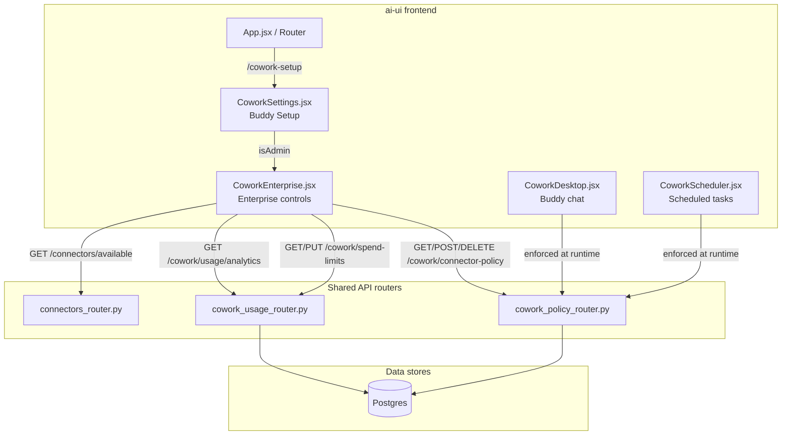
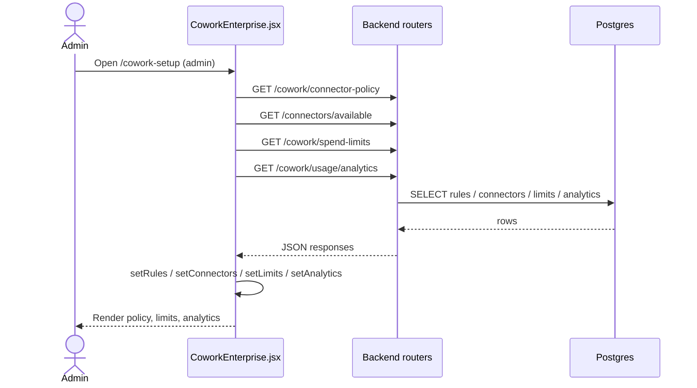
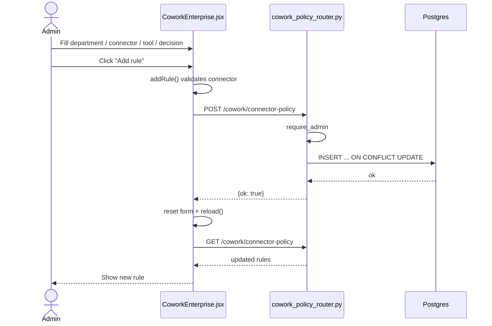
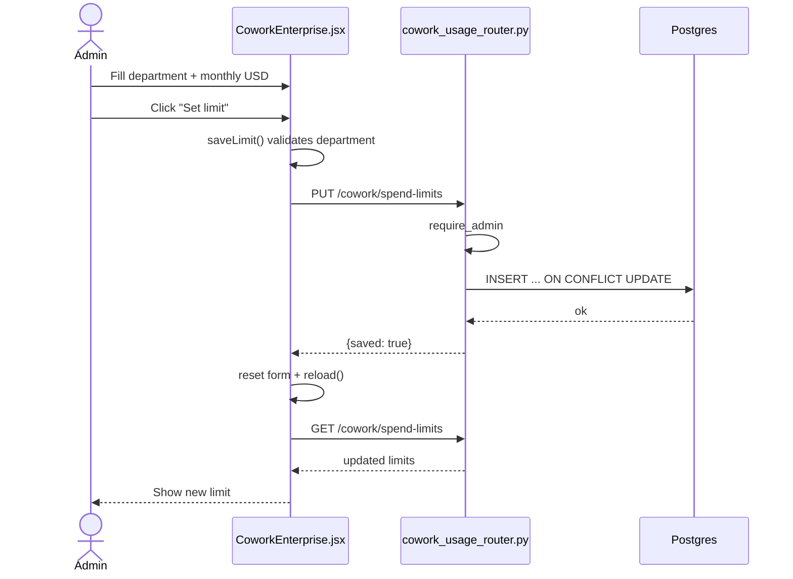
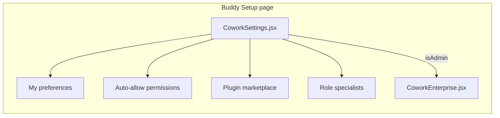
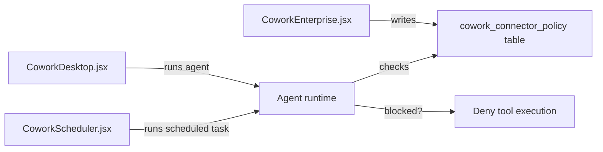

# Cowork Enterprise Module

## Brief Introduction

The **Cowork Enterprise** module provides the admin-only enterprise governance surface for **Buddy** — the local office AI assistant. It is implemented as a React component (`CoworkEnterprise.jsx`) embedded inside the [Buddy Setup](cowork_settings.md) page and exposes three pillars of control:

1. **Connector policy** — org-wide or per-department allow/deny rules for connector tools.
2. **Department spend limits** — monthly USD caps that warn or block new Buddy runs.
3. **Usage analytics** — month-to-date cost, token, and turn rollups by department and top users.

The component is intentionally read-only for non-admins; it is only rendered when the authenticated user has the `admin` role. All mutations are sent to dedicated backend routers (`cowork_policy_router.py` and `cowork_usage_router.py`), which enforce the same admin authorization.

---

## Architecture

### High-level placement

`CoworkEnterprise` is not a standalone route. It is mounted conditionally at the bottom of the [Buddy Setup](cowork_settings.md) page (`/cowork-setup`) when `user.role === "admin"`. This keeps personal/team configuration (roles, preferences, auto-allow permissions) and enterprise governance (policy, limits, analytics) in one logical place while restricting the sensitive controls to admins.

### Component responsibilities

| Component | Responsibility |
|-----------|----------------|
| `CoworkEnterprise` | Loads policy rules, connector catalog, spend limits, and analytics; renders three sections and handles all CRUD mutations. |
| `addRule` | Validates the new-rule form and POSTs a connector-policy rule. |
| `saveLimit` | Validates the spend-limit form and PUTs a department monthly cap. |

---

## Dependencies

### Frontend dependencies

- **React** — functional component with `useState`, `useEffect`, and `useCallback`.
- **lucide-react** — icons (`ShieldCheck`, `Plus`, `Trash2`, `Gauge`, `BarChart3`, `Loader2`).
- **`../config`** — `API_BASE` and authenticated `authFetch` helper.

### Related frontend modules

| Module | Relationship |
|--------|--------------|
| [cowork_settings.md](cowork_settings.md) | Hosts `CoworkEnterprise` at the bottom of the Buddy Setup page. |
| [cowork_desktop.md](cowork_desktop.md) | The main Buddy chat surface; connector policy and spend limits are enforced against its runs. |
| [cowork_scheduler.md](../workers/cowork_scheduler.md) | Scheduled Buddy tasks are also subject to connector policy and spend limits. |
| [cowork_canvas.md](cowork_canvas.md) | Document editing canvas; not directly governed here but part of the Buddy ecosystem. |

### Backend dependencies

| Router | Endpoints used | Purpose |
|--------|----------------|---------|
| [cowork_policy_router.md](cowork_policy_router.md) | `GET /cowork/connector-policy`, `POST /cowork/connector-policy`, `DELETE /cowork/connector-policy/{id}` | Manage allow/deny rules. |
| [cowork_usage_router.md](cowork_usage_router.md) | `GET /cowork/spend-limits`, `PUT /cowork/spend-limits`, `GET /cowork/usage/analytics` | Manage caps and view usage. |
| [connectors_router.md](../connectors/connectors_router.md) | `GET /connectors/available` | Populate the connector datalist. |

> See the linked router documentation for request/response schemas, authorization details, and database tables.

---

## Data Flow

### Initial load

On mount, `CoworkEnterprise` fires four parallel authenticated requests:

1. `GET /cowork/connector-policy` → `rules`
2. `GET /connectors/available` → `connectors`
3. `GET /cowork/spend-limits` → `limits`
4. `GET /cowork/usage/analytics` → `analytics`

Each request is wrapped in `.catch()` so a single failing endpoint does not crash the page; missing data renders as empty state.

### Connector policy mutation

### Spend limit mutation

---

## Component Interaction

### Within Buddy Setup

`CoworkEnterprise` receives no props; it is self-contained and relies on the global `authFetch` helper for authentication. The parent (`CoworkSettings`) decides whether to render it based on `user.role`.

### Runtime enforcement

Rules created in `CoworkEnterprise` are evaluated server-side when Buddy (desktop or scheduled) attempts to invoke a connector tool. The frontend component itself does not enforce policy; it only administers it.

---

## Process Flows

### Adding a connector policy rule

1. Admin selects or types a **connector** (e.g. `microsoft_365`).
2. Optionally types a **department** (blank = org-wide).
3. Optionally types a **tool** (blank or `*` = whole connector).
4. Chooses **Allow** or **Deny**.
5. Clicks **Add rule**.
6. `addRule` validates that a connector is provided, sets `busy`, and POSTs the rule.
7. On success, the form resets and `load()` refreshes the rule list.

> **Rule semantics:** Deny wins. A blank department means org-wide. `*` tool means the entire connector. These rules apply to every Buddy agent (desktop + server/scheduled).

### Setting a department spend limit

1. Admin types a **department** name.
2. Enters a **monthly USD** cap (`0` = unlimited).
3. Clicks **Set limit**.
4. `saveLimit` validates the department, sets `busy`, and PUTs the limit.
5. On success, the form resets and `load()` refreshes the limit list.

> Spend limits are evaluated at run time; Buddy warns or blocks new runs once a department is over its cap.

### Viewing usage analytics

1. On load, analytics are fetched from `GET /cowork/usage/analytics`.
2. The component renders two cards:
   - **By department** — cost, users, and turns per department for the current month.
   - **Top users** — top 50 users by cost, with turns.
3. While loading, a spinner is shown.

---

## State Management

| State | Type | Purpose |
|-------|------|---------|
| `rules` | `array` | Connector policy rules from `GET /cowork/connector-policy`. |
| `connectors` | `array` | Available connectors from `GET /connectors/available`. |
| `limits` | `array` | Spend limits from `GET /cowork/spend-limits`. |
| `analytics` | `object \| null` | Usage analytics from `GET /cowork/usage/analytics`. |
| `busy` | `boolean` | Disables action buttons during mutations. |
| `nr` | `object` | New-rule form state (`department`, `connector`, `tool`, `allow`). |
| `nl` | `object` | New-limit form state (`department`, `monthly_usd`). |

All state is local to the component; there is no global store involvement.

---

## Security & Authorization

- **Admin-only rendering:** `CoworkEnterprise` is only mounted inside `CoworkSettings` when `user.role === "admin"`.
- **Backend enforcement:** Every backend endpoint used by the component (`/cowork/connector-policy`, `/cowork/spend-limits`, `/cowork/usage/analytics`) depends on `require_admin`.
- **No client-side enforcement:** The component administers policy but does not apply it. Actual allow/deny decisions happen server-side during agent/tool execution.

---

## Error Handling

- All `authFetch` calls use `.catch(() => default)` so the UI remains usable even if one endpoint fails.
- Mutations set `busy` to prevent duplicate submissions.
- Network errors during `addRule` or `saveLimit` are silently swallowed in the component; the backend returns proper HTTP status codes and detail messages.

---

## Related Documentation

- [cowork_settings.md](cowork_settings.md) — Buddy Setup page that hosts this component.
- [cowork_desktop.md](cowork_desktop.md) — Main Buddy chat interface governed by these policies.
- [cowork_scheduler.md](../workers/cowork_scheduler.md) — Scheduled Buddy tasks also subject to these controls.
- [cowork_policy_router.md](cowork_policy_router.md) — Backend connector policy API.
- [cowork_usage_router.md](cowork_usage_router.md) — Backend spend limits and usage analytics API.
- [connectors.md](../connectors/connectors.md) — Connector system overview.
- [budget.md](../llm/budget.md) — User/team budget system (complementary to department spend limits).
