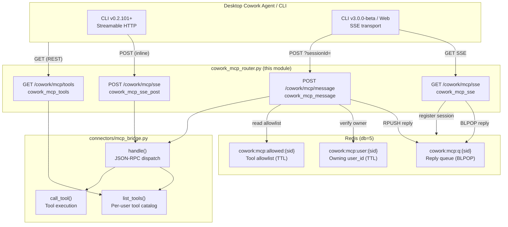
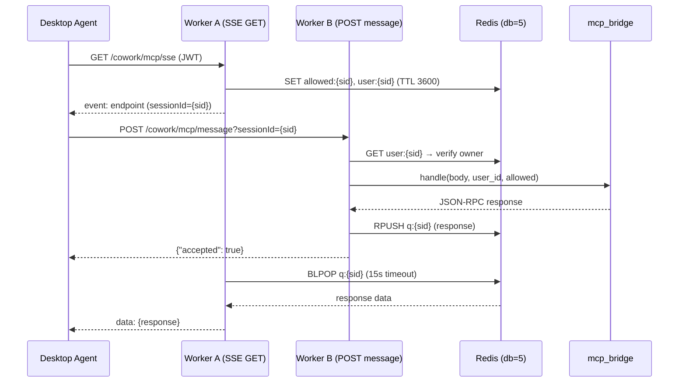
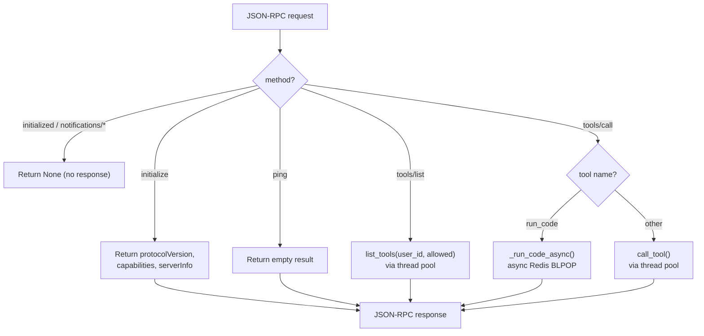
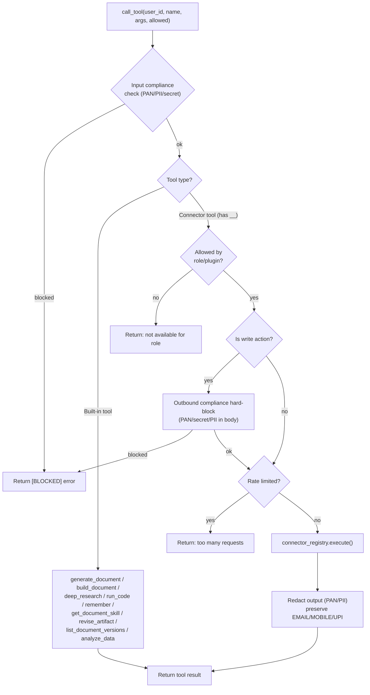
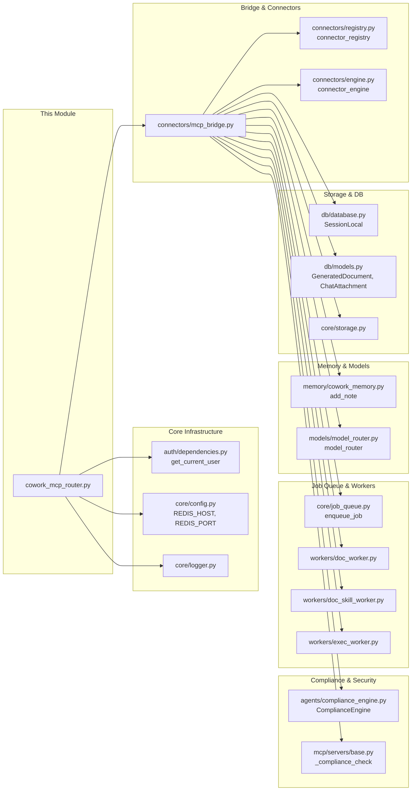
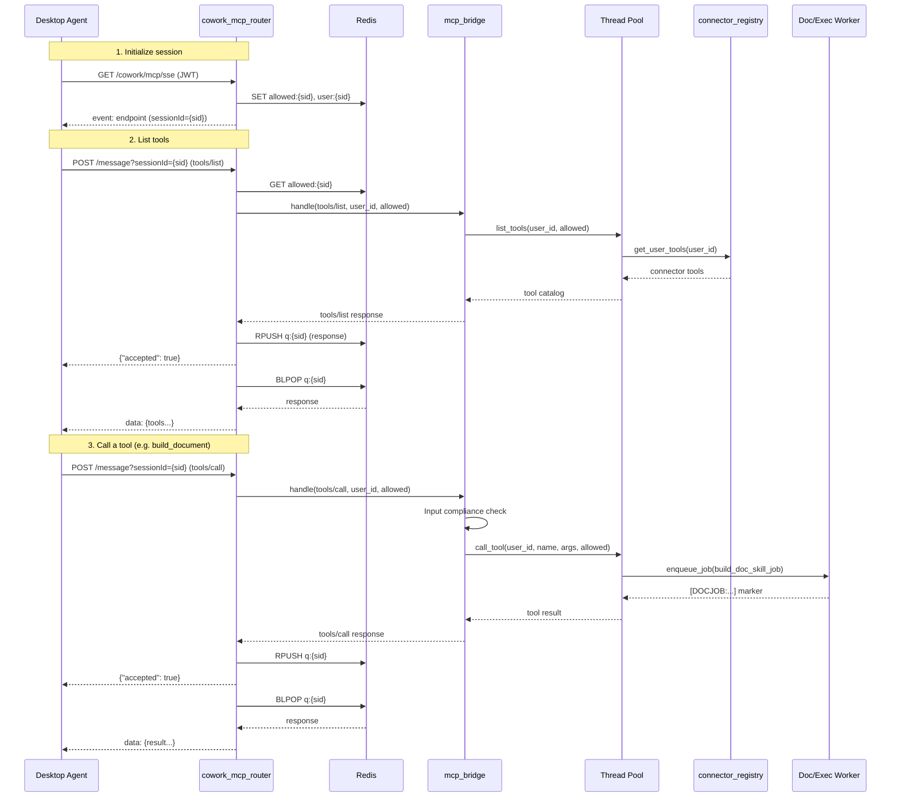

# Cowork MCP Router

> **Module:** `routers/cowork_mcp_router.py` (+ dispatch bridge `connectors/mcp_bridge.py`)
> **Layer:** Shared API Routers — Cowork desktop/local-agent MCP surface

## 1. Introduction

The **Cowork MCP Router** exposes the platform's per-user connectors (Outlook, Teams, Jira, GitLab, etc.) and built-in productivity tools (document generation, deep research, sandboxed code execution, durable memory) as **MCP (Model Context Protocol) tools** to the desktop Cowork local agent. The agent connects with an `sse`-type (or Streamable HTTP) MCP server pointed at `/cowork/mcp/sse` carrying the user's JWT — every call is scoped to that authenticated user.

This module is the **transport and session-routing layer**. It does not implement tool logic itself; it delegates all dispatch and per-user tool logic to the [`connectors/mcp_bridge`](../skills/shared_integrations.md) module. The router's primary responsibilities are:

1. **MCP transport** — SSE (legacy) and Streamable HTTP (MCP 2024-11-05 spec) endpoints.
2. **Multi-worker session routing** — Redis-backed session state so the SSE GET and the matching POST `/message` can land on different `uvicorn` workers and still deliver replies.
3. **Authentication & scoping** — every endpoint resolves the user from the JWT via `get_current_user`; the optional `x-cowork-allowed-tools` header scopes connector tools to the selected role/plugin.

---

## 2. Architecture Overview

### Key Design Decisions

| Concern | Decision | Rationale |
|---|---|---|
| **Multi-worker scaling** | Session routing state in **Redis**, not in-process dicts | Gateway runs `uvicorn --workers 4`; SSE GET can land on worker A while POST `/message` lands on worker B. In-process queues would lose the reply. |
| **Non-blocking SSE** | Async `BLPOP` via `redis.asyncio` | A stream never blocks the event loop or a threadpool thread. |
| **Dev fallback** | In-process `asyncio.Queue` when Redis unavailable | Single-worker development without Redis. |
| **Session ownership** | `cowork:mcp:user:{sid}` Redis key verified on every POST | A guessed `sid` (uuid4) can never push into another user's stream. |
| **Dual transport** | SSE (GET + POST) and Streamable HTTP (POST) coexist | FastAPI routes by HTTP method; old and new CLI clients work simultaneously. |

---

## 3. Endpoints

All endpoints are mounted under the `/cowork` prefix (full path includes the gateway's `/ainxt/v1/api` base).

### 3.1 `GET /cowork/mcp/sse` — `cowork_mcp_sse`

Opens the **SSE stream** for the legacy transport. Emits a relative `endpoint` event first, then pushes JSON-RPC responses and 15-second keep-alive pings.

**Flow:**
1. Generates a `session_id` (uuid4) and stores the user_id + tool allowlist in Redis (TTL 3600s).
2. Emits `event: endpoint\ndata: message?sessionId={session_id}\n\n`.
3. Loops: async `BLPOP` on `cowork:mcp:q:{sid}` (15s timeout). On data → push to stream; on timeout → refresh session key TTLs and emit `: ping`.
4. On client disconnect or cancellation: cleans up all three Redis keys.

**Headers consumed:**
- `x-cowork-allowed-tools` (optional) — comma-separated tool/connector allowlist for role/plugin scoping.

### 3.2 `POST /cowork/mcp/message` — `cowork_mcp_message`

Handles a **JSON-RPC message**. With `sessionId` → routes the reply to the SSE stream via Redis; without → returns the response inline.

**Flow:**
1. Parses JSON body (400 on invalid JSON).
2. Resolves tool allowlist: prefers this request's `x-cowork-allowed-tools` header; falls back to the value stored when the SSE stream opened (Redis key or in-process dict).
3. Delegates to `mcp_bridge.handle(body, user_id, allowed)`.
4. If `sessionId` present:
   - Verifies session ownership (`cowork:mcp:user:{sid}` must match `user_id`) — 403 on mismatch.
   - `RPUSH`es the JSON-RPC response to `cowork:mcp:q:{sid}`.
   - Returns `{"accepted": true}`.
5. If no `sessionId`: returns the response dict inline.

### 3.3 `POST /cowork/mcp/sse` — `cowork_mcp_sse_post`

**Streamable HTTP transport** (MCP 2024-11-05 spec) — used by CLI v0.2.101+. Handles the full MCP lifecycle in a single request/response cycle (no SSE stream required for `initialize` / `tools/list` / `tools/call`).

**Flow:**
1. Parses JSON body (400 on invalid JSON).
2. Resolves `Mcp-Session-Id` from request headers or generates `cowork-{uuid4}`.
3. Delegates to `mcp_bridge.handle(body, user_id, allowed)`.
4. Returns `JSONResponse` with the `Mcp-Session-Id` header echoed on every response.

> **Spec compliance note:** The MCP Streamable HTTP spec requires the server to assign a session ID on `initialize` and echo it back via the `Mcp-Session-Id` response header on every subsequent response. The CLI's `StreamableHttpClientWorker` (rmcp) validates this header — without it the handshake fails immediately.

### 3.4 `GET /cowork/mcp/tools` — `cowork_mcp_tools`

REST shortcut — lists the tools available to this user without needing an SSE connection or JSON-RPC handshake. Delegates directly to `mcp_bridge.list_tools(user_id, allowed)`.

---

## 4. Session Routing & Scaling

### Redis Key Schema

| Key | Type | Purpose | TTL |
|---|---|---|---|
| `cowork:mcp:q:{sid}` | List | JSON-RPC replies for the SSE stream (BLPOP/RPUSH) | 3600s (refreshed) |
| `cowork:mcp:allowed:{sid}` | String (JSON) | Tool allowlist for the session (`null` = no restriction) | 3600s |
| `cowork:mcp:user:{sid}` | String | Owning `user_id` — prevents cross-user session hijacking | 3600s |

### In-Process Fallback

When `redis.asyncio` is unavailable (dev / single worker), the router falls back to in-process `asyncio.Queue` and `dict` structures. This path is **single-worker only** — the SSE GET and POST `/message` must land on the same process.

---

## 5. Dispatch Bridge (`connectors/mcp_bridge.py`)

The router delegates all JSON-RPC dispatch and tool logic to the bridge. See [shared_integrations](../skills/shared_integrations.md) for the connector infrastructure details. Key bridge functions:

### 5.1 `handle(body, user_id, allowed)` — JSON-RPC Dispatch

### 5.2 `list_tools(user_id, allowed)` — Per-User Tool Catalog

Builds the MCP `tools/list` payload for the authenticated user. The catalog includes:

| Tool | Description |
|---|---|
| **Connector tools** | Per-user connected connectors (Outlook, Teams, Jira, GitLab, etc.) — scoped by role/plugin allowlist and org/dept policy. Write tools are advertised but **not executed** here (require explicit user confirm). |
| `generate_document` | Enqueue a Markdown document generation job → `[DOCJOB:...]` marker. |
| `get_document_skill` | Read the platform's document skill (SKILL.md) for docx/pptx/xlsx/pdf. |
| `build_document` | Run agent-authored build code in the isolated doc sandbox → styled, editable file + preview. |
| `list_document_versions` | Version history for an iterated document (by `artifact_id`). |
| `revise_artifact` | AI co-edit: apply a natural-language change to a prior build → new version. |
| `deep_research` | Multi-model, cross-vendor cited research report (decompose → analyze → synthesize → review). |
| `run_code` | Sandboxed code execution (network-isolated, ephemeral container). |
| `analyze_data` | Bind a dataset file into the sandbox + run analysis script. |
| `remember` | Persist a durable fact to the user's Cowork memory. |

**Tool name mapping:** Connector tools use `connector__tool` internally (e.g. `microsoft_365__outlook_send_mail`), but are exposed with a single underscore (`microsoft_365_outlook_send_mail`) because CLI v0.2.101 drops tools whose name contains `__` (its own server__tool delimiter). `call_tool()` reverses this mapping before dispatch.

### 5.3 `call_tool(user_id, name, arguments, allowed)` — Tool Execution

### 5.4 Compliance Model

The bridge implements a layered compliance model (NPCI policy):

| Layer | Direction | Action | Rationale |
|---|---|---|---|
| **Input block** | Tool arguments | **Hard-block** if PAN/secret/PII detected | Prevents exfiltration via tool args. |
| **Output redaction** | Connector/KB results | **Redact** (not block) PAN/PII; **preserve** EMAIL/MOBILE/UPI | User can still read their own data; contact identifiers needed for reply/forward. |
| **Outbound write block** | Email/Teams body | **Hard-block** on financial/secret types (`_OUTBOUND_BLOCK_TYPES`) | Outbound sends must not leak sensitive data. EMAIL/MOBILE/UPI excluded (legitimate recipients). |
| **Document build** | Build code | **Audit-and-proceed** (log, don't block) | Business figures trip Luhn heuristics as false positives; sandbox is local, not outbound. |

### 5.5 Write Action Flow

Write connector tools (e.g. `outlook_send_mail`, `teams_send_message`) are **advertised** in the tool list but **not executed** through the MCP path alone. They require:

1. **Desktop permission gate** — the desktop Cowork agent's `can_use_tool` confirm flow (user explicitly approves the exact send).
2. **Outbound compliance block** — the same gate as `POST /connectors/action`.
3. **Recipient verification** — Teams chat/channel IDs must be real IDs (not free-text names); email/calendar recipients must be valid addresses (not bare names). Prevents mis-sending to the wrong person.
4. **Attachment resolution** — built documents (`[DOCJOB:...]` markers), chat-uploaded files, and existing artifacts are resolved into Graph `fileAttachment` dicts before the send.

---

## 6. Dependencies

### External Module References

| Dependency | Module | Purpose |
|---|---|---|
| `auth.dependencies.get_current_user` | [authentication](../core/shared_core.md) (auth) | JWT-based user resolution for every endpoint. |
| `core.config` | [core_infrastructure](../core/shared_core.md) | Redis connection params, compliance config flags. |
| `core.logger` | [core_infrastructure](../core/shared_core.md) | Structured logging. |
| `connectors.mcp_bridge` | [shared_integrations](../skills/shared_integrations.md) | All dispatch + per-user tool logic. |
| `connectors.registry` | [shared_integrations](../skills/shared_integrations.md) | Per-user connected connector tool listing + execution. |
| `connectors.engine` | [shared_integrations](../skills/shared_integrations.md) | PAT auto-connect for GitLab/Jira. |
| `agents.compliance_engine` | [agent_system](../core/shared_core.md) | Input blocking + output redaction (PAN/PII/secret). |
| `mcp.servers.base._compliance_check` | [mcp_servers](../mcp/mcp_servers.md) | Input compliance check for tool arguments. |
| `core.job_queue` | [core_infrastructure](../core/shared_core.md) | Enqueue doc-generation and sandbox-exec jobs. |
| `workers.doc_worker` / `doc_skill_worker` / `exec_worker` | [workers](../workers/workers.md) | Async job execution for documents and sandboxed code. |
| `memory.cowork_memory` | [memory_system](../core/shared_core.md) | Durable per-user Cowork memory (`remember` tool). |
| `models.model_router` | [model_routing](../core/shared_core.md) | LLM generation for `deep_research` and `revise_artifact`. |
| `db.database` / `db.models` | [database](../core/shared_core.md) | `GeneratedDocument` / `ChatAttachment` lookups. |
| `core.storage` | [core_infrastructure](../core/shared_core.md) | Object storage for chat-uploaded attachments. |
| `core.otel` | [core_infrastructure](../core/shared_core.md) | OTLP span wrapping for tool-call telemetry. |
| `services.cowork_policy` | [services](../core/shared_core.md) | Org/dept connector policy enforcement. |

---

## 7. Data Flow: Full Tool-Call Lifecycle (SSE Transport)

---

## 8. Configuration

### Environment Variables

| Variable | Default | Scope | Description |
|---|---|---|---|
| `REDIS_HOST` | — | Router + Bridge | Redis host for session routing + job queues. |
| `REDIS_PORT` | — | Router + Bridge | Redis port. |
| `REDIS_PASSWORD` | — | Router + Bridge | Redis password (optional). |
| `COWORK_TOOL_POOL` | `64` | Bridge | Max workers in the blocking tool thread pool. |
| `COWORK_CONNECTOR_RATE_MAX` | `60` | Bridge | Max connector calls per user+connector per window. |
| `COWORK_CONNECTOR_RATE_WINDOW` | `60` | Bridge | Rate-limit window in seconds. |
| `COMPLIANCE_SCAN_TOOL_RESULTS` | — | Bridge | Whether to redact PAN/PII from tool outputs. |
| `M365_ATTACHMENT_FILE_MAX_BYTES` | `10485760` (10 MB) | Bridge | Max file size for local attachment resolution. |

### Constants

| Constant | Value | Description |
|---|---|---|
| `_SESSION_TTL` | `3600` (1 hour) | Redis session key TTL, refreshed on every message. |
| `MCP_PROTOCOL_VERSION` | `2024-11-05` | MCP protocol version advertised on `initialize`. |
| `SERVER_NAME` | `cowork-connectors` | MCP server name. |
| `SERVER_VERSION` | `1.0.0` | MCP server version. |
| `_EXEC_WAIT_SECONDS` | `75` | Max wait for sandbox execution result via Redis BLPOP. |

---

## 9. Security Considerations

1. **Session ownership verification** — every `POST /message?sessionId=...` checks that the Redis `cowork:mcp:user:{sid}` key matches the JWT-resolved `user_id`. A guessed session ID can never push into another user's SSE stream (403 Forbidden).

2. **JWT authentication on all endpoints** — every endpoint uses `Depends(get_current_user)`. No anonymous access.

3. **Input compliance hard-block** — tool arguments are scanned for PAN/PII/secrets before execution. Blocked calls return `[BLOCKED]` with the reason.

4. **Output redaction** — connector and KB results are redacted of PAN/PII before reaching the agent. Contact identifiers (EMAIL, MOBILE, UPI) are deliberately preserved for reply/forward functionality.

5. **Outbound write hard-block** — email/Teams message bodies are hard-blocked if they contain financial/secret data types (`_OUTBOUND_BLOCK_TYPES`). This is independent of the global redact-vs-block config — outbound sends are a different threat model.

6. **Recipient verification** — all outbound sends verify recipients are real IDs/addresses, preventing the agent from mis-sending to hallucinated or partial recipients.

7. **Sandbox isolation** — `run_code` and `analyze_data` execute in a network-isolated, ephemeral Docker container. The sandbox cannot reach the user's OS, the network, or any connector.

8. **Per-tenant rate limiting** — a Redis token bucket limits connector calls per user+connector to protect external APIs (M365/Graph) from throttling.

---

## 10. Related Documentation

| Topic | Document |
|---|---|
| Connector infrastructure (registry, engine, adapters) | [shared_integrations](../skills/shared_integrations.md) |
| Compliance engine (PAN/PII detection, redaction) | [shared_core](../core/shared_core.md) (agent_system) |
| MCP servers (base, platform, KB search, etc.) | [mcp_servers](../mcp/mcp_servers.md) |
| Job queue & workers (doc, exec, skill) | [workers](../workers/workers.md) |
| Memory system (Cowork memory) | [shared_core](../core/shared_core.md) (memory_system) |
| Model routing (LLM generation) | [shared_core](../core/shared_core.md) (model_routing) |
| Database models (GeneratedDocument, ChatAttachment) | [shared_core](../core/shared_core.md) (database) |
| Core infrastructure (config, logger, storage, OTel) | [shared_core](../core/shared_core.md) (core_infrastructure) |
| Authentication (JWT, RBAC) | [shared_core](../core/shared_core.md) (authentication) |
| Cowork admin router (roles, marketplace) | [cowork_admin_router](cowork_admin_router.md) |
| Cowork policy router (connector policy) | [cowork_policy_router](cowork_policy_router.md) |
| Cowork usage router (spend limits, usage) | [cowork_usage_router](cowork_usage_router.md) |
